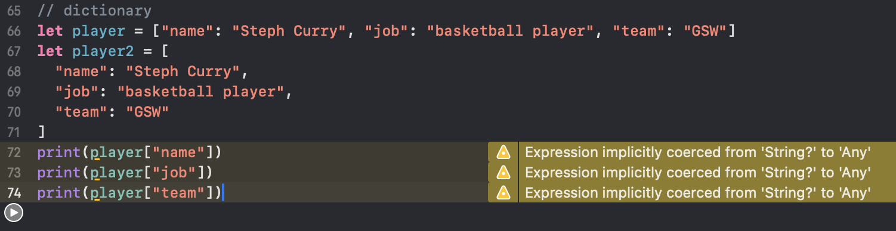

# Day 3 - Complex Data Types, Part 1

## Storing Ordered Data in Arrays

Arrays are Swift data type just like `String`, `Int`, and `Double`.

```swift
var gsw = ["Steph", "Klay", "Kevin"]
let numbers = [4, 8, 15, 16, 23, 42]
var temperatures = [25.3, 28.2, 26.4]
```

Arrays in Swift are zero-indexed.

```swift
print(gsw[0])
print(numbers[1])
print(temperatures[2])
```

If our array is variable, we can modify it after creating it. For example, we can use `append()` to add new items:

```swift
gsw.append("Jimmy")
gsw.append("Kyrie")
gsw.append("Derrick")
print(gsw)
```

However, Swift only allows one data type in an array at a time.

```swift
// raise error
temperatures.append('Chirs')
```

This is type safety.

We can see this more clearly when we want to start with an empty array and add items to it one by one. This is done with very precise syntax:

```swift
var scores = Array<Int>()
scores.append(100)
scores.append(80)
scores.append(85)
print(scores)
```

The first line shows how we have a specialized array type. This is not just any array, it is **an array that holds integers**. This is what allows Swift to know for sure that `scores` must always contain `Int` data.

The parentheses in `Array<Int>()` are there because it is possible to customize the way the array is created if we need to.

We can make other kinds of array by specializing it in different ways:

```swift
var albums = Array<String>()
albums.append("Folklore")
albums.append("Fearless")
albums.append("Red")
```

Arrays are so common in Swift that there is another way to create them:
```swift
var albums2 = [String]()
albums2.append("Folklore")
albums2.append("Fearless")
albums2.append("Red")
```

If we provide some initial values in an array, Swift can figure out the data type for itself:
```swift
var albums3 = ["Folklore"]
albums3.append("Fearless")
albums3.append("Red")
```

Array functionalities:

The `count` is used to read how many items are in an array:

```swift
print(albums.count)
```

We can remove items from an array by using either `remove(at: )` to remove one item at a specific index, or `removeAll()` to remove everything:
```swift
var characters = ["Lana", "Pam", "Ray", "Sterling"]
print(characters.count)
print(characters)

characters.remove(at: 2)
print(characters)

characters.removeAll()
print(characters)
```

We can check whether an array contains a particular item by using `contains()`:
```swift
let bondMovies = ["Casino Royale", "Spectre", "No Time To Die"]
print(bondMovies.contains("Frozen"))
```

We can sort an array using `sorted()`:

```swift
let cities = ["London", "Tokyo", "Rome", "Qingdao"]
print(cities.sorted())
```

This returns a new array with its items sorted in ascending order, which means alphabetically for strings but numerically for numbers. NOTE: the original array remains unchanged!

We can reverse an array by calling `reversed()`:

```swift
let gswStars = ["Curry", "Thompson", "Durant", "Green"]
let reversedGswStars = gswStars.reversed()
print(reversedGswStars)
```

When we reverse an array, Swift does not actually do the work of rearranging all the items, but instead just remembers to itself that we want the items to be reversed. So, when we print out `reversedGswStars`, we did not see it as a simple array:

```swift
ReversedCollection<Array<String>>(_base: ["Curry", "Thompson", "Durant", "Green"])
```

## Storing and Finding Data in Dictionaries

Dictionaries in Swift:

```swift
let player = ["name": "Steph Curry", "job": "basketball player", "team": "GSW"]
```

we can also split that up into individual lines
```swift
let player2 = [
  "name": "Steph Curry",
  "job": "basketball player",
  "team": "GSW"
]
```

When it comes to reading data out from the dictionary,

```swift
print(player["name"])
print(player["job"])
print(player["team"])
```

If we try this in a playground, we will see Xcode throws up various warnings along the lines of `"Expression implicitly coerced from 'String?' to 'Any'"`



If we look at the output from our playground, we will see it prints `Optional("Steph Curry")` rather than just `Steph Curry`.

```swift
print(player("password"))
```

If we try this, we will get an error because we are trying to read dictionary keys that do not have a value attached to them.

Therefore, Swift provides an alternative: when we access data inside a dictioanry, it will tell us "you might get a value back, but you might get back nothing at all". Swift calls these *optionals* because the existence of data is optional.

The statement, "Expression implicitly coerced from 'String?' to 'Any'", means that "this data might not actually be there - are you sure you want to print it?"

When reading from a dictionary, we can provide a *default* value to use if the key does not exist:
```swift
print(player["name", default: "Unknown"])
print(player["job", default: "Unknown"])
print(player["team", default: "Unknown"])
print(player["password", default: "Unknown"])
```

We could have other data types as keys and values as well:
```swift
let hasGraduated = [
  "Eric": false,
  "Maeve": true,
  "Otis": false,
]

let olympics = [
  2012: "London",
  2016: "Rio de Janeiro",
  2021: "Tokyo"
]
```

We can also create an empty dictionary:

```swift
var heights = [String: Int]()
heights["Yao Ming"] = 229
heights["Shaquille O'Neal"] = 216
heights["Steph Curry"] = 191
```

The `[String: Int]` means a dictionary with strings for its keys and integers for its values.

Dictionaries do not allow duplicate keys to exist. Setting a value for a key that already exists will overwrite whatever was the previous value.

```swift
var archEnemies = [String: String]()
archEnemies["Batman"] = "The Joker"
archEnemies["Superman"] = "Lex Luthor"
archEnemies["Batman"] = "Penguin"
print(archEnemies["Batman", default: "Unknown"])
```

Just like arrays, dictionaries come with useful functionality:

```swift
print(heights.count)
print(archEnemies.removeAll())
```

## Using Sets for Fast Data Lookup

Sets are similar to arrays, except we can add duplicate items, and they do not store their items in a particular order.

```swift
let people = Set(["Denzel Washington", "Tom Cruise", "Nicolas Cage", "Samuel L Jackson"])
```

To make a set of actor names, Swift first creates an array, and then puts that array into the set.

When adding items to a set, instead of calling `append()` as in an array, we should use `insert()`:

```swift
var people2 = Set<String>()
people2.insert("Denzel Washington")
people2.insert("Tom Cruise")
people2.insert("Nicolas Cage")
people2.insert("Samuel L Jackson")
```

Instead of storing items in the exact order we specify, sets store them in a highly optimized order that makes it very fast to locate items. For example, if we have an array of 1000 movie names and use `contains()` to check whether it contains a specific movie, Swift needs to go through every item until it finds one that matches - that might mean checking all 1000 movie names before returning `false`.

In comparison, calling `contains()` on a set runs super fast. Even if we had a million items or even 10 million items, it would still run instantly, whereas an array might take minutes or longer to do the same work.

Alongside `contains()`, sets also have `count` to read the number of items in a set, and `sorted()` to return a **sorted array** containing the set's items.

```swift
print(people.count)
print(people.sorted())
```

## Creating and Using ENUMs

An `enum` - short for *enumeration* - is a set of named values we can create and use in our code.

Suppose we want to write some code to let the user select a day of the week. We may start and later modify the variable:

```swift
var selected = "Monday"
selected = "Tuesday"
// and then
selected = "January"
// or
seelcted = "Friday " // extra space
```

This is where enums come in. So we could rewrite our weekdays into a new enum:

```swift
enum Weekday {
  case monday
  case tuesday
  case wednesday
  case thursday
  case friday
}
```

This calls the new enum `Weekday`, and provides five cases to handle the five weekdays. Now rather than using strings, we would use the enum:
```swift
var day = Weekday.monday
day = Weekday.tuesday
day = Weekday.friday
```

To make enums easier to use, we can write many cases in an enum with only one `case`, then separate each case with a comma:

```swift
enum Weekday2 {
  case monday, tuesday, wednesday, thursday, friday
}
```

Once we assign a value to a variable or constant, its data type becomes fixed - we cannot set a variable to a string at first, then an integer later on. For enums, this means that we can skip the enum name after the first assignment:

```swift
var day2 = Weekday2.monday
day2 = .tuesday
day2 = .friday
```

Swift knows that `.tuesday` must refer to `Weekday.tuesday` because `day` must always be some kind of `Weekday`.