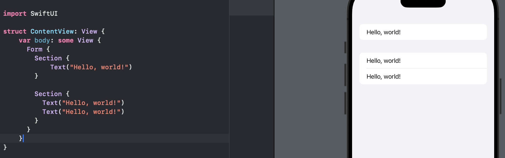
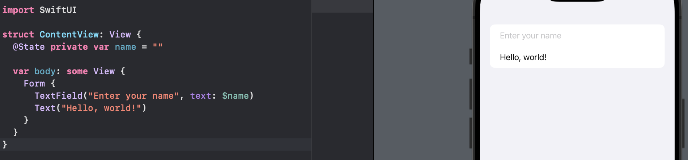

# Day 16 - Project 1, Part 1

The project is a check-sharing app that calculates how to split a check based on the number of people and how much tip we want to leave.

## WeSplit: Introduction

This project is broken down into three stages:

1. A hands-on introduction to all the techniques we learned.
2. A step-by-step guide to build the project.
3. Challenges to complete to take the project further.

This time we will launch Xcode and choose iOS App project:

- For Product Name please enter “WeSplit”.
- For Organization Identifier we can enter whatever we want, but if we have a website we should enter it with the components reversed: “hackingwithswift.com” would be “com.hackingwithswift”. If we don’t have a domain, make one up – “me.yourlastname.yourfirstname” is perfectly fine.
- For Interface please select SwiftUI.
- For Language please make sure we have Swift selected.
- For Storage please select None.
- Make sure all the checkboxes at the bottom are *not* checked.

## Understanding the Basic Structure of a SwuiftUI App

When we create a new SwiftUI app, we will get a selection of files:


Inside the project navigator:

- `WeSplitApp.swift` contains code for launching our app. If we create something when the app launches and keep it alive the entire time, we will put it here.
- `ContentView.swift` contains the initial user interface (UI) for our program, and is where we will be doing all the work in this project.
- `Assets.xcassets` is an *asset catalog* - a collection of pictures that we want to use in our app. We can also add colors here, along with app icons, iMessage sticks, and more.
- `Preview Content` is a group, with `Preview Assets.xcassets` inside - this is another asset catalog, this time specifically for example images we want to use when we design our user interfaces, to give us an idea of how they might look when the program is running.

All our work for this project will take place in `ContentView.swift`, which Xcode will already have opend for us:

```swift
import SwiftUI

struct ContentView: View {
    var body: some View {
        VStack {
            Image(systemName: "globe")
                .imageScale(.large)
                .foregroundStyle(.tint)
            Text("Hello, world!")
        }
        .padding()
    }
}

#Preview {
    ContentView()
}
```

1. `import SwiftUI` tells Swift that we want to use all the functionality given to us by the SwiftUI framework.
2. `struct ContentView: View` creates a new struct called `ContentView`, saying that it conforms to the `View` protocol. `View` protocol comes from SwiftUI, and is the basic protocol that must be adopted by anything we want to draw on the screen - all text, buttons, images, and more are all views, including our own layouts that combine other views.
3. `var body: some View` defines a new computed property called `body`, which has a type: `some View`. This means it will return something that conforms to the `View` protocol, which is our layout. This will actually result in a very complicated data type but `some View` means we do not need to worry about that.
4. The `View` protocol has only one requirement, which is that we have a computed property called `body` that returns `some View`. We can add more properties and methods to our view structs, but `body` is the only thing that is required.
5. `VStack` and the code inside show a globe image with the text "Hello, world!" below it. The globe image comes from Apple's SF Symbols icon set. Text views are simple pieces of static text that get drawn onto the screen, and will automatically wrap across mulitple lines as needed.
6. `imageScale()`, `foregroundStyle()`, and `padding()` are methods being called on the image and `VStack`. These are what SwiftUI calls *modifiers*, which are regular methods with one small difference: they always return a new view that contains both our original data, plus the extra modification we asked for. In our case, that means the globe image will be shown larger and in blue, and the whole `body` property will return a padded text view, not just a regular text view.
7. `#Preview` with `ContentView()` inside is a special piece of code that will not actually form part of our final app that goes to the App Store, but is instead specifically for Xcode to use so it can show a preview of our UI design alongside our code.

# Creating a Form

SwiftUI gives us a dedicated view type for user inputs, called `Form`.

Forms are scrolling lists of static controls like text and images, but can also include user interactive controls like text fields, toggle switches, buttons, and more.

A basic form:

```swift
var body: some View {
  Form {
    Text("Hello, world!")
  }
}
```

This will change the preview:


We can add more freely:

```swift
var body: some View {
  Form {
    Text("Hello, world!")
    Text("Hello, world!")
    Text("Hello, world!")
  }
}
```

Then, our preview


If we want to split our form up into visual chunks, just like the Settings app does, we can use `Section` :

```swift
var body: some View {
  Form {
    Section {
    	Text("Hello, world!")
    }
    
    Section {
      Text("Hello, world!")
      Text("Hello, world!")
    }
  }
}
```

In the preview:



## Adding a Navigation Bar

On an iPhone 15, the safe area spans the space from just below the dynamic island down to just above the home indicator.

We can swipe around in the iOS simulatro to move the row up and down.

A common way of fixing this is by placing a navigation bar at the top of the screen. Navigation bars can have titles and buttons, and in SwiftUI they also give us the ability to display new views when the user performs an action.

Using `Form` and `Section` learned in previous section, we can add a navigation bar in the same way:

```swift
var body: some View {
  NavigationStack {
    Form {
      Section {
        Text("Hello, world!")
      }
    }
  }
}
```

Usually we want to put some title in the navigation bar, and we can do that by attaching a *modifier*:

```swift
var body: some View {
  NavigationStack {
    Form {
      Section {
        Text("Hello, world!")
      }
    }
    .navigationTitle("SwiftUI")
  }
}
```


When we attach the `.navigationTitle()` modifier to our form, Swift actually creates a new form that has a navigation title plus all the existing contents we provided.

We can get a small font instead of the default large font by adding another modifier:

```swift
var body: some View {
  NavigationStack {
    Form {
      Section {
        Text("Hello, world!")
      }
    }
    .navigationTitle("SwiftUI")
    .navigationBarTitleDisplayMode(.inline)
  }
}
```


## Modifying Program State

When we say SwiftUI's views are a function of their state, we mean that the way our user interface looks - the things people can see and what they can interact with - are determined by the state of our program. For example, they cannot tap Continue until they have entered their name in a text field.

For example, we will create a button with an action closure that gets run when the button is tapped:

```swift
struct ContentView: View {
  var tapCount = 0
  
  var body: some View {
    Button("Tap Count: \(tapCount)") {
      tapCount += 1
    }
  }
}
```


ERROR!

`ContentView` is a struct, which might by created as a constant. This means that it is *immutable* - we cannot change its values freely.

When creating struct methods that want to change properties, we need to add the `mutating` keyword: `mutating func doSomeWork()`, for example.

However, Swift does NOT let us make mutating computed properties, which means we cannot write `mutating var body: some View`.

Fortunately, Swift gives us a special solution called a *property wrapper*: a special attribute we can place before our properties that effectively gives them superpowers.

In the case of storing simple program state like the number of times a button was tapped, we can use a property wrapper from SwiftUI called `@State`:

```swift
struct ContentView: View {
  @State var tapCount = 0
  
  var body: some View {
    Button("Tap Count: \(tapCount)") {
      self.tapCount += 1
    }
  }
}
```


`@State` allows us to work around the limitation of structs: we know we cannot change their properties because structs are fixed, but `@State` allows that value to be stored separately by SwiftUI in a place that can be modified.

`@State` is specifically designed for simple properties that are stored in one view. As a result, Apple recommends we add `private` access control:

```swift
struct ContentView: View {
  @State private var tapCount = 0
  
  var body: some View {
    Button("Tap Count: \(tapCount)") {
      self.tapCount += 1
    }
  }
}
```

## Binding State to User Interface Controls

SwiftUI's `@State` property wrapper lets us modify our view structs freely, which means as our program changes we can update our view properties to match.

For example, if we want to create an editable text box that users can type into, we need to add a `name` property in our strut that can be shown inside the text field and also store whatever the user types in the text field.

As what we did in the previous section, Swift needs to be able to update the `name` property to match whatever the user types into the text field, so we need to use the `@State` property wrapper:

```swift
@State private var name = ""
```

However this is not enough.

Swift differentiates between "show the value of this property here" and "show the value of this property here, *but write any changes back to the property*."

In the case of our text field, Swift needs to make sure whatever is in the text is also in the `name` property, so that it can fulfill its promise that our views are a function of their state - that everything the user can see is just the visible representation of the structs and properties in our code.

This is called a *two-way binding*: we bind the text field so that it shows the value of our property, but we also bind it so that any changes to the text field also update the property.

In Swift, we mark these two-way bindings with a special symbol (`$`) so that they stand out: `$name`. This tells Swift that it should read the value of the property but also write it back as any changes happen:

```swift
struct ContentView: View {
  @State private var name = ""
  
  var body: some View {
    Form {
      TextField("Enter your name", text: $name)
      Text("Hello, world!")
    }
  }
}
```

In preview:



We can also modify the text view so that it shows the user name directly below their text field:

```swift
struct ContentView: View {
  @State private var name = ""
  
  var body: some View {
    Form {
      TextField("Enter your name", text: $name)
      Text("Hello, world!")
      Text("Your name is \(name)")
    }
  }
}
```

In preview,


Notice how that uses `name` rather than `$name`. This is because we do not want a two-way binding here - we want to *read* the value but did not want to write it back because that text view will not change.

Thus, when we see `$` before a property name, this indicates it creates a two-way binding: the value of the property is read and written.

## Creating Views in a Loop

It is common to want to create several SwiftUI views inside a loop. For example, we might want to loop over an array of names and have each one be a text view, or loop over an array of menu items and have each one be shown as an image.

SwiftUI gives a dedicated view type called `ForEach`, which can loop over arrays and ranges, creating as many views as needed.

`ForEach` will run a closure once for every item it loops over, passing in the current loop item. For example, if we loop from 0 to 10 it would pass in 0, then 1, then 2, and son. The following creates a form with 10 rows:

```swift
struct ContentView: View {
  var body: some View {
      Form {
        ForEach(0..<10) {
          number in
          Text("Row \(number)")
        }
      }
  }
}
```

In preview:


Because `ForEach` passes in a closure, we can use shorthand syntax for the parameter name,

```swift
struct ContentView: View {
  var body: some View {
      Form {
        ForEach(0..<10) {
          Text("Row \($0)")
        }
      }
  }
}
```

This gives the same rendering in preview:


`ForEach` is particularly useful when working with SwiftUI's `Picker` view, which lets us show various options for users to select from.

For example, we will define a view that

- Has an array of possible student names.
- Has an `@State` property storing the currently selected student.
- Creates a `Picker` view asking users to select their favorite, using a two-way binding to the `@State` property.
- Uses `ForEach` to loop over all possible student names, turning them into a text view.

```swift
struct ContentView: View {
  let students = ["Steph", "Kyrie", "Derrick"]
  @State private var selectedStudent = "Steph"
  
  var body: some View {
    NavigationStack {
      Form {
        Picker("Select your student", selection: $selectedStudent) {
          ForEach(students, id: \.self) {
            Text($0)
          }
        }
      }
    }
  }
}
```

In preview


Note:

1. The `students` array does not need to be marked with `@State` because it is a constant.
2. The `selectedStudent` property starts with the value "Steph" but can change, which is why it is marked with `@State`.
3. The `Picker` has a label, "Select your student", which tells users what it does
4. The `Picker` has a two-way binding to `selectedStudent`, which means it will start showing a selection of "Harry" but update the property when the user selects something else.
5. Inside the `ForEach` we loop over all the students.
6. For each student we create one text view, showing that student's name


The only confusing part is `ForEach(students, id: \.self)`. This loops over the `students` array so we can create a text view for each one, but the `id: \.self` part is important. This exists because SwiftUI needs to be able to identify every view on the screen uniquely, so it can detect when things change.

For example, if we rearrange our array so that Kyrie comes first, SwiftUI would move its text view at the same time. Hence, we need to tell SwiftUI how it can identify each item in our string array uniquely.

This is why we have an `id` integer to make it unique. Here we have an array of simple strings, and the only thing unique about the string is the string itself: each string in our array is different, so the strings are naturally unique.

When we use `ForEach` to create many views and SwiftUI asks us what identifier makes each item in our string array unique, our answer is `\.self`, which means "the strings themselves are unique!"