# Day 17 - Project 1, Part 2

## Reading Text from the User with TextField

We are building a check-splitting app, which means users need to enter the cost of their check, how many people are sharing the cost, and how much tip they want to leave.

We start by adding three `@State` properties to our `ContentView` strut:

```swift
struct ContentView: View {
    @State private var checkAmount = 0.0
    @State private var numberOfPeople = 2
    @State private var tipPercentage = 20
}
```

We also set up a predetermined array of tip sizes for people to choose:

```swift
// under the first three properties
let tipPercentages = [10, 15, 20, 25, 0]
```

Next, we start to build up the form.

```swift
Form {
    Section {
        TextField("Amount", text: $checkAmount)
    }
}
```

This causes ERROR! SwiftUI requires `TextField` to be used for entering text - strings. As users could enter any kind of text, we need to carefully convert that string to a number we can work with. We can pass `Double` to `TextField` and ask it to treat the input as a currency:

```swift
Form {
    Section {
        TextField("Amount", value: $checkAmount, format: .currency(code: "USD"))
    }
}
```

In preview,

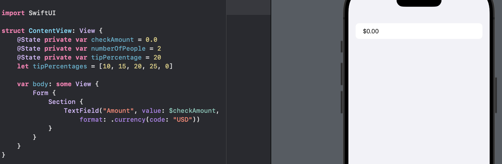

However, "USD" is not the only currency so we cannot force everyone to use this currency. A better solution is to ask iOS if it can give us the currency code for the current user, if there is one.

```swift
Form {
    Section {
        TextField(
            "Amount", 
            value: $checkAmount, 
            format: .currency(code: Locale.current.currency?.identifier ?? "USD")
        )
    }
}
```

`Locale` is a massive struct built into iOS that is responsible for storing all hte user's region settings - what calendar they use, how they separate thousands digits in numbers, whether they use the metric system, and more.

In `TextField`, 

- The 1st parameter is a string that gets used as the *placeholder* - gray text shown in side the text field, givin users an idea of what should be in there. 
- The 2nd parameter is the two-way binding to our `checkAmount` property, which means as the user types that property will be updated. 
- The 3rd parameter is the one that controls the way the text is formatted, making it a currency.

A great thing about the `@State` property wrapper is that it automatically watches for changes, and when something happens it will automatically re-inoke the `body` property.

```swift
Form {
    Section {
        TextField(
        	"Amount",
            value: $checkAmount,
            format: .currency(code: Locale.current.currency?.identifier ?? "USD")
        )
    }
    
    Section {
        Text(
        	checkAmount,
            format: .currency(code: Locale.current.currency?.identifier ?? "USD")
        )
    }
}
```

In preview,

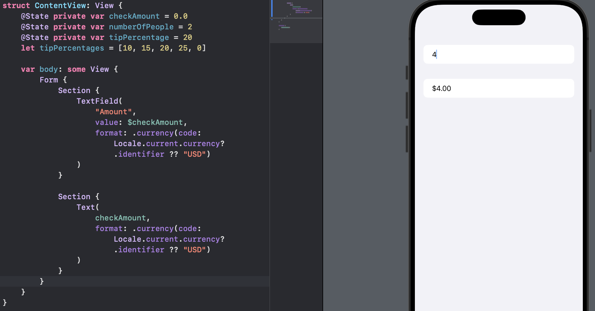

The synchronization in the `Text` box happens because

1. Our text field has a two-way binding to the `checkAmount` property.
2. The `checkAmount` property is marked with `@State`, which automatically watches for changes in the value.
3. When an `@State` property changes SwiftUI will re-invoke the `body` property (i.e., reload our UI).


When we tap to enter text into our text field, users see a regular alphabetical keyword. Text fields have a modifier that lets us force a different kind of keyboard: `keyboardType()`. We can give this a parameter specifying the kind of keyboard we want, and in this instance either `.numberPad` or `.decimalPad` are good choices. Both of those keyboards will show the digits 0 throught 9 for users to tap on, but `.decimalPad` also shows a decimal point so users can enter check amount like $32.50 rather than just whole numbers.

```swift
Form {
    Section {
        TextField(
        	"Amount",
            value: $checkAmount,
            format: .currency(code: Locale.current.currency?.identifier ?? "USD")
        )
        	// indented deeper than `TextField`
        	.keyboardType(.decimalPad)
    }
    
    Section {
        Text(
        	checkAmount,
            format: .currency(code: Locale.current.currency?.identifier ?? "USD")
        )
    }
}
```

## Creating Pickers in a Form

Pickers, like text fields, need a two-way binding to a property so they can track their value.

We will modify the first section in our form to include a picker:

```swift
Section {
    TextField(
        "Amount",
        value: $checkAmount,
        format: .currency(code: Locale.current.currency?.identifier ?? "USD")
    )
        // indented deeper than `TextField`
        .keyboardType(.decimalPad)
    
    Picker("Number of people", selection: $numberOfPeople) {
        ForEach(2..<10) {
            Text("\($0) people")
        }
    }
}
```

In preview,

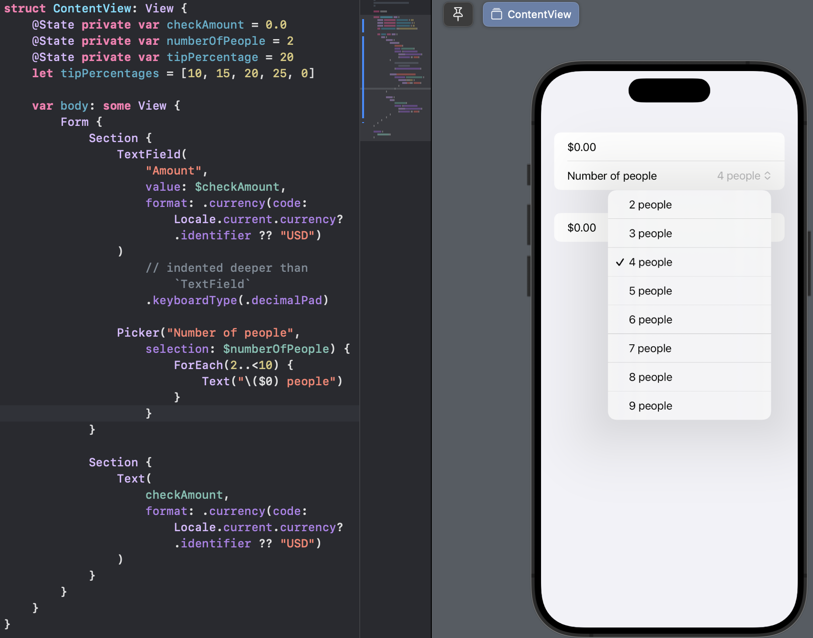

Gray arrows on the right edge indicates a menu of options. Notice that the row says "4 people" by default but we gave `numberOfPeople` property a default value of 2.

When we create the picker we use a `ForEach` view: `ForEach(2..<10)`, which counts from 2 up to 10, creating rows. This means that the 0th row - the first item that is created - contains "2 people", so when we give `numberOfPeople` the value of 2, we actually set it to the 3rd row, which is "4 people".

Pickers come with lots alternative styles depending on how we want things to behave. One popular picker style is called *navigation link*, which moves the user to a new screen to select their option:

```swift
Picker("Number of people", selection: $numberofPeople) {
    ForEach(2..<10) {
        Text("\($0) people")
    }
}
	.pickerStyle(.navigationLink)
```

This will NOT work as we will see a gray disclosure indicator on the right edge. What SwiftUI wants to do is show a new view with the options from our picker. To do that, we need to add a navigation stack, which gives us some space across the top to place a title, and also lets iOS slide in new views as needed.

We will directly add `NavigationStack` before the form:

```swift
var body: some View {
    NavigationStack {
        Form {
            // everything inside our form
        }
    }
}
```

In preview,

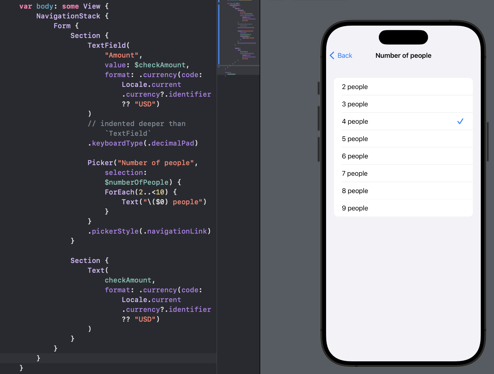

After selecting a value, the screen will automatically slide away, taking the user back to the previous screen with their new selection.

What we see here is the importance of what is called *declarative user interface design*. This means that we say what we want rather than say how it should be done: We said we wanted a navigation link picker with some values inside, but we didn't have to say "now create a list of all our items, showing a checkmark to whichever is selected right now."

We can also add a title to the new navigation bar. Give the form the following modifier:

```swift
.navigationTitle("WeSplit")
```

Note: it is tempting to attach this modifier to the end of the `NavigationStack`, but it needs to be attached to the end of the `Form` instead. The reason is that navigation stacks are capable of showing many views as our program runs, so by attaching the title to the thing *inside* the navigation stack we allow iOS to change titles freely.

In preview,

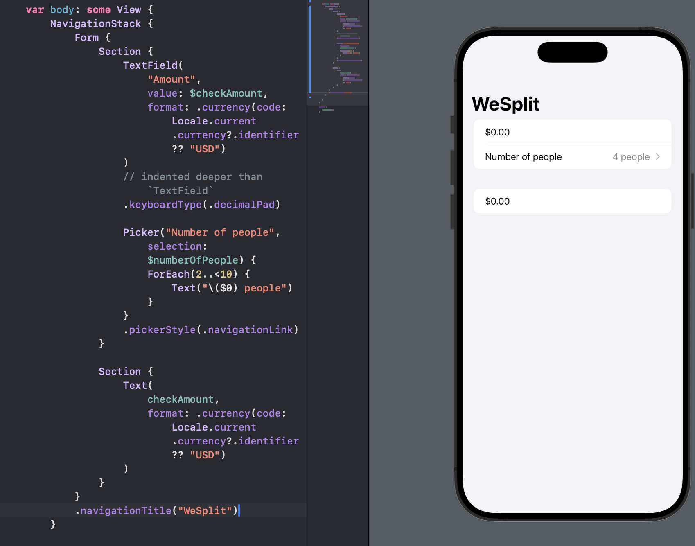

## Adding a Segmented Control for Tip Percentages

Now we will add a second picker view to our app, but this time we want a *segmented control*. This is a specialized kind of picker that shows a handful of options in a horizontal list, and it works great when we have only a small selection to choose from.

We have two sections: one for the amount and number of people, and one where we will show the final result.

We will add a new section to show tip percentages:

```swift
Section {
    Picker("Tip percentage", selection: $tipPercentage) {
        ForEach(tipPercentages, id: \.self) {
            Text($0, format: .percent)
        }
    }
}
```

In preview,

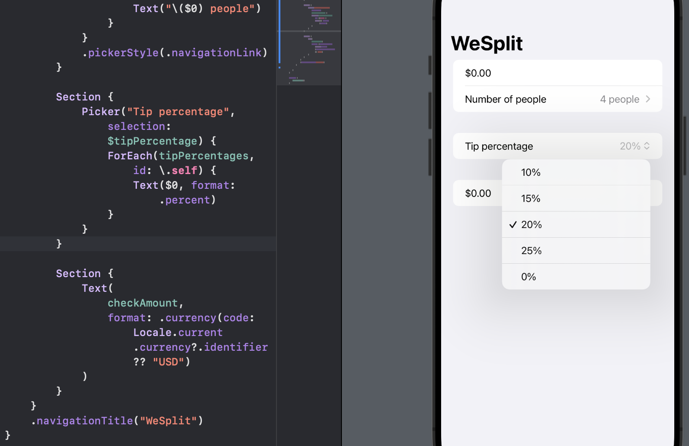

That loops over all the options in our `tipPercentages` array, converting each one into a text view with the `.percent` format. SwiftUI by default will convert that to a single row in our list, and present a pop-up menu of options when it is tapped.

To use a segmented control instead, we need to add a modifier to the tip picker:

```swift
Section {
    Picker("Tip percentage", selection: $tipPercentage) {
        ForEach(tipPercentages, id: \.self) {
            Text($0, format: .percent)
        }
    }
    .pickerStyle(.segmented)
}
```

In preview,

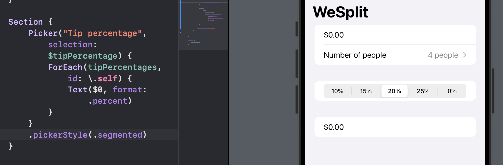

However, users do not know what the percentages are for. We can choose to add a text view directly:

```swift
Section {
    Text("How much tip do you want to leave?")

    Picker("Tip percentage", selection: $tipPercentage) {
        ForEach(tipPercentages, id: \.self) {
            Text($0, format: .percent)
        }
    }
    .pickerStyle(.segmented)
}
```

In preview,

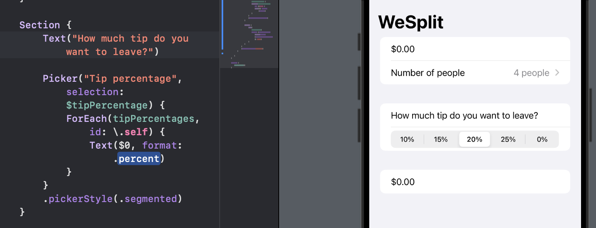

It works fine but looks like an item all by itself, rather than a label for the segmented control.

Instead, SwiftUI lets us add views to the header and footer of a section:

```swift
Section("How much tip do you want to leave?") {
    Picker("Tip percentage", selection: $tipPercentage) {
        ForEach(tipPercentages, id: \.self) {
            Text($0, format: .percent)
        }
    }
    .pickerStyle(.segmented)
}
```

In preview,

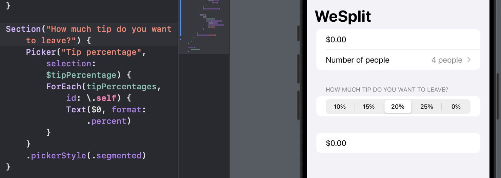

## Calculating the Total per Person

Before calculating the actual amount per person, we need to pull out the values for how many people there are, what the tip percentage is, and the value of the order.

We will create a new computed property called `totalPerPerson` that will be a `Double`, and it will start off by getting the input data ready.

First, we will add the computed property before the `body` property:

```swift
var totalPerPerson: Double {
    // calculate the total per person here
    return 0
}
```

This sends back 0 so our code does NOT break.

Next, we will figure out how many people there are by reading `numberOfPeople` and adding 2 to it. Remember that this thing has the range 2 to 100, but it *counts from 0*, which is why we need to add the 2 here:

```swift
var totalPerPerson: Double {
    // calculate the total per person here
    let peopleCount = Double(numberOfPeople + 2)
    return 0
}
```

We convert the resulting value to a `Double` because it needs to be used alongside the `checkAmount`. For the same reason, we also need to convert our tip percentage into a `Double`:

```swift
var totalPerPerson: Double {
    // calculate the total per person here
    let peopleCount = Double(numberOfPeople + 2)
    let tipSelection = Double(tipPercentage)
    return 0
}
```

Now that we have input values, we can calculate the correct amount per person:

```swift
var totalPerPerson: Double {
    // calculate the total per person here
    let peopleCount = Double(numberOfPeople + 2)
    let tipSelection = Double(tipPercentage)
    
    let tipValue = checkAmount / 100 * tipSelection
    let grandTotal = checkAmount + tipValue
    let amountPerPerson = grandTotal / peopleCount
    return amountPerPerson
}
```

Now that `totalPerPerson` gives us the correct value, we can change the final section in our form so it shows the correct text:

```swift
Section {
    Text(
        totalPerPerson, //checkAmount,
        format: .currency(code: Locale.current.currency?.identifier ?? "USD")
    )
}
```

In preview,

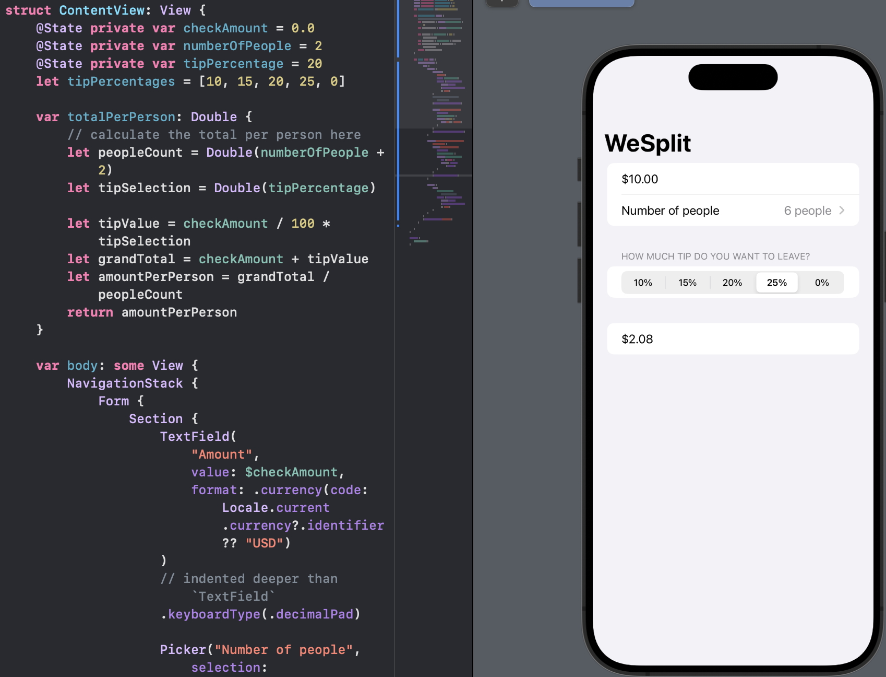

## Hiding the Keyboard

Once the keyboard appears for the check amount entry, it never goes away. This is a problem with the decimal and number keypads, because the regular alphabetic keyboard has a return key on there to dismiss the keyboard.

To fix this, we can

- give SwiftUI some way of determining whether the check amount box should currently have *focus* - should be receiving text input from the user
- add some kind of button to remove that focus when the user wants.

To solve the first one, we need a second property wrapper: `@FocusState`. This is like a regular `@State` property, except it is specifically designed to handle input focus in our UI.

If we add this new property to `ContentView`:

```swift
@FocusState private var amountIsFocused: Bool
```

Now we can attach that to our text field, so that when the text field is focused, `amountIsFocused` is true, otherwise it's false. We can add this modifier to our `TextField`:

```swift
TextField(
    "Amount",
    value: $checkAmount,
    format: .currency(code: Locale.current.currency?.identifier ?? "USD")
)
// indented deeper than `TextField`
.keyboardType(.decimalPad)
.focused($amountIsFocused)
```

In preview,

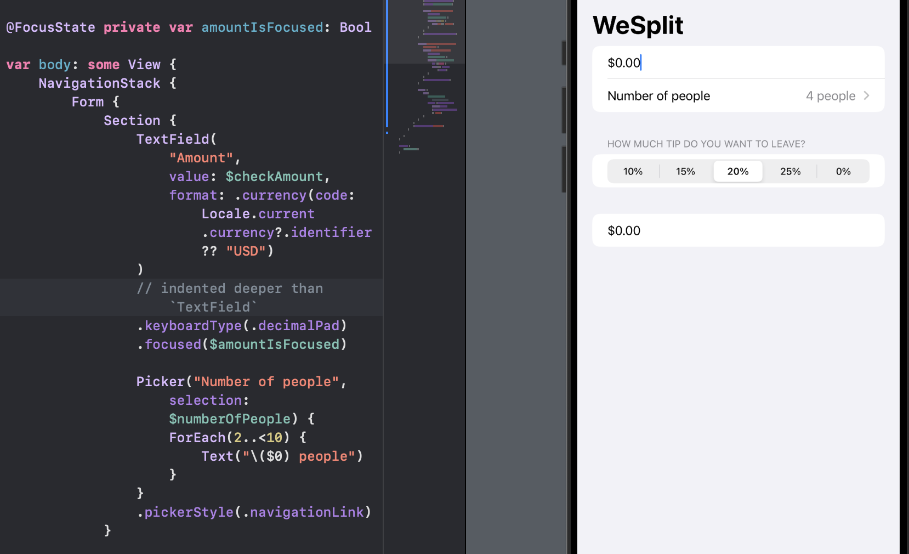

SwiftUI now is silently aware of whether the text field should have focus or not.

To solve the second one, we will add a toolbar button when the text field is active. We will add the following new modifier to our form, below the existing `navigationTitle()` modifier:

```swift
.toolbar {
    if amountIsFocused {
        Button("Done") {
            amountIsFocused = false
        }
    }
}
```

In preview,

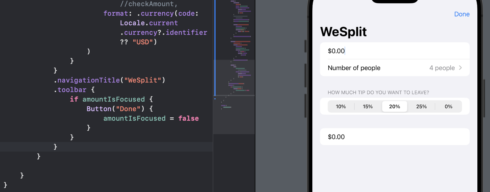

- The `toolbar()` modifier lets us specify tool bar items for a view. These toolbar items might appear in various places on the screen - in the navigation at the top, in a special toolbar area at the bottom, and so on.
- The condition checks whether `amountIsFocused` is currently true, so we only show the button when the text field is active.
- The `Button` view we used here display some tappable text, which in our case is "Done". We also provide it with some code to run when the button is pressed, which in our case sets `amountIsFocused` to false so that the keyboard id dismissed.