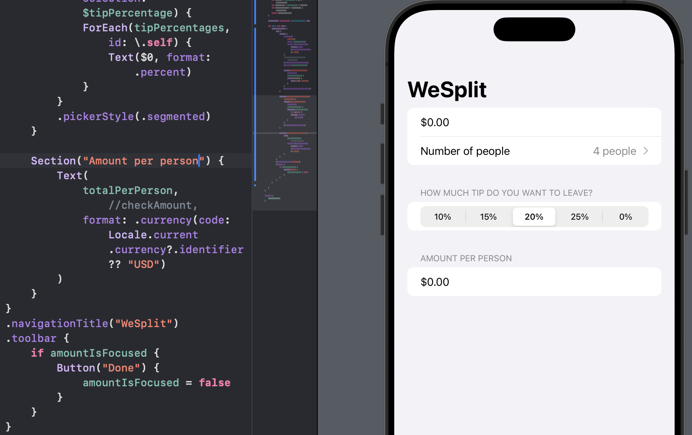
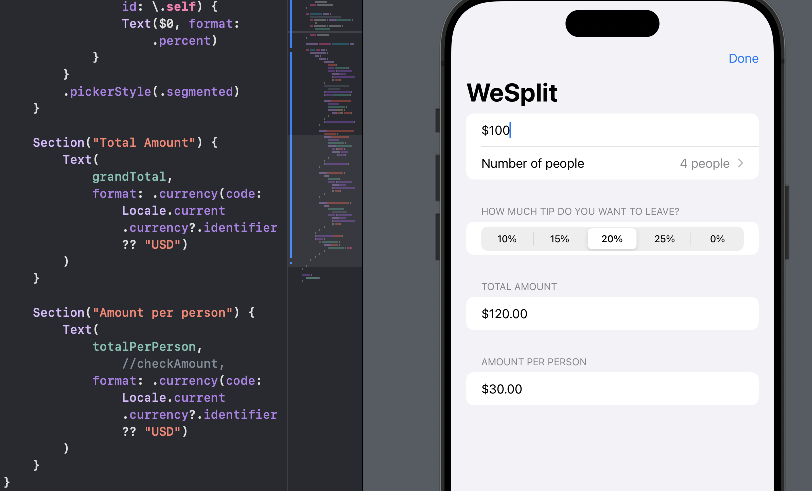
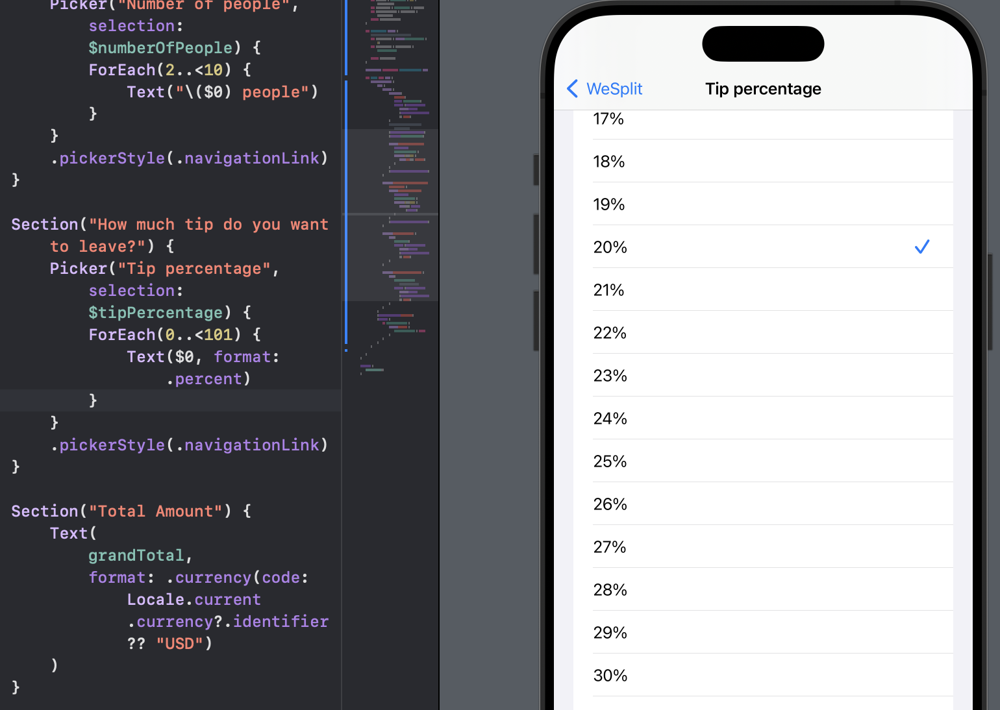

# Day 18 - Project 1, Part 3

Recall that

```swift
Picker("Tip percentage", selection: $tipPercentage) {
    ForEach(tipPercentages, id: \.self) {
        Text($0, format: .percent)
    }
}
```

The `$0` is the shorthand syntax for closure parameters.


## WeSplit: Wrap up

In the WeSplit app, we learned about the basic structure of SwiftUI apps, how to build forms and sections, creating navigation stacks and navigation bar titles, how to store program state with the `@State` and `@FocusState` property wrappers, how to create user interface controls like `TextField` and `Picker`, and how to create views in a loop using `ForEach`.


### Challenge

1. Add a header to the third section, saying "Amount per person"
   

2. Add another section showing the total amount for the check - i.e., the original amount plus tip value, without dividing by the number of people.
   

3. Change the tip percentage picker to show a new screen rather than using a segmented control, and give it a wider range of options - everything from 0% to 100%.
   