# Day 20 - Project 2, Part 1

## Guess the Flag: Introduction

In this project, we will build a guessing game that helps users learn flags of the world.

## Using Stacks to Arrange Views

When we return `some View` for our body, SwiftUI expects to receive back some kind of view that can be displayed on the screen. If we want to return *multiple* things neatly arranged, we can use `HStack`, `VStack`, and `ZStack`, which handle horizontal, vertical, and zepth layout.

For example, the default template:

```swift
var body: some View {
    VStack {
           Image(systemName: "globe")
                .imageScale(.large)
                .foregroundStyle(.tint)
           Text("Hello, world!")
    }
    .padding()
}
```

This would arrange the image appears above the text, but we can simplify this:

```swift
var body: some View {
    Image(systemName: "globe")
        .imageScale(.large)
        .foregroundStyle(.tint)
    Text("Hello, world!)
}
```

The rendering result is the same but there are three important differences:

- Being explicit allows us to specify how much space to place between the views.

- It also allows us to specify an *alignment* - whether the view should be placed on the left, right, or center of each other.

- If we don't explicitly ask for a vertical stack, SwiftUI is free to arrange those views in a different way.

By default `VStack` places automatic amount of spacing between the two views, but we can control the spacing:

```swift
VStack(spacing: 20) {
    Text("Hello world!")
    Text("This is inside a stack")
}
```

 In preview,

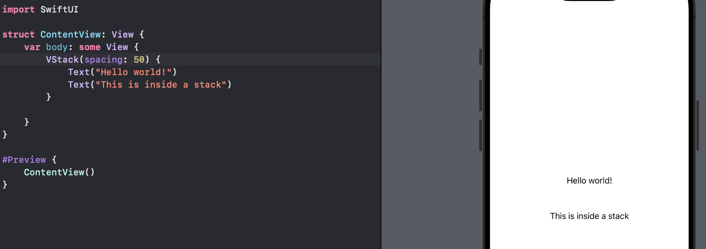

By default, `VStack` aligns its views at center, but we can control that with its `alignment` property,

```swift
VStack(alignment: .leading) {
    Text("Hello world!")
    Text("This is inside a stack")
}
```

In preview,

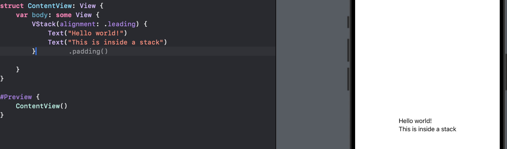

Similar to `VStack`, we can use `HStack` to arrange things horizontally.

```swift
HStack(spacing: 30) {
    Text("Hello world!")
    Text("This is inside a stack")
}
```

In preview,

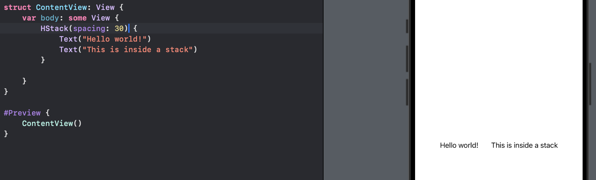

Vertical and horizontal stacks automatically fit their content, and prefer to align themselves to the center of the available space. If we want to change, we can use `Spacer` views:

```swift
VStack {
    Text("First")
    Spacer()
    Text("Second")
    Spacer()
    Spacer()
    Text("Third")
}
```

In preview,

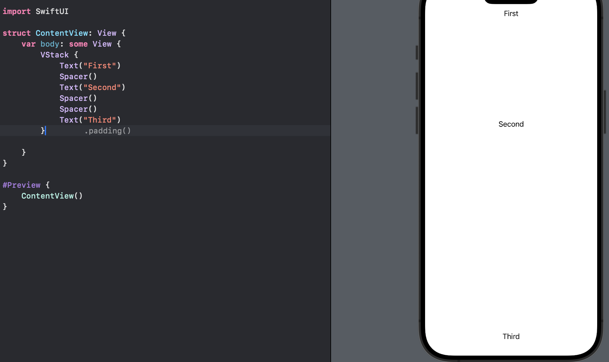

`ZStack` is used to arrange things by depth - it makes views that overlap.

```swift
ZStack {
    Text("Hello world!")
    Text("This is inside a stack")
}
```

In preview,


`ZStack` does not have the concept of spacing because the views overlap, but it *does* have alignment. `ZStack` draws its contents from top to bottom, back to front. This means if we have an image then some text `ZStack` will draw them in that order, placing the text on top of the image.

## Colors and Frames

To add a background color, we can use the `background()` modifier,

```swift
ZStack {
    Text("Your content")
}
.background(.red)
```

In preview,

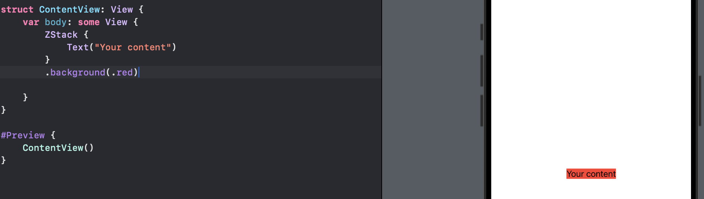

This only paints a red background in the text view, even though we asked the whole `ZStack` to have it. In fact, there is no difference from the following:

```swift
ZStack {
    Text("Your content")
        .background(.red)
}
```

If we want to fill in the whole area behind the text, we should place the color into the `ZStack` - treat it as a whole view, all by itself:

```swift
ZStack {
    Color.red
    Text("Your content")
}
```

In preview,

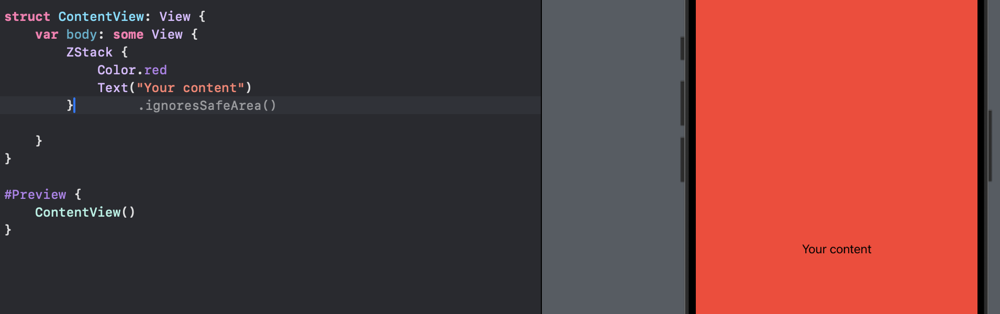

`Color.red` is a view in its own right, which is why it can be used like shapes and text.

When we use the `background()` modifier, SwiftUI figures out that `.red` actually means `Color.red`. When we use the color as a free-standing view Swift has no context to help it figure out what `.red` means so we need to specific that we mean `Color.red`.

Colors automatically take up all the space available. We can use the `frame()` modifier to ask for specific sizes. For example, we could ask for a 200x200 red square:

```swift
ZStack {
    Color.red
        .frame(width: 200, height: 200)
    Text("Your content")
}
```

In preview,

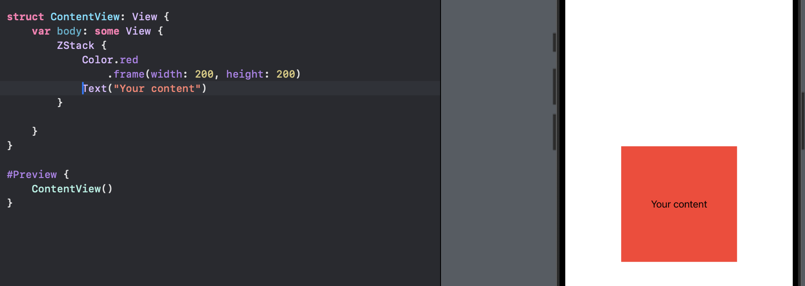

We can also specify minimum and maximum widths and heights:

```swift
ZStack {
    Color.red
        .frame(minWidth: 200, maxWidth: .infinity, maxHeight: 200)
}
```

This gives a red corlor that is no more than 200 points high, but for its width must be at least 200 points width but can stretch to fill all the available width that is not used by other stuff.

SwiftUI also has *semantic* colors - colors that do not say what hue they contain, but instead describe their purpose. For example, `Color.primary` is the default color of text in SwiftUI, and will either be black or white depending on whether the user's device is running in light mode or dark mode. `Color.secondary` is also black or white depending on the device, but now has slight transparency so that a little of the color behind it shines through.

We can also pass specific values:

```swift
Color(red: 1, green: 0.8, blue: 0)
```

The dynamic island area and the home indicator are left uncolored. This is intentional so not to interfere with other UI features. Hence, the whole middle space is called the *safe area*, and we can draw freely without worrying that it might be clipped by the notch on an iPhone.

If we *want* our content to go under the safe area, we can use the `.ignoresSafeArea()` modifier to specify which screen edges we want to run up to, or specify nothing to automatically go edge to edge.

```swift
ZStack {
    Color.red
    Text("Your content")
}
.ignoresSafeArea()
```

In preview, if we set `.ignoresSafeArea()`,

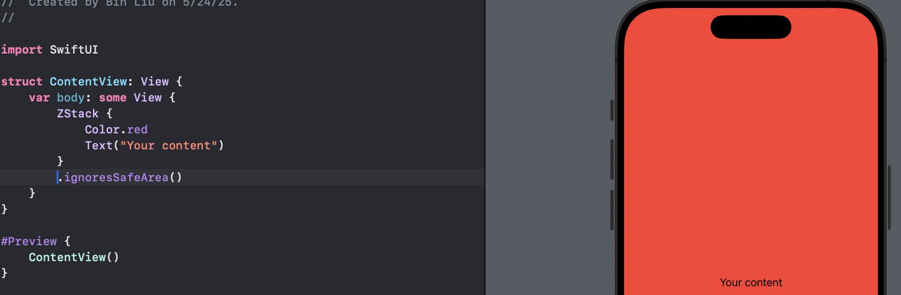

If not,

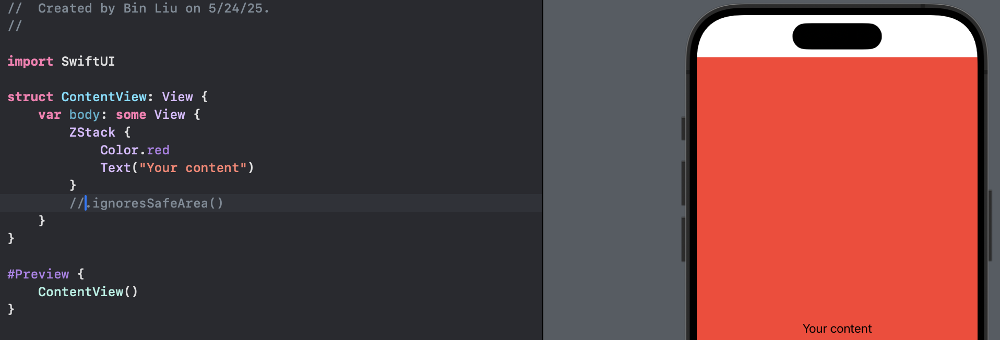

IMPORTANT: No important content is placed outside the safe area, because it might by hard for users to see. If our content is just decorative, then extending it outside the safe area is okay.

The `background()` modifier can accept *materials*. These apply a frosted glass effect over whatever comes below them. For example,

```swift
ZStack {
    VStack(spacing: 0) {
        Color.red
        Color.blue
    }

    Text("Your content")
        .foregroundStyle(.secondary)
        .padding(50)
        .background(.ultraThinMaterial)
}
.ignoresSafeArea()
```

In preview,

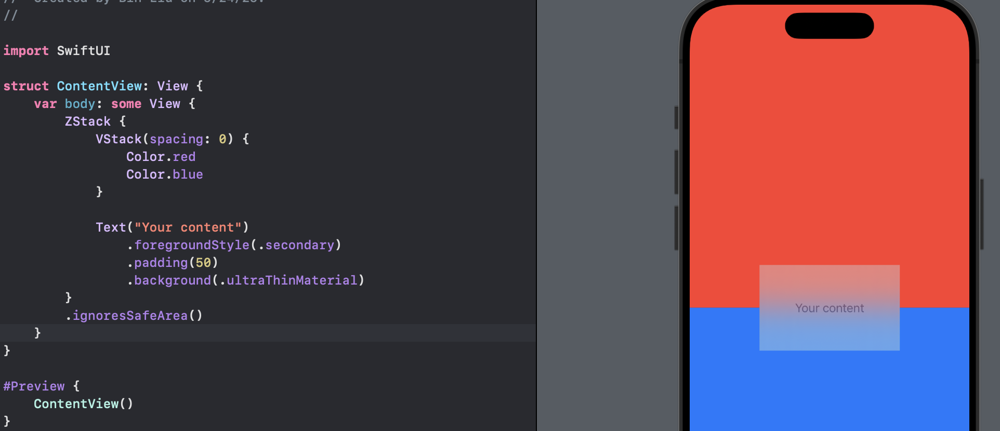

This uses the thinnest material.

## Gradients

Gradients are made up of

- an array of colors to show

- size and direction information

- type of gradient to use

For example, a linear gradient goes in one direction,

```swift
LinearGradient(colors: [.white, .black], startPoint: .top, endPoint: .bottom)
```

In preview,

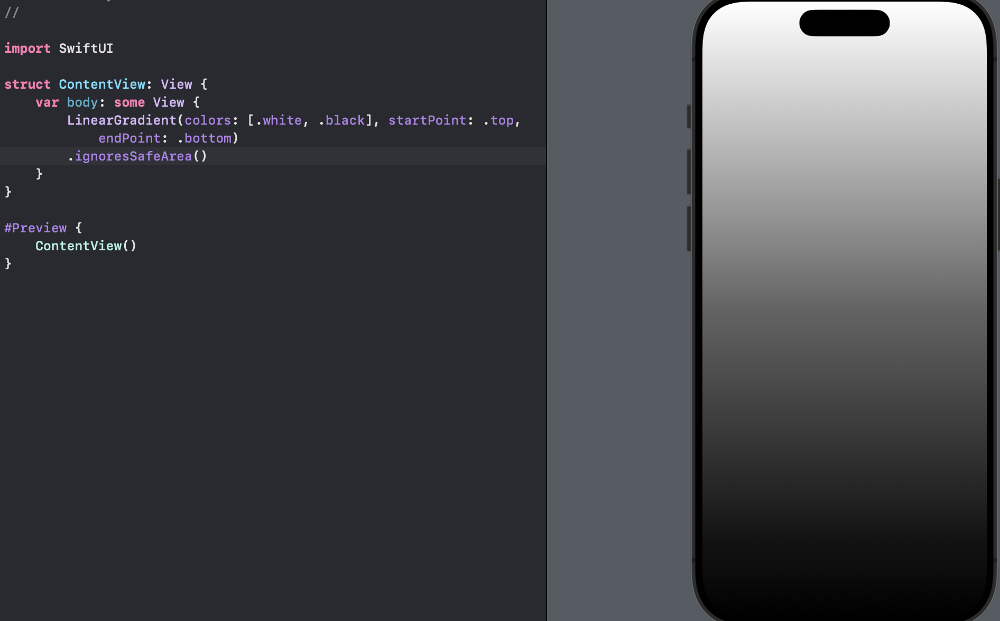

We can also provide with gradient stops, which let us specify both a color and how far along the gradient the color should be used.

```swift
LinearGradient(
    stops: [
        Gradient.Stop(color: .white, location: 0.45),
        Gradient.Stop(color: .black, location: 0.55)
    ],
    startPoint: .top,
    endPoint: .bottom
)
```

In preview,

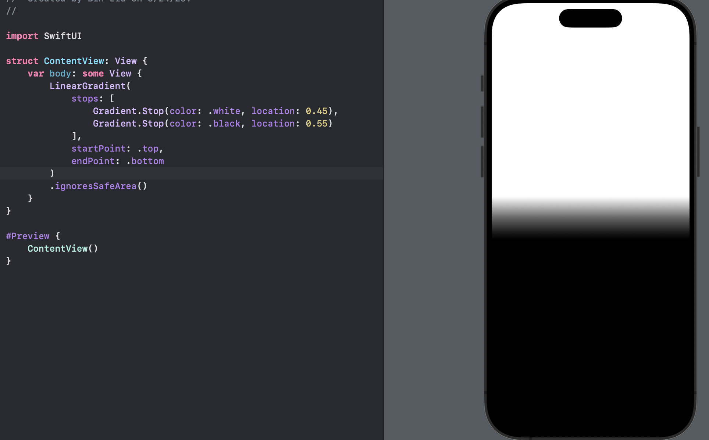

This will create a much sharper gradient.

Swift knows we creat gradient stops here, so we can use a shortcut:

```swift
LinearGradient(
    stops: [
        .init(color: .white, location: 0.45),
        .init(color: .black, location: 0.55)
    ],
    startPoint: .top,
    endPoint: .bottom
)
```

Radial gradients move outward in a circle shape.

```swift
RadialGradient(
    colors: [.blue, .black],
    center: .center,
    startRadius: 20,
    endRadius: 200
)
```

In preview,

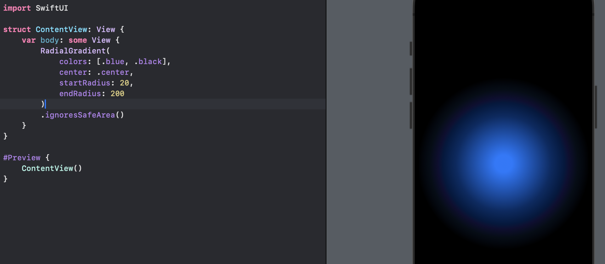

Angular gradients cycle colors around a circle rather than radiating outward.

```swift
AngularGradient(
    colors: [.red, .yellow, .green, .blue, .purple, .red],
    center: .center
)
```

In preview,

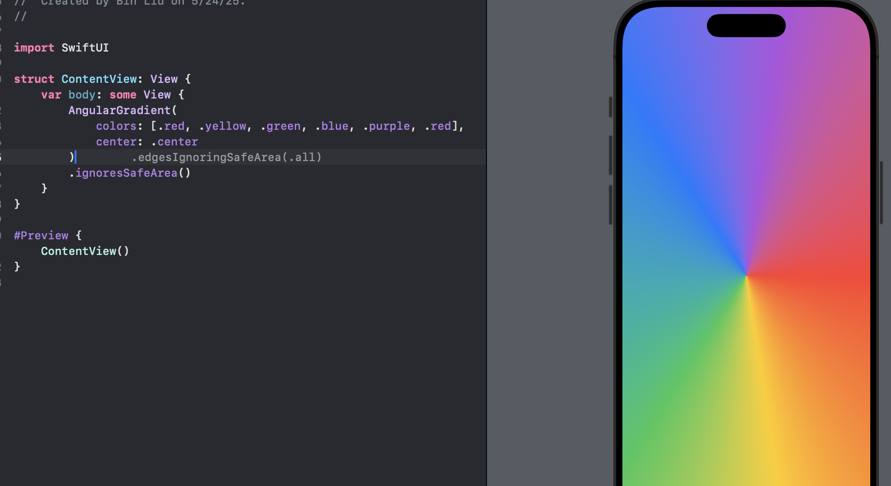

All of these gradient types can have stops provided rather than simple colors.

SwiftUI also has a fourth type of gradient - we don't get any cnotrol over it, and we can use them only as backgrounds and foreground styles rather than individual views.

This gradient is created by simply adding `.gradient` after any color - SwiftUI will automatically convert our color into a very gentle linear gradient:

```swift
Text("Your content")
    .frame(maxWidth: .infinity, maxHeight: .infinity)
    .foregroundStyle(.white)
    .background(.red.gradient)
```

In preview,

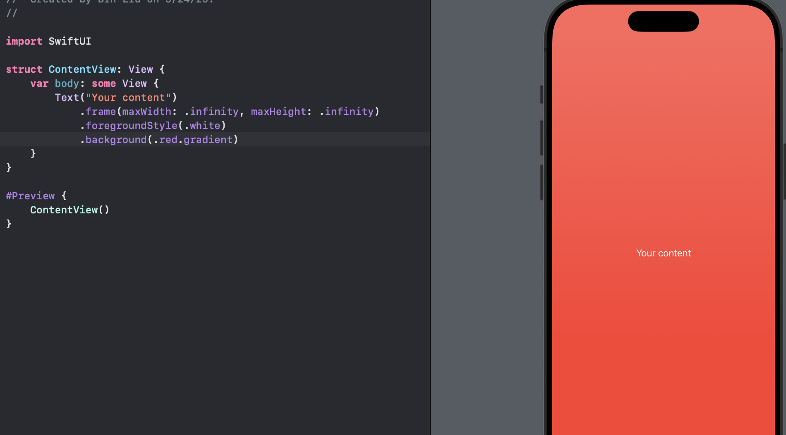

## Buttons and Images

Simple button example:

```swift
Button("Delete selection) {
    print("Now deleting...")
}
```

In preview,

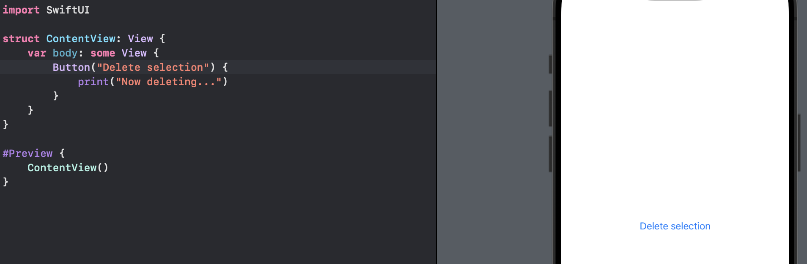

There are a few ways to customize the button. First, we can attach a *role* to the button, which iOS can use to adjust its appearance both visually and for screen readers.

```swift
struct ContentView: View {
    var body: some View {
        Button("Delete selection", role: .destructive, action: executeDelete)
    }

    func executeDelete() {
        print("Now deleting...")
    }
}
```

In preview,

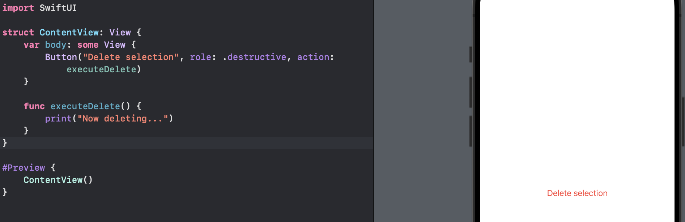

Second, we can use one of the built-in styles for buttons: `.bordered` and `.borderedProminent`.

```swift
VStack {
    Button("Button 1") {}
        .buttonStyle(.bordered)
    Button("Button 2", role: .destructive) {}
        .buttonStyle(.bordered)
    Button("Button 3") {}
        .buttonStyle(.borderedProminent)
    Button("Button 4", role: .destructive) {}
        .buttonStyle(.borderedProminent)
}
```

In preview,

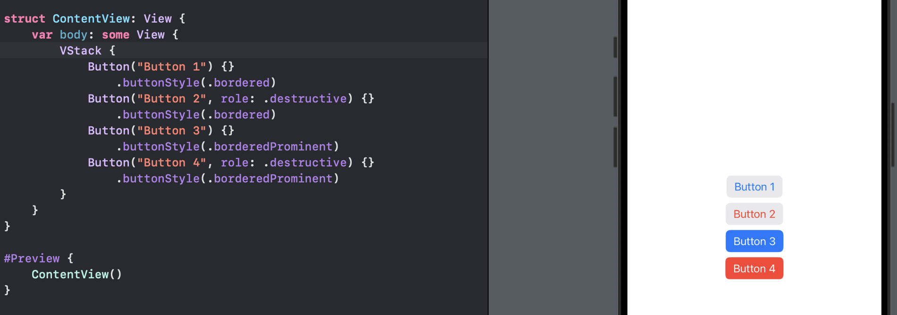

If we want to customize the colors used for a bordered button, we can use the `tint()` modifier:

```swift
Button("Button 5") {}
    .buttonStyle(.borderedProminent)
    .tint(.mint)
```

In preview,

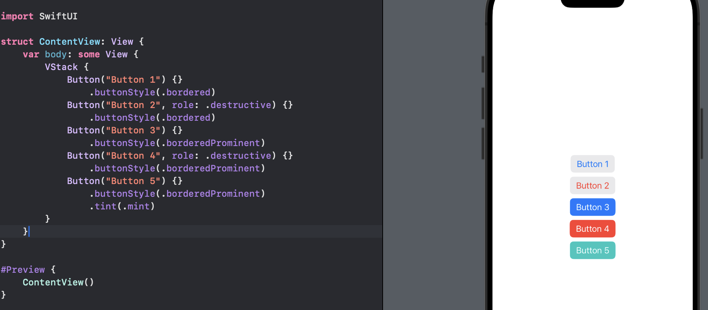

If we want something completely custom, we can pass a custom label using a second trailing closure:

```swift
Button {
    print("Button was tapped")
} label: {
    Text("Tap me!")
        .padding()
        .foregroundStyle(.white)
        .background(.purple)
}
```

In preview,

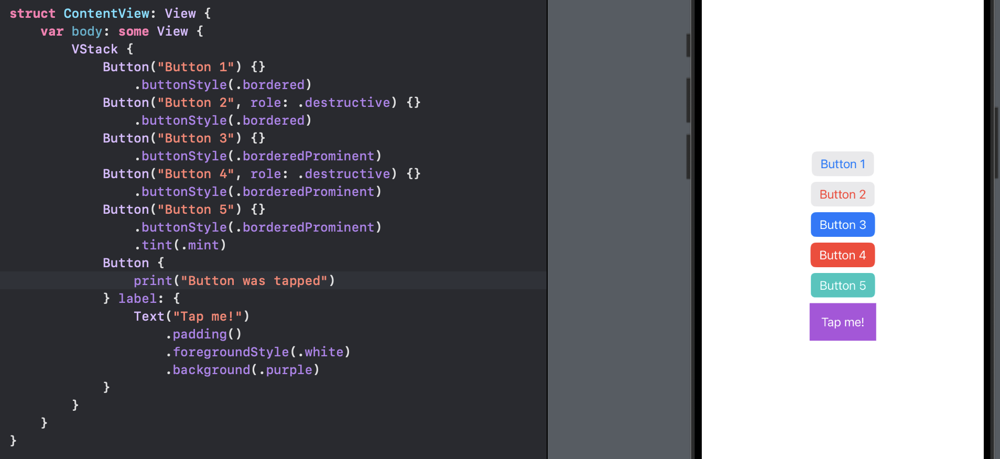

SwiftUI has a dedicated `Image` type for handling pictures in our apps:

- `Image("pencil")` - load an image called "pencil" that we have added to our project

- `Image(decorative: "pencil")` - load the same image, but will NOT read it out for users who have enabled the screen reader. This is useful for images taht do not convey additional important information.

- `Image(systemName: "pencil")` - load the pencil icon that is built into iOS. This uses Apple's SF Symbols icon collection.

By default, the screen reader will read our image name if it is enabled, so make sure we give our images clear names if we want to avoid confusing the user. Or, if they do not actually add information that is not already else where on the screen, use the `Image(decorative:)` initializer.

Because the longer form of buttons can have any kind of views inside them, we can use images like this:

```swift
Button {
    print("Edit button was tapped")
} label: {
    Image(systemName: "pencil")
}
```

In preview,

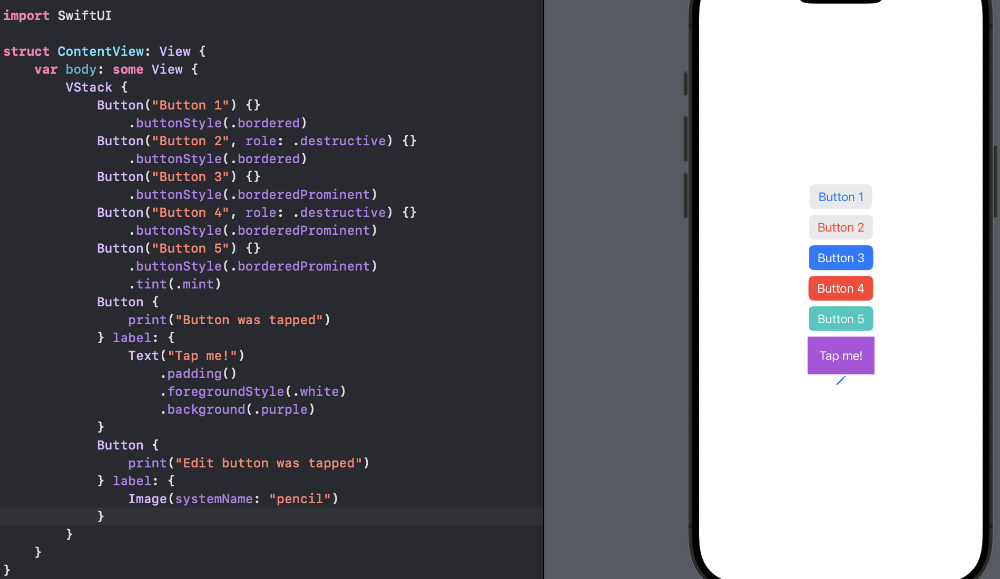

If we want both text and image at the same time, we have two options:

```swift
Button("Edit", systemImage: "pencil") {
    print("Edit button was tapped")
}
```

If we want more customization,

```swift
Button {
    print("Edit button was tapped")
} label: {
    Label("Edit", systemImage: "pencil")
        .padding()
        .foregroundStyle(.white)
        .background(.yellow)
}
```

In preview,

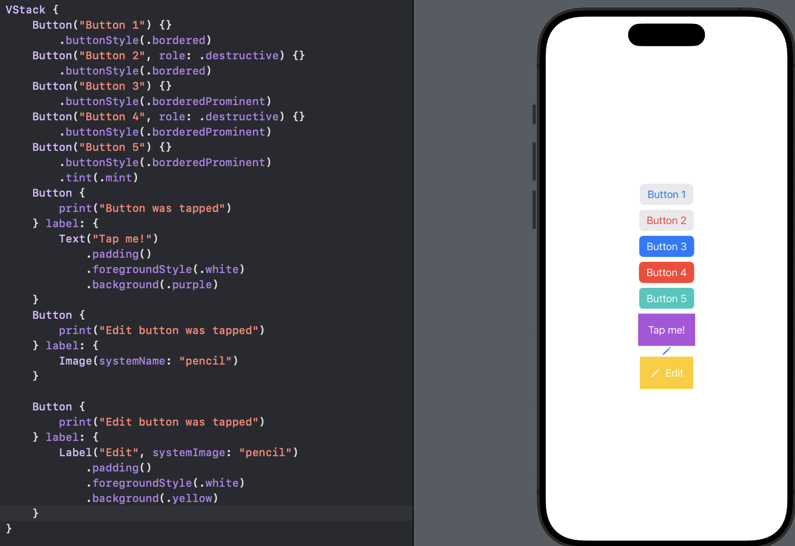

## Showing Alert Messages

Views are a function of our program state, and alerts are not an exception to that.

A basic SwiftUI alert has a title and a button that dismisses it. We will create some state that tracks whether our alert is showing:

```swift
@State private var showingAlert = false
```

Then we attached our alert to our user interface, telling it to use that state to determine whether the alert is presented or not.

```swift
struct ContentView: View {
    @State private var showingAlert = false

    var body: some View {
        Button("Show Alert") {
            showingAlert = true
        }
        .alert("Important message", isPresented: $showingAlert) {
            Button("OK") {}
        }
    }
}
```

In preview,

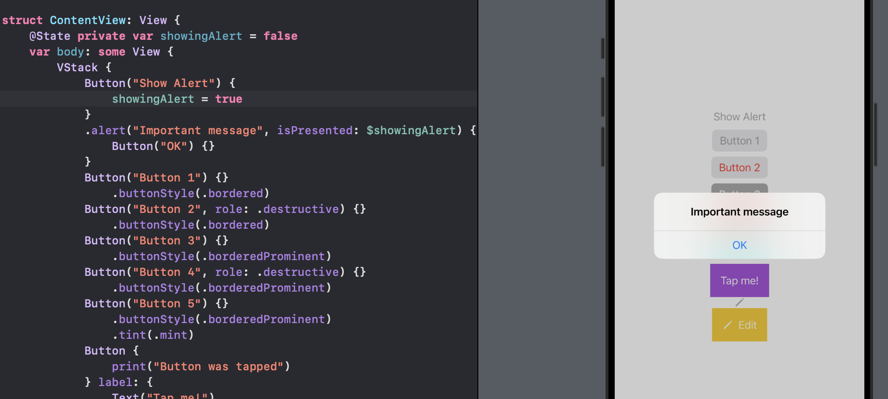

- `alert("Important message", isPresented: $showingAlert)` - the first part is the alert title, and the second part is a two-way data binding to set `showingAlert` back to false when the alert is dismissed.

- `Button("OK"){}` - has an empty closure, meaning that we are not assigning any funcitonality to run when the button is pressed, this is okay here because any button inside an alert will automatically dismiss the alert.

We can add more buttons to our alert, and this is a good place to add roles to make sure it is clear what each button does:

```swift
.alert("Important message", isPresented: $showingAlert) {
    Button("Delete", role: .destructive) {}
    Button("Cancel", role: .cancel) {}
}
```

In preview,

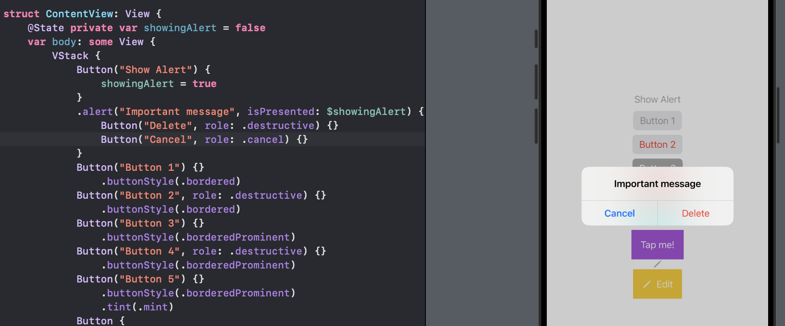

Finally, we can add message text to go alongside our title with a second trailing closure,

```swift
Button("Show Alert") {
    showingAlert = true
}
.alert("Important message", isPresented: $showingAlert) {
    Button("OK", role: .cancel) {}
} message: {
    Text("Please read this.")
}
```

In preview,

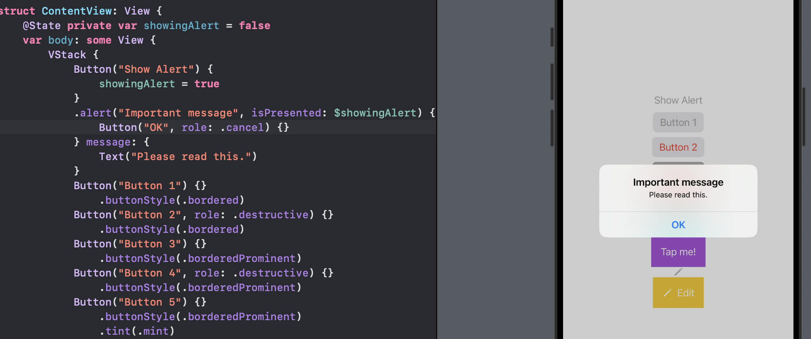
