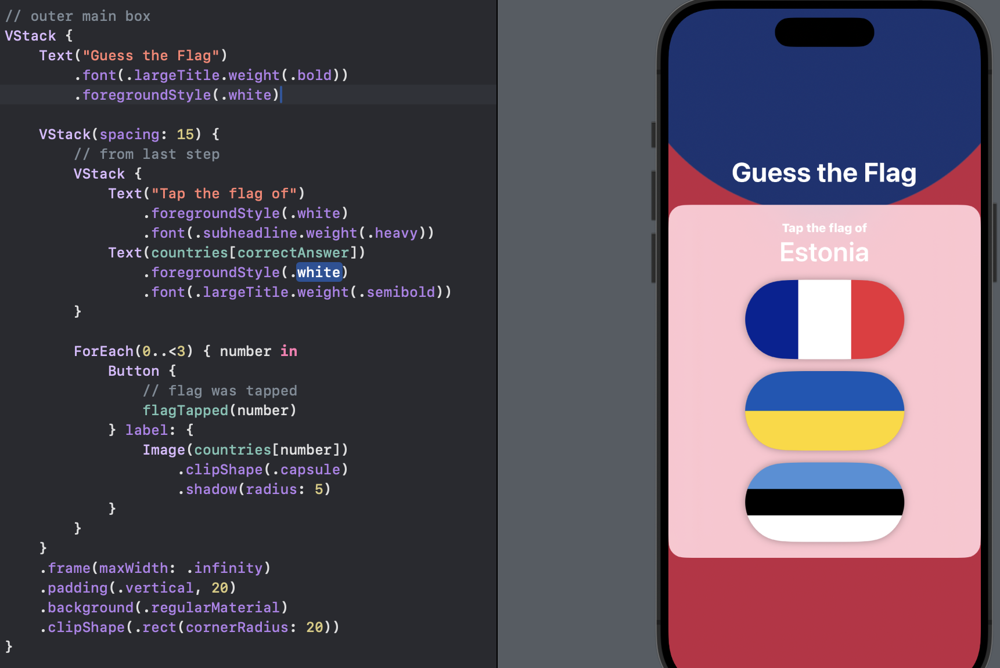
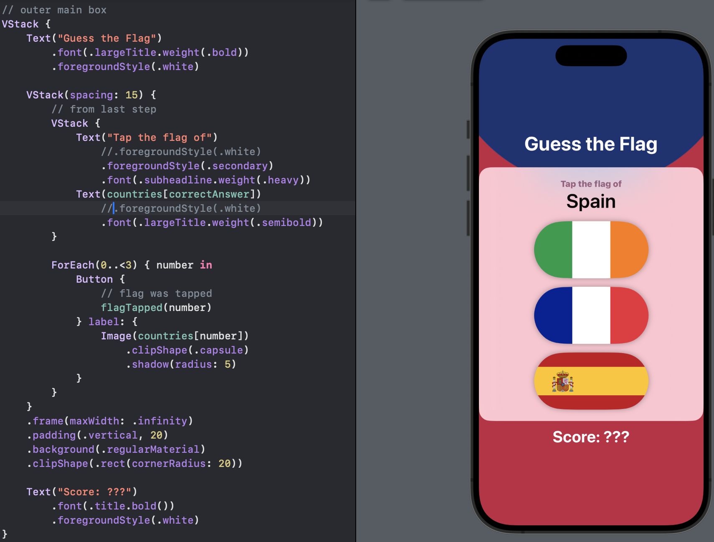

# Day 21 - Project 2, Part 2

## Stacking up Buttons

We start our app by building the basic UI structure, which will be two labels telling the user what to do, then three image buttons showing three world flags.

First, we need to open `Assets.xcassets` in Xcode and then drag the flag images in the `proj_imgs` folder to create `.imageset` collections in Xcode. 


The `@2x` or `@3x` in the filenames means double or triple resolution to handle different types of iPhone screen.

Next we need 2 properties to store our game data:

- an array of all the country images we want to show in the game,

- an integer storing which country image is correct.

```swift
var countries = ["Estonia", "France", "German", "Ireland", "Italy", "Nigeria", "Poland", "Spain", "UK", "Ukraine", "US"]
var correctAnswer = Int.random(in: 0...2)
```

Inside our body, we need to lay out our game prompt in a vertical stack:

```swift
var body: some View {
    VStack {
        Text("Tap the flag of")
        Text(countries[correctAnswer])
    }
}
```

In preview,


Below the two text views, we want to have our tappable flag buttons. We will create a second `VStack` so that we have more control over the spacing. We will have 30 points of spacing between flags to look better. So, we will wrap our previous `VStack` with another one using a `ForEach` loop.

```swift
var body: some View {
    VStack(spacing: 30) {
        // from last step
        VStack {
            Text("Tap the flag of")
            Text(countries[correctAnswer])
        }

        ForEach(0..<3) { number in
            Button {
                // flag was tapped
            } label: {
                Image(countries[number])
            }
        }
    }
}
```

Having two vertical stacks allows us to position things more precisely:

- the outer stack will space its views out by 30 points each,

- the inner stack has no custom spacing.

Now we have a basic idea of our user interface:


Since some flags have white color, we will put a blue background to make the flags easier to see for now. To do that, we will put a `ZStack` outside the outer `VStack`:

```swift
var body: some View {
    ZStack {
        Color.blue
            .ignoresSafeArea()
        // previous VStack code
        VStack(spacing: 30) {
            VStack {
                Text("Tap the flag of")
                Text(countries[correctAnswer])
            }

            ForEach(0..<3) { number in
                Button {
                    // flag was tapped
                } label: {
                    Image(countries[number])
                }
            }
        }
    }
}
```

In preview,


Now that we have a darker background color, we will give the text a brighter color to stand out:

```swift
var body: some View {
    ZStack {
        Color.blue
            .ignoresSafeArea()
        // previous VStack code
        VStack(spacing: 30) {
            VStack {
                Text("Tap the flag of")
                    .foregroundStyle(.white)
                Text(countries[correctAnswer])
                    .foregroundStyle(.white)
            }

            ForEach(0..<3) { number in
                Button {
                    // flag was tapped
                } label: {
                    Image(countries[number])
                }
            }
        }
    }
}
```

In preview,


## Showing the Player's Score with an Alert

In this section, we will randomize the order in which flags are shown, trigger an alert telling users whether they were right or wrong whenever they tap a flag, then reshuffle the flags.

We already set `correctAnswer` to a random integer, so need to shuffle the `countries` array as well:

```swift
var countries = ["Estonia", "France", "Germany", "Ireland", "Italy", "Monaco", "Nigeria", "Poland", "Spain", "UK", "Ukraine", "US"].shuffled()
```

The `shuffled()` mthod automatically takes care of randomizing the array order for us.

When a flag has been tapped, we need to write some code to determine whether they tapped the correct flag or not, so we need a new method that accepts the integer of the button and checks whether that matches our `correctAnswer` property.

In addition, regardless of whether they were correct, we want to show an alert saying what happened so they can track their progress:

- to store whether the alert is showing or not:
  
  ```swift
  @State private var showingScore = false
  ```

- to store the title that will be shown inside the alert:
  
  ```swift
  @State private var scoreTitle = ""
  ```

Next is the function we will add directly after the `body` property:

```swift
func flagTapped(_ number: Int) {
    if number == correctAnswer {
        scoreTitle = "Correct"
    } else {
        scoreTitle = "Wrong"
    }

    showingScore = true
}
```

Then we will call this function inside the `Button` block,

```swift
ForEach(0..<3) { number in
    Button {
        // flag was tapped
        flagTapped(number)
    } label: {
        Image(countries[number])
    }
}
```

the `number` variable is given to us by `ForEach`.

After an alert is dismissed, the game should not be over, so we need to write an `askQuestion()` method that resets the game by shuffling up the countries and picking a new correct answer:

```swift
func askQuestion() {
    countries.shuffle()
    correctAnswer = Int.random(in: 0...2)
}
```

This function will NOT compile, not because the function itself has issue but the `countries` and `correctAnswer` variables have not been marked with `@State`:

```swift
@State private var countries = ["Estonia", "France", "Germany", "Ireland", "Italy", "Monaco", "Nigeria", "Poland", "Spain", "UK", "Ukraine", "US"].shuffled()
@State private var correctAnswer = Int.random(in: 0...2)
```

Finally, we will use an `alert()` modifier so the alert gets presented when `showingScore` is true. We will put this at the end of the `ZStack` in the `body` property:

```swift
.alert(scoreTitle, isPresented: $showingScore) {
    Button("Continue", action: askQuestion)
} message: {
    Text("Your score is ???")
}
```

In preview,


## Styling Our Flags

First, we will replace our solid background color with a linear gradient from blue to black, which ensures that even if a flag has a similar blue stripe it will still stand out against the background. So we will replace `Color.blue` with:

```swift
LinearGradient(colors: [.blue, .black], startPoint: .top, endPoint: .bottom)
    .ignoresSafeArea()
```

In preview,


Now we adjust the fonts by adjusting the *weight* of fonts - `weight()`.

- Change the "Tap the flag of" text
  
  ```swift
  .font(.subheadline.weight(.heavy))
  ```

- Change the country name
  
  ```swift
  .font(.largeTitle.weight(.semibold))
  ```

In preview,


"Large title" is the largest built-in font size iOS offers us, and automatically scales up or down depending on what setting the user has for their fonts.

SwiftUI gives us a number of modifiers to affect the way views are presented. There are four built-in shapes in Swift: rectangle, rounded rectangle, circle, and capsule. We will make our image capsule shaped:

```swift
Button {
    // flag was tapped
    flagTapped(number)
} label: {
    Image(countries[number])
        .clipShape(.capsule)
}
```

In preview,


We can also apply a shadow effect around each flag:

```swift
Button {
    // flag was tapped
    flagTapped(number)
} label: {
    Image(countries[number])
        .clipShape(.capsule)
        .shadow(radius: 5)
}
```

In preview,


## Upgrading Our Design

We now want something fancier - a radial gradient with custom stops.

```swift
RadialGradient(
    stops: [
        .init(color: .blue, location: 0.3),
        .init(color: .red, location: 0.3)
    ],
    center: .top,
    startRadius: 200,
    endRadius: 700
).ignoresSafeArea()
```

In preview,


We may need to modify the gradient,

```swift
RadialGradient(
    stops: [
        .init(color: Color(red: 0.1, green: 0.2, blue: 0.45), location: 0.3),
        .init(color: Color(red: 0.76, green: 0.15, blue: 0.26), location: 0.3)
    ],
    center: .top,
    startRadius: 200,
    endRadius: 400
).ignoresSafeArea()
```

We also need to modify the spacing from 30 to 15: `VStack(spacing: 15)`. In addition, we will add the following modifiers to the end of the same `VStack`:

```swift
.frame(maxWidth: .infinity)
.padding(.vertical, 20)
.background(.regularMaterial)
.clipShape(.rect(cornerRadius: 20))
```

In preview,


This resizes to take up all the horizontal space it needs, adds a little vertical padding, applies a background material so that it stands out from the red-blue gradient the background, and finally clips the whole thing into the shape of a rounded rectangle.

Next step is to add a title before our main box, and a score placeholder after. This adds another `VStack` around what we have so far:

```swift
VStack {
    Text("Guess the Flag")
        .font(.largeTitle.weight(.bold))
        .foregroundStyle(.white)

    // current VStack(spacing: 15) code
}
```

This adds a new title at the top:



Asking for bold fonts is so common that there is a small shortcut: `.font(.largeTitle.bold())` to replace `.font(.largeTitle.weight(.bold))`.

Next we also add a score label at the bottom of the new `VStack`:

```swift
VStack {
    Text.("Guess the Flag")
        .font(.largeTitle.weight(.bold))
        .foregroundStyle(.white)

    // VStack(specing: 15) code

    Text("Score: ???")
        .font(.title.bold())
        .foregroundStyle(.white)
}
```

In preview,


The title and score label look great with white text, but the text inside rounded box does not, and we just need a little tweak:


