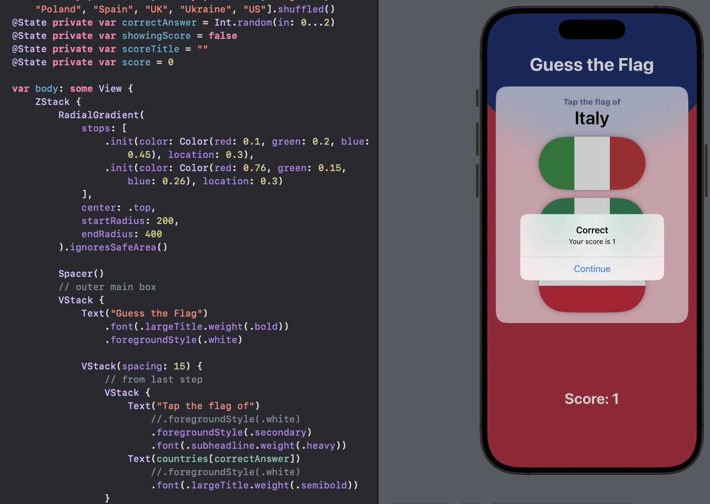
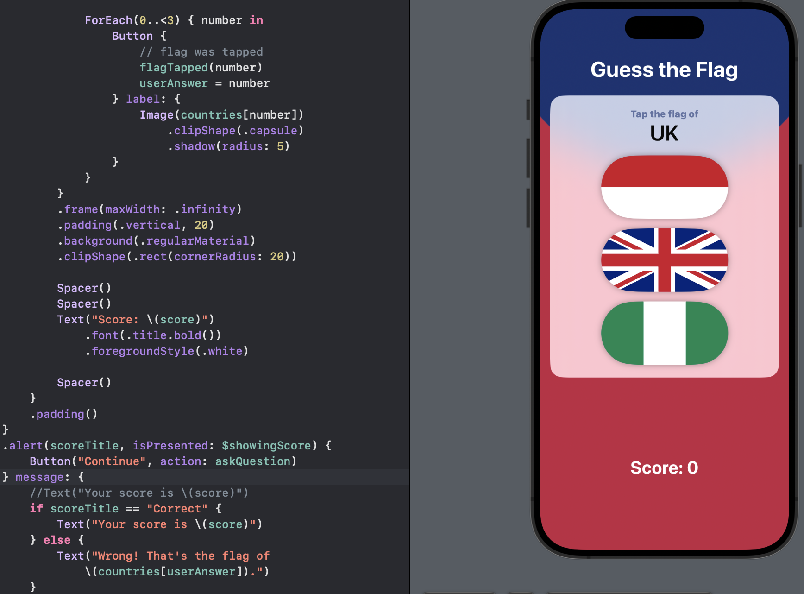
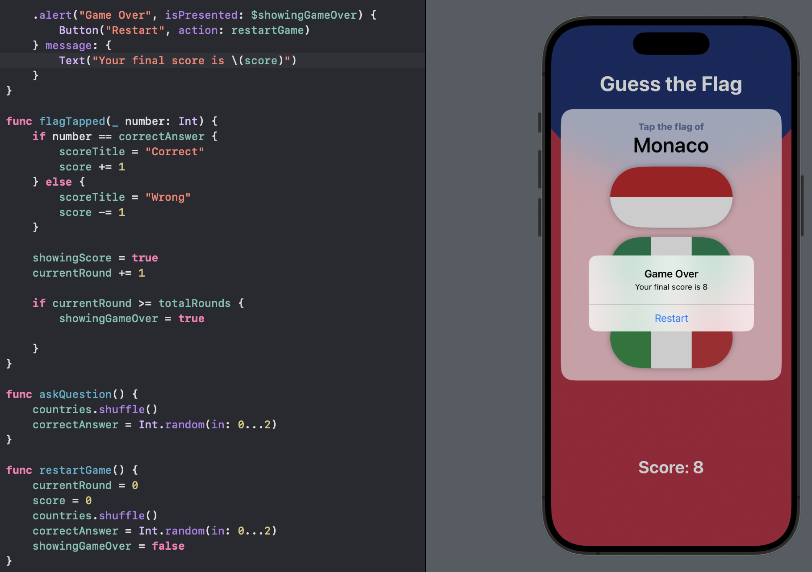

# Day 22 - Project 2, Part 3

## Guess the Flag: Wrap up

Add spacing:

- Add `Spacer()` in four positions:
  
  - one directly before the "Guess the Flag" title,
  
  - two directly before the "Score ???" text,
  
  - one directly after the "Score ???" text.

- Add a little padding around the outmost `VStack`:
  
  ```swift
  .padding()
  ```

### Challenge

1. Add an `@State` property to store the user's score, modify it when they get an answer right or wrong, then display it in the alert and in the score label.
   
   

2. When someone chooses the wrong flag, tell them their mistake in our alert message. For example, "Wrong! That is the flag of France."
   
   

3. Make the game show only 8 questions, at which point they see a final alert judging their score and can restart the game.
   
   
