# Day 23 - Project 3, Part 1

We will focus on **views** and **modifiers** in this project. We will learn to build custom view modifiers and custom containers.

## Views and Modifiers: Introduction

Project name: `ViewsAndModifiers`

## Why does SwiftUI Use Structs for Views

UIKit or AppKit (UI frameworks for iOS and macOS) use *classes* for views rather than structs, whereas SwiftUI prefer to use *structs* for views.

- In UIKit, every view descended from a class called `UIView` that had many properties and methods - a background color, constraints that determined how it was positioned, a layer for rendering its contents into, and more. Every `UIView` and `UIView` subclass had to have them, because that's how inheritance works. 

- In SwiftUI, all views are trivial structs and are almost free to create.

Structs force us to think about isolating state in a clean way. Classes are able to change their values freely, which can lead to messier code. By producing views that do not mutate over time, SwiftUI encourages us to move to a more functional design approach. Our views become simple, inert things that convert data into UI, rather than intelligent things that can grow out of control.

## What is behind the Main SwiftUI View

Recall our default template when creating a new project:

```swift
struct ContentView: View {
    var body: some View {
        VStack {
            Image(systemName: "globe")
                .imageScale(.large)
                .foregroundStyle(.tint)
            Text("Hello, world!")
        }
        .padding()
    }
}
```

If we modify the `VStack` with a background color:

```swift
struct ContentView: View {
    var body: some View {
        VStack {
            Image(systemName: "globe")
                .imageScale(.large)
                .foregroundStyle(.tint)
            Text("Hello, world!")
        }
        .padding()
        .background(.red)
    }
}
```

We can see that the whole screen was not filled but a small view in the center of the screen:

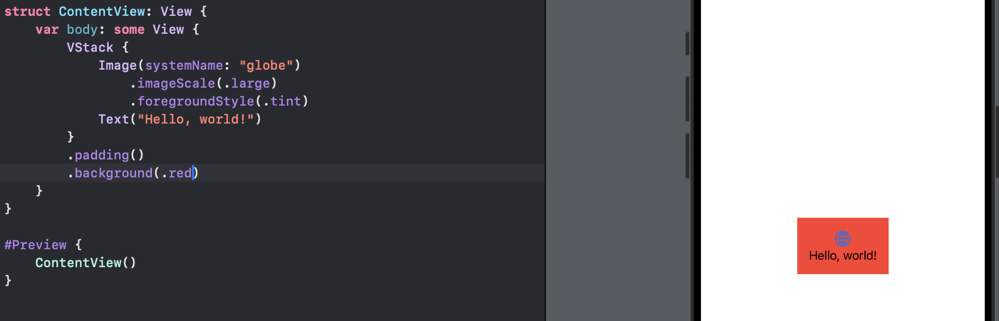

**For SwiftUI developers, there is nothing behind our view.** Right now at least there is something behind our content view called a `UIHostingController` - the bridge between UIKit (Apple's original iOS UI framework) and SwiftUI. We should NOT try to modify that, otherwise our code may not work on other platforms. Instead, we should think of that there is nothing behind our view.

To fill up the entire, we should make the `VStack` take up more space and allow it to fill the screen rather than being sized precisely around its content.

We can do that by using the `frame()` modifier and replacing the `padding()` modifier:

```swift
.frame(maxWidth: .infinity, maxHeight: .infinity)
```

In preview,

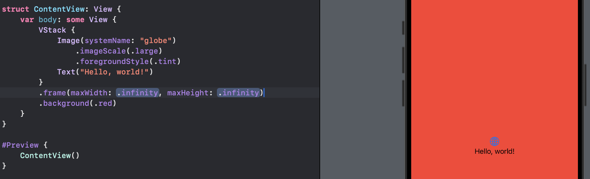

## Why Modifier Order Matters

Every time we apply a modifier to a SwiftUI view, we create a new view with that change applied - we do not modify the existing view in place. Our views only hold the exact properties we give them, so if we set the background color or font size there is no place to store that data.

For example,

```swift
Button("Hello, world!") {
    // do nothing
}
.background(.red)
.frame(width: 200, height: 200)
```

In preview,

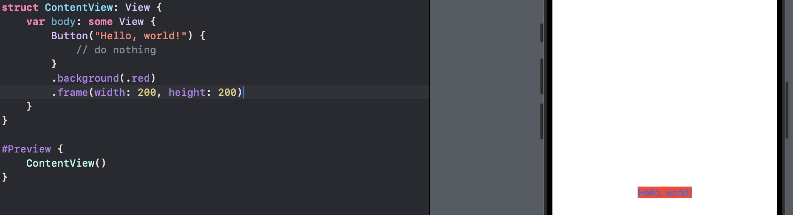

Each modifier creates a new struct with that modifier applied, rather than just setting a property on the view. We can see this by asking for the type of our view's body:

```swift
Button("Hello, world!") {
    print(type(of: self.body))
}
.background(.red)
.frame(width: 200, height: 200)
```

Swift's `type(of:)` funtion prints the exact type of a particular value. If we switch the order of `.frame()` and `.background()` modifiers:

```swift
Button("Hello, world!") {
    print(type(of: self.body))
}
.frame(width: 200, height: 200)
.background(.red)
```

We will get:

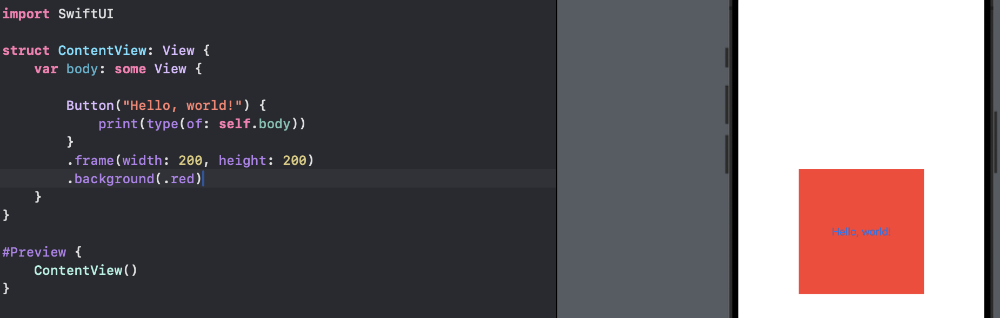


An important side effect of using modifiers is that we can apply the same effect multiple times: each on simply adds to whatever was there before. For example,

```swift
Text("Hello, world!")
    .padding()
    .background(.red)
    .padding()
    .background(.blue)
    .padding()
    .background(.green)
    .padding()
    .background(.yellow)
```

In preview,

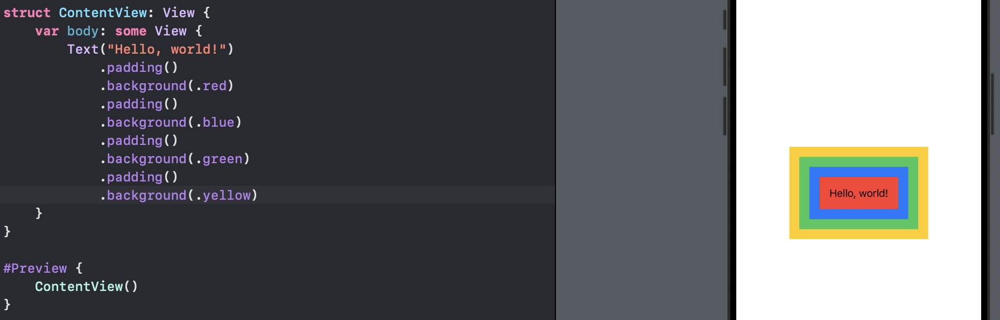

The `padding()` modifier adds a little space around a view so that it does not push up against other views or the edge of the screen. If we apply padding and then a background color, then more padding and a different background color, we can give a view multiple borders.

## Why does SwiftUI Use "some View" for its View Type

SwiftUI relies heavily on a Swift power feature called "opaque return types", which we can see in action every time we write `some View`, which means "one object that conforms to the `View` protocol, but we do not want to say what."

Returning `some View` means even though we do not know what view type is going back, the compiler does.


Using `some View` is important for performance. SwiftUI needs to be able to look at the views we are showing and understand how they change, so it can correctly update the user interface.

SwiftUI builds up its data using `ModifiedContent`. The `View` protocol has an associated type attached to it, which says that `View` by itself does not mean anything - we need to say exactly what kind of view it is. It is like Swift does not let us say "this variable is an array" but instead requries that we say what is in the array: "this variable is a string array."


Hence, SwiftUI does not allow us to write a view like this:

```swift
struct ContentView: View {
    // this body is a view (NOT ALLOWED)
    var body: View {
        Text("Hello, world!")
    }
}
```

Instead, it is perfectly legal to write:

```swift
struct ContentView: View {
    // this body is a text view
    var body: Text {
        Text("Hello, world!")
    }
}
```

Returning `View` makes no sense, because Swift wants to know what is inside the view - it has a big hole that must be filled. On the other hand, returning `Text` is fine.


What `some View` lets us do is say "this will be a view, such as `Buton` or `Text`, but I do not want to say what". Therefore, the hole that `View` has will be filled by a real view object, but we are not required to write out the exact type.


The `VStack` conforms to the `View` protocol. If we create a `VSTack` with two text views inside, SwiftUI creates a `TupleView` to contain those two views, so the `VStack` fills a `TupleView` containing two text views.

If we send back two views directly from our `body` property without wrapping them in a stack, Swift applies a special attribute to the `body` property called `@ViewBuilder`. This has an effect of wrapping multiple views in one of those `TupleView` containers, so that even though it looks like we send back multiple views, they get combined into one `TupleView`.

## Conditional Modifiers

Recall that to use the ternary operator we write our condition first, then a question and what should be used if the condition is true, then a colon followed by what should be used if the condition is false.

For example, we could use it to control the foreground style of a button:

```swift
struct ContentView: View {
    @State private var useRedText = false

    var body: some View {
        Button("Hello, world!") {
            // flip the Boolean true and false
            useRedText.toggle()
        }
        .foregroundStyle(useRedText ? .red : .blue)
    }
}
```

In preview,

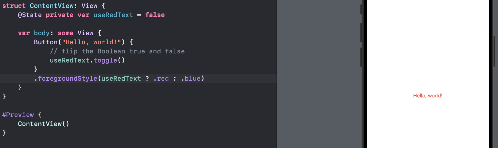

We can use regular `if` conditions to achieve the same result but this creates more work:

```swift
struct ContentView: View {
    @State private var useRedText = false

    var body: some View {
        if useRedText {
            Button("Hello World") {
                useRedText.toggle()
            }
            .foregroundStyle(.red)
        } else {
            Button("Hello World") {
                useRedText.toggle()
            }
            .foregroundStyle(.blue)
        }    
    }
}
```

## Environment Modifiers

Many modifiers can be applied to containers, which allows us to apply the same modifier to many views at the same time. For example,

```swift
VStack {
    Text("Gryffindor")
    Text("Hufflepuff")
    Text("Ravenclaw")
    Text("Slytherin")
}
.font(.title)
```

In preview,

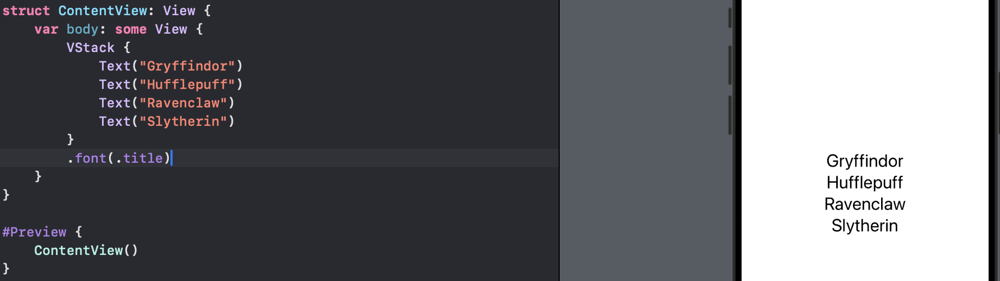

If we want to give all text views the same font modifier, we could apply the modifier to the `VStack` directly. This is called an *environment modifier*, and is different from a regular modifier that is applied to a view.

To show the difference from a regular modifier, if we add a modifier to one text view,

```swift
VStack {
    Text("Gryffindor")
        .font(.largeTitle)
    Text("Hufflepuff")
    Text("Ravenclaw")
    Text("Slytherin")
}
.font(.title)
```

In preview,

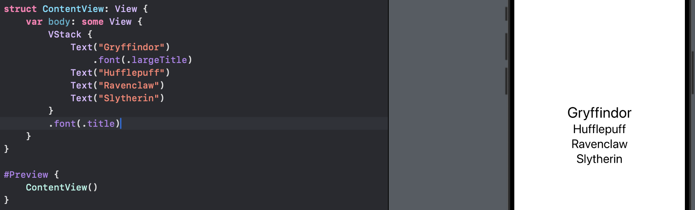

The Gryffindor text view can override the environment modifier with a custom font.


Another example,

```swift
VStack {
    Text("Gryffindor")
        .blur(radius: 0)
    Text("Hufflepuff")
    Text("Ravenclaw")
    Text("Slytherin")
}
.blur(radius: 5)
```

In preview,

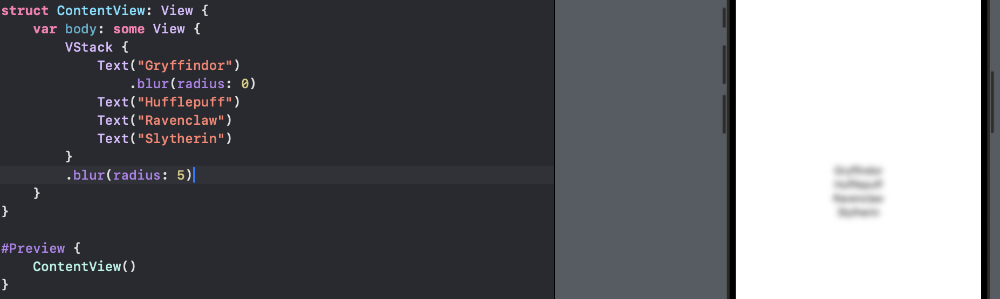

This will NOT disable blurring on the first text view, because `blur()` is a regular modifier, so any blurs applied to child views are added to the `VStack` blur rather than replacing it.

## Views as Properties

To make it easier to use complex view hierarchies in SwiftUI, we can use properties - to create a view as a property of our own view, then use that property inside our layouts.

For example,

```swift
struct ContentView: View {
    let motto1 = Text("Go go go")
    let motto2 = Text("Come back")

    var body: some View {
        VStack {
            motto1
            motto2
        }
    }
}
```

In preview,

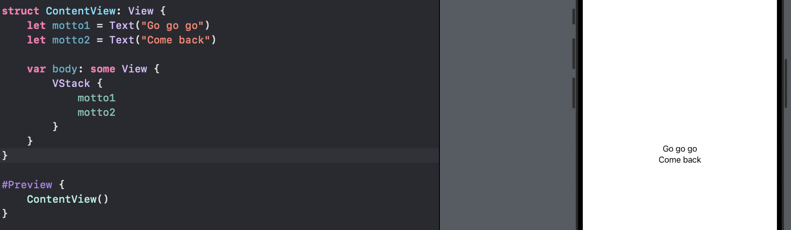

Then we can apply modifiers directly to those properties as they are being used,

```swift
VStack {
    motto1
        .foregroundStyle(.red)
    motto2
        .foregroundStyle(.blue)
}
```

In preview,

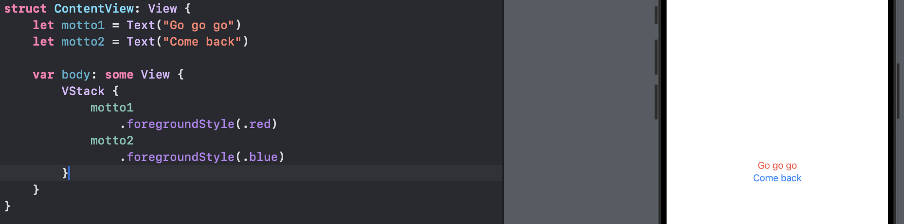

Creating views as properties can be helpful to keep our `body` cleaner.

Swift does not let us create one stored property that refers to other stored properties, because it would cause problems when the object is created. This means trying to create a `TextField` bound to a local property will cause problems. However we can create *computed properties*:

```swift
var motto1: some View {
    Text("Go go go")
}
```

This is a great way to build complex views into smaller chunks. NOTE: unlike the `body` property, Swift will NOT automatically apply the `@ViewBuilder` attribute here, so if we want to send multiple views back, we have the following options.

1. place them in a stack
   
   ```swift
   var spells: some View {
       VStack {
           Text("Lumos")
           Text("Obliviate")
       }
   }
   ```
   
   In preview,
   
   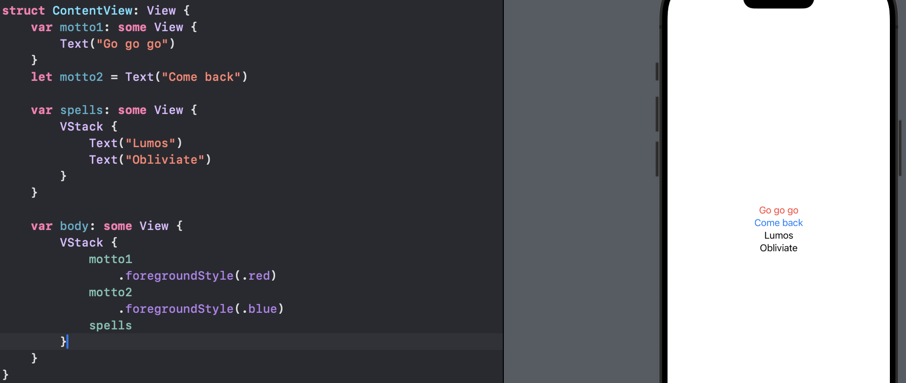

2.  send back a `Group`. the arranged of our views is determined by how we use them elsewhere in our code
   
   ```swift
   var spells: some View {
       Group {
           Text("Lumos")
           Text("Obliviate")
       }
   }
   ```
   
   In preview,
   
   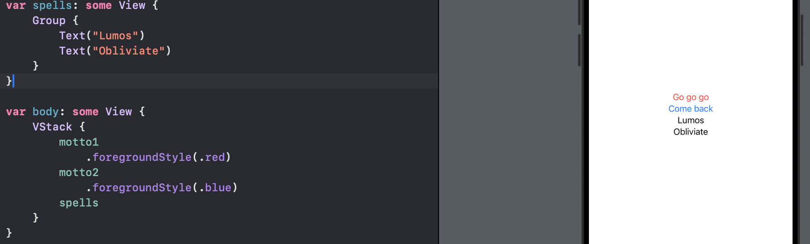

3. add the `@ViewBuilder` attribute ourself,
   
   ```swift
   @ViewBuilder var spells: some View {
       Text("Lumos")
       Text("Obliviate")
   }
   ```
   
   In preview,
   
   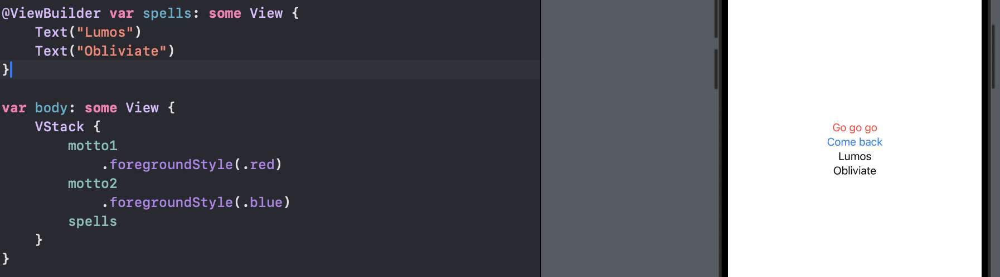

## View Composition

In the view of multiple styling text views,

```swift
struct ContentView: View {
    var body: some View {
        VStack(spacing: 10) {
            Text("First")
                .font(.largeTitle)
                .padding()
                .foregroundStyle(.white)
                .background(.blue)
                .clipShape(.capsule)

            Text("Second")
                .font(.largeTitle)
                .padding()
                .foregroundStyle(.white)
                .background(.blue)
                .clipShape(.capsule)
        }
    }
}
```

Because those two text views are identical apart from their text, we can wrap them up in a new custom view,

```swift
struct CapsuleText: View {
    var text: String
        
    var body: some View {
        Text(text)
            .font(.largeTitle)
            .padding()
            .foregroundStyle(.white)
            .background(.blue)
            .clipShape(.capsule)
    }
}

struct ContentView: View {
    var body: some View {
        VStack(spacing: 10) {
            CapsuleText(text: "First")
            CapsuleText(text: "Second")
        }
    }
}
```

In preview,

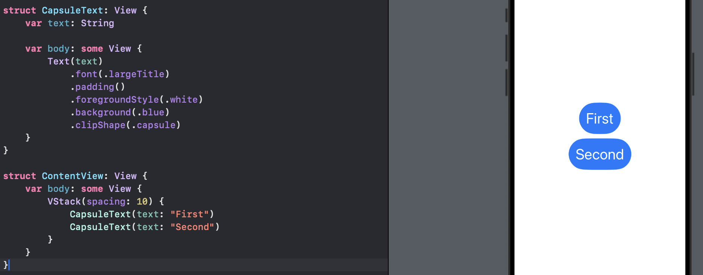

We can also store some modifiers and customize others. For example, if we remove `.foregroundStyle()` from `CapsuleText`, then we could apply custom colors

```swift
struct CapsuleText: View {
    var text: String
        
    var body: some View {
        Text(text)
            .font(.largeTitle)
            .padding()
            //.foregroundStyle(.white)
            .background(.blue)
            .clipShape(.capsule)
    }
}

struct ContentView: View {
    var body: some View {
        VStack(spacing: 10) {
            CapsuleText(text: "First")
                .foregroundStyle(.white)
            CapsuleText(text: "Second")
                .foregroundStyle(.yellow)
        }
    }
}
```

In preview,

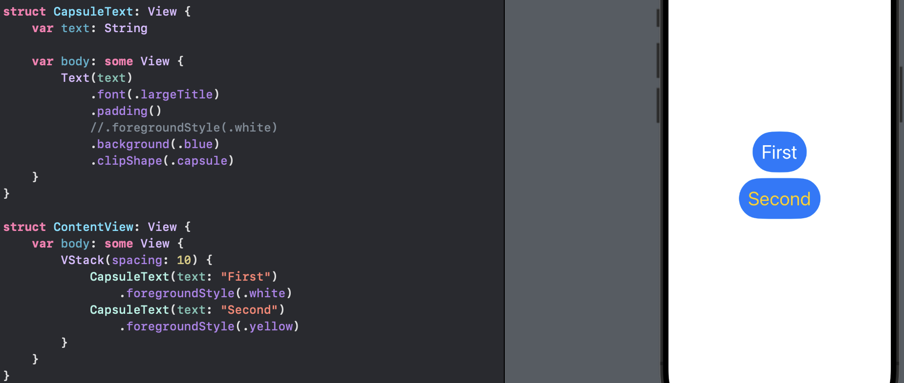

## Custom Modifiers

To create a custom modifier, we need to create a new struct that conforms to the `ViewModifier` protocol. This has only one requirement, which is a method called `body` that accepts whatever content it is being given to work with, and must return `some View`.

For example, we want all titles in our app should have a particular style:

```swift
struct Title: ViewModifier {
    func body(content: Content) -> some View {
        content
            .font(.largeTitle)
            .foregroundStyle(.white)
            .padding()
            .background(.blue)
            .clipShape(.rect(cornerRadius: 10))
    }
}
```

Now we can use that with the `modifier()` modifier:

```swift
Text("Hello world")
    .modifier(Title())
```

In preview,

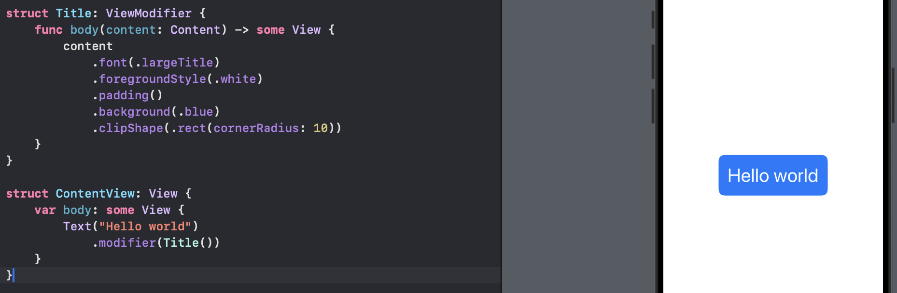

When working with custom modifier, it is usually a good idea to create extensions on `View` that make them easier to use. For example, we may wrap the `Title` modifier in an extension:

```swift
extension View {
    func titleStyle() -> some View {
        modifier(Title())
    }
}
```

Then we can now use the custom modifier like this:

```swift
Text("Hello world")
    .titleStyle()
```

In preview,

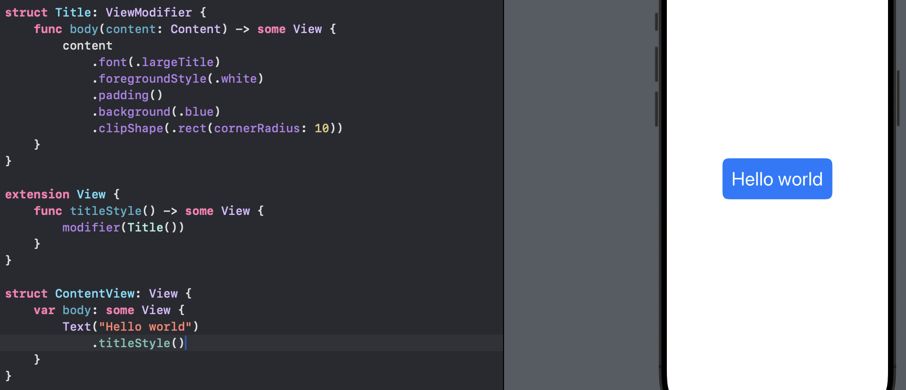


Custom modifiers can do much more than just apply other existing modifiers - they can also create new view structure. Remember that **modifiers return new objects rather than modifiying existing ones**, so we could create one that embeds the view in a stack and adds another view:

```swift
struct Watermark: ViewModifier {
    var text: String

    func body(content: Content) -> some View {
        ZStack(alignment: .bottomTrailing) {
            content
            Text(text)
                .font(.caption)
                .foregroundStyle(.white)
                .padding(5)
                .background(.black)
        }
    }
}


extension View {
    func watermarked(with text: String) -> some View {
        modifier(Watermark(text: text))
    }
}
```

With that in place, we can now add a watermark to any view:

```swift
Color.blue
    .frame(width: 300, height: 200)
    .watermarked(with: "I Can Do All Things")
```

In preview,

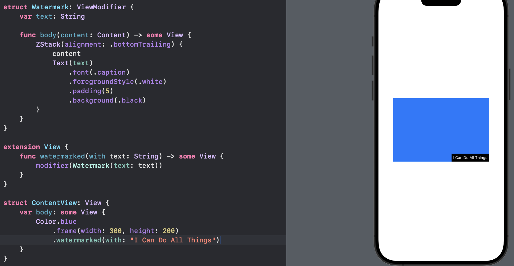

## Custom Containers

`GridStack` lets us create any number of views inside a fixed grid. `GridStack` conforms to the `View` protocol and has a set number of rows and columns.

In Swift,

```swift
struct GridStack<Content: View>: View {
    let rows: Int
    let columns: Int
    let content: (Int, Int) -> Content

    var body: some View {
        // more to come
    }
}
```

The `struct GridStack<Content: View>: View` uses a more advanced feature of Swift called *generics*, which means "we can provide any kind of content we like, but whatever it is it must conform to the `View` protocol". After the colon we repeat `View` again to say that `GridStack` itself also conforms to the `View` protocol.

In the `body`` property:

```swift
var body: some View {
    VStack {
        ForEach(0..<rows, id: \.self) { row in
            HStack {
                ForEach(0..<columns, id: \.self) { column in
                    content(row, column)
                }
            }
        }
    }
}
```

When looping over ranges, SwiftUI can use the range directly only if we know for sure the values in the range will not change over time.

Here we use `ForEach` with `0..<rows` and `0..<columns`, both of which are values that can change over time, for example, we might add more rows. In this situation, we need to add a second parameter to `ForEach`, the `id: \.self` to tell SwiftUI how it can identify each view in the loop.

Now we have a custom container, we can write a view

```swift
struct ContentView: View {
    var body: some View {
        GridStack(rows: 4, columns: 4) { row, col in
            Text("R\(row) C\(col)")
        }
    }
}
```

We could also take a stack of views:

```swift
struct ContentView: View {
    var body: some View {
        GridStack(rows: 4, columns: 4) { row, col in
            HStack {
                Image(systemName: "\(row * 4 + col).circle")
                Text("R\(row) C\(col)")
            }
        }
    }
}
```

For more flexibility we could use `@ViewBuilder` attribute for the `body` property of its views. We can modify the `content` property of `GridStack`:

```swift
struct GridStack<Content: View>: View {
    let rows: Int
    let columns: Int
    @ViewBuilder let content: (Int, Int) -> Content

    var body: some View {
        VStack {
            ForEach(0..<rows, id: \.self) { row in
                HStack {
                    ForEach(0..<columns, id: \.self) { column in
                        content(row, column)
                    }
                }
            }
        }
    }
}
```

With that in place SwiftUI will automatically create an implicit horizontal stack inside our cell closure:

```swift
struct ContentView: View {
    var body: some View {
        GridStack(rows: 4, columns: 4) { row, col in
            Image(systemName: "\(row * 4 + col).circle")
            Text("R\(row) C\(col)")
        }
    }
}
```


