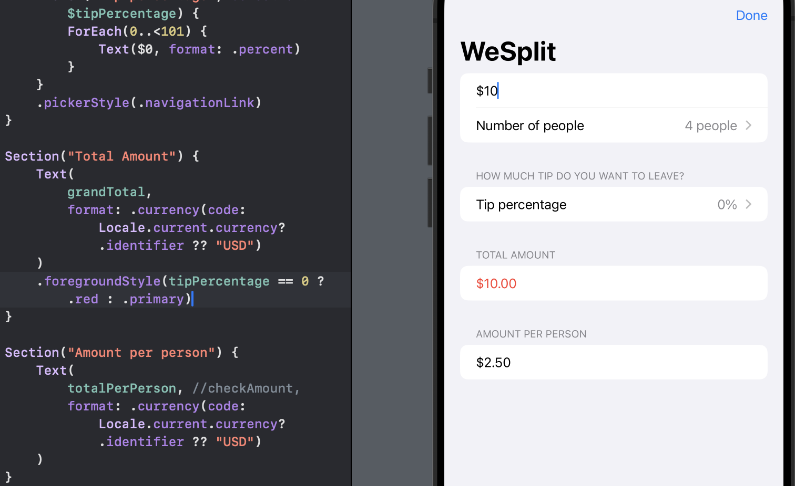
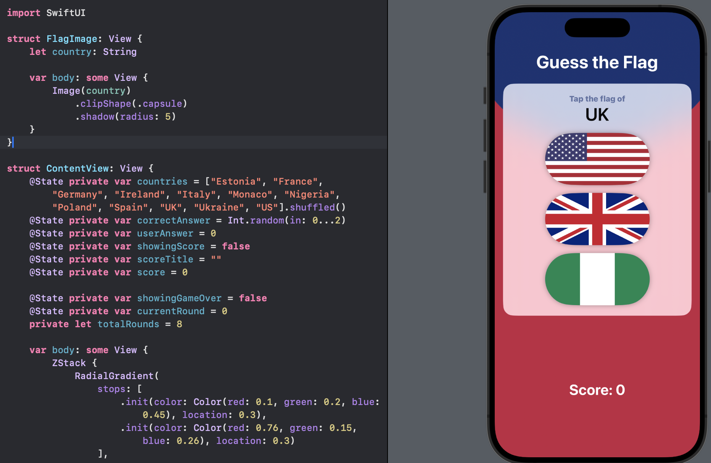
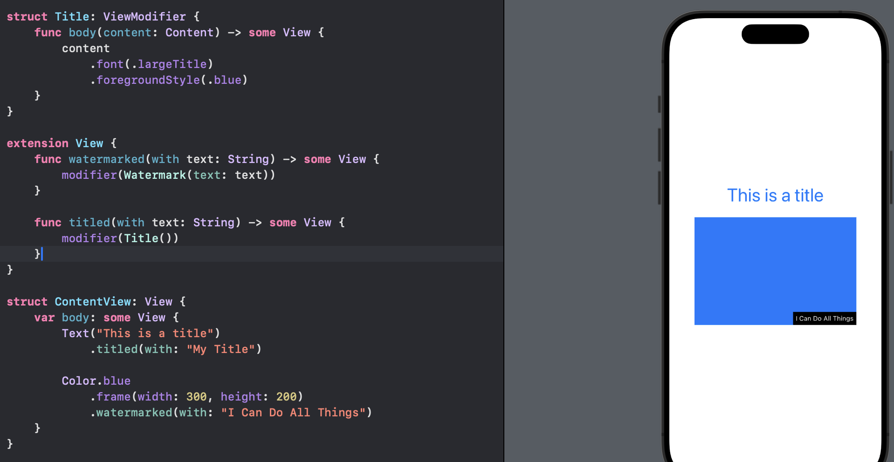

# Day 24 - Project 3, Part 2

Recall that SwiftUI uses structs for views over classes.

## Challenges

1. Go back to project 1 and use a conditional modifier to change the total amount text view to red if the user selects a 0% tip.
   
   

2. Go back to project 2 and replace the `Image` view used for flags with a new `FlagImage()` view that renders one flag image using the specific set of modifiers we had.
   
   

3. Create a custom `ViewModifier` (and accompanying `View` extension) that makes a view have a large, blue font suitable for prominent titles in a view.
   
   

