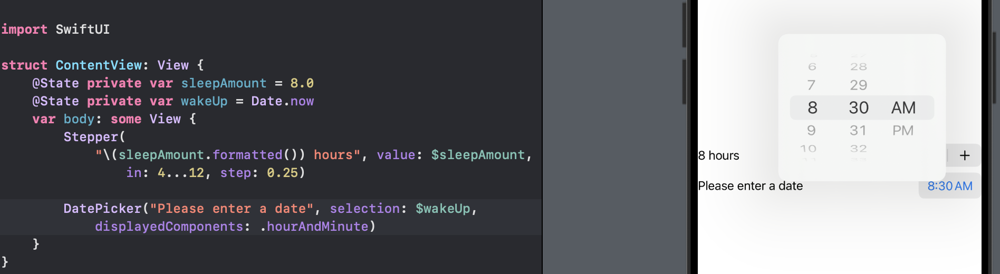

# Day 26 - Project 4, Part 1

## BetterRest: Introduction

We will build a forms-based app that will ask the user to enter information and convert that all into an alert.

We will use the built-in machine learning package called *Core ML*, which allows us to write code that makes predictions about new data based on previous data it has seen. We will start with some raw data, give that to our Mac as training data, then use the results to build an app able to make accurate estimates about new data - all on device, and with complete privacy for users.

The BetterRest app is designed to help coffee drinkers get a good night's sleep by asking them three questions:

1. When do they want to wake up?

2. Roughly how many hours of sleep do they want?

3. How many cups of coffee do they drink per day?

Once we have those three values, we will feed them into Core ML to get a result telling us when they should go to bed. We will use *regression analysis* to get accurate results.


## Entering Numbers with Stepper

SwiftUI has two ways of letting users enter numbers. In this project, we will use `Stepper` - a simple - and + button that can be tapped to select a precise number. The other option is `Slider`, which allows us to select from a range of values but less precisely.

Steppers can work with any kind of number type. We can create a property and bind that to a stepper:

```swift
struct ContentView: View {
    @State private var sleepAmount = 8.0
    var body: some View {
        Stepper("\(sleepAmount) hours", value: $sleepAmount)
    }
}
```

In preview,


By default steppers are limited only by the range of their storage. We can limit the values by providing an `in` range:

```swift
struct ContentView: View {
    @State private var sleepAmount = 8.0
    var body: some View {
        Stepper("\(sleepAmount) hours", value: $sleepAmount, in: 4...12)
    }
}
```

In preview,


This allows us to control the sleep range with reasonable hours. `Stepper` also takes a `step` value - how far to move the value each time - or + is tapped. This can be any sort of number but it does need to match the type used for the binding. So if we bind to an integer, we cannot then use a `Double` for the step value:

```swift
struct ContentView: View {
    @State private var sleepAmount = 8.0
    var body: some View {
        Stepper(
            "\(sleepAmount) hours", 
            value: $sleepAmount, 
            in: 4...12,
            step: 0.25
        )
    }
}
```

In preview,


Finally we need to fix the text:

```swift
struct ContentView: View {
    @State private var sleepAmount = 8.0
    var body: some View {
        Stepper(
            "\(sleepAmount.formatted()) hours", // changed here
            value: $sleepAmount, 
            in: 4...12,
            step: 0.25
        )
    }
}
```

In preview,


## Selecting Dates and Times with DatePicker

`DatePicker` can be bound to a date property. Swift has a dedicated type for working with dates called `Date`. For example,

```swift
struct ContentView: View {
    @State private var wakeUp = Date.now
    var body: some View {
        DatePicker("Please enter a date", selection: $wakeUp)
    }
}
```

In preview,


Putting an empty string to replace the label may not work as we think:

```swift
DatePicker("", selection: $wakeUp)
```


We see that the date picker still makes space for an empty label and users have no idea that is that date picker is for. A better alternative is to use the `labelsHidden()` modifier:

```swift
struct ContentView: View {
    @State private var wakeUp = Date.now
    var body: some View {
        DatePicker("Please enter a date", selection: $wakeUp)
            .labelsHidden()
    }
}
```

In preview,


DatePickers provides us with a couple of configuration options that control how they work.

`displayedComponents` decide what kind of options users should see:

- If not used, users see a day, hour, and minute.

- If using `.date`, users see month, day, and year.

- If using `.hourAndMinute`, users see just hour and minute.

```swift
struct ContentView: View {
    @State private var wakeUp = Date.now
    var body: some View {
        DatePicker(
            "Please enter a date", 
            selection: $wakeUp,
            displayedComponents: .hourAndMinute
        )
    }
}
```

In preview,



Finally, there is an `in` parameter just the same as with `Stepper`: we can provide it with a date range, and the date picker will ensure the users cannot select beyond it.

We have been using ranges like `1...5` or `0..<10`, but we can also use Swift dates with range. For example:

```swift
func exampleDates() {
    // create a second Date instance set to one day in seconds from now
    let tomorrow = Date.now.addingTimeInterval(86400)

    // create a range from thsoe two
    let range = Date.now...tomorrow
}

```

In addition, Swift lets us form *one-sided ranges* - ranges where we specify either the start or end but not both, leaving Swift to infer the other side. For example,

```swift
DatePicker(
    "Please enter a date", 
    selection: $wakeUp,
    in: Date.now...,
    displayedComponents: .hourAndMinute
)
```

In preview,


This allows all dates in the future, but non in the past - read it as "from the curent date up to anything."

## Working with Dates

Working with dates is really difficult...

```swift
let now = Date.now
let tomorrow = Date.now.addingTimeInterval(86400)
let range = now...tomorrow
```

That creates a range from now to the same time tomorrow (86400 is the number of seconds in a day). However, not all days have 86400 seconds. One example is the daylight savings time.

For any usage of dates that actually matters in our code, we should rely on Apple's frameworks for calculations and formatting.

Swift gives us `Date` for working with dates, and that encapsulates the year, month, date, hour, minute, second, timezone, and more.

If we do not want to think about those but want to say "give me an 8AM wake-up time, regardless of what day it is day", we can use `DateComponents` in Swift, which lets us read or write specific parts of a date rather than the whole thing.

For example,

```swift
var components = DateComponents()
components.hour = 8
components.minute = 0
let date = Calendar.current.date(from: components) ?? .now // nil coalescing
```

Because of difficulties around date validation, that `date(from:)` method returns an *optional* date, so it is a good idea to use *nil coalescing* to say "if that fails, just give me back the current date".

To read the hour they want to wake up, we can also use `DateComponents` to handle everything. We also need to take care of that with optional values for all its properties:

```swift
let components = Calendar.current.dateComponents(
    [.hour, .minute],
    from: someDate
)
let hour = components.hour ?? 0
let minute = components.minute ?? 0
```

To format dates and times, we have two options. First is to rely on the `format` parameter. For example,

```swift
Text(
    Date.now,
    format: .dateTime.hour().minute()
)
```

Or

```swift
Text(
    Date.now,
    format: .dateTime.day().month().year()
)
```

In the UK, the date format is day/month/year. In the US, it is month/day/year. But we don't worry about this here: when we write `day().month().year()`, we are asking for that data, not *arranging* it, and iOS will automatically format that data using the user's preferences.

As an alternative, we can also use the `formatted()` method directly on dates, passing in configuration options for how we want both the date and the time to be formatted:

```swift
Text(
    Date.now.formatted(date: .long, time: .shortened)
)
```

## Training a Model with Create ML

**Core ML** lets us make apps using machine learning, and **Create ML** lets us create custom machine learning models of our own using a dedicated Create ML app that makes the whole process drag and drop.

Core ML is capable of handling a variety of training tasks, such as recognizing images, sounds, and even motion.

We start the training process by launching Create ML from Xcode and choosing Open Developer Tool > Create ML.


Then we need to create a new document for Tabular Regression,


Then we will have the interactive interface of Create ML:


Following the below screenshot to set up the model:


After training, select the Evaluation tab then choose Validation to see some reslut metrics.


If we go to the Output tab, we will see our finished model:


Now that our model is trained, we can press the Get button to export it so we can  use it in code.


