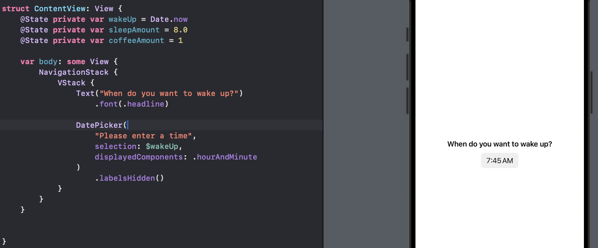
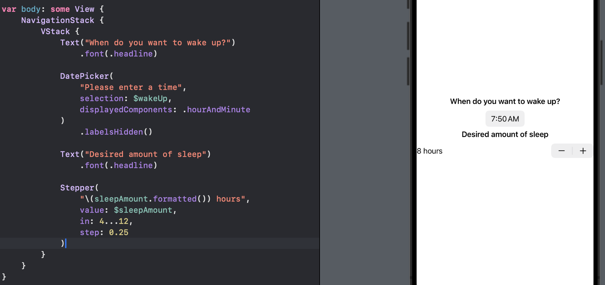
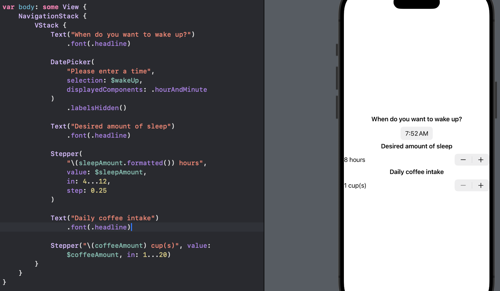
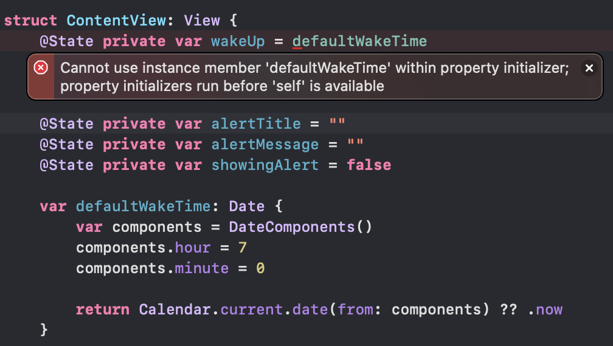
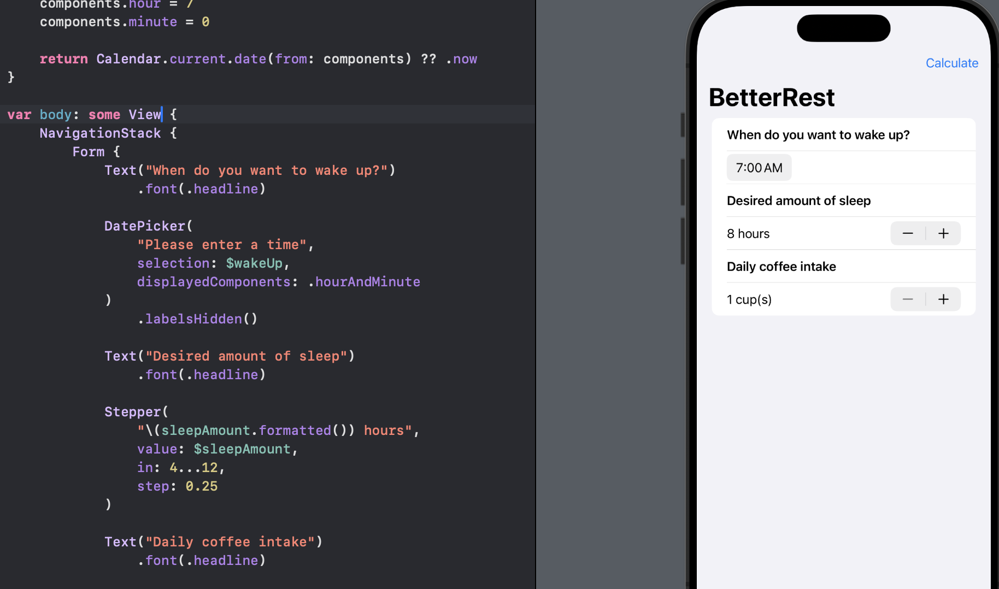
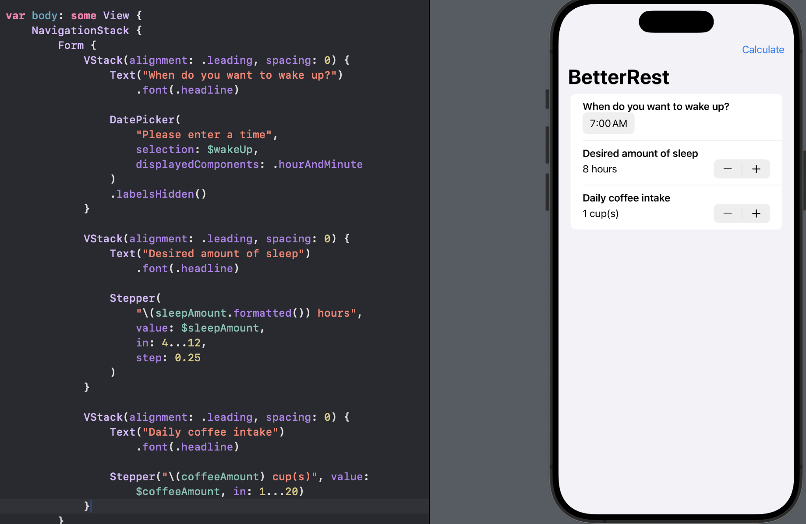
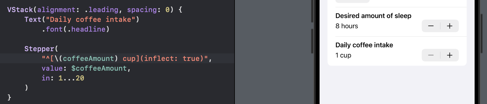

# Day 27 - Project 4, Part 2

## Building a Basic Layout

This app will allow user input with a date picker and two steppers, which combined will tell us when they want to wake up, how much sleep they usually like, and how much coffee they drink.

We start by storing the following information:

```swift
@State private var wakeUp = Date.now
@State private var sleepAmount = 8.0
@State private var coffeeAmount = 1
```

Inside our `body` we will place three sets of components wrapped in a `VStack` and a `NavigationStack`.

We start with the wake up time:

```swift
var body: Some View {
    NavigationStack {
        VStack {
            Text("When do you want to wake up?")
                .font(.headline)

            DatePicker(
                "Please enter a time",
                selection: $wakeUp,
                displayedComponents: .hourAndMinute
            )
                .labelsHidden()
        }
    }
}
```

In preview,



Next we will add a stepper to let users choose roughly how much sleep they want, by giving this thing an `in` range of `4...12`, a step of 0.25, and a `formatted()` method.

```swift
Text("Desired amount of sleep")
    .font(.headline)

Stepper(
    "\(sleepAmount.formatted()) hours",
    value: $sleepAmount,
    in: 4...12,
    step: 0.25
)
```

In preview,



Finally we will add one last stepper and label to handle how much coffee they drink.

```swift
Text("Daily coffee intake")
    .font(.headline)


Stepper("\(coffeeAmount) cup(s)", value: $coffeeAmount, in: 1...20)
```

In preview,



The final thing is a button to let users calculate the best time they should go to bed. We could do that with a simple button at the end of the `VStack`, but this time we will add a button directly to the navigation bar.

We first create an empty `calculateBedtime()` method:

```swift
func calculateBedtime() {
}
```

Then we will use the `toolbar()` modifier to add a button to the navigation bar. We might also use `navigationTitle()` to put some text at the top. So we will add the following modifiers to the `VStack`:

```swift
.navigationTitle("BetterRest")
.toolbar {
    Button("Calculate", action: calculateBedtime)
}
```

In preview,


## Connecting SwiftUI to Core ML

After we trained our Core ML model, we can drag it into the project navigator in Xcode. When Xcode prompts to "Copy items if needed", make sure that box is checked.

When we add an `.mlmodel` file to Xcode, it will automatically create a Swift class of the same name. In this case, we will import the `SleepCalculator.mlmodel` file.

Before we implement the `calculateBedtime()` function, we need to import Core ML package at the top before `import SwiftUI`:

```swift
import CoreML
```

Now we start to implement the `calculateBedtime()` function. First we need to create an instance of the `SleepCalculator` class:

```swift
func calculateBedtime() {
    do {
        let config = MLModelConfiguration()
        let model = try SleepCalculator(configuration: config)

        // more code here
    } catch {
        // something went wrong
    }
}
```

The configuration is there in case we need to enable a handful of options and features.

We use `do/catch` blocks here because using Core ML can throw errors in two places: loading the model as seen above, and using the model for predictions.

Recall that we trained our model with a CSV file containing:

- "wake" - when the user wants to wake up. This is expressed as the number of seconds from midnight, so 8AM would be 8 hours multiplied by 60 multiplied by 60, giving 28800.

- "estimatedSleep" - how much sleep the user wants to have, stored as values from 4 through 12 in quarter increments.

- "coffee" - how many cups of coffee the user drinks per day.

The `sleepAmount` and `coffeeAmount` properties are already set up, but the wake time requires more thinking, because our `wakeUp` property is a `Date` not a `Double` representing the number of seconds.

Therefore, we need to get a `DateComponents` instance from a `Date` with a specific method call `Calendar.current.dateComponents()` to request the hour and minute components, and pass in our wake up date. The `DateComponents` instance that comes back has properties for all its components:

```swift
func calculateBedtime() {
    do {
        let config = MLModelConfiguration()
        let model = try SleepCalculator(configuration: config)

        // new date components
        let components = Calendar.current.dateComponents(
            [.hour, .minute],
            from: wakeUp
        )
        let hour = (components.hour ?? 0) * 60 * 60
        let minute = (components.minute ?? 0) * 60
    } catch {
        // something went wrong
    }
}
```

The `hour` and `minute` use 0 if they cannot be read.

The next step is to feed our values into Core ML and see what comes out.

```swift
func calculateBedtime() {
    do {
        let config = MLModelConfiguration()
        let model = try SleepCalculator(configuration: config)

        // new date components
        let components = Calendar.current.dateComponents(
            [.hour, .minute],
            from: wakeUp
        )
        let hour = (components.hour ?? 0) * 60 * 60
        let minute = (components.minute ?? 0) * 60

        // Core ML prediction
        let prediction = try model.prediction(
            wake: Double(hour + minute),
            estimatedSleep: sleepAmount,
            coffee: Double(coffeeAmount)
        )
    } catch {
        // something went wrong
    }
}
```

With that in place, `prediction` now contains how much sleep they actually need. However the result is not a helpful value for users as it will be some number in seconds, so we need to convert back to a `Date`:

```swift
let sleepTime = wakeUp - prediction.actualSleep
```

This one line of code, subtracting a value in seconds directly from a `Date` will return a new `Date`.


Our final step is to show the sleep time to the user. We will do this with an alert. We start by adding the following properties that determine the title, message of the alert, and whether or not it is showing:

```swift
@State private var alertTitle = ""
@State private var alertMessage = ""
@State private var showingAlert = false
```

Then if our calculation in `calculateBedtime()` goes wrong, we can `catch` that with error message:

```swift
alertTitle = "Error"
alertMessage = "Sorry, there was a problem calculating your bedtime."
```

Regardless of whether or not the prediction works, we should show the alert, so at the end of `calculateBedtime()`, after the `catch` block, we should set

```swift
showingAlert = true
```

If the prediction works, we will create a constant called `sleepTime` that contains the time they need to go to bed. We also need to set this as a `Date` rather than a neatly formatted sttring:

```swift
alertMessage = sleepTime.formatted(
    date: .omitted,
    time: .shortened
)
alertTitle = "Your ideal bedtime is..."
```

To finally wrap up this stage of the app, we need to add an `alert()` modifier that shows `alertTitle` and `alertMessage` when `showingAlert` becomes true. We will add this modifier to our `VStack`:

```swift
VStack {
    // app set up
}
.alert(alertTitle, isPresented: $showingAlert) {
    Button("OK") {}
} message: {
    Text(alertMessage)
}
```

## Cleaning up the User Interface

When we read `Date.now`, it is automatically set to the current date and time. When we create our `wakeUp` property with a new date, the default wake up time will be whatever time it is right now.

We want to set up a default wake up time somewhere between 6 AM and 8 AM. To achieve this, we will add a computed property to our `ContentView` struct that contains a `Date` value referencing 7 AM of the current day:

```swift
var defaultWakeTime: Date {
    var components = DateComponents()
    components.hour = 7
    components.minute = 0

    return Calendar.current.date(from: components) ?? .now
}
```

Again, we will add this computed property to the `ContentView` struct. After that, we can re-assign this to `wakeUp`:

```swift
@State private var wakeUp = defaultWakeTime
```

But we will see an error:



Because we access one property from inside another - Swift does not know which order the properties will be created in, so this is NOT allowed.

To fix this, we can make `defaultWakeTime` a static variable, which means it belongs to the `ContentView` struct itself rather than a single instance of that struct. This in turn means `defaultWakeTime` can be read whenever we want, because it does not rely on the existence of any other properties:

```swift
static var defaultWakeTime: Date {
    var components = DateComponents()
    components.hour = 7
    components.minute = 0

    return Calendar.current.date(from: components) ?? .now
}
```

That fixes our usability problem, because the majority of users will find the default wake up time is close to what they want to choose.


As for the app styling. We would first switch the `VStack` to a `Form`:



We get a clearly segmented table of inputs, rather than controls centered in a white space.

Next, we will wrap each pair of text view and control with a `VStack` so they are seen as a single row each, and also applying `.leading` for the `VStack` alignment and 0 for spacing.

For example,

```swift
Text("Desired amount of sleep")
    .font(.headline)

Stepper("\(sleepAmount.formatted()) hours", value: $sleepAmount, in: 4...12, step: 0.25)
```

becomes to

```swift
VStack(alignment: .leading, spacing: 0) {
    Text("Desired amount of sleep")
        .font(.headline)

    Stepper("\(sleepAmount.formatted()) hours", value: $sleepAmount, in: 4...12, step: 0.25)
}
```

In preview,



Finally, we will fix the "cup(s)" lazy string to show "1 cup", "2 cups", "3 cups", etc.

```swift
Stepper("\(coffeeAmount) cup(s)", value: $coffeeAmount, in: 1...20)
```

We could correct this with a ternary operator:

```swift
Stepper(
    coffeeAmount == 1 ? "1 cup" : "\(coffeeAmount) cups",
    value: $coffeeAmount,
    in: 1...20
)
```

Even better, Swift can handle the pluralization for us:

```swift
Stepper(
    "^[\(coffeeAmount) cup](inflect: true)",
    value: $coffeeAmount,
    in: 1...20
)
```

This looks weird at first, but it is actually a specialized form of Markdown. This syntax tells SwiftUI that the word "cup" needs to be inflected to match whatever is in the `coffeeAmount` variable.

In preview,


