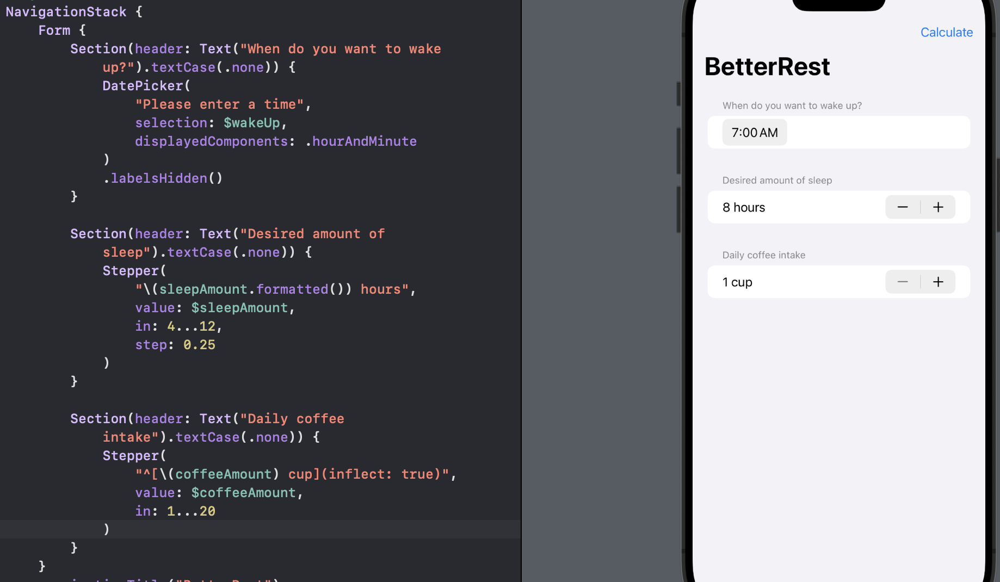
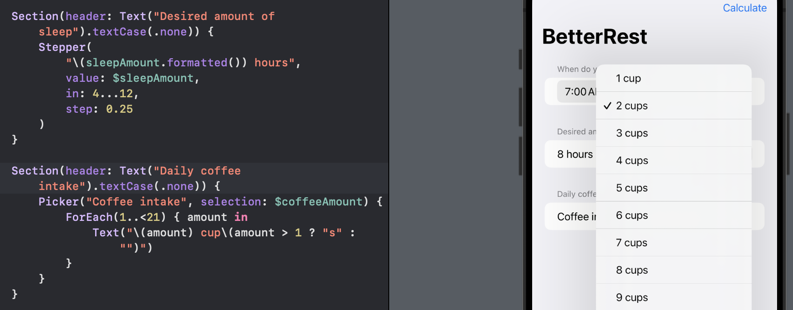
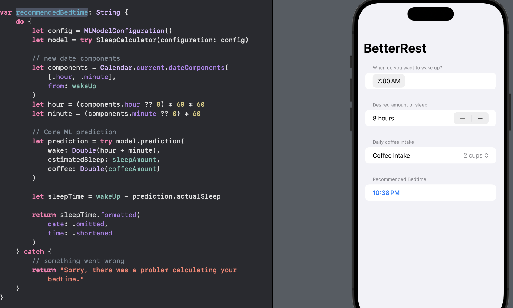

# Day 28 - Project 4, Part 3

## BetterRest: Wrap up

Introduced `DatePicker`, `Stepper`, `Date`, and `DateComponents`.

Created machine learn models using Create ML and Core ML.

## Challenges

1. Replace Each `VStack` in our form with a `Section`, where the text view is the title of the section.
   
   

2. Replace the "Number of cups" stepper with a `Picker` showing the same range of values.
   
   

3. Change the user interface so that it always shows their recommended bedtime using a nice and large font. We should be able to remove the "Calculate" button entirely.
   
   
