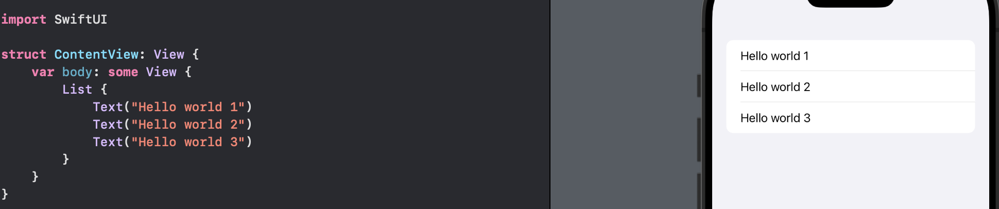
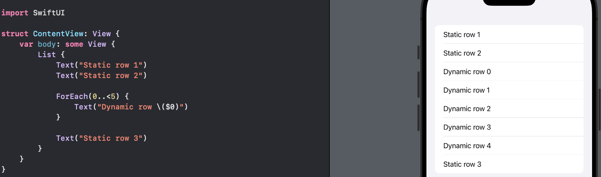
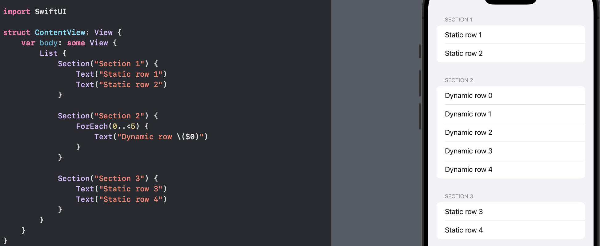
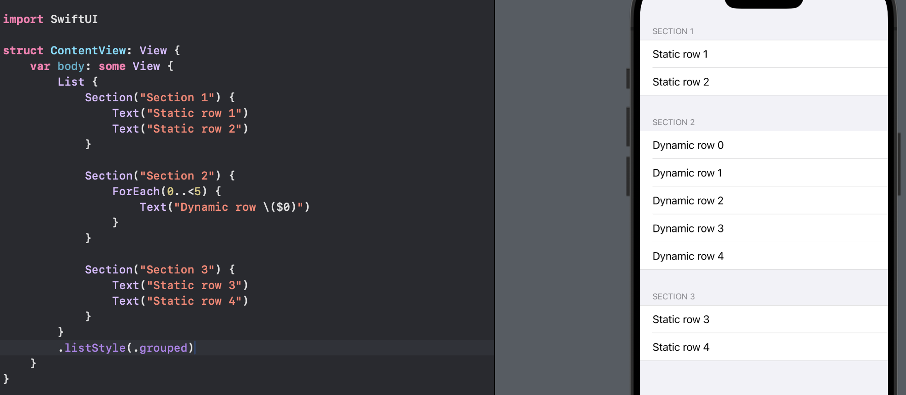
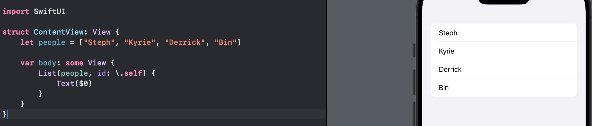
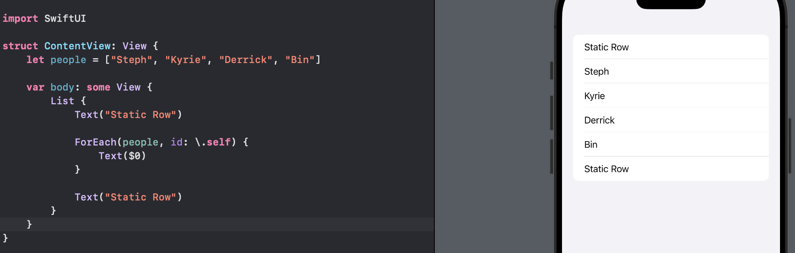

# Day 29 - Project 5, Part 1

## Word Scramble: Introduction

The game app wil show players a random eight-letter word, and ask them to make words out of it. For example, if the starter word is "alarming", they might spell "alarm", "ring", "main", and so on.

We will create a new App project called `WrodScramble`. 

## Introducing List

The job of `List` is to provide a scrolling table of data. It is similar to `Form`, except it is used for presentation of data rather than requesting user input. We can provide `List` a selection of static views to have them rendered in individual rows:

```swift
List {
    Text("Hello world 1")
    Text("Hello world 2")
    Text("Hello world 3")
}
```

In preview,



We can also switch to `ForEach` in order to create rows dynamically from an array or range:

```swift
List {
    ForEach(0..<5) {
        Text("Dynamic row \($0)")
    }
}
```

We can also mix static and dynamic rows:

```swift
List {
    Text("Static row 1")
    Text("Static row 2")

    ForEach(0..<5) {
        Text("Dynamic row \($0)")
    }

    Text("Static row 3")
}
```

In preview,



We can combine with `Section` to make our list easier to read:

```swift
List {
    Section("Section 1") {
        Text("Static row 1")
        Text("Static row 2")
    }

    Section("Section 2") {
        ForEach(0..<5) {
            Text("Dynamic row \($0)")
        }
    }

    Section("Section 3") {
        Text("Static row 3")
        Text("Static row 4")
    }
}
```

In preview,



Being able to have both static and dynamic content side by side lets us recreate something like the Wi-Fi screen in Apple's Settings app - a toggle to enable Wi-Fi system-wide, then a dynamic list of nearby networks, then some more static cells with options to auto-join hotspots and so on.

We can adjust how the list looks using the `listStyle()` modifier:

```swift
List {
    Section("Section 1") {
        Text("Static row 1")
        Text("Static row 2")
    }

    Section("Section 2") {
        ForEach(0..<5) {
            Text("Dynamic row \($0)")
        }
    }

    Section("Section 3") {
        Text("Static row 3")
        Text("Static row 4")
    }
}
.listStyle(.grouped)
```

In preview,




One thing `List` can do that `Form` cannot is to generate its rows entirely from dynamic content without needing a `ForEach`. If our entire list is made up of dynamic rows, we can write:

```swift
List(0..<5) {
    Text("Dynamic row \($0)")
}
```

This allows us to create list really quickly.

In this project we will use `List` differently because we will make it loop over an array of strings. Unlike we use `ForEach` with ranges, either hard-coded (`0..<5`) or relying on variable data (`0..<student.count`), when working with an array of data, SwiftUI needs to know how to identify each row uniquely.

If one element in an array gets removed, the `List` can simply remove that one rather than having to redraw the whole list. This is where the `id` parameter comes in, and it works identically in both `List` and `ForEach` - it lets us tell SwiftUI exactly what makes each item in the array unique.

For example, when working with arrays of strings and numbers, we use `id: \.self` like this:

```swift
struct ContentView: View {
    let people = ["Steph", "Kyrie", "Derrick", "Bin"]

    var body: some View {
        List(people, id: \.self) {
            Text($0)
        }
    }
}
```

In preview,



This works the same with `ForEach`, so if we want to mix static and dynamic rows, we could write:

```swift
struct ContentView: View {
    let people = ["Steph", "Kyrie", "Derrick", "Bin"]

    var body: some View {
        List{
            Text("Static Row")

            ForEach(people, id: \.self) {
                Text($0)
            }

            Text("Static Row")
        }
    }
}
```

In preview,



## Loading Resources from Our App Bundle

When Xcode builds our iOS app, it creates a "bundle", which happens across all of Apple's platforms, including macOS, and allows the system to store all the files for a single app in one place - the binary code, all the artwork, plus any extra files we need all in one place.

In a single app with complicated structure, we can actually include multiple bundles, allowing us to write things like Siri extensions, iMessage apps, widgets, and more.  Hence, it is common to look in a bundle for a file we place there. This uses a new data type called `URL`, which stores not only web addresses, but also file locations.

For example, if we want to read the URL for a file in our main app bundle, we use `Bundle.main.url()`. If the file exists, it will be sent back to us, otherwise we will get back `nil`, so this is an optional `URL`, which means we need to unwrap it:

```swift
if let fileURL = Bundle.main.url(forResource: "some-file", withExtension: "txt") {
    // we found the file in our bundle
}
```

Once we have a URL, we can load it into a string with a speical initializer: `String(contentsOf: )`. We give this a file URL, and it will send back a string containing the contents of that file if it can be loaded. If it cannot be loaded, it throws an error, so we need to call this using `try` or `try?`:

```swift
if let fileContents = try? String(contentsOf: fileURL) {
    // we loaded the file into a string
}
```

Once we have the contents of the file, we can do further processing as it is a regular string.

## Working with Strings

In the `WordScramble` app, we will load a file from our app bundle that contains over 10,000 eight-letter words, each of which can be used to start the game. These words are stored one per line, so what we really want is to split that string up into an array of strings in order that we can pick one randomly.

Swift gives us a method called `components(separatedBy: )` that can converts a single string into an array of strings by breaking it up wherever another string is found. For example,

```swift
let input = "a b c"
let letters = input.components(separatedBy: " ")
```

If we have a string where words are separated by line breaks,

```swift
let input = """
            a
            b
            c
            """
let letters = input.components(separatedBy: "\n")
```

Regardless of what string we split on, the result will be an array of strings. As an array type, Swift gives us a method `randomElement()` to return one random item from the array:

```swift
let letter = letters.randomElement()
```

However, Swift does not know how many items are in that array, so the `randomElement()` method returns an optional string, which we must either unwrap or use with nil coalescing.


Another useful string method is `trimmingCharacters(in:)` which asks Swift to remove certain kinds of characters from the start and end of a string. This uses a new type called `CharacterSet`. Most of the time we want to use this to remove whitespace and newlines - this could be spaces, tabs, and line breaks.

```swift
let trimmed = letter?.trimmingCharacters(in: .whitespacesAndNewlines)
```

One last useful method for string is to check for misspelled words. This functionality is provided through the class `UITextChecker` and it takes four steps in total. First, we create a word to check and an instance of `UITextChecker`:

```swift
let word = "swift"
let checker = UITextChecker()
```

Second, we need to tell the checker how much of our string we want to check.

```swift
let range = NSRange(location: 0, length: word.utf16.count)
```

UTF-16 is a *character encoding* - a way of storing letters in a string. We use it here so that Apple's Objective-C can understand how Swift's strings are stored.

Third, we can ask our text checker to report where it found any mispellings in our word, passing in 

- the range to check, 

- a position to start within the range (so that we can do things like "Find Next"), 

- whether it should wrap around once it reaches the end, and 

- what language to use for the dictionary:

```swift
let misspelledRange = checker.rangeOfMisspelledWord(
    in: word,
    range: range,
    startingAt: 0,
    wrap: false,
    language: "en"
)
```

That sends back another Objective-C string range, telling us where the misspelling was found. In this example, if the Objective-C range comes back as empty, i.e., if there was no spelling mistake, then we get back the special value `NSNotFound`.

Hence, we could check our spelling result to see whether there was a mistake or not:

```swift
let allGood = misspelledrange.location == NSNotFound
```


