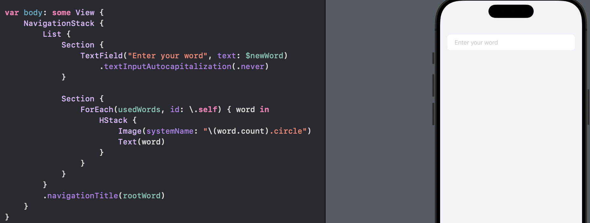
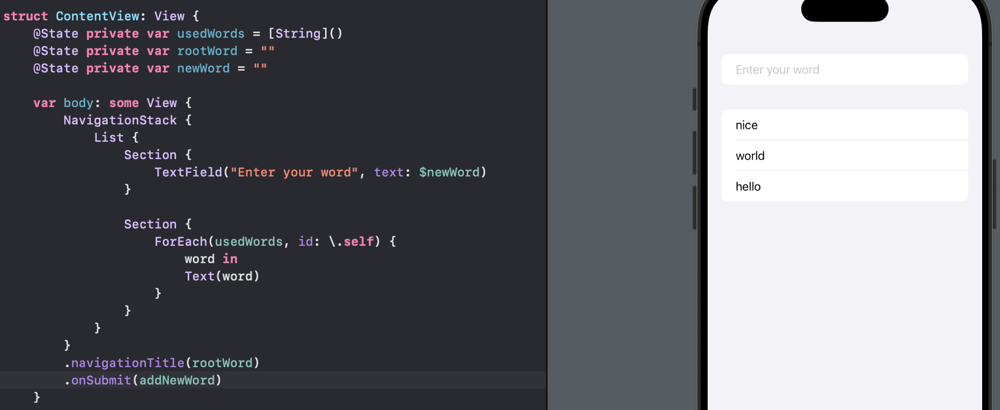
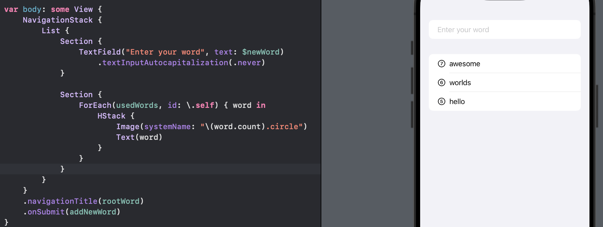

# Day 30 - Project 5, Part 2

## Adding to a List of Words

The user interface for this app will be made up of three main SwiftUI:

- a `NavigationStack` showing the word they are spelling from,

- a `TextField` where they can enter one answer, and

- a `List` showing all the words they have entered previously.


We need 

- an array of words they have already used, 

- a root word for them to spell other words from, and 

- a string we can bind to a text field

```swift
// add properties to ContentView
@State private var usedWords = [String]()
@State private var rootWord = ""
@State private var newWord = ""
```

For the body of the view,

```swift
var body: some View {
    NavigationStack {
        List {
            Section {
                TextField("Enter your word", text: $newWord)
            }

            Section {
                ForEach(usedWords, id: \.self) {
                    word in
                    Text(word)
                }
            }
        }
    }
    .navigationTitle(rootWord)
}
```

In preview,



Using `id: \.self` would cause problems if there are lots of duplicates in `usedWords`, but later we will disallow this.

In our current text view, we cannot submit our answer after we type words into the text box. To fix this, we will write a new method called `addNewWord()` to

1. Lowercase `newWord` and remove any whitespace

2. Check that it has at least 1 character otherwise exit

3. Insert that word at position 0 in the `usedWords` array

4. Set `newWord` back to be an empty string


```swift
func addNewWord() {
    // lowercase and trim the word to make sure we do not add duplicate words with case differences
    let answer = newWord.lowercased().trimmingCharacters(in: .whitespacesAndNewlines)

    // exit if the remaining string is empty
    guard answer.count > 0 else { return }

    // extra validation to come

    usedWords.insert(answer, at: 0)
    newWord = ""
}
```

We want to call `addNewWord()` when the user presses return on the keyboard, and in SwiftUI we can do this by adding an `onSubmit()` modifier somewhere in our view hierachy - it could be directly on the text field, but it can be anywhere else in the view because it will be triggered when *any text* is submitted.


Note that `onSubmit()` needs to be given a function that accepts no parameters and returns nothing, which is exactly what `addNewWord()` does. So we can pass that in directly by adding this modifier below `navigationTitle()`:

```swift
NavigationStack {
    List {
        Section {
            TextField("Enter your word", text: $newWord)
        }

        Section {
            ForEach(usedWords, id: \.self) {
                word in
                Text(word)
            }
        }
    }
}
.navigationTitle(rootWord)
// add here
.onSubmit(addNewWord)
```

In preview,



We force to lowercase user inputs and store them in an array, but this looks odd in practice. The text field automatically capitalizes the first letter of whatever the user types, so when they submit "Car" what they see in the list is "car". To fix this, we can disable capitalization for the text field with a modifier `textInputAutocapitalization()`:

```swift
Section {
    TextField("Enter your word", text: $newWord)
        .textInputAutocapitalization(.never)
}
```

Next, we will use Apple's SF Symbols icons to show the length of each word next to the text. SF Symbols provides numbers in circles from 0 through 50, all named using the format "x.circle.fill" - e.g., 1.circle.fill, 20.circle.fill.

In this app since we will show eight-letter words to users, the longest word could compose eight letters. So we can wrap our word text in a `HStack`, and place an SF Symbol next to it using `Image(systemName:)`:

```swift
Section {
    ForEach(usedWords, id: \.self) { word in
        HStack {
            Image(systemName: "\(word.count).circle")
            Text(word)
        }
    }
}
```

In preview,



Now we can type words in the text field, press return, and then see them appear in the list with their length icon to the side.

When we submit our text field right now, the text just appears in the list immediately, but we could animate that by modifying the `insert()` call inside `addNewWord()`:

```swift
func addNewWord() {
    // lowercase and trim the word to make sure we do not add duplicate words with case differences
    let answer = newWord.lowercased().trimmingCharacters(in: .whitespacesAndNewlines)

    // exit if the remaining string is empty
    guard answer.count > 0 else { return }

    // extra validation to come

    // add animation effect
    withAnimation {
        usedWords.insert(answer, at: 0)
        newWord = ""
    }
}
```

## Running Code When Our App Launches

When Xcode builds an iOS project, it puts our compiled program, our asset catalog, and any other asses into a single directory called a *bundle*, then gives that bundle the name `<OurAppName>.app`. This ".app" extension is automatially recognized by iOS and Apple's other platforms.

In our game, we will include a file called "start.txt", which includes over 10,000 eight-letter words that will be randomly selected for the player to work with. We need to drag `start.txt` into our project in Xcode.

We defined a property called `rootWord`, which will contain the word we want the player to spell from. What we need to do now is to write a new method `startGame()` that will

- find `start.txt` in our bundle

- load it into a string

- split that string into array of strings, with each element being one word

- pick one random word from there to be assigned to `rootWord`, or use a sensible default if the array is empty.

```swift
func startGame() {
    // find the url for start.txt in our app bundle
    if let startWordsURL = Bundle.main.url(forResource: "start", withExtension: "txt") {
        // load start.txt into a string
        if let startWords = try? String(contentsOf: startWordsURL) {
            // split the string up into an array of strings, splitting on line breaks
            let allWords = startWords.components(separatedBy: "\n")

            // pick one random word, or use "silkworm" as a sensible default
            rootWord = allWords.randomElement() ?? "silkworm"

            // if everything works, we can exit
            return
        }
    }

    // otherwise we have a problem - trigger a crash and report the error
    fatalError("Could not load start.txt from bundle.")
}
```

Now that we have a method to load everything for the game, we need to call that function when our view is shown. SwiftUI gives us a dedicated view modifier, `.onAppear(perform:)`, for running a closure when a view is shown. We need to add this modifier after `onSubmit()`:

```swift
.onAppear(perform: startGame)
```

## Validating Words with UITextChecker

The last part of this project is to make sure the user cannot enter invalid words.

First, we will implement a method that accepts a string as the only parameter, and return true or false depending on whether the word has been used before or not. We had a `usedWords`  array so we can pass the word into its `contains()` method:

```swift
func isOriginal(word: String) -> Bool {
    !usedWords.contains(word)
}
```

Second, we need to check whether a random word can be made out of the letters from another random word. If we create a variable copy of that root word, we can then loop over each letter of the user's input word to see if that letter exists in our copy.

- If it does, we remove it from the copy (so it cannot be used twice), then continue.

- If we make it to the end of the user's word successfully, then the word is good, otherwise there's a mistake and we return false.

```swift
func isPossible(word: String) -> Bool {
    var tempWord = rootWord

    for letter in word {
        if let pos = tempWord.firstIndex(of: letter) {
            tempWord.remove(at: pos)
        } else {
            return false
        }
    }

    return true
}
```

Third, we will implement a method to make an instance of `UITextChecker` for scanning strings for misspelled words.

```swift
func isReal(word: String) -> Bool {
    let checker = UITextChecker()
    let range = NSRange(location: 0, length: word.utf16.count)
    let misspelledRange = checker.rangeOfMisspelledWord(in: word, range: range, startingAt: 0, wrap: false, language: "en")

    return misspelledRange.location == NSNotFound
}
```

Before we can use those three, we also want to add some code to make showing error alerts easier:

```swift
@State private var errorTitle = ""
@State private var errorMessage = ""
@State private var showingError = false
```

Then we can add a method that sets the title and message based on the parameters it receives, then flip the `showingError` to true:

```swift
func wordError(title: String, message: String) {
    errorTitle = title
    errorMessage = message
    showingError = true
}
```

Next we can pass those directly on to SwiftUI by adding an `alert()` modifier below `.onAppear()`:

```swift
.alert(errorTitle, isPresented: $showingError) {
    Button("OK") {}
} message: {
    Text(errorMessage)
}
```

If we do not include *any* button in the code, we automatically get a simple "OK" button that dismisses that alert:

```swift
.alert(errorTitle, isPresented: $showingError) {} message: {
    Text(errorMessage)
}
```

Finally, we need to replace `// extra validation to come` comment in `addNewWord()` with the following:

```swift
func addNewWord() {
    // lowercase and trim the word to make sure we do not add duplicate words with case differences
    let answer = newWord.lowercased().trimmingCharacters(in: .whitespacesAndNewlines)

    // exit if the remaining string is empty
    guard answer.count > 0 else { return }

    // extra validation to come
    guard isOriginal(word: answer) else {
        wordError(title: "Word used already", message: "Be more original")
        return
    }
    guard isPossible(word: answer) else {
        wordError(title: "Word not possible", message: "You can't spell that word from '\(rootWord)'!")
        return
    }
    guard isReal(word: answer) else {
        wordError(title: "Word not recognized", message: "You can't just make them up, you know!")
        return
    }

    // add animation effect
    withAnimation {
        usedWords.insert(answer, at: 0)
        newWord = ""
    }
}
```


