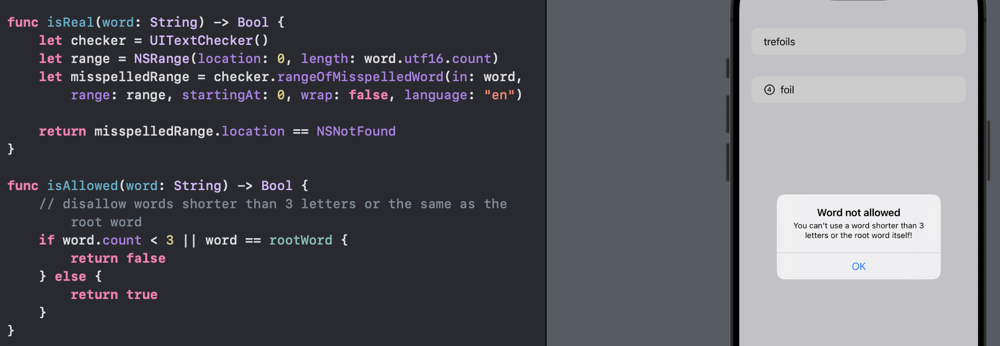
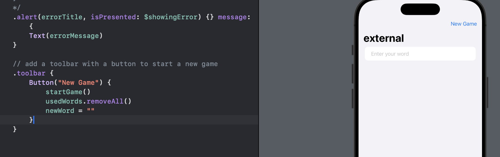
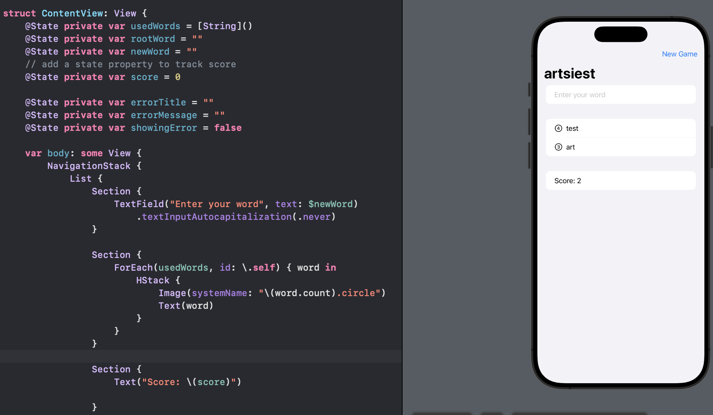

# Day 31 - Project 5, Part 3

## WordScramble: Wrap up

`fatalError()` is used to force the code to shut down when something impossible has happened.

### Challenge

1. Disallow answers that are shorter than three letters or are just our start word.
   
   

2. Add a toolbar button that calls `startGame()`, so users can restart with a new word whenver they want to.
   
   

3. Put a text view somewhere so we can track and show the player's score for a given root word.
   
   
