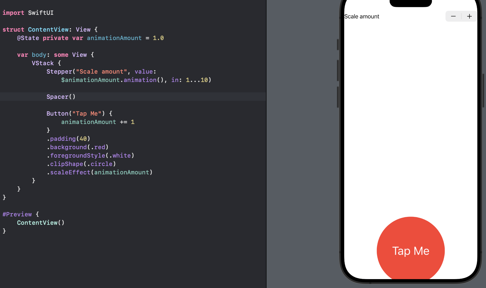

# Day 32 - Project 6, Part 1

## Animation: Introduction

Animations do not only make our user interfaces look better, but also help users understand what is going on with our program.

## Creating Implicit Animations

In SwiftUI, the simplest type of animation is an *implicit* one: we tell our views ahead of time "if someone wants to animate you, here is how you should respond." For example

```swift
Button("Tap Me") {
    // do nothing
}
.padding(50)
.background(.red)
.foregroundStyle(.white)
.clipShape(.circle)
```

This is just a simple red button with no acion, using 50 points of padding and a circular clip shape.

What we want for that button is to get bigger every time it is tapped, and we can do that with a new modifier called `scaleEffect()`. Because we want to change the scale effect value every time the button is tapped, we need to use an `@State` property:

```swift
@State private var animationAmount = 1.0
```

Now we can make the button use that for its scale effect:

```swift
Button("Tap Me") {
    // increase the animation amount by 1 when tapped
    animationAmount += 1
}
.padding(50)
.background(.red)
.foregroundStyle(.white)
.clipShape(.circle)
.scaleEffect(animationAmount)
```

In preview,


So far there is no animation and the changing ocurrs immediately after tapping. We can ask SwiftUI to create an implicit animation for our changes so that all the scaling happens smoothly:

```swift
Button("Tap Me") {
    // increase the animation amount by 1 when tapped
    animationAmount += 1
}
.padding(50)
.background(.red)
.foregroundStyle(.white)
.clipShape(.circle)
.scaleEffect(animationAmount)
.animation(.default, value: animationAmount)
```

The `.animation()` modifier applies a default animation whenever the value of `animationAmount` changes.

This implicit animation takes effect on all properties of the view that change, meaning that if we attach more animating modifiers to the view then they will all change together. For example, we can add a second new modifier to the button, `.blur()`, which lets us add a Gaussian blur with a speical radius. Make sure to add this modifier **before** the `animation()`:

```swift
Button("Tap Me") {
    // increase the animation amount by 1 when tapped
    animationAmount += 1
}
.padding(50)
.background(.red)
.foregroundStyle(.white)
.clipShape(.circle)
.scaleEffect(animationAmount)
.blur(radius: (animationAmount - 1) * 3)
.animation(.default, value: animationAmount)
```

In preview,


The radius of `(animationAmount - 1) * 3` means the blur radius will start at 0 (no blur), but then move to 3 points, 6 points, etc.

## Customizing Animations in SwiftUI

When we attach the `animation()` modifier to a view, SwiftUI will automatically animate any changes that happen to that view using whatever is the default system animation, whenever the value we’re watching changes.

We can control the type of animation used by passing in different values to the modifier. For example, we could use `.linear` to make the animation move at a constant speed from start to finish:

```swift
.animation(
    .linear,
    value: animationAmount
)
```

Implicit animations always need to watch a particular value otherwise animations would be triggered for every small change - even rotating the device from portrait to langscape would trigger the animation.

Another example, we could customize `.spring` animation to scale up quickly and then bounce a lot:

```swift
.animation(
    .spring(duration: 1, bounce: 0.9),
    value: animationAmount
)
```

For more precise control, we can customize the animation with a duration specified as a number of seconds. We could get an ease-in-out animation that lasts for two seconds:

```swift
struct ContentView: View {
    @State private var animationAmount = 1.0
    var body: some View {
        Button("Tap Me") {
            // increase the animation amount by 1 when tapped
            animationAmount += 1
        }
        .padding(50)
        .background(.red)
        .foregroundStyle(.white)
        .clipShape(.circle)
        .scaleEffect(animationAmount)
        .animation(.easeInOut(duration: 2), value: animationAmount)
    }
}
```

When we apply `.easeInOut(duration: 2)`, we actually create an instance of an `Animation` struct that has its own set of modifiers, so we can attach modiifers directly to the animation to add a delay:

```swift
.animation(
    .easeInOut(duration: 2)
        .delay(1),
    value: animationAmount
)
```

Tapping the button now will wait for a second before executing a two-second animation.

We can also ask the animation to repeat a certain number of times, and even make it bounce back and forward by setting `autoreverses` to true:

```swift
.animation(
    .easeInOut(duration: 1)
        .repeatCount(3, autoreverses: true),
    value: animationAmount
)
```

For continuous animations, we need to use `repeatForever()` modifier:

```swift
.animation(
    .easeInOut(duration: 1)
        .repeatForever(autoreverses: true),
    value: animationAmount
)
```

We can use these `repeatForever()` animations in combination with `onAppear()` to make animations that start immediately and continue animating for the life of the view.

For example, we will create an overlay to make a sort of pulsating circle around the button. We will add the `overlay()` modifier to the button before the `animation()` modifier:

```swift
Button("Tap Me") {
    // increase the animation amount by 1 when tapped
    animationAmount += 1
}
.padding(50)
.background(.red)
.foregroundStyle(.white)
.clipShape(.circle)
.scaleEffect(animationAmount)
.blur(radius: (animationAmount - 1) * 3)
.overlay(
    Circle()
        .stroke(.red)
        .scaleEffect(animationAmount)
        .opacity(2 - animationAmount)
)
```

This makes a stroked red circle over our button, using an opacity value of `2 - animationAmount` so that 

- when `animationAmount` is 1, the opacity is 1 (opaque),

- when `animationAmount` is 2, the opacity os 0 (transparent)

Next we remove the `scaleEffect()` and `blur()` modifiers from the button and comment out the `animationAmount += 1` action part as well, because we do not want that to change anymore, and move its animation modifier up to the circle inside the overlay:

```swift
Button("Tap Me") {
    // increase the animation amount by 1 when tapped
    //animationAmount += 1
}
.padding(50)
.background(.red)
.foregroundStyle(.white)
.clipShape(.circle)
.overlay(
    Circle()
        .stroke(.red)
        .scaleEffect(animationAmount)
        .opacity(2 - animationAmount)
        .animation(
            .easeOut(duration: 1)
                .repeatForever(autoreverses: false),
            value: animationAmount
        )
)
```

Finally, we will an `onAppear()` modifier to the button:

```swift
Button("Tap Me") {
    // increase the animation amount by 1 when tapped
    //animationAmount += 1
}
.padding(50)
.background(.red)
.foregroundStyle(.white)
.clipShape(.circle)
.overlay(
    Circle()
        .stroke(.red)
        .scaleEffect(animationAmount)
        .opacity(2 - animationAmount)
        .animation(
            .easeInOut(duration: 1)
                .repeatForever(autoreverses: false),
            value: animationAmount
        )
)
.onAppear {
    animationAmount = 2
}
```

Because the overlay circle uses that for a "repeat forever" animation without autoreversing, we will see the overlay circle scale up and fade out continuously.

In preview,


## Animating Bindings

The `animation()` modifier can be applied to any SwiftUI binding, which causes the value to animate between its current and new value.

For example,

```swift
struct ContentView: View {
    @State private var animationAmount = 1.0

    var body: some View {
        VStack {
            Stepper("Scale amount", value: $animationAmount.animation(), in: 1...10)

            Spacer()

            Button("Tap Me") {
                animationAmount += 1
            }
            .padding(40)
            .background(.red)
            .foregroundStyle(.white)
            .clipShape(.circle)
            .scaleEffect(animationAmount)
        }
    }
}
```

In preview,



The stepper can move `animationAmount` up and down, and tapping the button will add 1 to it. However, tapping the button changes `animationAmount` immediately, so the button will just jump up to its larger size. In contrast, the stepper is boun to `$animationAmount.animation()` to animate its changes.

We can even set the animation more complicated:

```swift
struct ContentView: View {
    @State private var animationAmount = 1.0

    var body: some View {
        VStack {
            Stepper(
                "Scale amount", 
                value: $animationAmount.animation(
                    .easeInOut(duration: 1)
                        .repeatCount(3, autoreverses: true)
                ), 
                in: 1...10
            )

            Spacer()

            Button("Tap Me") {
                animationAmount += 1
            }
            .padding(40)
            .background(.red)
            .foregroundStyle(.white)
            .clipShape(.circle)
            .scaleEffect(animationAmount)
        }
    }
}
```

These binding animations effectively turn the tables on implicit animations: rather than setting the animation on a view and implicitly animating it with a state change, we now set nothing on the view and explicitly animate it with a state change.

## Creating Explicit Animations

We now have known how SwiftUI lets us create implicit animations by attaching the `animation()` modifier to a view, and how it also lets us create animated binding changes by adding the `animation()` modifier to a binding.

Now we will explicitly ask SwiftUI to animate changes occurring as the result of a state change. For example, let's return to a simple button example again:

```swift
struct ContentView: View {   
    var body: some View {
        Button("Tap Me") {
            // do nothing
        }
        .padding(50)
        .background(.red)
        .foregroundStyle(.white)
        .clipShape(.circle)
    }
}
```

When that button is tapped, we will make it spin around with a 3D effect. This requires a new modifier, `rotation3DEffect()`, which can be given a rotation amount in degrees as well as an axis that determines how the view rotates. We need to create a `@State` property and then add the `animationAmount` modifier to the button:

```swift
struct ContentView: View {
    @State private var animationAmount = 0.0

    var body: some View {
        Button("Tap Me") {
            // do nothing
        }
        .padding(50)
        .background(.red)
        .foregroundStyle(.white)
        .clipShape(.circle)
        .rotation3DEffect(.degrees(animationAmount), axis: (x: 0, y: 1, z: 0))
    }
}
```

Next, we will add an action inside the button so that it adds 360 to `animationAmount` every time it is tapped. We could just write `animationAmount += 360` then the change will happen immediately, because there is no animation modifier attached to the button.

However, this is where *explicit animations* come in: if we use the `withAnimation()` funciton then SwiftUI will ensure any changes resulting from the new state will automatically be animated:

```swift
struct ContentView: View {
    @State private var animationAmount = 0.0

    var body: some View {
        Button("Tap Me") {
            withAnimation {
                animationAmount += 360
            }
        }
        .padding(50)
        .background(.red)
        .foregroundStyle(.white)
        .clipShape(.circle)
        .rotation3DEffect(.degrees(animationAmount), axis: (x: 0, y: 1, z: 0))
    }
}
```

The `withAnimation()` can be given an animation parameter, using all the same animations we can use elsewhere in SwiftUI. For example, we could make our rotation effect using a spring animation:

```swift
struct ContentView: View {
    @State private var animationAmount = 0.0

    var body: some View {
        Button("Tap Me") {
            withAnimation(.spring(duration: 1, bounce: 0.5)) {
                animationAmount += 360
            }
        }
        .padding(50)
        .background(.red)
        .foregroundStyle(.white)
        .clipShape(.circle)
        .rotation3DEffect(.degrees(animationAmount), axis: (x: 0, y: 1, z: 0))
    }
}
```


