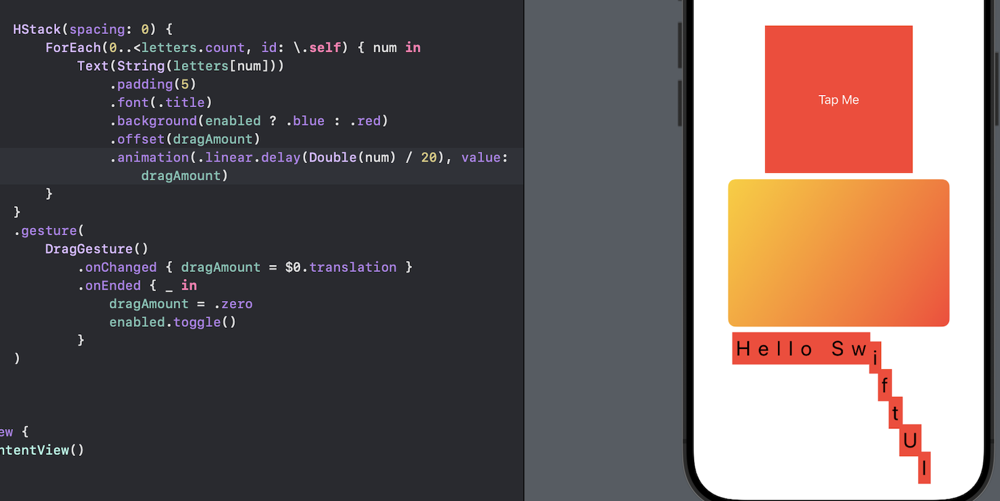

# Day 33 - Project 6, Part 2

## Controlling the Animation Stack

Previously we have looked at how the order of modifiers matters. If we write the following code:

```swift
Button("Tap Me") {
    // do nothing
}
.background(.blue)
.frame(width: 200, height: 200)
.foregroundStyle(.white)
```

the result would look different from the following code:

```swift
Button("Tap Me") {
    // do nothing
}
.frame(width: 200, height: 200)
.background(.blue)
.foregroundStyle(.white)
```

In preview,


This is because if we color the background before adjusting the frame, only the original space is colored rather than the expanded space.

The underlying reason for this is the way SwiftUI wraps views with modifiers, allowing us to apply the same modifier multiple times.

We could modify our button so that it shows different colors depending on some state:

```swift
@State private var enabled = false
```

Then we can use a conditional value inside the `backgorund()` modifier so the button is either blue or red:

```swift
struct ContentView: View {
    @State private var enabled = false

    var body: some View {
        Button("Tap Me") {
            // toggle boolean
            enabled.toggle()
        }
        .frame(width: 200, height: 200)
        .background(enabled ? .blue : .red)
        .foregroundStyle(.white)
    }
}
```

In preview,


Finally we add the `animation()` modifier to the button to make those changes animate:

```swift
struct ContentView: View {
    @State private var enabled = false

    var body: some View {
        Button("Tap Me") {
            // toggle boolean
            enabled.toggle()
        }
        .frame(width: 200, height: 200)
        .background(enabled ? .blue : .red)
        .foregroundStyle(.white)
        .animation(.default, value: enabled)
    }
}
```

**We can also attach the** `animation()` modifier **several times, and the order in which we use it matters!**

Now if we add the following modifier to our button after all other modifiers:

```swift
.clipShape(.rect(cornerRadius: enabled ? 60 : 0))
```

When running the program, we will see that tapping the button causes it to animate between red and blue, but *jump* between square and rounded rectangle, which does NOT animate.


This is why we need to move the `clipShape()` modifier before the animation:

```swift
Button("Tap Me") {
    // toggle boolean
    enabled.toggle()
}
.frame(width: 200, height: 200)
.background(enabled ? .blue : .red)
.foregroundStyle(.white)
.clipShape(.rect(cornerRadius: enabled ? 60 : 0))
.animation(.default, value: enabled)
```

Therefore, **only changes that occur *before* the `animation()` modifier get animated.**

If we apply multiple `animation()` modifiers, each one controls everything before it up to the next animation. Thiw allows us to animate state changes in all sorts of different ways rather than uniformly for all properties.

For example, we could make the color change happen with the default animation, but use a spring for the clip shape:

```swift
Button("Tap Me") {
    // toggle boolean
    enabled.toggle()
}
.frame(width: 200, height: 200)
.background(enabled ? .blue : .red)
.animation(.default, value: enabled)
.foregroundStyle(.white)
.clipShape(.rect(cornerRadius: enabled ? 60 : 0))
.animation(.spring(duration: 1, bounce: 0.6), value: enabled)
```

We can have as many `animation()` modifiers as we need to construct our design, which lets us split one state change into as many segments as we need.

It is also possible to disable animations entirely by passing `nil` to the modifier. For example, we might want the color change to happen immediately but the clip shape to retain its animation:

```swift
Button("Tap Me") {
    // toggle boolean
    enabled.toggle()
}
.frame(width: 200, height: 200)
.background(enabled ? .blue : .red)
.animation(nil, value: enabled) // disable animation
.foregroundStyle(.white)
.clipShape(.rect(cornerRadius: enabled ? 60 : 0))
.animation(.spring(duration: 1, bounce: 0.6), value: enabled)
```

## Animating Gestures

SwiftUI lets us attach gestures to any views, and the effects of those gestures can also be animated. For example,

- Tap gestures to let any view respond to taps,

- Drag gestures to respond to us dragging a finger over a view.

As an example, we can create a card that we can drag around the screen, but when we let go it will snap back into its original location.

Our initial layout:

```swift
struct ContentView: View {
    var body: some View {
        LinearGradient(colors: [.yellow, .red], startPoint: .topLeading, endPoint: .bottomTrailing)
            .frame(width: 300, height: 200)
            .clipShape(.rect(cornerRadius: 10))
    }
}
```

In preview,


This draws a card-like view. Before we can move this card around the screen, we need some state to store the amount of the drag:

```swift
@State private var dragAmount = CGSize.zero
```

Then, to use this to influence the card's position on-screen. We need to call `offset()` modifier, which lets us adjust the X and Y coordinate of a view without moving other views around it:

```swift
struct ContentView: View {
    @State private var dragAmount = CGSize.zero
    var body: some View {
        LinearGradient(colors: [.yellow, .red], startPoint: .topLeading, endPoint: .bottomTrailing)
            .frame(width: 300, height: 200)
            .clipShape(.rect(cornerRadius: 10))
            .offset(dragAmount)
    }
}
```

Next, we will create a `DragGesture` and attach it to the card. Drag gestures have two extra modifiers:

- `onChanged()` to run a closure whenever the user moves their finger,

- `onEnded()` to run a closure when the user lifts their finger off the screen, ending the drag.

For the `onChanged()` modifier, we will read the *translation* of the drag, which tells us how far it is moved from the start point - we can assign that directly to `dragAmount` so that our view moves along with the gesture.

For the `onEnded()` modifier, we will ignore the input entirely, because we will be setting `dragAmount` back to zero.

```swift
struct ContentView: View {
    @State private var dragAmount = CGSize.zero
    var body: some View {
        LinearGradient(colors: [.yellow, .red], startPoint: .topLeading, endPoint: .bottomTrailing)
            .frame(width: 300, height: 200)
            .clipShape(.rect(cornerRadius: 10))
            .offset(dragAmount)
            .gesture(
                DragGesture()
                    .onChanged { dragAmount = $0.translation }
                    .onEnded { _ in dragAmount = .zero }
            )
    }
}
```

In preview,


Now we can drag the gradient card around, and when we release the drag it will jump back to the original position.

The next task is to add some animation, and we have two options:

- add an implicit animation that will animate the drag and the release,

- add an explicit animation to animate just the release.

For the implicit animation, we can add the following modifier to the linear gradient:

```swift
.animation(.bouncy, value: dragAmount)
```

NOTE: `.bouncy` is one of the built-in animation options for SwiftUI producing a spring with a gentle bounce.

As we drag around, the card will move to the drag location with a slightly delay because of the spring animation, but it will also gently overshoot if we make sudden movements.

For the explicit animation, we will remove that `animation()` modifier first and then change our existing `onEnded()` drag gesture code to the following:

```swift
.onEnded { _ in
    withAnimation(.bouncy) {
        dragAmount = .zero
    }
}
```

Now the card will follow our drag immediately (because that is not being animated), but when we release it will animate.

In the last example, we will write the text "Hello SwiftUI" as a series of individual letters, each one with a background color and offset that is controlled by some state.

```swift
struct ContentView: View {
    let letters = Array("Hello SwiftUI")
    @State private var enabled = false
    @State private var dragAmount = CGSize.zero

    var body: some View {
        HStack(spacing: 0) {
            ForEach(0..<letters.count, id: \.self) { num in
                Text(String(letters[num]))
                    .padding(5)
                    .font(.title)
                    .background(enabled ? .blue : .red)
                    .offset(dragAmount)
                    .animation(.linear.delay(Double(num) / 20), value: dragAmount)
            }
        }
        .gesture(
            DragGesture()
                .onChanged { dragAmount = $0.translation }
                .onEnded { _ in
                    dragAmount = .zero
                    enabled.toggle()
                }
        )
    }
}
```

In preview,



We can see that any letter can be dragged around to have the whole string follow suit, with a brief delay causing a snake-like effect. SwiftUI will also add in color changing as we release the drag, animating between blue and red even as the letters move back to the center.

## Showing and Hiding Views with Transitions

One of the most powerful features of SwiftUI is the ability to customize the way views are shown and hidden.

Transitions control how the view insertion and removal takes place, and we can work with the built-in transitions, combine them in different ways, or even create wholly custom transitions.

For example, we will start with a `VStack`:

```swift
struct ContentView: View {
    var body: some View {
        VStack {
            Button("Tap Me") {
                // do nothing
            }

            Rectangle()
                .fill(.red)
                .frame(width: 200, height: 200)
        }
    }
}
```

We can make the rectangle appear only when a certain condition is satisfied. First we add a state property:

```swift
@State private var isShowingRed = false
```

Next we use that state as a condition for showing our rectangle:

```swift
if isShowingRed {
    Rectangle()
        .fill(.red)
        .frame(width: 200, height: 200)
}
```

Finally we can toggle `isShowingRed` in the button's action:

```swift
struct ContentView: View {
    @State private var isShowingRed = false
    var body: some View {
        VStack {
            Button("Tap Me") {
                isShowingRed.toggle()
            }
            if isShowingRed {
                Rectangle()
                    .fill(.red)
                    .frame(width: 200, height: 200)
            }
        }
    }
}
```

In preview,


We see that pressing the button shows and hides the red square, but there is no animation. We can get SwiftUI's default view transition by wrapping the state change using `withAnimation()`:

```swift
Button("Tap Me") {
    withAnimation {
        isShowingRed.toggle()
    }
}
```

The app now fades the red rectangle in and out, while also moving the button up to make space.

We can even do better with the `transition()` modifier. For example, we could have the rectangle scale up and down as it is shown just by adding the `transition()` modifier to it:

```swift
Rectangle()
    .fill(.red)
    .frame(width: 200, height: 200)
    .transition(.scale)
```

Now tapping the button make the rectangle scales up as the button makes space, and then scales down when tapped again.

We can also add parameters in transitions. For example, `.asymmetric` lets us use one transition when the view is being shown and another when it is disappearing:

```swift
Rectangle()
    .fill(.red)
    .frame(width: 200, height: 200)
    .transition(.asymmetric(insertion: .scale, removal: .opacity))
```

## Building Custom Transitions Using ViewModifier

We will write a view modifier that lets us mimic the Pivot animation in Keynote - it causes a new slide to rotate in from its top-left corner.

In SwiftUI, that means creating a view modifier that causes our view to rotate in from one corner, without escaping the bounds it is supposed to be in. SwiftUI actually gives us modifiers to do this:

- `rotationEffect()` lets us rotate a view in 2D space, 

- `clipped()` stops the view from being drawn outside of its rectangular space.


`rotationEffect()` is similar to `rotation3DEffect()`, except it always rotates around the Z axis. It also gives us the ability to control the *anchor point* of the rotation. SwiftUI also gives us a `UnitPoint` type for controlling the anchor, which lets us specify an exact X/Y point for the rotation or use one of the many built-in options - `.topLeading`, `.bottomTrailing`, `.center`, and so on.

Now we will create a `CornerRotateModifier` struct that has an anchor point to control where the rotation should take place, and an amount to control how much rotation should be applied:

```swift
struct CornerRotateModifier: ViewModifier {
    let amount: Double
    let anchor: UnitPoint

    func body(content: Content) -> some View {
        content
            .rotationEffect(.degrees(amount), anchor: anchor)
            .clipped()
    }
}
```

The addition of `clipped()` means that when the view rotates the parts that are lying outside its natural rectangle don't get drawn.

Next we can try this using the `.modifier` transition. We will wrap that in an extension to `AnyTransition`, making it rotate from -90 to 0 on its top leading corner:

```swift
extension AnyTransition {
    static var pivot: AnyTransition {
        .modifier(
            active: CornerRotateModifier(amount: -90, anchor: .topLeading),
            identity: CornerRotateModifier(amount: 0, anchor: .topLeading)
        )
    }
}
```

With that in place we can now attach the pivot animation to any view. For example, we could use the `onTapGesture()` modifier to make a red rectangle pivot onto the screen:

```swift
struct ContentView: View {
    @State private var isShowingRed = false

    var body: some View {
        ZStack {
            Rectangle()
                .fill(.blue)
                .frame(width: 200, height: 200)

            if isShowingRed {
                Rectangle()
                    .fill(.red)
                    .frame(width: 200, height: 200)
                    .transition(.pivot)
            }
        }
        .onTapGesture {
            withAnimation {
                isShowingRed.toggle()
            }
        }
    }
}
```


