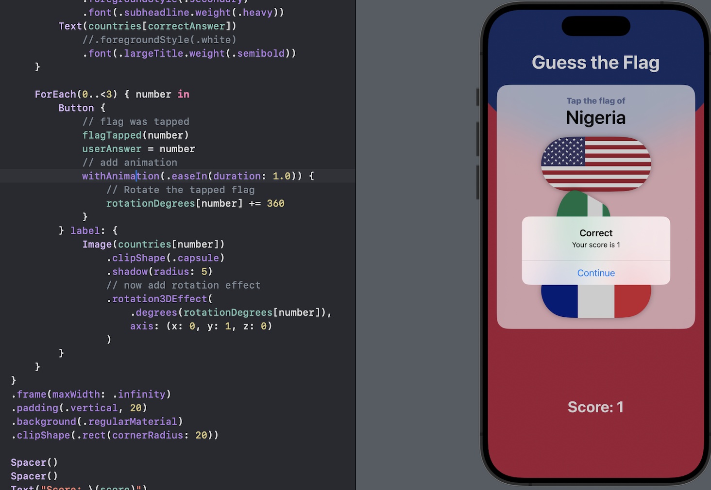
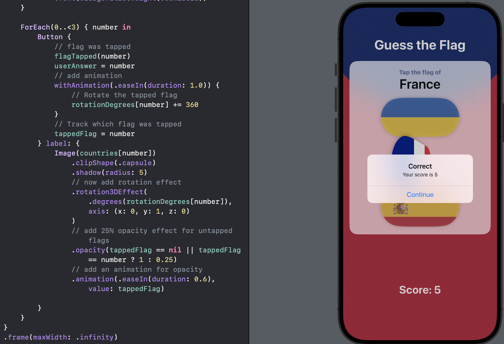
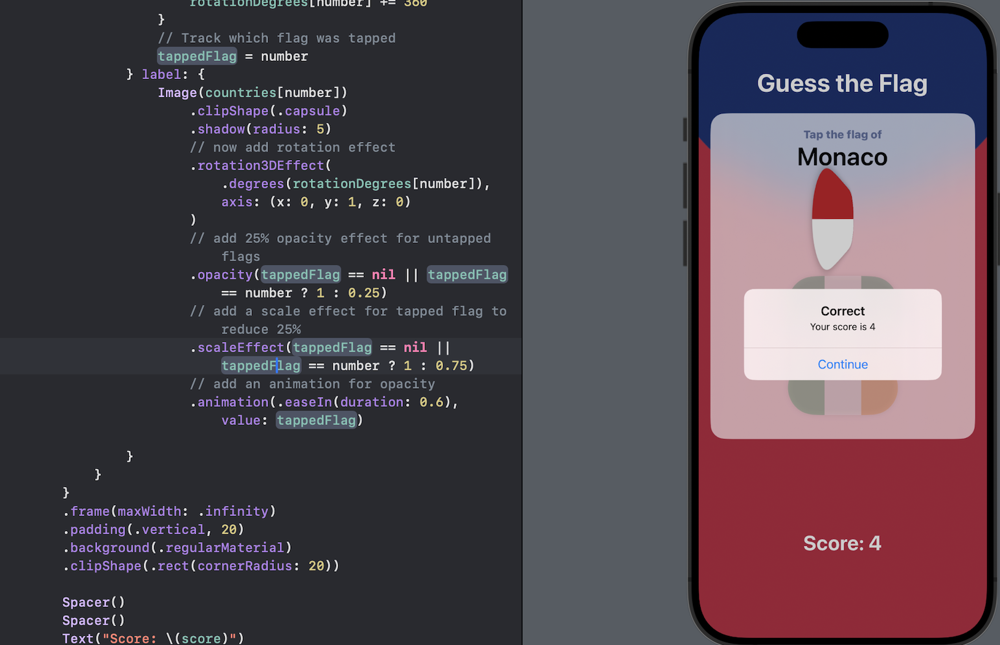

# Day 34 - Project 6, Part 3

## Animation: Wrap up

### Challenge

Go back to the Guess the Flag Project,

1. When we tap a flag, make it spin around 360 degrees on the Y axis.
   
   

2. Make the other two buttons fade out to 25% opacity.
   
   

3. Add a third effect of our choosing to the two flags the user did not choose - maybe make them scale down by 25%.
   
   

