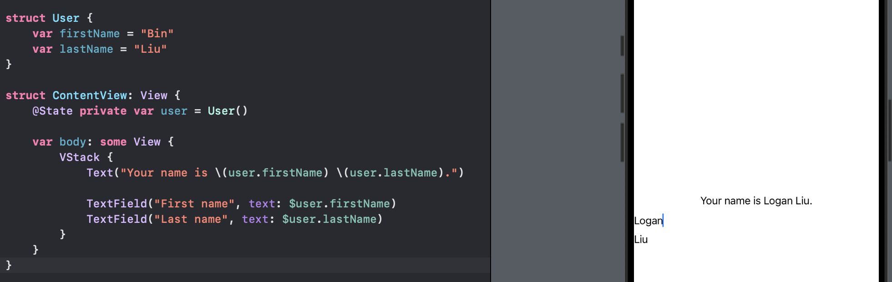
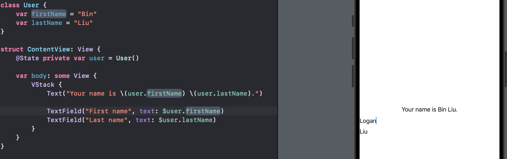
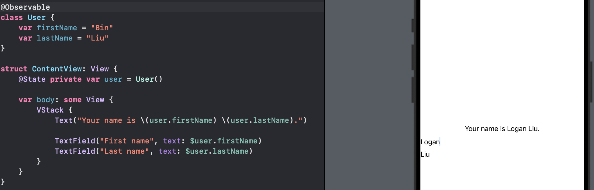
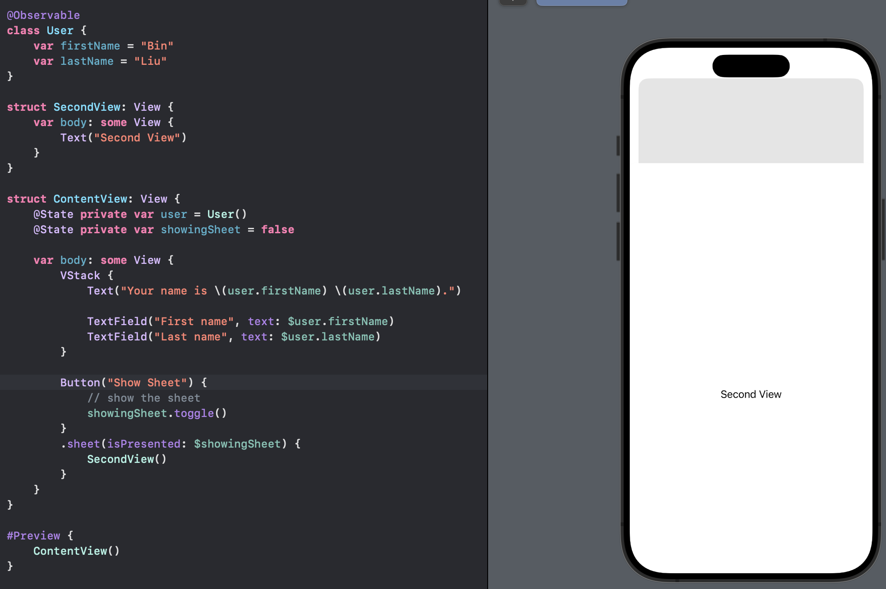
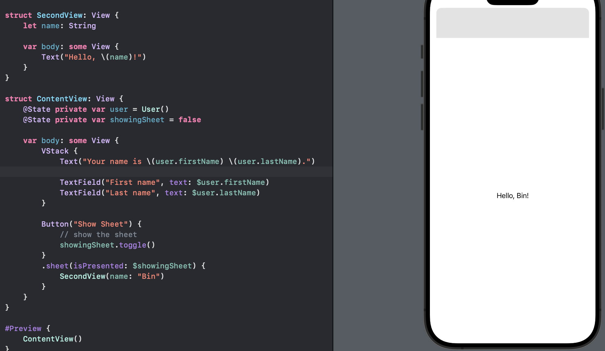
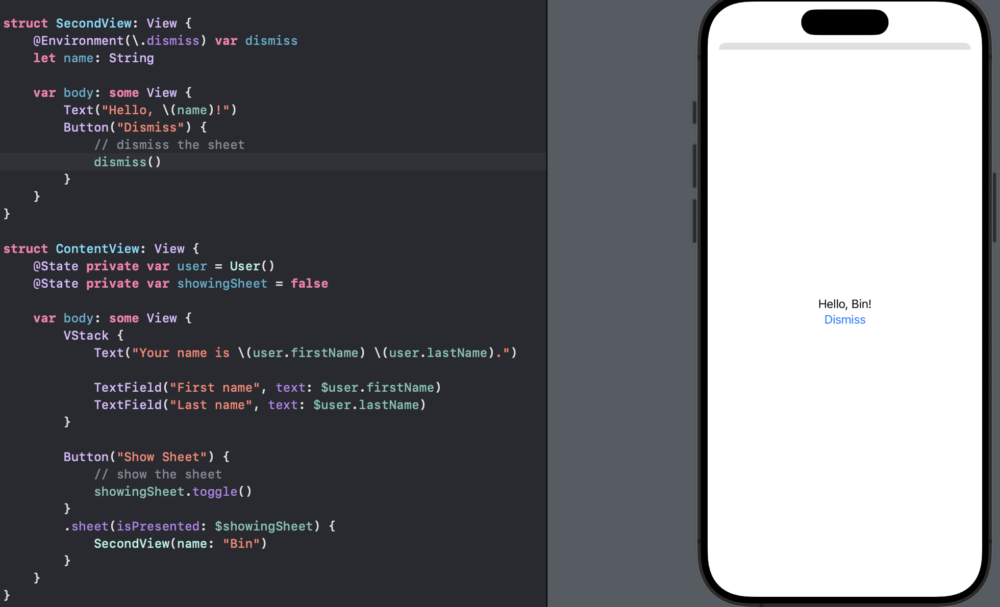
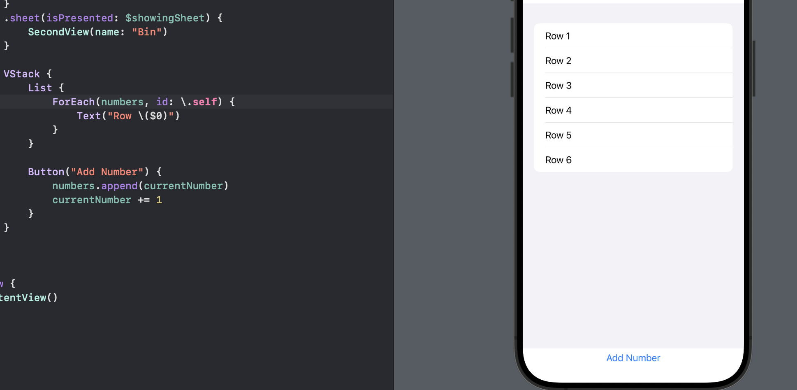
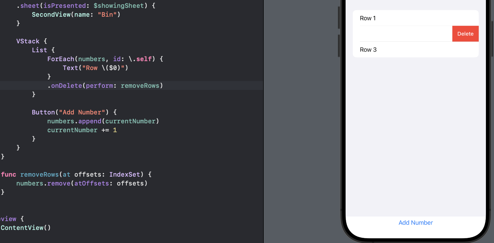
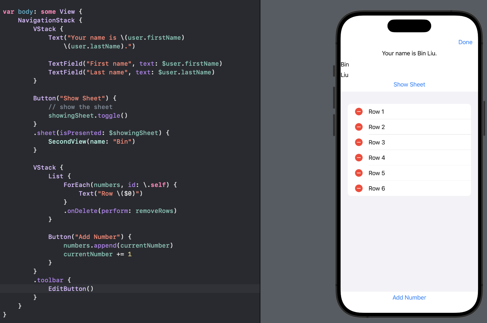
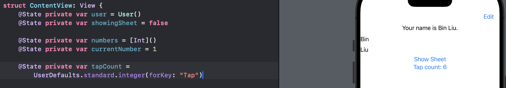

# Day 36 - Project 7, Part 1

## iExpense: Introduction

In this project we will build iExpense, which is an expense tracker that separates personal costs from business costs.

## Using @State with Classes

SwiftUI's `@State` property wrapper is designed for simple data that is local to the current view.

```swift
struct User {
    var firstName = "Bin"
    var lastName = "Liu"
}
```

We can now use that in a SwiftUI view by creating an `@State` property and attached things to `$user.firstName` and `$user.lastName`:

```swift
struct ContentView: View {
    @State private var user = User()

    var body: some View {
        VStack {
            Text("Your name is \(user.firstName) \(user.lastName).")

            TextField("First name", text: $user.firstName)
            TextField("Last name", text: $user.lastName)
        }
    }
}
```

In preview,



The `user` object contains all our data and will update the UI when either value changes.

Recall that structs always have unique owners, whereas with classes multiple things can point to the same value. 

In addition, classes don not need the `mutating` keyword before methods that change their properties, because we can change properties of constant classes. This means that if we have two SwiftUI views and we send them both the same struct to work with, they actually each have a unique copy of that struct; if one changes it, the other will NOT see that change. On the other hand, if we create an instance of a *class* and send that to both views, they *will* share changes.

For SwiftUI developers, that means that if we want to share data between multiple views - if we want two or more views to point to the same data so that when one changes they all get those changes - we need to use classes rather than structs.

If we change the `User` struct to be a class:

```swift
class User {
    var firstName = "Bin"
    var lastName = "Liu"
}
```

In preview,



Now changing in text field does not reflect in the top text view.

When we use `@State`, we ask SwiftUI to watch a property for changes. As the property has changed, SwiftUI will re-invoke the `body` property fo the view.

When `User` was a struct, every time we modified a property of that struct, Swift was actually creating a new instance of that struct. `@State` was able to spot that change, and automatically reloaded our view.

We need to use the `mutating` keyword for struct methods that modify properties. Classes do not need the `mutating` keyword because even if the class instance is marked as constant, Swift can still modify variable properties.


Now that `User` is a class the property itself is not changing, so `@State` does not notice anything and cannot reload the view. The value inside the class are changing but `@State` does not monitor those. 

We can fix this issue with one small change:

```swift
@Observable
class User {
    var firstName = "Bin"
    var lastName = "Liu"
}
```

and now it works again.



## Sharing SwiftUI State with @Observable

- A SwiftUI view will update automatically when a value changes by using `@State` with a struct.

- A SwiftUI class must be marked with `@Observable` if we want SwiftUI to watch its contents for changes with `@State`.

```swift
@Observable
class User {
    var firstName = "Bin"
    var lastName = "Liu"
}
```

The `@Observable` tells SwiftUI to watch each individual property inside the class for changes, and reloads any view that relies on a property when it changes.

Add another `import` next to `import SwiftUI`:

```swift
import Observation
```

The `@Observable` is a *macro*, which is Swift's way of quietly rewriting our code to add extra functionality.

Now that we have imported the framework it comes from, Xcode can expand `@Observable` by right-clicking and choosing "Expand Macro" to see what rewriting is happening:

1. Our two string properties are marked `@ObservationTracked`.

2. If we right-click on `@ObservationTracked`, we can expand that macro too. This macro has the job of tracking whenever any property is read or written, so that SwiftUI can update only views that absolutely need to be refreshed.

3. Our class is made to conform to the `Observable` protocol.

iOS keeps track of every SwiftUI view that reads properties from an `@Observed` object, so that when a property changes it can intelligently update all the views that depend on it while leaving the others unchanged.


## Showing and Hiding Views

One of the most basic way to show views in SwiftUI is a *sheet*: a new view presented on top of our existing one.

On iOS this automatically gives us a card-like prensetation where the current view slides away into the distance a little and the new view animates in on top.

We will define the *conditions* under which a sheet should be shown, and when those conditions become true or false the sheet will either be presented or dismissed respectively.

For example, we start with a simple view using a sheet:

```swift
struct SecondView: View {
    var body: some View {
        Text("Second View")
    }
}
```

Next we will create our initial view, which will show the second view:

```swift
struct ContentView: View {
    var body: some View {
        Button("Show Sheet") {
            // show the sheet
        }
    }
}
```

There are four steps to fully implement this function. First, we need to track whether the sheet is showing and add this `@State` property to `ContentView`:

```swift
@State private var showingSheet = false
```

Second, we need to toggle that when our button is tapped:

```swift
Button("Show Sheet") {
    showingSheet.toggle()
}
```

Third, we need to attach our sheet to our view hierarchy. In previous days, we used to show alerts using `isPresented` with a two-way binding to our state property, and here we use similar method: `sheet(isPresented:)`.

`sheet()` is a modifier just like `alert()`, so we can add this modifier to out button now:

```swift
Button("Show Sheet") {
    showingSheet.toggle()
}
.sheet(isPresented: $showingSheet) {
    // contents of the sheet
}
```

Fourth, we need to decide what should actually be in the seet. In our case, we want to create and show an instance of `SecondView`.

Hence, the finished `ContentView` struct should look like this:

```swift
struct ContentView: View {
    @State private var showingSheet = false

    var body: some View {
        Button("Show Sheet") {
            // show the sheet
            showingSheet.toggle()
        }
        .sheet(isPresented: $showingSheet) {
            SecondView()
        }
    }
}
```

In preview,



We can see that our second view slide upwards from the bottom when we tap the button, and then we can drag that down to dismiss it.

When we create a view, we can pass in any parameters it needs to work. For example,

```swift
struct SecondView: View {
    let name: String

    var body: some View {
        Text("Hello, \(name)!")
    }
}
```

Now if we pass in a name string to the `SecondView`, we can display the name in our second view.

In preview,



One last thing is to make a view dismiss itself. To dismiss another view, we need another property wrapper called `@Environment`, which allows us to create properties that store values provided to us externally.

To try this wrapper, we will create a property called `dismiss` based on a value from the environment in `SecondView`:

```swift
struct SecondView: View {
    @Environment(\.dismiss) var dismiss
    let name: String

    var body: some View {
        Text("Hello, \(name)!")
    }
}
```

Then we will replace the text view in `SecondView with the following button:

```swift
Button("Dismiss") {
    dismiss()
}
```

Now we can show and hide the sheet using button presses:



## Deleting Items Using onDelete()

SwiftUI gives us the `onDelete()` modifier for us to use to control how objects should be deleted from a collection.

In practice, this is almost exclusively used with `List` and `ForEach`. We create a list of rows that are shown using `ForEach`, and then attach `onDelete()` to that `ForEach` so that user can remove rows they do not want.

For example, we will create a list that shows numbers, and every time we tap the buton a new number appears:

```swift
struct ContentView: View {
    @State private var numbers = [Int]()
    @State private var currentNumber = 1

    var body: some View {
        VStack {
            List {
                ForEach(numbers, id: \.self) {
                    Text("Row \($0)")
                }
            }

            Button("Add Number") {
                numbers.append(currentNumber)
                currentNumber += 1
            }
        }
    }
}
```

In preview,



The `ForEach` is not really needed - the list is made up of entirely dynamic rows, so we could write:

```swift
List(numbers, id: \.self) {
    Text("Row \($0)")
}
```

However, the `onDelete()` modifier only exists on `ForEach`, so if we want users to delete items from a list we must put the items inside a `ForEach`.

To make `onDelete()` work, we need to implement a method that will receive a single parameter of type `IndexSet`, which tells us the positions of all the items in the `ForEach` that should be removed.

Because our `ForEach` was created entirely from a single array, we can actually pass that index set straight to our `numbers` array - it has a special `remove(atOffsets:)` method that accepts an index set. Hence, we need to add the following method to `ContentView`:

```swift
func removeRows(at offsets: IndexSet) {
    numbers.remove(atOffsets: offsets)
}
```

Then we can tell SwiftUI to call that method when it wants to delete data from the `ForEach`:

```swift
List {
    ForEach(numbers, id: \.self) {
        Text("Row \($0)")
    }
    // add here
    .onDelete(perform: removeRows)
}
```

In preview,



SwiftUI has another trick: we can add an "Edit/Done" button to the navigation bar, that lets users delete several rows more easily. We just need to wrap our `VStack` in a `NavigationStack`, then add the `.toolbar` to the VStack:

```swift
struct ContentView: View {
    @State private var numbers = [Int]()
    @State private var currentNumber = 1

    var body: some View {
        NavigationStack {
            VStack {
                List {
                    ForEach(numbers, id: \.self) {
                        Text("Row \($0)")
                    }
                }

                Button("Add Number") {
                    numbers.append(currentNumber)
                    currentNumber += 1
                }
            }
            .toolbar {
                EditButton()
            }
        }
    }
}
```

In preview,



## Storing User Settings with UserDefaults

One common way to store a small amount of data is called `UserDefaults`, and it is great for simple user preferences. Everything we store in `UserDefaults` will automatically be loaded when our app launches - if we store a lot in there our app launch will slow down.

An ideal amount we should aim is to store no more than 512KB in `UserDefaults`.

To start with,

```swift
struct ContentView: View {
    @State private var tapCount = 0

    var body: some View {
        T
    }
}
```

To save the number of taps that user made so when they come back to the app in the future they can pick up where thye left off, we need to write to `UserDefaults` inside our button's action closure:

```swift
Button("Tap count: \(tapCount)") {
    tapCount += 1
    // add here
    UserDefaults.standard.set(tapCount, forKey: "Tap")
}
```

In preview,


`UserDefaults.standard.set(tapCount, forKey: "Tap")` means

- `UserDefaults.standard` is the built-in instance of `UserDefaults` that is attached to our app, but in more advanced apps we can create our own instances.

- The `set()` method accepts any kind of data.

- We attach a string name to this data called "Tap". We need to use the same key to read the data back out of `UserDefaults`.

Speaking of reading the data back, rather than start with `tapCount` set to 0, we should instead make it read the value back from `UserDefaults`:

```swift
@State private var tapCount = UserDefaults.standard.integer(forKey: "Tap")
```

We need to ensure it reads the same key name. Now the app can store the `tapCount`:



If we do not have the "Tap" key set, this is the case where the very first time the app is run. If the key cannot be found, it just sends back 0.

If we quickly tap the button and relaunch the app from Xcode, we see that our most recent tap count was not saved.

SwiftUI provides an `@AppStorage` property wrapper around `UserDefaults`. It allows us to effectively ignore `UserDefaults` entirely, and just use `@AppStorage` rather than `@State`:

```swift
struct ContentView: View {
    @AppStorage("tapCount") private var tapCount = 0

    var body: some View {
        Button("Tap count: \(tapCount)") {
            tapCount += 1
        }
    }
}
```

Now,

- Our access to the `UserDefaults` system is through the `@AppStorage` property wrapper. This works like `@State`: when the value changes, it will reinvoked the `body` property so our UI reflects the new data.

- We attach a string name, which is the `UserDefaults` key where we want to store the data.

- The rest of the property is declared as normal, including providing a default value of 0. That will be used if there is not existing value saved inside `UserDefaults`.

**IMPORTANT:** When it comes to submitting an app to the App Store, Apple asks that we let them know why we are loading and saving data using `UserDefaults`. This also applies to the `@AppStorage` property wrapper.

## Archiving Swift Objects with Codable

`@AppStorage` is great for storing simple settings such as integers and Booleans, but when it comes to complex data - custom Swift types - We need to do a little more work. This is where we need to poke around directly with `UserDefaults` itself, rather than going through the `@AppStorage` property wrapper.

For example, a simple `User` data structure

```swift
struct User {
    let firstName: String
    let lastName: String
}
```

When working with data like this, Swift gives us a protocol called `Codable` - a protocol specifically for *archiving* and *unarchiving* data, which is a fancy way of saying "converting objects into plain text and back again."

In this example, we want to archive a custom type so we can put it into `UserDefaults`, then unarchive it when it comes back *out* from `UserDefaults`.

When working with a type that only has simple properties, the only thing we need to support archiving and unarchiving is add a conformance to `Codable`:

```swift
struct User: Codable {
    let firstName: String
    let lastName: String
}
```

Swift will automatically generate some code for us that will archive and unarchive `User` instances for us as needed, and we still need to tell Swift *when to archive* and *what to do* with the data.

This process is powered by `JSONEncoder`, whose job is to take something that conforms to `Codable` and send back that object in JavaScript Object Notation (JSON).

The `Codable` protocol does not require that we use JSON but it is by far the most common. In this instance, we do not care *what data is used*, because it will be stored in `UserDefaults`.

To convert our `user` data into JSON data, we need to call the `encode()` method on a `JSONEncoder`, which might throw errors, so it should be called with `try` or `try?` to handle errors neatly.

```swift
struct User: Codable {
    let firstName: String
    let lastName: String
}

struct ContentView: View {
    @State private var user = User(firstName: "Bin", lastName: "Liu")

    var body: some View {
        Button("Save User") {
            let encoder = JSONEncoder()

            if let data = try? encoder.encode(user) {
                UserDefaults.standard.set(data, forKey: "UserData")
            }
        }
    }
}
```

This accesses `UserDefaults` directly rather than going through `@AppStorage`, because the `@AppStorage` property wrapper does not work here.

When we have JSON data and want to convert it to Swift `Codable` type, we should use `JSONDecoder` and the then the rest of the process is pretty much the same.


