# Day 37 - Project 7, Part 2

Recall:

- `@Observable` watches classes for changes and refreshes any views that are affected.

- `sheet()` watches a condition we specify and shows or hides a view automatically.

- `Codable` converts Swift objects into JSON and back with almost no code from us.

- `UserDefaults` reads and writes data so that we can save settings and more instantly.

## Building a List We Can Delete from

In this project we want a list can show some expenses. Previously we used to do this using an `@State` array of objects. Here, we will create an `Expenses` class that will be attached to our list using `@State`.

First we need to decide *what an expense is*:

- name of the item,

- whether it is business or personal

- its cost

```swift
struct ExpenseItem {
    let name: String
    let type: String
    let amount: Double
}
```

Next we will create and store an array of those expense items inside a single object. This needs to use the `@Observable` macro so it can be watched by SwiftUI. As with the `ExpenseItem` struct, this will start of simple and we will add to it later, so now we can add this new class as the following:

```swift
@Observable
class Expenses {
    var items = [ExpenseItem]()
}
```

That finishes all the data required for our main view:

- a struct to represent a single item of expense,

- a class to store an array of all those items.

Most of our view will be a `List` showing the items in our expenses, but because we want users to delete items they no longer want we cannot just use a simple `List` - we need to use a `ForEach` inside the list, so we can get access to the `onDelete()` modifier.

```swift
struct ContentView: View {
    @State private var expenses = Expenses()

    var body: some View {
        NavigationStack {
            List {
                ForEach(expenses.items, id: \.name) { item in
                    Text(item.name)
                }
            }
            .navigationTitle("iExpense")
        }
    }
}
```

This tells the `ForEach` to identify each expense item uniquely by its name, then prints the name out as the list row.

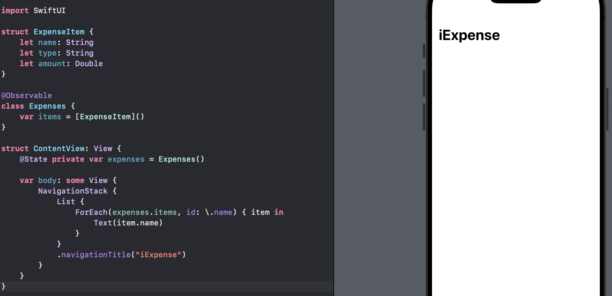

Remember: using `@State` keeps the object alive, but it is the `@Observable` macro that actually gives SwiftUI the power to watch the object for any changes.

Next, we will let users add their own items but it is important to check that our list actually works well before we continue. Hence, we will add a toolbar button that adds example `ExpenseItem` instances for us to work with:

```swift
List {
    ForEach(expenses.items, id: \.name) { item in
        Text(item.name)
    }
}
.navigationTitle("iExpense")
// add here
.toolbar {
    Button("Add Expense", systemImage: "plus") {
        let expense = ExpenseItem(name: "Test", type: "Personal", amount: 5)
        expenses.items.append(expense)
    }
}
```

In preview,

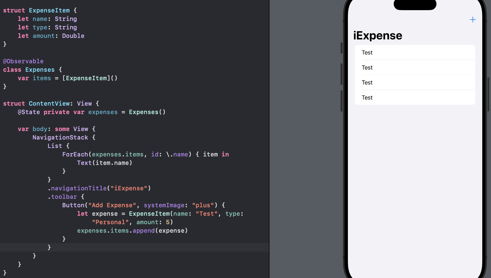

Now that we can add expenses, we can also add code to remove them. This means adding a method capable of deleting an `IndexSet` of list items, then passing that directly on to our `expenses` array:

```swift
func removeItems(at offsets: IndexSet) {
    expenses.items.remove(atOffsets: offsets)
}
```

and then to attach that to SwiftUI, we add an `onDelete()` modifier to our `ForEach`:

```swift
List {
    ForEach(expenses.items, id: \.name) { item in
        Text(item.name)
    }
    .onDelete(perform: removeItems)
}
.navigationTitle("iExpense")
// add here
.toolbar {
    Button("Add Expense", systemImage: "plus") {
        let expense = ExpenseItem(name: "Test", type: "Personal", amount: 5)
        expenses.items.append(expense)
    }
}
```

In preview,

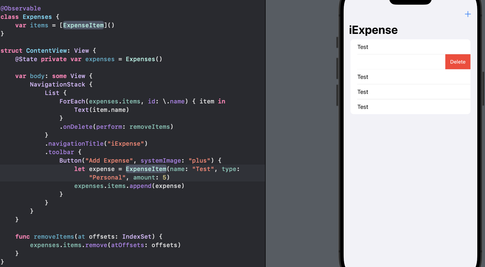

Remember: when we say `id: \.name`, we are saying we can identify each item uniquely by its name, which is not be true since we can have the same name multiple times (just like we have mutiple "Test" items here, and we cannot guarantee our expenses will be unique either.

## Working with Identifiable Items in SwiftUI

When we create static views in SwiftUI - when we hard-code a `VStack`, then a `TextField`, then a `Button`, and so on - SwiftUI can see exactly which views we have, and is able to control them, animate them, and more.

However, when we use `List` or `ForEach` to make dynamic views, SwiftUI needs to know how it can identify each item uniquely otherwise it will struggle to compare view hierachies to figure out what has changed.

In our current setup, we have:

```swift
ForEach(expenses.items, id: \.name) { item in
    Text(item.name)
}
.onDelete(perform: removeItems)
```

This means "create a new row for every item in the expense items, identified uniquely by its name, showing that name in the row, and calling the `removeItems()` method to delete it."

Then, we defined a button to add expense items:

```swift
Button("Add Expense", systemImage: "plus") {
    let expense = ExpenseItem(name: "Test", type: "Personal", amount: 5)
    expenses.items.append(expense)
}
```

Every time that button is pressed, it adds a test expense to our list, so we can make sure adding and deleting works.

Hoever, every time we create an example expense item, we keep using the name "Test", but we also told SwiftUI that it can use the expense name as a unique identifier.

In this situation we are lucky because `List` knows exactly which row we are swiping on, but our app will start to behave strangely in other situations.

We need to add something to `ExpenseItem` that is unique, such as an ID number that we can assign. To do that we will use **UUID** - short for "universally unque identifier". UUIDs are long hexadecimal strings. Now we could update `ExpenseItem` to have a `UUID` property:

```swift
struct ExpenseItem {
    let id = UUID() // generate on call
    let name: String
    let type: String
    let amount: Double
}
```

Then we can fix our `ForEach`:

```swift
ForEach(expenses.items, id: \.id) { item in
    Text(item.name)
}
.onDelete(perform: removeItems)
```

In preview,

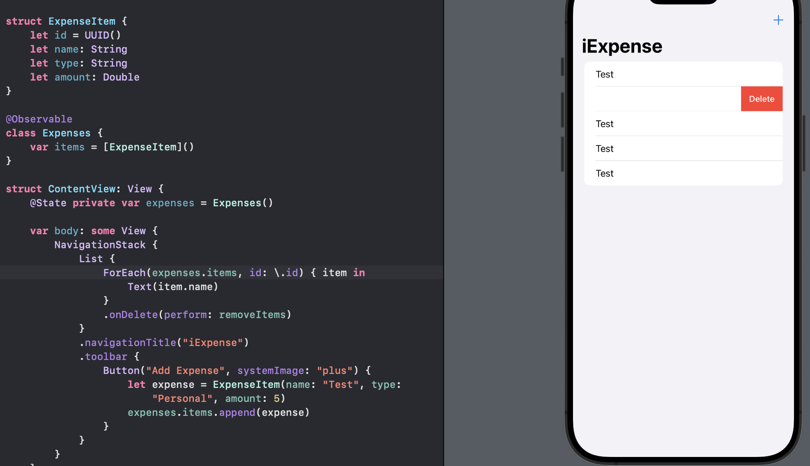

We still need to modify the `ExpenseItem` to make it conform to a new protocol called `Identifiable`:

```swift
struct ExpenseItem: Identifiable {
    let id = UUID()
    let name: String
    let type: String
    let amount: Double
}
```

This is one of the protocols built into Swift, meaning "this type can be identified uniquely." It has only one requirement, which is that there must be a property called `id` that contains a unique identifier.

The reason why we need to add `Identifiable` is that our expense items are now guaranteed to be identifiable uniquely, we no longer need to tell `ForEach` which property to use for the identifier - it knows there will be an `id` property and that it will be unique, because that is the point of the `Identifiable` protocol.

Therefore, as a result of this change, we can now modify the `ForEach` again:

```swift
// no need for `id: \.id`
ForEach(expenses.items) { item in
    Text(item.name)
}
.onDelete(perform: removeItems)
```

In preview,

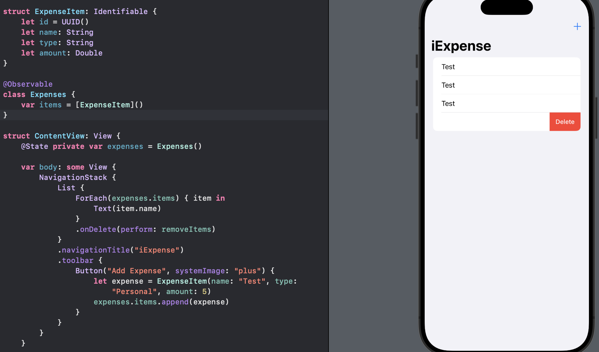


## Sharing an Observed Object with a New View

Classes that use `@Observable` can be used in more than one SwiftUI view, and all of those views will be updated when the properties of the class change.

In this app, we will design a view specially for adding new expense items. When the user is ready, we will add that to our `Expenses` class, which will automatically cause the orignal view to refresh its data so the expense item can be shown.

To make a new SwiftUI view, we can either press Command+N or go to the File menu and choose New > File, and then Select "SwiftUI View" under the User Interface category. We will name the file `AddView.swift`. We will save the this inside the "iExpense" folder.

In the new created `AddView.swift`, we will add text fields for the expense name and amount, plus a picker for the type, all wrapped up in a form and a navigation stack:

```swift
struct AddView: View {
    @State private var name = ""
    @State private var type = "Personal"
    @State private var amount = 0.0

    let types = ["Business", "Personal"]

    var body: some View {
        NavigationStack {
            Form {
                TextField("Name", text: $name)

                Picker("Type", selection: $type) {
                    ForEach(types, id: \.self) {
                        Text($0)
                    }
                }

                TextField("Amount", value: $amount, format: .currency(code: "USD"))
                    .keyboardType(.decimalPad)
            }
            .navigationTitle("Add new expense")
        }
    }
}
```

In preview,

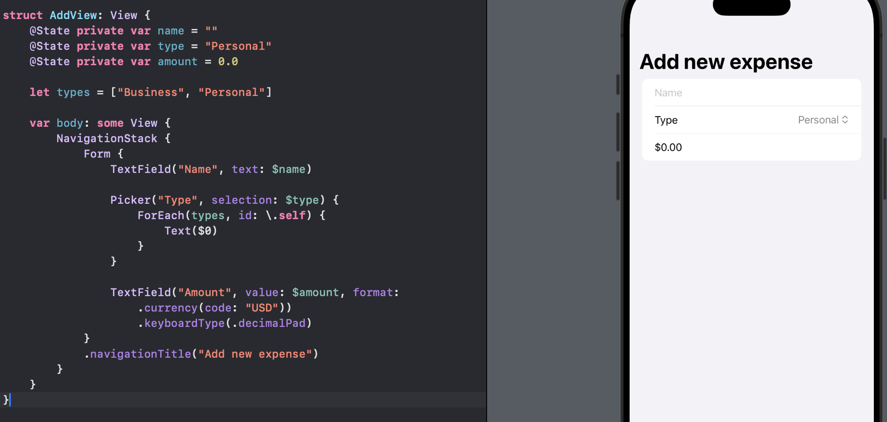

Next, we will add some code to `ContentView` so we can show `AddView` when the "+" button is tapped.

First, we need some state to track whether or not `AddView` is being shown:

```swift
@State private var showingAddExpense = false
```

Next, we need to tell SwiftUI to use that Boolean as a condition for showing a sheet - a pop-up window. This is done by attaching the `sheet()` modifier to the `NavigationStack`. We could also use the `List` but `NavigationStack` works well here.

```swift
NavigationStack {
    // views
}
.sheet(isPresented: $showingAddExpense) {
    // show an Addview here
    AddView()
}
```

We already have the `expenses` property in our content view, and inside `AddView` we will write code to add expense items. We do NOT want to create a *second* instance of the Expenses class in `AddView`, but instead want it to share the existing instance from `ContentView`. Therefore, we will add a property to `AddView` to store an `Expenses` object:

```swift
var expenses: Expenses
```

And now we can pass our existing `Expenses` object from one view to another - they will both monitor it for changes. We need to modifer the `sheet()` modifier in `ContentView`:

```swift
NavigationStack {
    // views
}
.sheet(isPresented: $showingAddExpense) {
    // show an Addview here
    AddView(expenses: expenses)
}
```

Our code will not compile for now because our button does not trigger the sheet.

We need to change the `#Preview` in `AddView`:

```swift
#Preview {
    AddView(expenses: Expenses())
}
```

Finally, we need to modify our code so that the "+" button adds an `AddView`:

```swift
Button("Add Expense", systemImage: "plus") {
    showingAddExpense.toggle()
}
```

In preview,

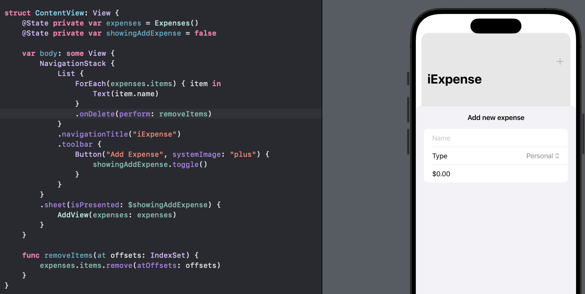

## Making Changes Permanent with UserDefaults

In the current app setup, any data placed into `AddView` is completely, and even if it were not ignored then it still would not be saved for future times the app is run.

In the `AddView`, we have already had properties that store the values from our form, and previously we added a property to store an `Expenses` object passed in from the `ContentView`.

What we need is a button that creates an `ExpenseItem` out of our properties and adds it to the `expenses` items when tapped. Hence, we will add this modifier below `navigationTitle()` in `AddView`:

```swift
.toolbar {
    Button("Save") {
        let item = ExpenseItem(name: name, type: type, amount: amount)
        expenses.items.append(item)
    }
}
```

In preview,

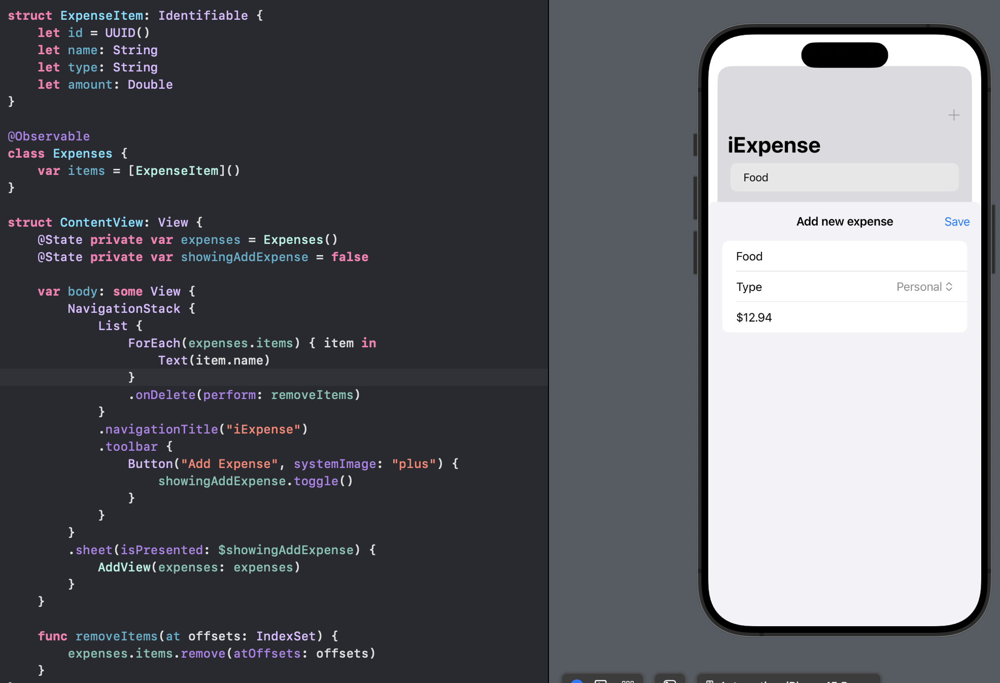

Now we can show the add view, enter some details, press "Save", then swipe to dismiss. This means our data synchronization is working properly.

However, if we relaunch the app again, any data we used to add there is not stored.

To fix this issue, we will leverage four important features to help us save and load data in a clean way:

- The `Codable` protocol, which allows us to achieve all the existing expense items ready to be stored.

- `UserDefaults`, which lets us save and load that archived data.

- A custom initializer for the `Expense` class, so that when we make an instance of it we load any saved data from `UserDefaults`.

- A `didSet` property observer on the `items` property of `Expenses`, so that whenever an item gets added or removed we will write out changes.


First, in the `Expenses` class, we have an `items` property:

```swift
@Observable
class Expenses {
    var items = [ExpenseItem]()
}
```

This is where we store all the expense item structs that have been created, and that is also where we will attach our property observer to write out changes as they happen. Next, we will create an instance of `JSONEncoder` that will do the work to convert our data to JSON, encode our `items` array, and then write that to `UserDefaults` using the key `"Items"`.

Therefore, we will modify as the following:

```swift
@Observable
class Expenses {
    var items = [ExpenseItem]() {
        didSet {
            if let encoded = try? JSONEncoder().encode(items) {
                UserDefaults.standard.set(encoded, forKey: "Items")
            }
        }
    }
}
```

NOTE: Using `JSONEncoder().encode()` means "create an encoder and use it to encode something," all in one step, rather than creating the encoder first then using it later.

The `encode()` method can only archive objects that conform to the `Codable` protocol. Conforming to `Codable` is what asks the compiler to generate code for us able to handle archiving and unarchiving objects, and if we do not add a comformance for that then our code will not build.

Therefore, what we need to do is to add `Codable` to `ExpenseItem`:

```swift
struct ExpenseItem: Identifiable, Codable {
    let id = UUID()
    let name: String
    let type: String
    let amount: Double
}
```

However, we still have an issue:

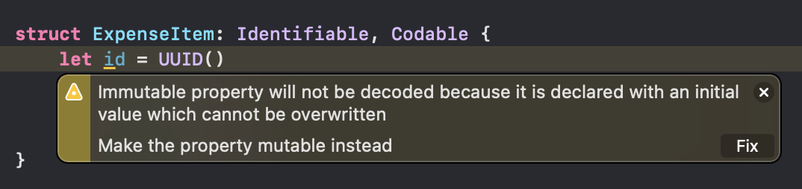

What we need to do is make the property be a variable instead of a constant:

```swift
struct ExpenseItem: Identifiable, Codable {
    var id = UUID()
    let name: String
    let type: String
    let amount: Double
}
```

With that change, we have written all the code needed to make sure our items are saved when the user adds them.

However, the data might be saved, but it is not loaded again when the app relaunches.

To solve this, we need to implement a custom initializer, which will:

- Attempt to read the `"Items"` key from `UserDefaults`.

- Create an instance of `JSONEncoder`, which is the counterpart of `JSONEncoder` that lets us go from JSON data to Swift objects.

- Ask the decoder to convert the data we received from `UserDefaults` into an array of `ExpenseItem` objects.

- If that worked, assign the resulting array to `items` and exit.

- Otherwise, set `items` to be an empty array.

We will add an initializer to the `Expenses` class:

```swift
@Observable
class Expenses {
    var items = [ExpenseItem]() {
        didSet {
            if let encoded = try? JSONEncoder().encode(items) {
                UserDefaults.standard.set(encoded, forKey: "Items")
            }
        }
    }

    // add an initializer
    init() {
        if let savedItems = UserDefaults.standard.data(forKey: "Items") {
            if let decodedItems = try? JSONDecoder().decode([ExpenseItem].self, from: savedItems) {
                items = decodedItems
                return
            }
        }
        
        items = []
    }
}
```

Key parts:

- `data(forKey: "Items")` - attempts to read whatever is in `"Items"` as a `Data` object.

- `try? JSONDecoder().decode([ExpenseItem].self, from: savedItems)` - unarchives the `Data` object into an array of `ExpenseItem` objects.


What does the `.self` mean here? If we had just used `[ExpenseItem]`, Swift would want to know what we mean - are we trying to make a copy of the class? Were we planning to reference a static property or method? Did we perhaps mean to create an instance of the class? **To avoid confusion - to say that we mean we are referring to the type itself, known as the *type object* - we write `.self` after it.**

## Final Polish

If we run the app, it has two main issues:

- Adding an expense does not dismiss `AddView`; it just stays there.

- When we add an expense, we cannot actually see any details about it.

First, to dismiss `AddView`, we can call `dismiss()` on the environment. This is controlled by the view's environment, and links to the `isPresented` parameter for our sheet - that Boolean gets set to true by us to show `AddView`, but will be set to false by the environment when we call `dismiss()`.

We start by adding the following property to the `AddView` struct:

```swift
@Environment(\.dismiss) var dismiss
```

Notice that we do not specify a type for that - Swift can figure out thanks to the `@Environment` property wrapper.

Next, we need to call `dismiss()` when we want the view to dismiss itself. This causes the `showingAddExpense` Boolean in `ContentView` to go back to false, and hides the `AddView`.

We have a `Save` button in `AddView` that creates a new expense item and appends it to our existing expenses, so we can add `dismiss()` directly after that:

```swift
.toolbar {
    Button("Save") {
        let item = ExpenseItem(name: name, type: type, amount: amount)
        expenses.items.append(item)
        // add dismiss here
        dismiss()
    }
}
```

This solves our first issue to dismiss the `AddView` when we save an expense.

To solve our second issue, we need to understand that the `ForEach` right now only displays the name of each expense item.

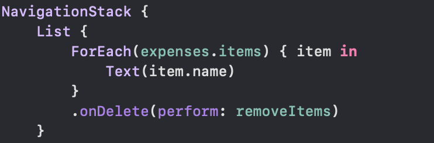

We will replace that with a stack within another stack to make sure all the information looks good on screen:

```swift
ForEach(expenses.items) { item in
    HStack {
        VStack(alignment: .leading) {
            Text(item.name)
                .font(.headline)
            Text(item.type)
        }
        Spacer()
        Text(item.amount, format:.currency(code: "USD"))
    }
}
```

In preview,

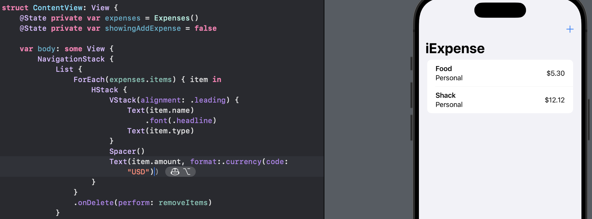


