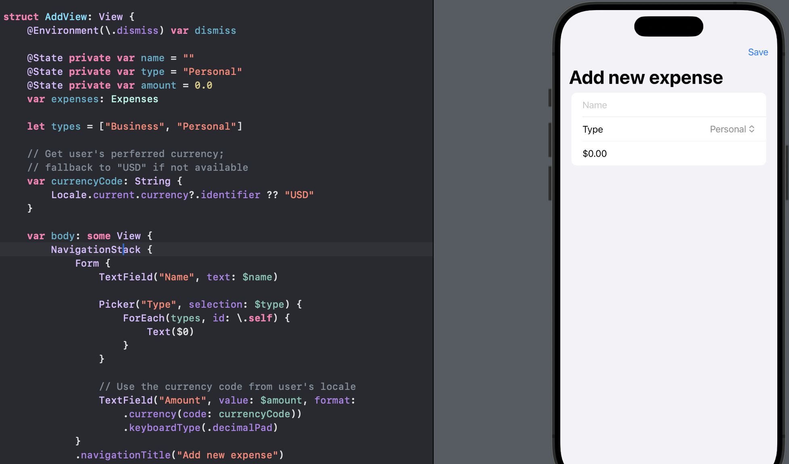
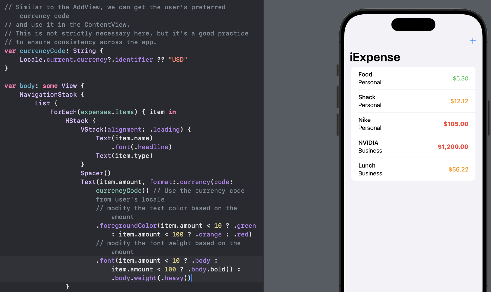
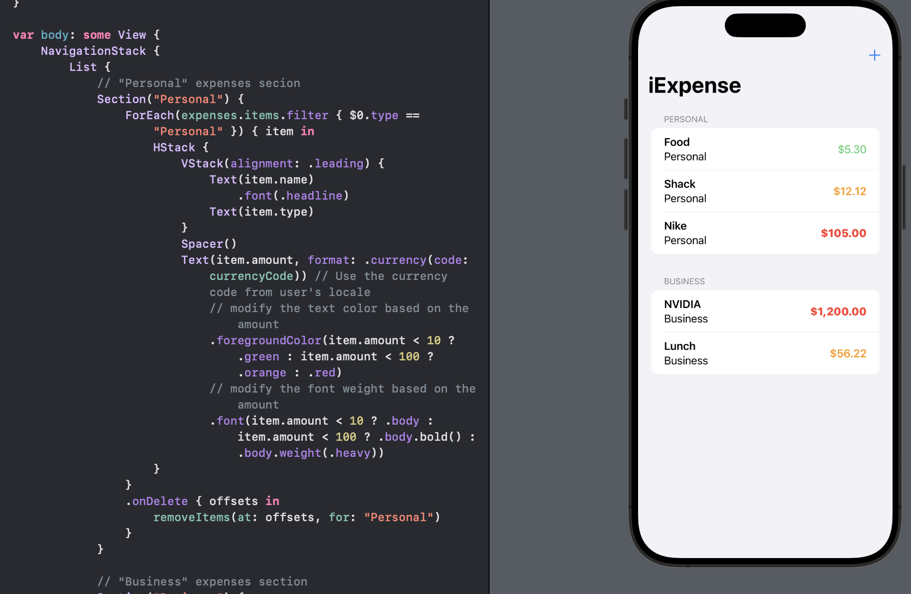

# Day 38 - Project 7, Part 3

## iExpense: Wrap up

We covered

- `UserDefaults`

- `Codable`

- `sheet()`

- `onDelete()`

- `@Observable`

## Challenge

1. Use the user's preferred currency, rather than always using US dollars.
   
   

2. Modify the expense amounts in `ContentView` to contain some styling depending on their value - expenses under \$10 should have one style, expenses under \$100 another, and expenses over \$100 a third style.
   
   

3. Try splitting the expenses list into two sections: one for personal expenses, and one for business expenses.
   
   

