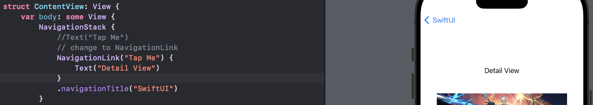

# Day 39 - Project 8, Part 1

## Moonshot: Introduction

In this project we will build an app that lets users learn about the missions and astronauts that formed NASA's Apollo space program.

## Resizing Images to Fit the Available Space

We will drag an image into the `Assets.xcassets` in our project, and then draw that image on the screen:

```swift
struct ContentView: View {
    var body: some View {
        Image("Archer")
    }
}
```

In preview,


When we use fixed image names like this one, Xcode generates constant names for them all that we can use in place of strings. In this case, we can also write `Image(.archer)`, which is much safer than using a string.

We can see that the image is too big in the preview. We can use the `frame()` modifier to scale it down:

```swift
Image(.archer)
    .frame(width: 300, height: 300)
```

This will NOT work as our image still appears to be its full size. When we change Xcode's preview mode from Live to Selectable. We see that our image is full size, but there is a box that is 300x300, sat in the middle.


The *image view* has the correct frame size, but the *content* of the image is in its original size. To change the image, we need to do:

```swift
Image(.archer)
    .frame(width: 300, height: 300)
    .clipped()
```

In preview,


If we want the image *contents* to be resized too, we need to use the `resizable()` modifier:

```swift
Image(.archer)
    .resizable()
    .frame(width: 300, height: 300)
    .clipped()
```

In preview,


To fix the distorted content, we need to use `scaledToFit()` and `scaledToFill()` to resize the image proportionally.

- `scaledToFit()` - the entire image will fit inside the container even if the means leaving some parts of the view empty.
  
  ```swift
  Image(.archer)
      .resizable()
      .scaledToFit()
      .frame(width: 300, height: 300)
  ```


- `scaledToFill()` - the image view will have no empty parts even if that means some of our image lies outside the container.
  
  ```swift
  Image(.archer)
      .resizable()
      .scaledToFill()
      .frame(width: 300, height: 300)
  ```


All works great if we want fixed-sized images, but very often we want timages that automatically scale up to fill more of the screen in one or both dimensions.

Rather than forcing a specific frame, SwiftUI has a dedicated `containerRelativeFrame()` modifier that lets us get exactly the result we want. For example, we could make an image that is 80% the width of the screen:

```swift
Image(.archer)
    .resizable()
    .scaledToFit()
    .containerRelativeFrame(.horizontal) { size, axis in
        size * 0.8
    }
```

1. We want to give this image a frame relative to the *horizontal size* of its parent. We are not specifying a vertical size.

2. SwiftUI then runs a closure where we are given a `size` and an `axis`. For us the axis will be `.horizontal` because that is the one we are using. The `size` value will be the size of our container, which for this image is the full screen.

3. We need to return the size we want for this axis, so we are sending back 80% of the container's width.

In preview,


## How ScrollView Lets Us Work with Scrolling Data

Recall that `List` and `Form` let us create scrolling tables of data.

When it comes to scrolling *arbitrary data*, i.e., some views we created by hand, we need to turn to SwiftUI's `ScrollView`.

Scroll vies can scroll horizontally and vertically. When we place views inside scroll views, they automatically figure out the size of that content so users can scroll from one edge to the other.

For example, we could create a scrolling list of 10 text views:

```swift
ScrollView {
    VStack(spacing: 10) {
        ForEach(0..<10) {
            Text("Item \($0)")
                .font(.title)
        }
    }
}
```

In preview,


We can drag the scroll view around freely, and if we scroll to the bottom, `ScrollView` treats the safe area just like `List` and `Form` - their content goes *under* the home indicator, but they add some extra padding so the final views are fully visible.

In addition, to make the whole area scrollable, we should make the `VStack` take up more space while leaving the default center alignment intact:

```swift
ScrollView {
    VStack(spacing: 10) {
        ForEach(0..<10) {
            Text("Item \($0)")
                .font(.title)
        }
    }
    // add here
    .frame(maxWidth: .inifinity)
}
```

Now we can tap and drag anywhere within the `ScrollView` on the screen.

Next, when we add views to a scroll view, they get created immediately. For example, we can create a simple wrapper around the regular text view:

```swift
struct CustomText: View {
    let text: String

    var body: some View {
        Text(text)
    }

    init(_ text: String) {
        print("Create a new CustomText")
        self.text = text
    }
}
```

Now we can use that inside our `ForEach`:

```swift
ScrollView {
    VStack(spacing: 10) {
        ForEach(0..<10) {
            CustomText("Item \($0)")
                .font(.title)
        }
    }
    .frame(maxWidth: .inifinity)
}
```

In preview,


The result will lokk identical, but "Creating a new CustomText" printed 10 times in Xcode's log - SwiftUI will NOT wait until we scroll down to see them, it will create them immediately.

If we want to avoid this happening, we could call `LazyVStack` and `LazyHStack` to replace `VStack` and `HStack`. These can be used in the same way as regular stacks but will load their content on demand - they will NOT create views until they are actually shown, and so minimize the amount of system resources being used:

```swift
ScrollView {
    LazyVStack(spacing: 10) {
        ForEach(0..<10) {
            CustomText("Item \($0)")
                .font(.title)
        }
    }
    .frame(maxWidth: .inifinity)
}
```

It will only create the `CustomText` structs when they are acutally needed.

Note that lazy stacks always take up as much as room as is available in our layouts, whereas regular stacks take up only as much space as is needed. This setting stops lazy stacks having to adjust their size if a new view is loaded that wants more space.

Finally, we can make horizontal scrollviews by passing `.horizontal` as a parameter when we make our `ScrollView`:

```swift
ScrollView {
    LazyHStack(spacing: 10) {
        ForEach(0..<10) {
            CustomText("Item \($0)")
                .font(.title)
        }
    }
}
```

In preview,


## Pushing New Views onto the Stack Using NavigationLink

The `NavigationStack` shows a navigation bar at the top of our views, but also lets us push views onto a view stack. For example in Settings when we tap Wi-Fi or General, or in Messages App.

The view stack system is very different from the sheets we used previously. For example, we could start with a simple text view inside a navigation stack:

```swift
struct ContentView: View {
    var body: some View {
        NavigationStack {
            Text("Tap Me")
                .navivationTitle("SwiftUI")
        }
    }
}
```

In preview,


This is just a static text; not a button with any sort of action attached to it. We can make it so that when users tap on it we present them with a new view, and this is done using `NavigationLink`. To achieve this, we need to modify this code:

```swift
struct ContentView: View {
    var body: some View {
        NavigationStack {
            //Text("Tap Me")
            // change to NavigationLink
            NavigationLink("Tap Me") {
                Text("Detail View")
            }
            .navivationTitle("SwiftUI")
        }
    }
}
```

In preview,



Now the "Tap Me" looks like a button, and tapping it makes a new view slide in from the right saying "Detail View".

If we want something other than a simple text view as our label, we can use two trailing closures with out `NavigationLink`:

```swift
struct ContentView: View {
    var body: some View {
        NavigationStack {
            NavigationLink {
                Text("Detail View")
            } label: {
                VStack {
                    Text("This is the label")
                    Text("So is this!")
                    Image(systemName: "face.smiling")
                }
                .font(.largeTitle)
            }
            .navivationTitle("SwiftUI")
        }
    }
}
```

In preview,


Now we made a label out of several text views and an image.

Both `sheet()` and `NavigationLink` allow us to show a new view from the current one, but the way they do it is different:

- `NavigationLink` shows details about the user's selection, like we dig deeper into a topic.

- `sheet()` shows unrelated content, such as settings or a compose window.

The most common place we see `NavigationLink` is with a list:

```swift
struct ContentView: View {
    var body: some View {
        NavigationStack {
            List(0..<10) { row in
                NavigationLink("Row \(row)") {
                    Text("Detail \(row)")
                }
            }
            .navivationTitle("SwiftUI")
        }
    }
}
```

In preview,


We will see 10 list rows that can be tapped to show a detail view.

## Working with Hierarchical Codable Data

If we want to decode hierarchical data, such as JSON, the key is to create separate types for each level we have. As long as the data matches the hierarchy we asked for, `Codable` is capable of decoding everything with no further work from us.

For example,

```swift
Button("Decode JSON") {
    let input = """
    {
        "name": "Steph Curry",
        "address": {
            "street": "Chase Center",
            "city": "Oakland"
        }
    }
    """
}
```

This creates a string of JSON. We can build Swift structs that match it:

```swift
struct User: Codable {
    let name: String
    let address: Address
}


struct Address: Codable {
    let street: String
    let city: String
}
```

Then we can convert our JSON string to the `Data` type (which is what `Codable` works with), then decode that into a `User` instance:

```swift
let data = Data(input.utf8)
let decoder = JSONDecoder()


if let user = try? decoder.decode(User.self, from: data) {
    print(user.address.street)
}
```

In summary,

```swift
Button("Decode JSON") {
    let input = """
    {
        "name": "Steph Curry",
        "address": {
            "street": "Chase Center",
            "city": "Oakland"
        }
    }
    """

    let data = Data(input.utf8)
    let decoder = JSONDecoder()


    if let user = try? decoder.decode(User.self, from: data) {
        print(user.address.street)
    }
}

struct User: Codable {
    let name: String
    let address: Address
}


struct Address: Codable {
    let street: String
    let city: String
}
```

## How to Lay out Views in a Scrolling Grid

SwiftUI's `List` view is used to show scrolling rows of data. To show *columns* of data, we could use `LazyHGrid` for showing horizontal data, and `LazyVGrid` for showing vertical data.

Recall that the "lazy" part indicates that SwiftUI will automatically delay loading the views it contains until the moment they are needed.

To create a grid, we need to first define the rows or columns we want - we only define one of the two, depending on which grid we want. For example, if we have a vertically scrolling grid, then we might want our data laid out in three columns exactly 80 points wide by adding this property to our view:

```swift
let layout = [
    GridItem(.fixed(80)),
    GridItem(.fixed(80)),
    GridItem(.fixed(80))
]
```

Next, we will place our grid inside a `ScrollView`, along with as many items as we want. Each item we create inside the grid is automatically assigned a column in the same way that rows inside a list. For example, we could render 10 items inside our three-column grid:

```swift
ScrollView {
    LazyVGrid(columns: layout) {
        ForEach(0..<10) {
            Text("Item \($0)")
        }
    }
}
```

In preview,


Grids have ability to work across a variety of screen sizes. We can use *adaptive sizes* in the column layout:

```swift
let layout = [
    GridItem(.adaptive(minimum: 80))
]
```

In preview,


This tells SwiftUI to fit in as many columns as possible, as long as they are at least 80 points in width.

We can also specify a maximum range for even more control:

```swift
let layout = [
    GridItem(.adaptive(minimum: 80, maximum: 120))
]
```

To make *horizontal grids*, we need to make our `ScrollView` work horizontally, then create a `LazyHGrid` using rows rather than columns:

```swift
ScrollView(.horizontal) {
    LazyHGrid(rows: layout) {
        ForEach(0..<10) {
            Text("Item \($0)")
        }
    }
}
```

In preview,


