# Day 40 - Project 8, Part 2

## Loading a Specific Kind of Codable Data

We will load two JSON files into Swift structs. First we need to drag in two JSON files, `astronauts.json` and `missions.json`, for this project under the `Moonshot` in Xcode.

Notice that each astronaut in the astronaut.json is defined by three fields: `id`, `name`, and `description`. We will convert the astronaut data into a Swift struct by creating a new Swift file and name it `Astronaut.swift` with the following code:

```swift
struct Astronaut: Codable, Identifiable {
    let id: String
    let name: String
    let description: Sttring
}
```

We have made the `Astronaut` struct conform to `Codable` so we can *create instances of this sttruct straight from JSON*. This struct is also conformed to `Identifiable` so we can *use arrays of astronauts inside* `ForEach` and more.

Next we want to convert astronauts.json into a dictionary of `Astronaut` instances, which means we need to *use* `Bundle` *to find the path to the file, load that into an instance of* `Data`, *and pass it through a* `JSONDecoder`.

We used to put this into a method on `ContentView`, but here we will write an extension on `Bundle` to do it all in one centralized place. We will create another new Swift file called `Bundle-Decodable.swift`. Previously we used `String(contentsOf:)` to load files into a string, but because `Codable` uses `Data`, we will instead use `Data(contentsOf:)`, which works in the same way as `String(contentsOf:)` - giving it a file URL to load and returning its contents or throwing an error:

```swift
extension Bundle {
    func decode(_ file: String) -> [String: Astronaut] {
        guard let url = self.url(forResource: file, withExtension: nil) else {
            fatalError("Failed to locate \(file) in bundle.")
        }
        
        guard let data = try? Data(contentsOf: url) else {
            fatalError("Failed to load \(file) from bundle.")
        }

        let decoder = JSONDecoder()

        guard let loaded = try? decoder.decode([String: Astronaut].self, from: data) else {
            fatalError("Failed to decode \(file) from bundle.")
        }

        return loaded
    }
}
```

`fatalError()` - If the file cannot be found, loaded, or decoded the app will crash.

Now we will add this property to the `ContentView` struct:

```swift
struct ContentView: View {
    let astronauts = Bundle.main.decode("astronauts.json")
}
```

What we have done is to move code out of `ContentView` and into an extension. Anything we can do to help our views stay small and focused is a good thing.

We can check if our JSON is loaded correctly by add a text view in the `body` property:

```swift
struct ContentView: View {
    let astronauts = Bundle.main.decode("astronauts.json")
    
    var body: some View {
        Text(String(astronauts.count))
    }
}
```

In preview,

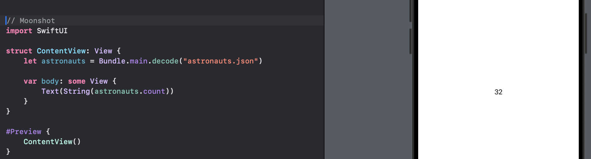

In addiion, we want to go back to our extension and add the extra code to help us diagnose problems, if we want to use it in the future. We will modify the part after the `decoder` initialization:

```swift
extension Bundle {
    func decode(_ file: String) -> [String: Astronaut] {
        guard let url = self.url(forResource: file, withExtension: nil) else {
            fatalError("Failed to locate \(file) in bundle.")
        }
        
        guard let data = try? Data(contentsOf: url) else {
            fatalError("Failed to load \(file) from bundle.")
        }

        let decoder = JSONDecoder()

        /* REPLACE THIS PART
        guard let loaded = try? decoder.decode([String: Astronaut].self, from: data) else {
            fatalError("Failed to decode \(file) from bundle.")
        }
        */

        do {
            return try decoder.decode([String: Astronaut].self, from: data)
        } catch DecodingError.keyNotFound(let key, let context) {
            fatalError("Failed to decode \(file) from bundle due to missing key '\(key.stringValue)' - \(context.debugDescription)")
        } catch DecodingError.typeMismatch(_, let context) {
            fatalError("Failed to decode \(file) from bundle due to type mismatch - \(context.debugDescription)")
        } catch DecodingError.valueNotFound(let type, let context) {
            fatalError("Failed to decode \(file) from bundle due to missing \(type) value - \(context.debugDescription)")
        } catch DecodingError.dataCorrupted(_) {
            fatalError("Failed to decode \(file) from bundle because it appears to be invalid JSON.")
        } catch {
            fatalError("Failed to decode \(file) from bundle: \(error.localizedDescription)")
        }

    }
}
```

Now the method will tell us what went wrong with decoding.

## Using Generics to Load Any Kind of Codable Data

We added a `Bundle` extension for loading the astronaut JSON data from our app bundle. Next we have a second JSON, `missions.json`, which contains more complex structure:

- Every mission has an ID number, which means we can use `Identifiable` easily.

- Every mission has a description.

- Every mission has an array of crew, where each crew member has a name and role.

- All missions have a launch date except one.

Hence, crew roles need to be represented as their own struct, storing the name string and role string. We need to create a new Swift file called `Mission.swift`:

```swift
struct CrewRole: Codable {
    let name: String
    let role: String
}
```

As for the missions, we will have an ID integer, an array of `Crewrole` we just created, and a description string. The launch date is optional, so we need to rely on Swift's optionals. If we mark a property as optional, `Codable` will automatically skip over it if the value is missing from our input JSON:

```swift
struct Mission: Codable, Identifiable {
    let id: Int
    let launchDate: String? // optionals
    let crew: [CrewRole]
    let description: String
}
```

Our `CrewRole` strut was made specifically to hold data about missions, and as a result we can actually put the `CrewRole` struct ***inside*** the `Mission` struct:

```swift
struct Mission: Codable, Identifiable {
    struct CrewRole: Codable {
        let name: String
        let role: String
    }

    let id: Int
    let launchDate: String? // optionals
    let crew: [CrewRole]
    let description: String
}
```

This is called a *nested struct*. Rather than saying `CrewRole`, we could write `Mission.CrewRole` to make our code more organized.

We already have a `Bundle` extension to load JSON file into a dictionary of `Astronaut` structs, so we could rewrite and use it to load missions rather than astronauts. However, the better solution is to leverage Swift's generics system.

**Generics** allow us to write code that is capable of working with a variety of different types. In this project, we had a `Bundle` extension to work with dictionary of astronauts, but we want to handle other scenarios as well.

To make a method generic, we give it a placeholder for certain types, written in angle brackets (`<` and `>`) after the method name but before its parameters:

```swift
func decode<T>(_ file: String) -> [String: Astronaut] {
    // everything else the same for now
}
```

We could use anything for that placeholder - "Type", "TypeOfThing", or even "Fish". "T" is a convention in coding, as a short-hand placeholder for "type".

Inside the method, we can now use "T" everywhere we used to use `[String: Astronaut]` - it is just a placeholder for the type we want to work with. Therefore, rather than returning `[String: Astronaut]`, we would use:

```swift
func decode<T>(_ file: String) -> T {
    // everything else the same for now
}
```

There is a big different between `T` and `[T]`.

- `T` is a placeholder for whatever type we ask for, so if we say "decode our dictionary of astronauts", then `T` becomes `[String: Astronaut]`.

- If we return `[T]` from `decode()`, then we would actually be returning `[[String: Astronaut]]` - an array of dictionaries of astronauts!

Inside the `decode()` method, there is another place where `[String: Astronaut]` is used:

```swift
return try decoder.decode([String: Astronaut].self, from: data)
```

Again, change that to `T`:

```swift
return try decoder.decode(T.self, from: data)
```

What we said is that `decode()` will be used with some sort of type, such as `[String: Astronaut]`, and it should attempt to decode the file it has loaded to be that type.

If we try compiling our updated extension:

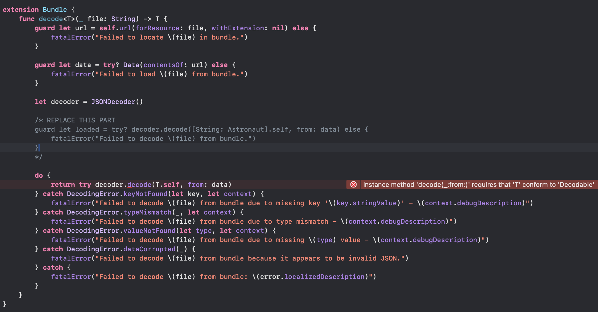

The error meesage is "Instance method 'decode(_:from:)' requires that 'T' conform to 'Decodable'.", which means that `T` could be anything. Swift cannot be sure the type we work with conforms to the `Codable` protocol.

We can fix this with a *constraint*: we can tell Swift that `T` can be whatever we want, as long as that thing conforms to `Codable`, then Swift knows it is safe to use and makes sure we do not try to use the method with a type that does not conform with `Codable`.

Therefore, we will update the method signature:

```swift
func decode<T: Codable>(_ file: String) -> T {
    // same thing inside
}
```

Now if we try compiling again, we will see another error:

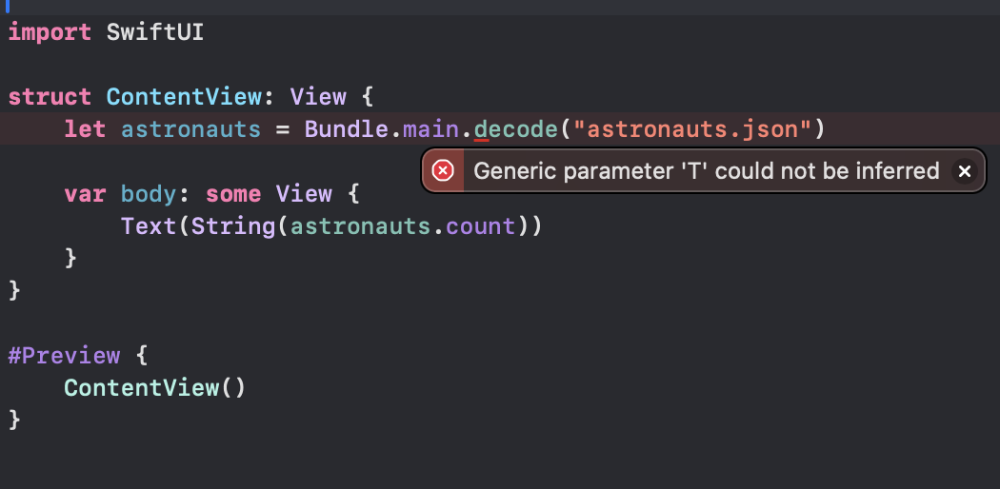

The error message is "Generic parameter 'T' could not be inferred" over in the `astronauts` property of `ContentView`.

Before we update `decode()` with generics, the `decode()` method would always return a dictionary of astronauts, but now it returns anything we want as long as it conforms to `Codable`.

*We know it will still return a dictionary of astronauts because the actual underlying data has not changed*, but Swift does not know that and needs more information. To fix this issue, we need to use a type annotation so Swift knows exactly what `astronauts` will be:

```swift
let astronauts: [String: Astronaut] = Bundle.main.decode("astronauts.json)
```

Now everything works as usual!

Next we can also load `mission.json` into another property in `ContentView`:

```swift
let missions: [Mission] = Bundle.main.decode("mission.json")
```

In preview,

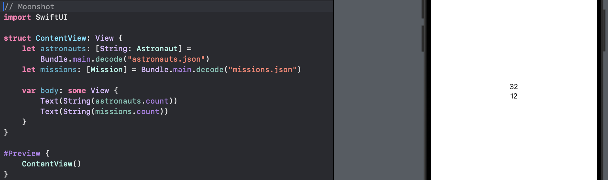

This is the power of generics: we can use the same `decode()` method to load any JSON from our bundle into any Swift type that conforms to `Codable` - we do not need multiple variants of the same method.

Extra point: the error message, **"Instance method 'decode(_:from:)' requires that 'T' conform to 'Decodable'."**, mentioned `Decodable` but we only used `Codable` everywhere. Behind the scenes, `Codabl` is an alias for two separate protocols: `Encodable` and `Decodable`. We can use `Codable` if we want, or we can use the specific `Encodable` and `Decodable`.

## Formatting Our Mission View

Before moving forward, we need to drag all our images into assets:

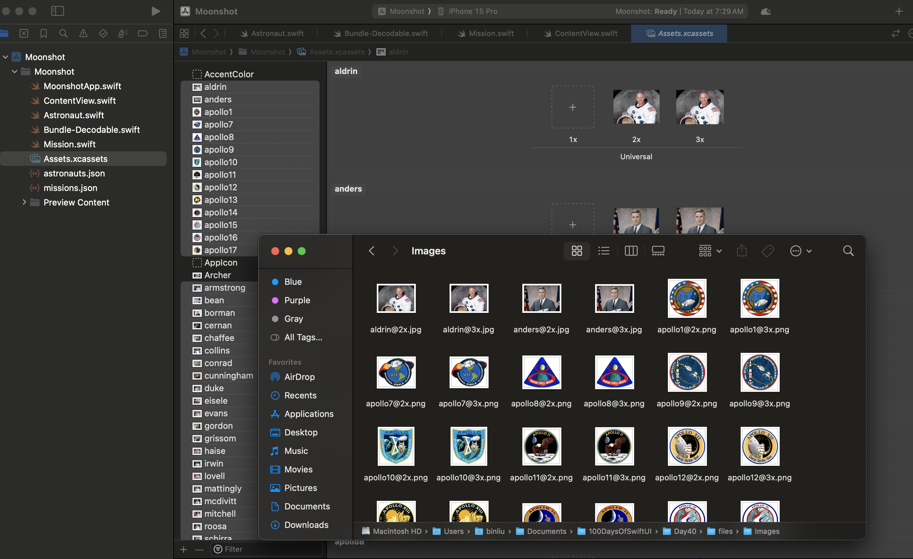

The image names "apollo1@2x.png" and similar mean they are accessible in the asset catalog as "apollo1", "apollo12", and so on. Our `Mission` struct has an `id` integer providing the number part, so we could use string interpolation such as `"apollo\(mission.id)"` to get our image name and `"Apollo \(mission.id)"` to get the formatted display name of the mission.

On the other hand, we can also add computed properties to the `Mission` struct to send the same data back so our `Mission` struct has everything in one place. Hence, we will add two properties to the `Mission` struct:

```swift
struct Mission: Codable, Identifiable {
    struct CrewRole: Codable {
        let name: String
        let role: String
    }

    let id: Int
    let launchDate: String? // optionals
    let crew: [CrewRole]
    let description: String

    var displayName: String {
        "Apollo \(id)"
    }

    var image: String {
        "apollo\(id)"
    }
}
```

Now we can build our `ContentView`, which will have a `NavigationStack` with a title, a `LazyVGrid` using our `missions` array as input, and each row inside there will be a `NavigationLink` containing the image, name, and launch date of the mission.

First, we need to define an adaptive column layout in the `ContentView`:

```swift
struct ContentView: View {
    let astronauts: [String: Astronaut] = Bundle.main.decode("astronauts.json")
    let missions: [Mission] = Bundle.main.decode("missions.json")

    let columns = [
        GridItem(.adaptive(minimum: 150))
    ]
    
    var body: some View {
        Text(String(astronauts.count))
        Text(String(missions.count))
    }
}
```

And then we will rewrite the entire `body` property with the following:

```swift
NavigationStack {
    ScrollView {
        LazyVGrid(columns: columns) {
            ForEach(missions) { mission in
                NavigationLink {
                    Text("Detail view")
                } label: {
                    VStack {
                        Image(mission.image)
                            .resizable()
                            .scaledToFit()
                            .frame(width: 100, height: 100)

                        VStack {
                            Text(mission.displayName)
                                .font(.headline)
                            Text(mission.launchDate ?? "N/A") // optional
                                .font(.caption)
                        }
                        .frame(maxWidth: .infinity)
                    }
                }
            }
        }
    }
    .navigationTitle("Moonshot")
}
```

In preview,

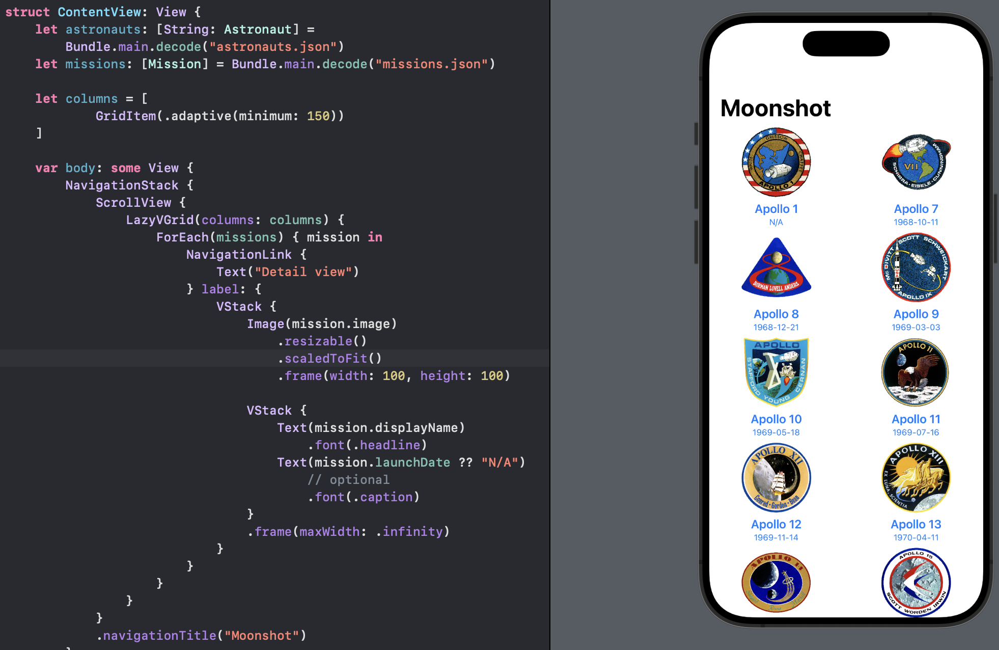

We have a scrolling, vertical grid that uses `resizable()`, `scaledToFit()`, and `frame()` to make the image occupy a 100x100 space while also maintaining its original aspect ratio.

The dates displayeed there are in unnatural format. Swift's `JSONDecoder` type has a property called `dateDecodingStrategy`, which determines how it should decode dates. We can provide that with a `DateFormatter` instance that describes how our dates are formatted.

NOTE: Date formates are case sensitive. `mm` means "zero-padded minute" and `MM` means "zero-padded month".

Then we will add a `formatter` after `let decoder = JSONDecoder()` in the `Bundle-Decodable.swift`:

```swift
let formatter = DateFormatter()
formatter.dateFormat = "y-MM-dd"
decoder.dateDecodingStrategy = .formatted(formatter)
```

That tells the decoder to parse dates in the exact format we expect.

If we run the code now, things will look exactly the same, because Swift does not realize that `launchDate` is a date since we declare it as `let launchDate: String?`.

Now that our decoding code understands how our dates are formatted, we need to change that property from optional `String` to optional `Date`:

```swift
let launchDate = Date?
```

Our code will not compile now because we attempt to use an optional `Date` inside a text view, or replace it with "N/A" if the date is empty.

To fix this, we need to ask the mision itself to provide a formatted launch date that converts the optional date into a neatly formatted string or sends back "N/A" for missing dates. This uses the same `formatted()` method we have used previously for the currency. We will add this computed property to `Mission`:

```swift
var formattedLaunchDate: String {
    launchDate?.formatted(date: .abbreviated, time: .omitted) ?? "N/A"
}
```

And now we can replace the text view in the `ContentView` with the following:

```swift
// previous broken text view
//Text(mission.launchDate ?? "N/A")
Text(mission.formattedLaunchDate)
    .font(.caption)
```

In preview,

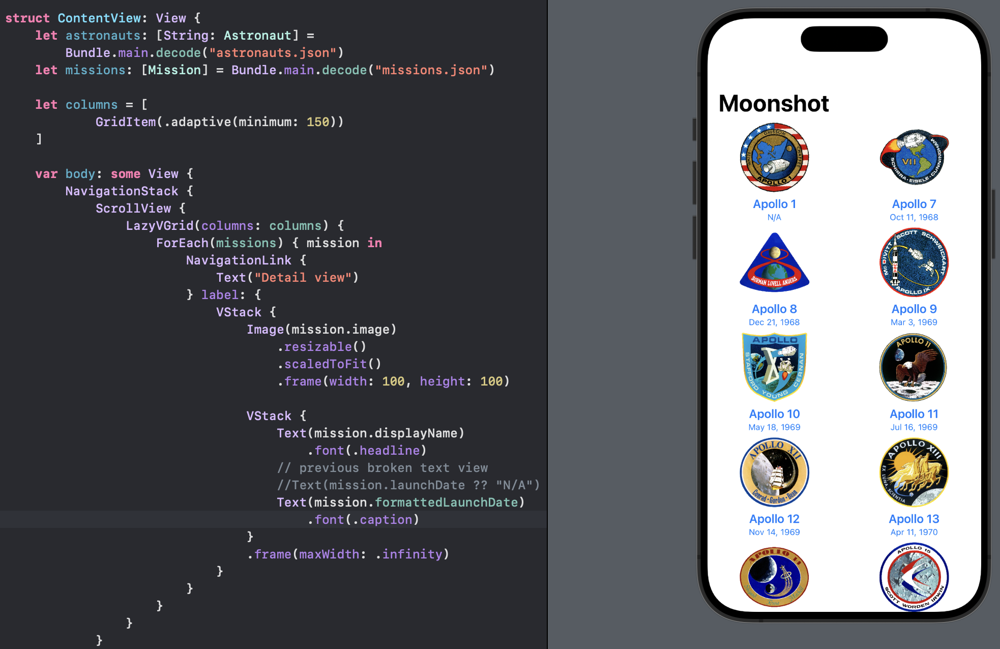

Now our dates will be rendered in a much more natural way.

Next we will focus on how to share custom app colors and how to force a dark theme for our app.

First, there are two ways to set custom colors: we can either add colors to our asset catalog with specific names, or add them as Swift extensions. The former approach lets us work visually, whereas the latter one using code makes it easier to monitor changes.

We will implement this using Swift extensions. If we make these extensions on `Color`, we can use them in a handful of places in SwiftUI. However, `Color` conforms to a bigger protocol called `ShapeStyle` that can let us use colors, gradients, materials, and more as if they were the same thing.

In addition, the `ShapeStyle` protocol is what the `background()` modifier uses, so we will write extentions to `Shapestyle` rather than `Color`: "we want to add functionality to `ShapeStyle`, but only for times when it is being used as a color."

To try this out, we will create a new Swift file called `Color-Theme.swift` and add the following:

```swift
// comment Foundation out
//import Foundation
import SwiftUI


extension ShapeStyle where Self == Color {
    static var darkBackground: Color {
        Color(red: 0.1, green: 0.1, blue: 0.2)
    }

    static var lightBackground: Color {
        Color(red: 0.2, green: 0.2, blue: 0.3)
    }
}
```

The two new colors `darkBackground` and `lightBackground` are placed inside a very specific extension that allows us to use those colors everywhere SwiftUI expects a `ShapeStyle`.

To use this in action, we will modify the `VStack` containing the mission name and launch date with the following modifiers:

```swift
VStack {
    Text(mission.displayName)
    .font(.headline)
                                    
    Text(mission.formattedLaunchDate)
        .font(.caption)
}
// new modifiers here
.padding(.vertical)
.frame(maxWidth: .infinity)
.background(.lightBackground)
```

In preview,

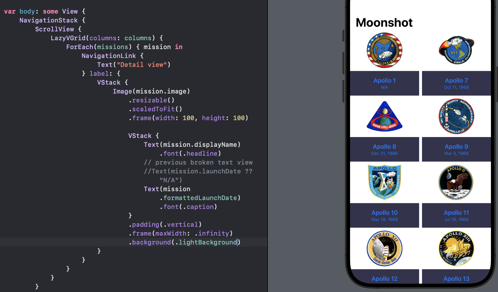

Next, We will modify the outer `VStack` and add the following modifiers to the end of it:

```swift
VStack {
    Image(mission.image)
        .resizable()
        .scaledToFit()
        .frame(width: 100, height: 100)

    VStack {
        Text(mission.displayName)
            .font(.headline)
        // previous broken text view
        //Text(mission.launchDate ?? "N/A")
        Text(mission.formattedLaunchDate)
            .font(.caption)
    }
    .padding(.vertical)
    .frame(maxWidth: .infinity)
    .background(.lightBackground)
}
// add new modifiers here
.clipShape(.rect(cornerRadius: 10))
.overlay(
    RoundedRectangle(cornerRadius: 10)
        .stroke(.lightBackground)
)
```

In preview,

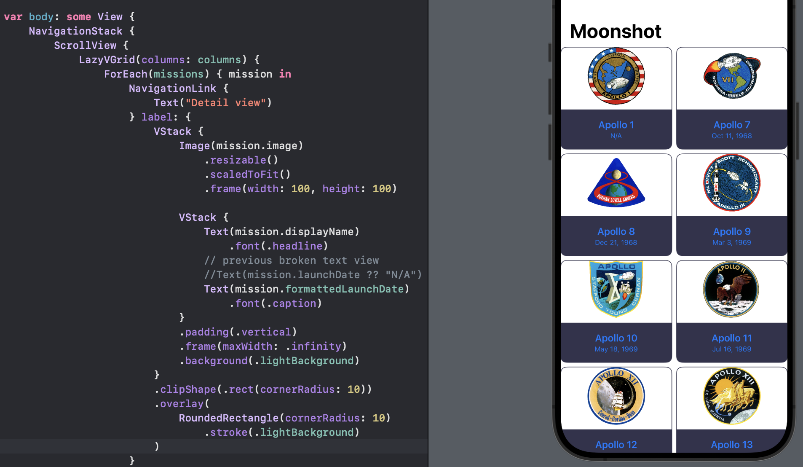

Third, we need to add paddings two places

- adding simple padding to the mission images, directly after their 100x100 frame:
  
  ```swift
  Image(mission.image)
      .resizable()
      .scaledToFit()
      .frame(width: 100, height: 100)
      .padding()
  ```

- adding horizontal and bottom padding to the grid. This should be added to the `LazyVGrid`, not to the `ScrollView`:
  
  ```swift
  LazyVGrid(columns: columns) {
      // everything the same
  }
  .padding([.horizontal, .bottom])
  ```

In preview,

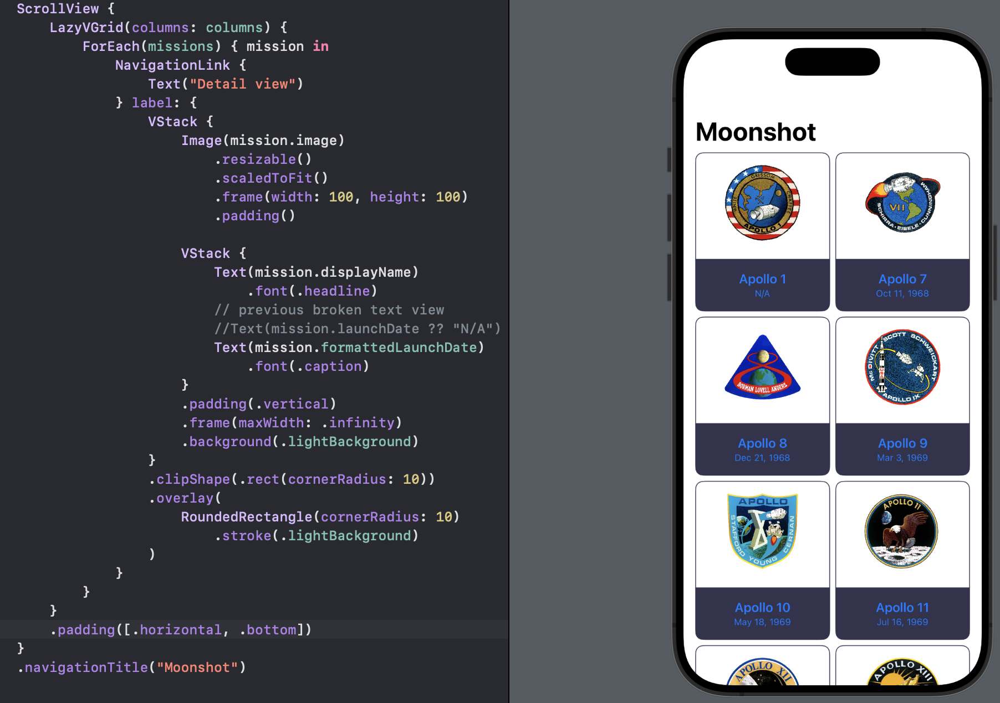

Now we can replace the white background with the custom background color we created earlier. We will add this modifier to the `ScrollView`, after its `navigationTitle()` modifier:

```swift
ScrollView {
    // LazyVGrid stuff
}
.navigationTitle("Moonshot")
.background(.darkBackground)
```

In preview,

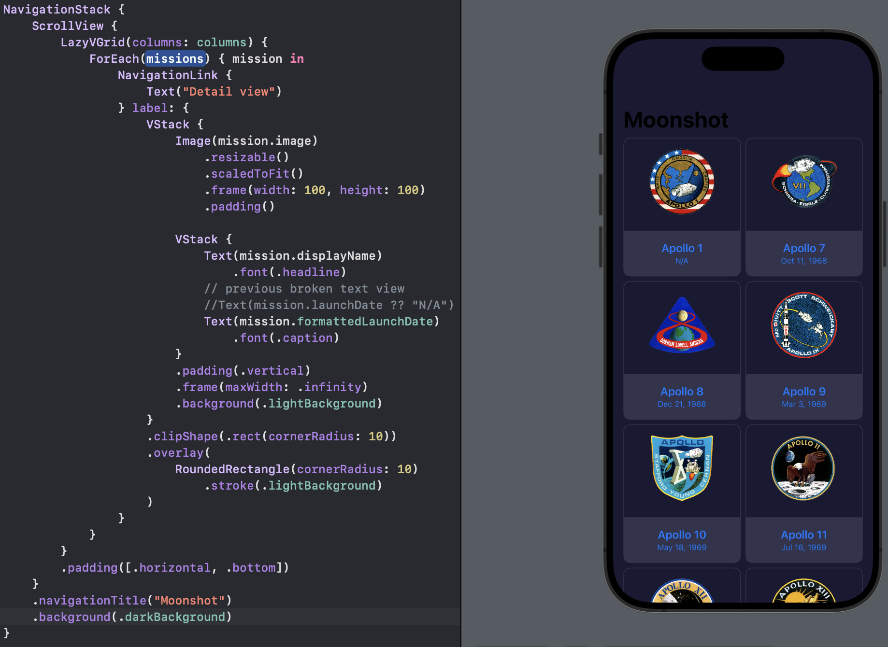

To finish up, we will modify a few color assignments in the text fields:

```swift
VStack {
    Text(mission.displayName)
        .font(.headline)
        .foregroundStyle(.white)
    Text(mission.formattedLaunchDate)
        .font(.caption)
        .foregroundStyle(.white.opacity(0.5))
}
```

As for the Moonshot title, that belongs to our `NavigationStack`, and will appear either black or white depending on whether the user is in light mode or dark mode.

To fix this, we can tell SwiftUI our view prefers to be in dark mode *always*, which will cause the title to be in white no matter what. To finish up the design for this view, we will add the final modifier to the `ScrollView`, below its background color:

```swift
ScrollView {
    // LazyVGrid stuff
}
.navigationTitle("Moonshot")
.background(.darkBackground)
// Moonshot title
.preferredColorScheme(.dark)
```

In preview,

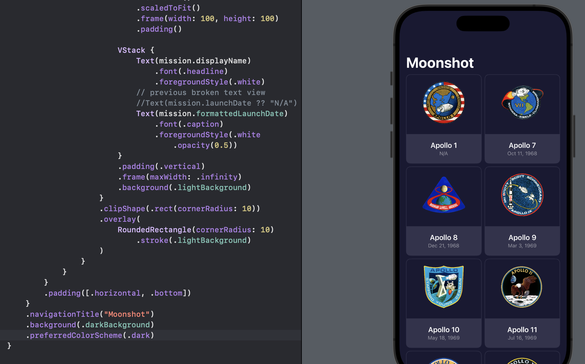

Tapping any of our missions will bring in a temporary detail view.


