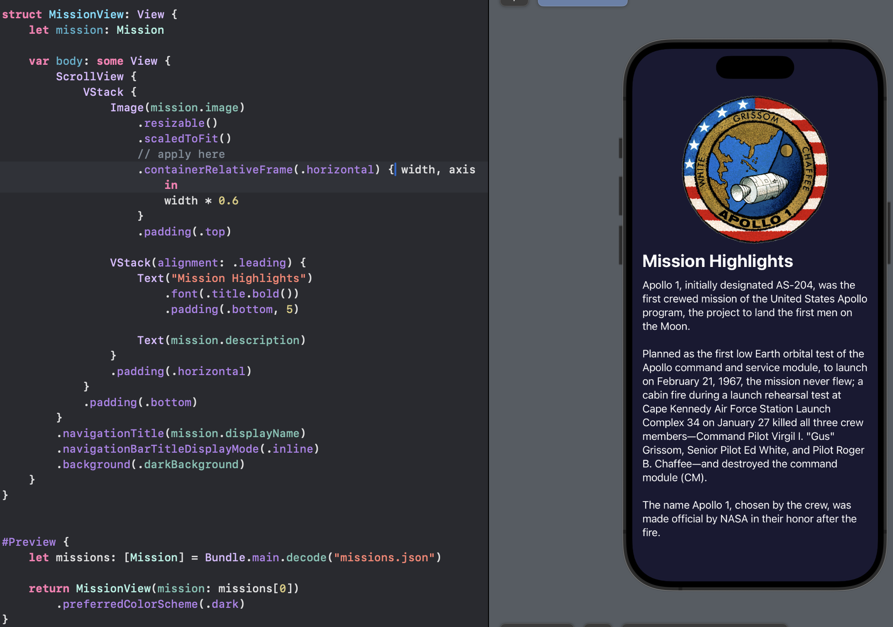
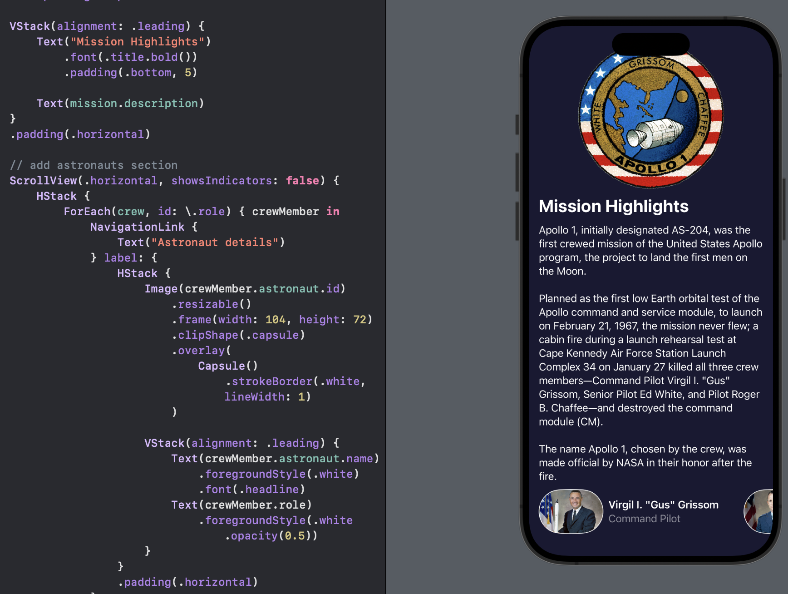
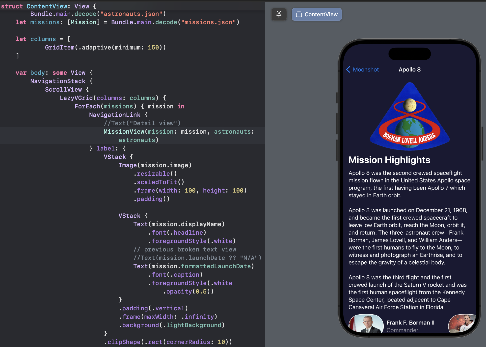
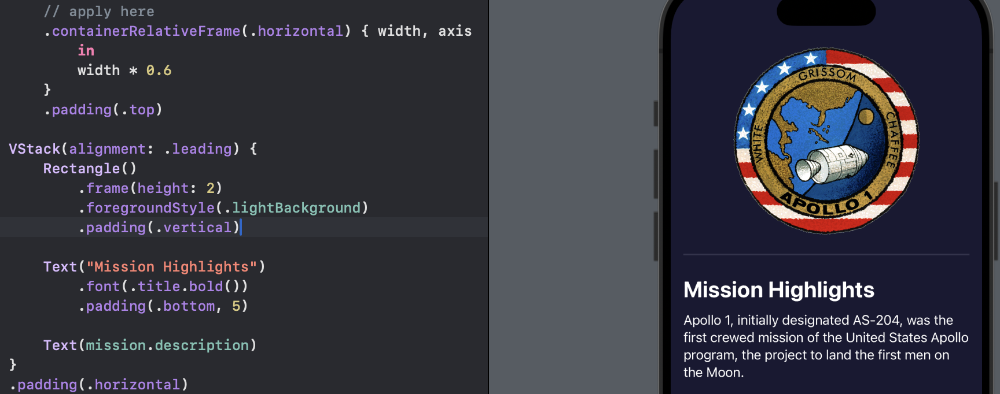
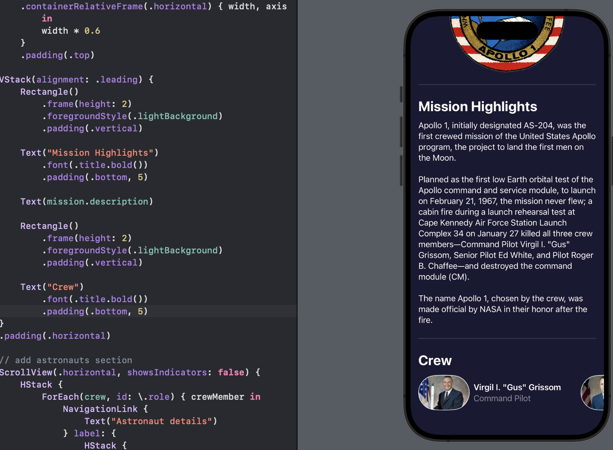
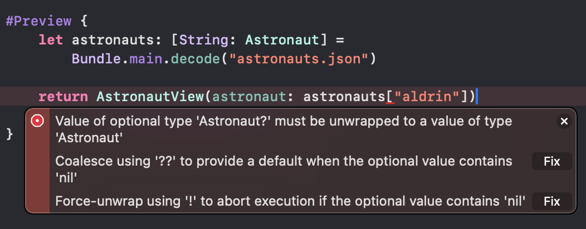
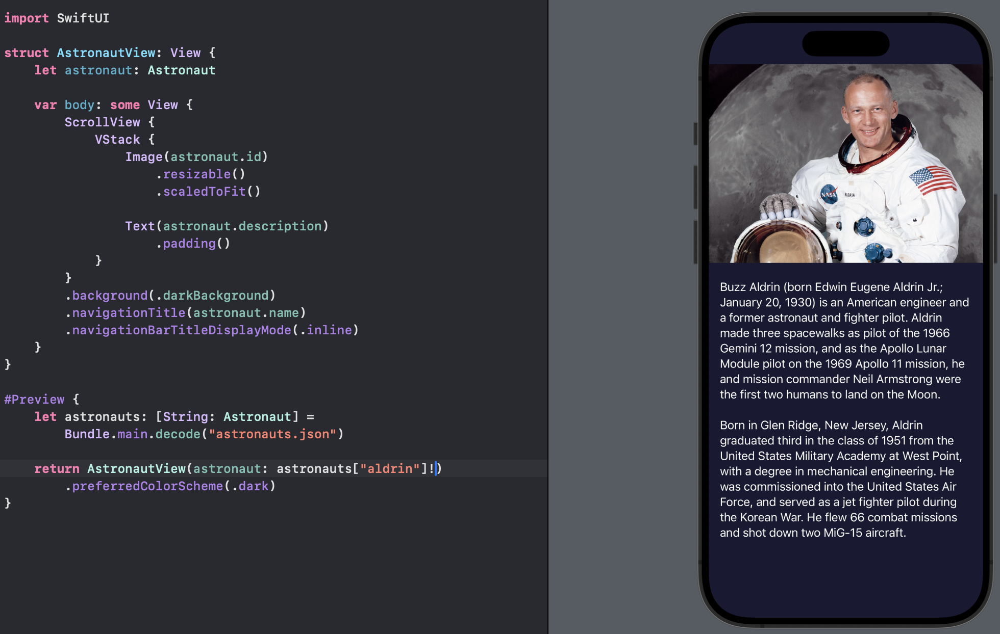
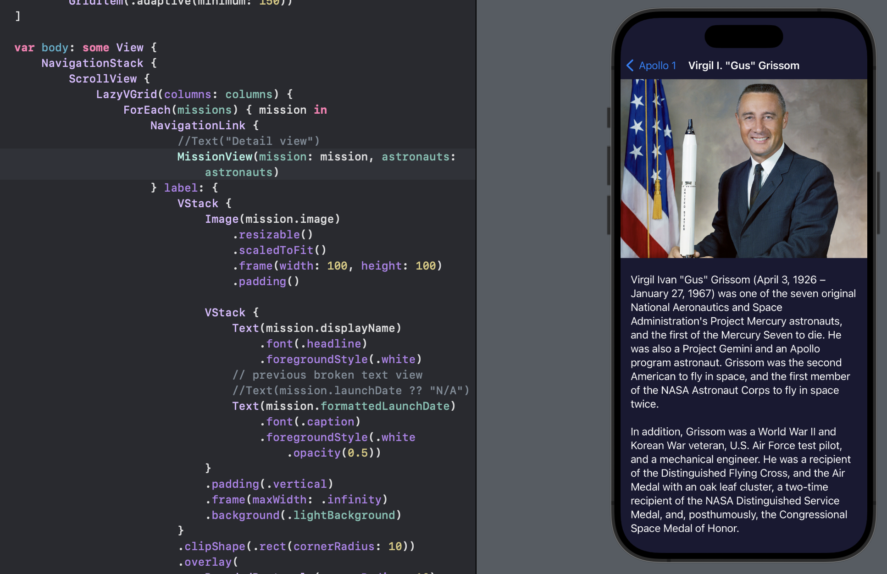

# Day 41 - Project 8, Part 3

## Showing Mission Details with ScrollView and containerRelativeFrame()

When the user selects one of the Apollo missions from our main list, we want to show information about the mission:

- mission badge,

- mission description, and

- all astronauts that were on the crew along with their roles.

We will make a new SwiftUI view called `MissionView.swift`. In terms of layout, we need to have a scrolling `VStack` with a resizable image for the mission badge, then a text view.

We will use `containerRelativeFrame()` to set the width of the mission image:

```swift
// MissionView.swift


struct MissionView: View {
    let mission: Mission

    var body: some View {
        ScrollView {
            VStack {
                Image(mission.image)
                    .resizable()
                    .scaledToFit()
                    // apply here
                    .containerRelativeFrame(.horizontal) { width, axis in
                        width * 0.6
                    }
                    .padding(.top)

                VStack(alignment: .leading) {
                    Text("Mission Highlights")
                        .font(.title.bold())
                        .padding(.bottom, 5)

                    Text(mission.description)
                }
                .padding(.horizontal)
            }
            .padding(.bottom)
        }
        .navigationTitle(mission.displayName)
        .navigationBarTitleDisplayMode(.inline)
        .background(.darkBackground)
    }
}
```

Placing a `VStack` inside another `VStack` allows us to control alignment for one specific part of our view.

With that new view in place, the code will no longer build, because of the previews struct below it. That needs a `Mission` object passed in so it has something to render. Hence, we need to pass in our `Bundle` extension:

```swift
#Preview {
    let missions: [Mission] = Bundle.main.decode("missions.json")

    return MissionView(mission: missions[0])
        .preferredColorScheme(.dark)
}
```

In preview,



This view will automatically have a dark color scheme because it's applied to the `NavigationStack` in `ContentView`, but the `MissionView` preview does not know that so we need to enable it by hand.

## Merging Codable structs

Below our mission description, we want to show the pictures, names, and roles of each crew member, which means matching up data that came from two different JSON files.

Our JSON data is split across `missions.json` and `astronauts.json`. This eliminates duplication in our data, because some astronauts took part in multiple missions, but it also means we need to join our data together.

We need to make our `MissionView` accept the mission that got tapped, along with our full astronauts dictionary, then have it figure out which astronauts actually took part in that launch.

To begin with, we will add a nested struct inside `MissionView`:

```swift
struct CrewMember {
    let role: String
    let astronaut: Astronaut
}
```

Now for the tricky part: we need to add a property to `MissionView` that stores an array of `CrewMember` objecs - these are the fully resolved role / astronaut pairings. At first, this is as simple as adding another property:

```swift
let crew: [CrewMember]
```

If we make this view be handed its mission and all astronauts, we can loop over the mission crew, then for each crew member look in the dictionary to find the one that has a matching ID. When we find one, we can convert that and their role into a `CrewMember` object, but if we do not it means somehow we have a crew role with an invalid or unknown name.

If we have added some JSON to our project that points to missing data in our app, we have made a fundamental mistake!

This is where `fatalError()` is useful: If we cannot find an astronaut using their ID, we should exit immediately.

We will use a custom initializer for `MissionView`, which will accept the mission it represents along with all the astronauts. Its job is to store the mission away then figure out the array of resolved astronauts:

```swift
init(mission: Mission, astronauts: [String: Astronaut]) {
    self.mission = mission

    self.crew = mission.crew.map { member in
        if let astronaut = astronauts[member.name] {
            return CrewMember(role: member.role, astronaut: astronaut)
        } else {
            fatalError("Missing \(member.name)")
        }
    }
}
```

Our preview struct will stop working again because it needs more information. We need to add a second call to `decode()` there so it loads all the astronauts:

```swift
#Preview {
    let missions: [Mission] = Bundle.main.decode("missions.json")
    let astronauts: [String: Astronaut] = Bundle.main.decode("astronauts.json")

    return MissionView(mission: missions[0], astronauts: astronauts)
        .preferredColorScheme(.dark)
}
```

Now that we have all our astronaut data, we can show this directly below the mission description using a horizontal scroll view. We will add this after the entire `VStack(alignment: .leading)`  block:

```swift
ScrollView(.horizontal, showsIndicators: false) {
    HStack {
        ForEach(crew, id: \.role) { crewMember in
            NavigationLink {
                Text("Astronaut details")
            } label: {
                HStack {
                    Image(crewMember.astronaut.id)
                        .resizable()
                        .frame(width: 104, height: 72)
                        .clipShape(.capsule)
                        .overlay(
                            Capsule()
                                .strokeBorder(.white, lineWidth: 1)
                        )

                    VStack(alignment: .leading) {
                        Text(crewMember.astronaut.name)
                            .foregroundStyle(.white)
                            .font(.headline)
                        Text(crewMember.role)
                            .foregroundStyle(.white.opacity(0.5))
                    }
                }
                .padding(.horizontal)
            }
        }
    }
}
```

In preview,



Scroll views work best when they take full advantage of the available screen space, which means they should scroll edge to edge.

If we put this inside our `VStack` it would have the same padding as the rest of our text.

Next, since we have mission view ready, we will replace the placholder `Text("Detail View")` in `ContentView` with:

```swift
MissionView(mission: mission, astronauts: astronauts)
```

In preview,



SwiftUI provides a dedicated `Divider` view for creating a visual divide in our layout, but it is not customizable. To draw a custom divider to break up our view, we will place the following directly before the "Mission Highlights" text:

```swift
Rectangle()
    .frame(height: 2)
    .foregroundStyle(.lightBackground)
    .padding(.vertical)
```

In preview,



We also need to place this directly after the `mission.description` text

To finish up this view, we will add a title before our crew. This relates to the scroll view, but it needs to have the same padding as the rest of our text. Hence, the best place for this is inside the `VStack`, directly after the previous rectangle:

```swift
Text("Crew")
    .font(.title.bold())
    .padding(.bottom, 5)
```

In preview,



## Finishing up with One Last View

To finish our app, we will make another view to display astronaut details, which will be reached by tapping one of the astronauts in the mission view.

We will create a new SwiftUI view file called `AstronautView.swift`. We will build an `AstronautView` that links a single `Astronaut` property so it knows what to show. This will layout the information using a similar `ScrollView`/`VStack` combination that we did in `MissionView`:

```swift
struct AstronautView: View {
    let astronaut: Astronaut

    var body: some View {
        ScrollView {
            VStack {
                Image(astronaut.id)
                    .resizable()
                    .scaledToFit()

                Text(astronaut.description)
                    .padding()
            }
        }
        .background(.darkBackground)
        .navigationTitle(astronaut.name)
        .navigationBarTitleDisplayMode(.inline)
    }
}
```

Again, since we need data from `Astronaut`, we need to update the preview so that it creates its view with some data:

```swift
#Preview {
    let astronauts: [String: Astronaut] = Bundle.main.decode("astronauts.json")

    return AstronautView(astronaut: astronauts["aldrin"]!)
        .preferredColorScheme(.dark)
}
```

If we do not add `!` in the return part inside the `#Preview`, we will have an error:



Because the value taken from a dictionary may be a `nil` so we need to unwrap the `optional`.

Now in the preview of the complete `AstronautView.swift`:



Now we can present this from the `NavigationLink` inside `MissionView`. This points to `Text("Astronaut details")` for now, but we can update it to point to our new `AstronautView`:

```swift
// Inside MissionView
// replace Text("Astronaut details") to
AstronautView(astronaut: crewMember.astronaut)
```

In preview,




