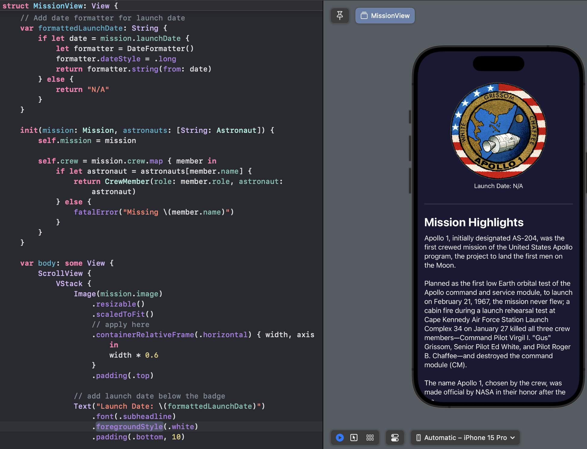
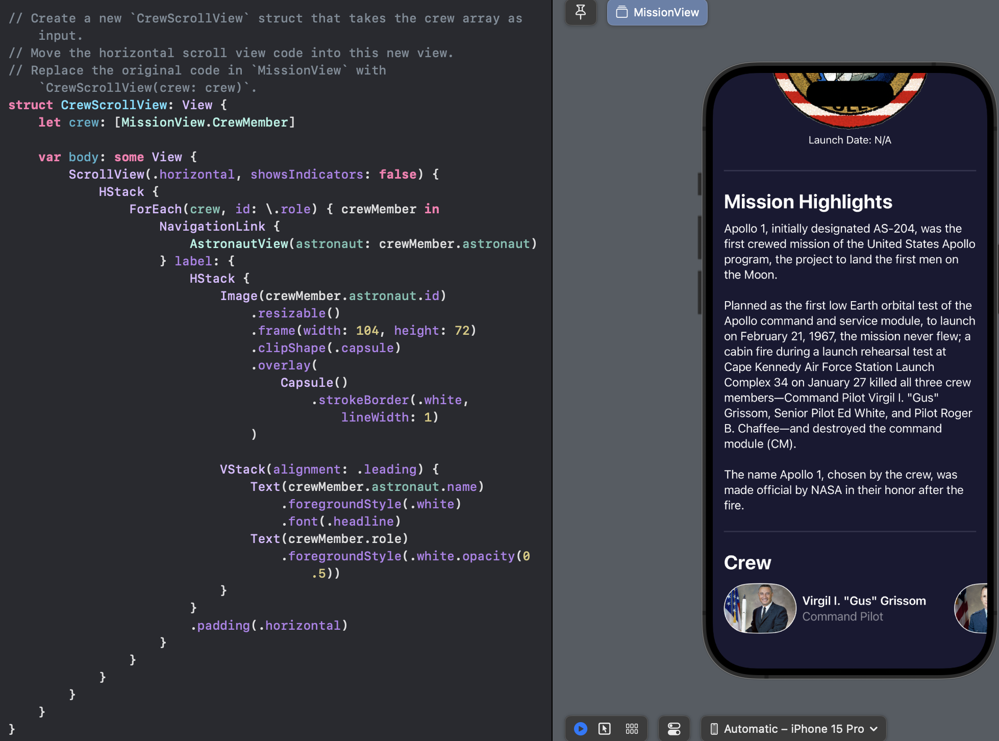
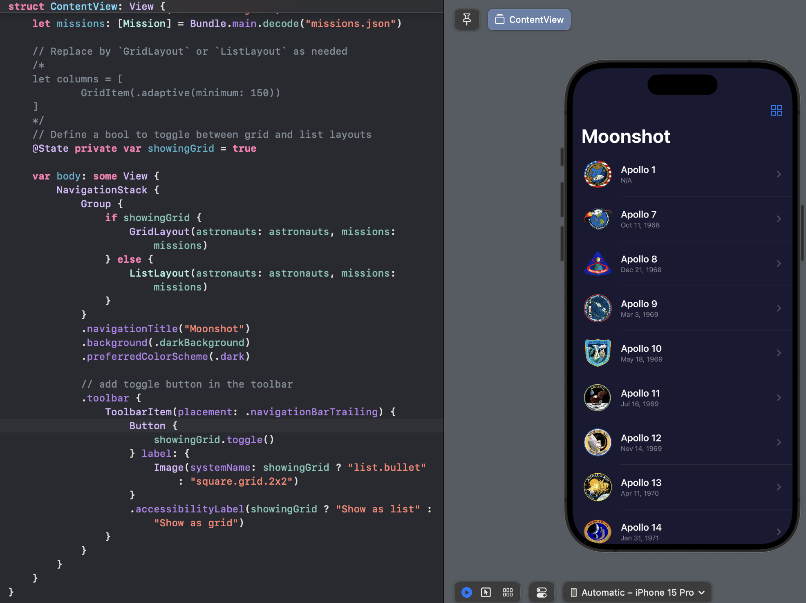
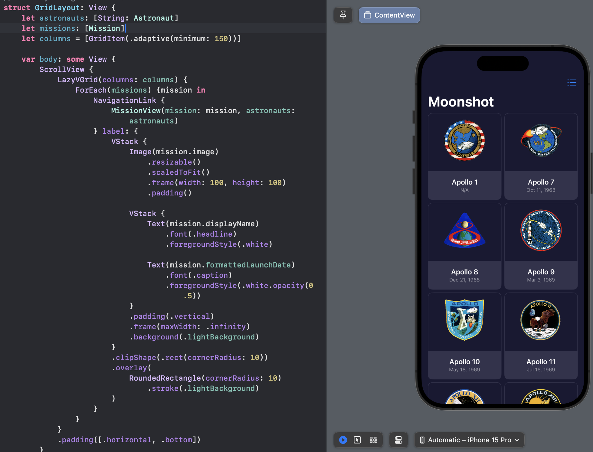
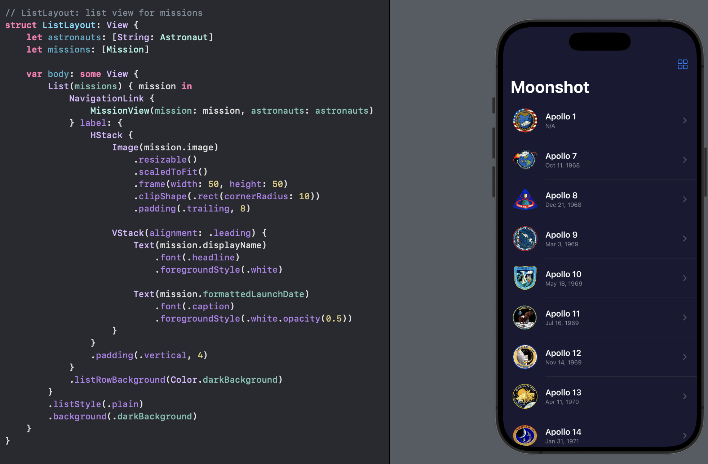

# Day 42 - Project 8, Part 4

## Moonshot: Wrap up

We applied multiple views, using `containerRelativeFrame()` to get precise sizes to make the most of our space.

We also wrote Swift code using generics to store data.

## Challenge

1. Add the launch date to `MissionView`, below the mission badge. We might choose to format this differently given that more space is available.
   
   

2. Extract one or two pieces of view code into their own new SwiftUI views - the horizontal scroll view in `MissionView` is a great candidate.
   
   

3. Add a toolbar item to `ContentView` that toggles between showing mission as a grid and as a list.
   
   - We can make all our grid code and all our list code as two separate views, and switch between them using a `if` condition in `ContentView`. We cannot attach SwiftUI modifiers to an `if` condition, but we can wrap that condition in a `Group` then attach modifier there:
     
     ```swift
     Group {
         if showingGrid {
             GridLayout(astronauts: astronauts, missions: missions)
         } else {
             ListLayout(astronauts: astronauts, missions: missions)
         }
     }
     .navigationTitle("My Group")
     ```

We can attach `.listStyle(.plain)` to our list, then something like `.listRowBackground(Color.darkBackground)` to the contents of our list row.



The custom grid and list layouts:

- `GridLayout`
  
  

- `ListLayout`
  
  
