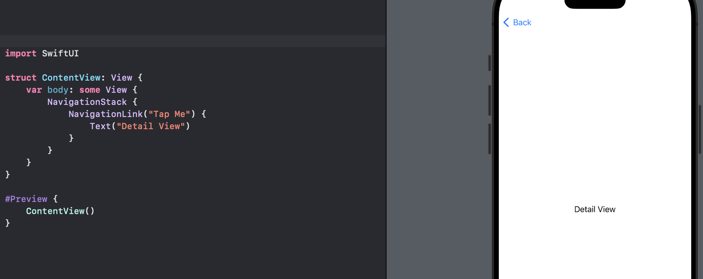
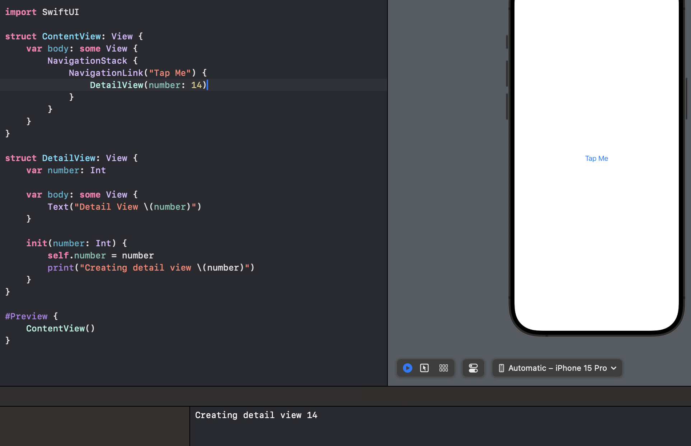
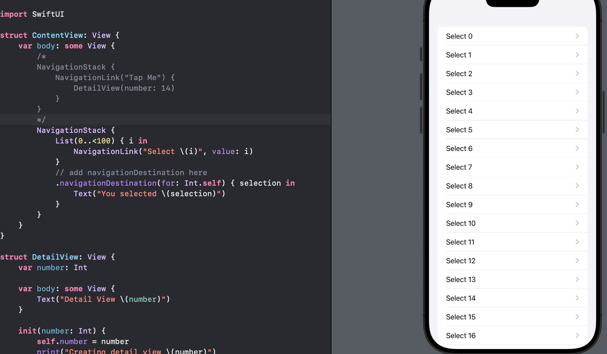

# Day 43 - Project 9, Part 1

Navigation is broken down into two major types:

- navigation driven by user interaction, and

- *programmatic* navigation that we trigger ourself.


## Navigation: Introduction

In this project we will take a close look at navigation in SwiftUI - how we move from one screen to another using `NavigationStack`, both because the user asked for it and also because we want to do it automatically at a specific time.

We will create a new App project called `Navigation`.

## The Problem with a Simple NavigationLink

```swift
NavigationStack {
    NavigationLink("Tap Me") {
        Text("Detail View")
    }
}
```

In preview,



Sometimes this is okay, but it has a hidden problem. For example, we could create a real detail view that prints a message in its initializer:

```swift
struct DetailView: View {
    var number: Int

    var body: some View {
        Text("Detail View \(number)")
    }

    init(number: Int) {
        self.number = number
        print("Creating detail view \(number)")
    }
}
```

Then we try using that in our navigation code:

```swift
NavigationStack {
    NavigationLink("Tap Me") {
        DetailView(number: 14)
    }
}
```

In preview,



Before we tap the navigation link, the debug console area in Xcode has already print "Creating detail view 14".

Just showing the navigation on the screen is enough for SwiftUI to automatically create a detail view instance. If we had something much more complex, for example, having a list of 1000 rows:

```swift
NavigationStack {
    List(0..<1000) { i in
        NavigationLink("Tap Me") {
            DetailView(number: i)
        }
    }
}
```

This makes Swift do a lot more work than is necessary. Hence when we deal with dynamic data - when we have lots of different integers to show in the same way - SwiftUI gives us a better solution: attaching a presentation value to our navigation link.

## Handling Navigation the Smart Way with navigationDestination()

In the simplest form of SwiftUI navigation, we provide both a label and a destination view in one single `NavigationLink`:

```swift
NavigationStack{
    // a label
    NavigationLink("Tap Me") {
        // a destination view
        Text("Detail View")
    }
}
```

But for more advanced navigation, it is better to separate the destination from the value. This allows SwiftUI to load the destination only when it is needed.

We will

1. attach a value to the `NavigationLink`. This value can be anything we want; however, whatever type we use must conform to a protocol called `Hashable`.

2. attach a `navigationDestination()` modifier inside the navigation stack, telling it what to do when it receives our data.

For the `Hashable` protocol, most of Swfit's built-in types conform to this protocol, for example, `Int`, `String`, `Date`, `URL`, arrays, and dictionaries already conform to `Hashable`.

Regarding of `navigationDestination()`, we could make a `List` of 100 numbers, with each one being attached to a navigation link as its presentation value:

```swift
NavigationStack {
    List(0..<100) { i in
        NavigationLink("Select \(i)", value: i)
    }
}
```

This is not done yet. We have told SwiftUI we want to navigate to 0 when "Select 0" is tapped, but we have NOT said how to show that data.

This is where the `navigationDestination()` modifier comes in:

```swift
NavigationStack {
    List(0..<100) { i in
        NavigationLink("Select \(i)", value: i)
    }
    // add navigationDestination here
    .navigationDestination(for: Int.self) { selection in
        Text("You selected \(selection)")
    }
}
```

In preview,



When SwiftUI attempts to navigate to any `Int` value, it gives us that value in the `selection` constant, and we need to return the correct SwiftUI view to show it.

That works great for lots of data, such as navigating to strings, integers, and UUIDs. But for more complex data such as custom structs, we need to use *hashing*.

Hashing is a computer science term that is the process of converting some data into a smaller representation in a consistent way. With hashing, we can convert that 10GB movie into a short string – maybe 40 characters in total – that uniquely identifies it.

The hash function needs to be consistent, which means if we hash the movie locally and compare it to the hash on the server, they should always be the same, and comparing two 40-character strings is much easier than comparing two 10GB files.

Swift uses `Hashable` internally. For example, when we use a `Set` rather than an array, everything we put in there must conform to the `Hashable` protocol. This is what makes sets so fast compared to arrays.

If we make a custom struct with properties that all conform to `Hashable`, we can make the whole struct conform to `Hashable` with one tiny change:

```swift
struct Student {
    var id = UUID()
    var name: String
    var age: Int
}
```

If we want to make that struct conform to `Hashable`, we just add the protocol like this:

```swift
struct Student: Hashable {
    var id = UUID()
    var name: String
    var age: Int
}
```

Now that our `Student` struct conforms to `Hashable`. It can be used with both `NavigationLink` and `navigationDesitnation()` just like integers or strings.


