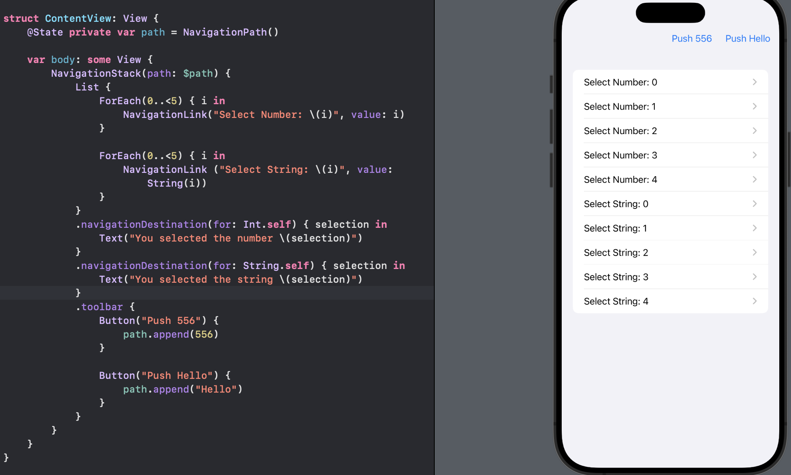
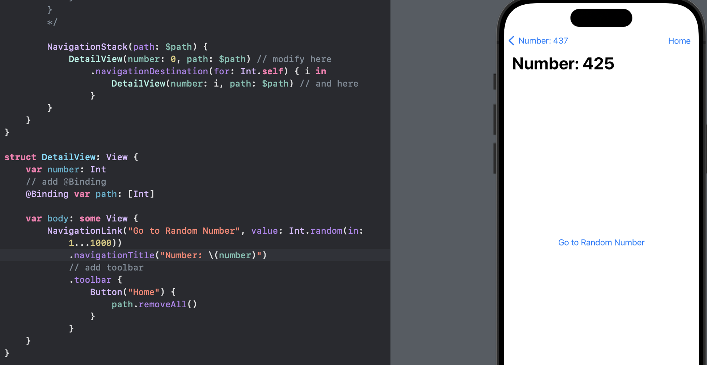

# Day 44 - Project 9, Part 2

In this section, we will explore how to handle programmatic navigation, as well as how to load and save navigation paths so we can restore our app's state.

## Programmatic Navigation with NavigationStack

Programmatic naviagtion allows us to move from one view to another just using code, rather than waiting for the user to take a specific action.

In SwiftUI this is done by binding the path of a `NavigationStack` to an array of whatever data we navigate with. We may start with:

```swift
struct ContentView: View {
    @State private var path = [Int]()

    var body: some View {
        NavigationStack(path: $path) {
            VStack {
                // more code here
            }
            .navigationDestination(for: Int.self) { selection in
                Text("You selected \(selection)")
            }
        }
    }
}
```

- This creates an `@State` property to store an array of integers.

- It binds that property to the `path` of our `NavigationStack`, meaning that changing the array will automatically navigate to whatever is in the array, but also changes the array as the user presses "Back" in the navigation bar.

Now we can add two buttons:

```swift
struct ContentView: View {
    @State private var path = [Int]()

    var body: some View {
        NavigationStack(path: $path) {
            VStack {
                Button("Show 32") {
                    path = [32]
                }

                Button("Show 64") {
                    path.append(64)
                }
            }
            .navigationDestination(for: Int.self) { selection in
                Text("You selected \(selection)")
            }
        }
    }
}
```

The first button will set the whole array so that it just contains the number 32. If anything else happens to be in the array, it will be removed. This means that the `NavigationStack` will return to its original state before navigating to the number 32.

The second button will append number 64 to the `path` array. This means that the number 64 will be added to whatever we navigate to. Hence, if our array already contained 32, we will now have three views in the stack:

- the original vew (the "root" view)

- the view to show number 32, and 

- the view to show number 64.

We can also push multiple values at the same time:

```swift
Button("Show 32 then 64") {
    path = [32, 64]
}
```

In preview,


This will present a view for 32 then a view for 64, so **the user needs to tap "Back" twice to get back to the root view.**

## Navigating to Different Data Types Using NavigationPath

Navigating to different data types takes one of two forms. We can simply use `navigationDestination()` with different data types, but we do not track the exact path that is being shown, because we just add `navigationDestination()` multiple times, once for each data type. For example, we could show five numbers and five strings and navigate them differently:

```swift
NavigationStack {
    List {
        ForEach(0..<5) { i in
            NavigationLink("Select Number: \(i)", value: i)
        }

        ForEach(0..<5) { i in
            NavigationLink ("Select String: \(i)", value: String(i))
        }
    }
    .navigationDestination(for: Int.self) { selection in
        Text("You selected the number \(selection)")
    }
    .navigationDestination(for: String.self) { selection in
        Text("You selected the string \(selection)")
    }
}
```

In preview,


However, we cannot use one array to bind some data to the navigation stack's path since now we have integers or strings in our path so a simple array cannot do that.

SwiftUI has a special type called `NavigationPath`, which is able to hold a variety of data types in a single path:

```swift
@State private var path = NavigationPath()
```

Then we can bind this to a `NavigationStack`:

```swift
NavigationStack(path: $path) {
    // same code
}
```

Then we can push things to it programmatically, for example with toolbar buttons:

```swift
.toolbar {
    Button("Push 556") {
        path.append(556)
    }

    Button("Push Hello") {
        path.append("Hello")
    }
}
```

In preview,



`NavigationPath` is a *type-eraser* - it stores any kind of `Hashable` data without exposing exactly what type of data each item is.

## How to Make a NavigationStack Return to Its Root View Programmatically

It is common to be several levels deep in a `NavigationStack`, then to decide if we want to return to the beginning. To demonstrate this, we can create a little sandbox to push to new views endlessly by generating new random numbers each time.

First, we need a `DetailView` that shows its current number as its title, and has a button that pushes to a new random number whenever it is pressed:

```swift
struct DetailView: View {
    var number: Int

    var body: some View {
        NavigationLink("Go to Random Number", value: Int.random(in: 1...1000))
            .navigationTitle("Number: \(number)")
    }
}
```

Then we can present that from our `ContentView`, starting with an initial value of 0 but navigating to a new `DetailView` every time a new integer is shown:

```swift
struct ContentView: View {
    @State private var path = [Int]()

    var body: some View {
        NavigationStack(path: $path) {
            DetailView(number: 0)
                .navigationDestination(for: Int.self) { i in
                    DetailView(number: i)
                }
        }
    }
}
```

In preview,


When we run this we will see we can keep pushing our way through views endlessly. Now if we are 10 views deep and decide to return home, we will have two options:

1. If we use a simple array for our path, like what we did here, we can call `removeAll()` on that array to remove everything in our path, going back to the root view.

2. If we use `NavigationPath` for our path, we can set it to a new, empty instance of `NavigationPath`: `path = NavigationPath()`.

However, another bigger problem is how we can do that from the subview, when we do not have access to the original `path` property.

We can either store our path in an external class that uses `@Observable`, or bring in a new property wrapper called `@Binding`. We have used `@Observable` before, so this time we will focus on `@Binding` here.

The `@Binding` property wrapper lets us pass an `@State` property into another view and modify it from there - we can share an `@State` property in several places, and changing it in one place will change it everywhere.

In our current setup, that means we will add a new property to `DetailView` to get access to the navigation path array:

```swift
struct DetailView: View {
    var number: Int
    // add @Binding
    @Binding var path: [Int]

    var body: some View {
        NavigationLink("Go to Random Number", value: Int.random(in: 1...1000))
            .navigationTitle("Number: \(number)")
    }
}
```

And now we need to pass that in from both places in `ContentView` where `DetailView` is used:

```swift
DetailView(number: 0, path: $path) // modify here
    .navigationDestination(for: Int.self) { i in
        DetailView(number: i, path: $path) // and here
    }
```

We pass in `$path` because we want to pass the binding in - we want `DetailView` to be able to read and write the path. Then we can add a toolbar to `DetailView` to manipulate the path array:

```swift
struct DetailView: View {
    var number: Int
    // add @Binding
    @Binding var path: [Int]

    var body: some View {
        NavigationLink("Go to Random Number", value: Int.random(in: 1...1000))
            .navigationTitle("Number: \(number)")
            // add toolbar
            .toolbar {
                Button("Home") {
                    path.removeAll()
                }
            }
    }
}
```

In preview,


If we use `NavigationPath` for `path`, 

```swift
.toolbar {
    Button("Home") {
        path = NavigationPath()
    }
}
```

Sharing a binding like this is common - it is exactly how `TextField`, `Stepper`, and other controls work.

## How to Save NavigationStack Paths Using Codable

We can save and load the navigation stack path using `Codable` in one ways:

- If we use `NavigationPath` to store the active path of our `NavigationStack`, SwiftUI provides two helpers to make saving and loading our paths easier.

- If we use a homogenous array - e.g., `[Int]` or `[String]` - then we can load and save our data freely.

Both rely on storing our path outside our view, so that all the loading and saving of path data happens invisibly - an external class will take care of it automatically.

Every time our path data changes - whether that's an array of integers or strings, or a `NavigationPath` object - we need to save the new path so it is preserved for the future, and we will also load that data back from disk when the class is initialized.

For example, if our path data is stored as an array of integers:

```swift
@Observable
class PathStore {
    var path: [Int] {
        didSet {
            save()
        }
    }

    private let savePath = URL.documentsDirectory.appending(path: "SavedPath")

    init() {
        if let data = try? Data(contentsOf: savePath) {
            if let decoded = try? JSONDecoder().decode([Int].self, from: data) {
                path = decoded
                return
            }
        }

        // fallback
        path = []
    }

    func save() {
        do {
            let data = try JSONEncoder().encode(path)
            try data.write(to: savePath)
        } catch {
            print("Failed to save navigation data")
        }
    }
}
```

If we use `NavigationPath`, we need to make 4 changes:

```swift
@Observable
class PathStore {
    // 1. path has to be NavigationPath
    var path: NavigationPath {
        didSet {
            save()
        }
    }

    private let savePath = URL.documentsDirectory.appending(path: "SavedPath")

    init() {
        if let data = try? Data(contentsOf: savePath) {
            // 2. Need to decode to a specific type
            if let decoded = try? JSONDecoder().decode(NavigationPath.CodableRepresentation.self, from: data) {
                path = NavigationPath(decoded)
                return
            }
        }

        // fallback
        // 3. assign an empty `NavigationPath`
        path = NavigationPath()
    }

    func save() {
        // 4. add a check to retrieve the `Codable` navigation path
        guard let representation = path.codable else { return }

        do {
            // 5. convert to JSON
            let data = try JSONEncoder().encode(representation)
            try data.write(to: savePath)
        } catch {
            print("Failed to save navigation data")
        }
    }
}
```

Pay attention to what we have done in the `save()` method. This method needs to write the `Codable` representation of our navigation path. The `Navigationpath` does not require that its data types conform to `Codable` - it only needs `Hashable` conformance. As a result, Swift cannot verify at compile time that there is a valid `Codable` representation of the navigation path, so we need to request it and see what comes back. This is why we add a check at the start of the `save()` method, which attempts to retrieve the `Codable` navigation path and bails out immediately if we get nothing back.


Now we can go back and bind the path of our `NavigationStack` to the `path` property of the `PathStore` instance.

For example, this lets us show views with random integers attached - we can push as many views as we like, then quit and relaunch the app to get it exactly back as we left it:

```swift
struct DetailView: View {
    var number: Int

    var body: some View {
        NavigationLink("Go to Random Number", value: Int.random(in: 1...1000))
            .navigationTitle("Number: \(number)")
    }
}


struct ContentView: View {
    @State private var pathStore = PathStore()

    var body: some View {
        NavigationStack(path: $pathStore.path) {
            DetailView(number: 0)
                .navigationDestination(for: Int.self) { i in
                    DetailView(number: i)
                }
        }
    }
}
```


