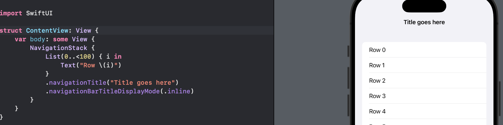
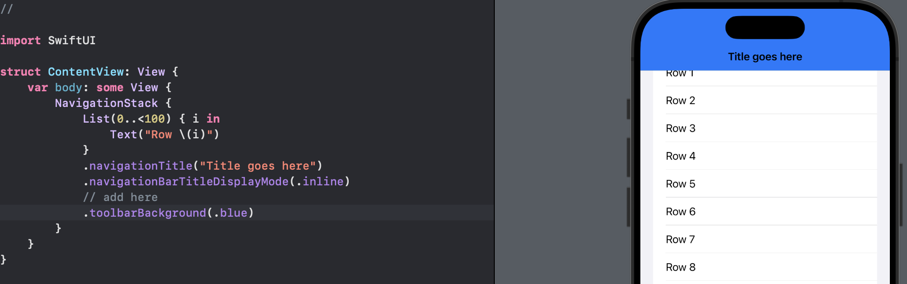
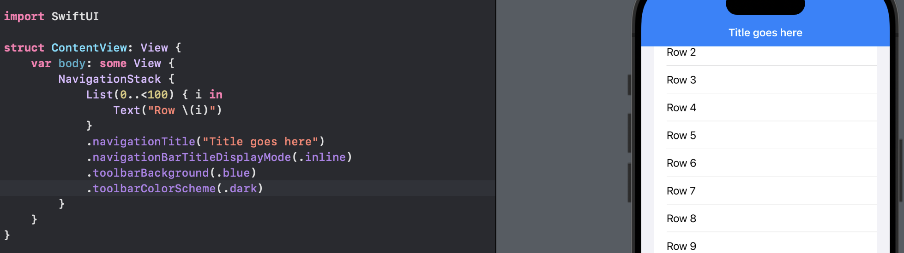
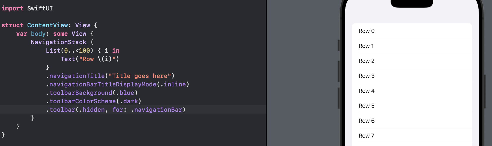
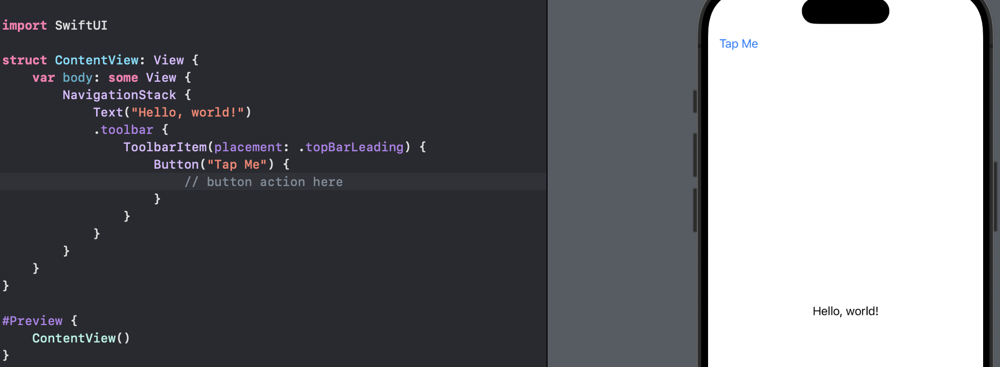
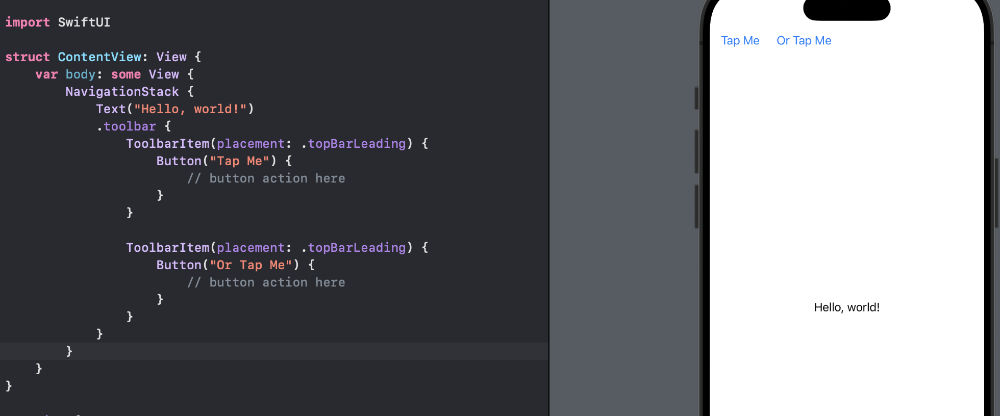
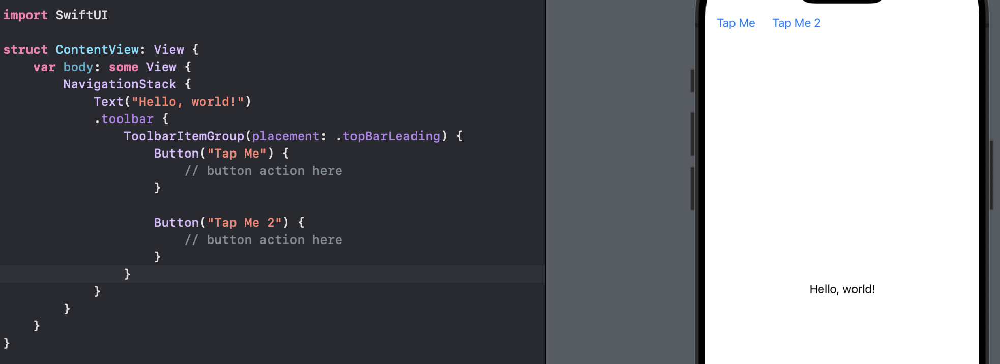
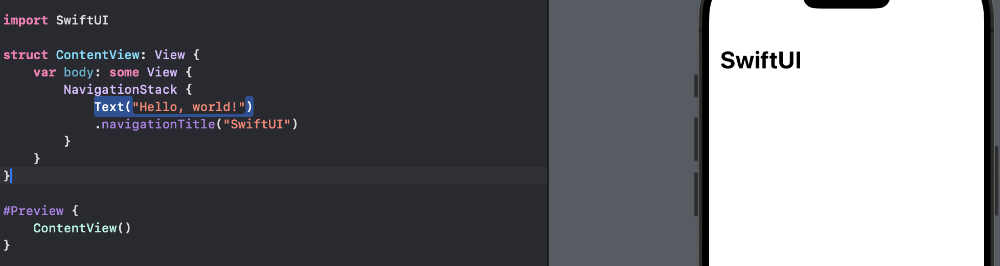
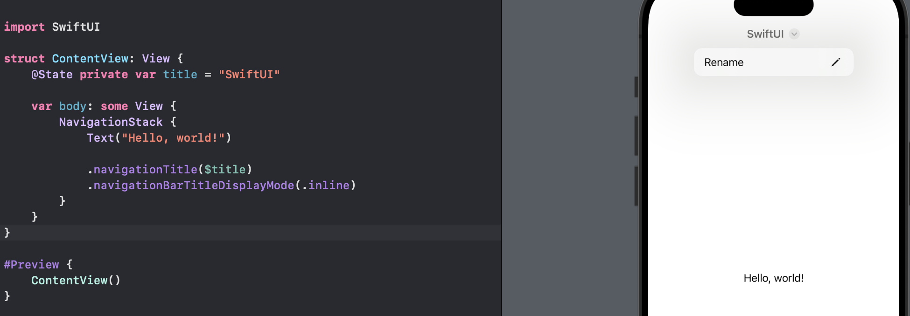

# Day 45 - Project 9, Part 3

## Customizing the Navigation Bar Appearance

We have already seen how we can use larger or inline navigation title styles, giving us large or small text at the top. For example, we can use a small title at the top:

```swift
NavigationStack {
    List(0..<100) { i in
        Text("Row \(i)")
    }
    .navigationTitle("Title goes here")
    .navigationBarTitleDisplayMode(.inline)
}
```

In preview,



SwiftUI lets us costomize this title. We can modify that by adding more modifiers after `navigationBarTitleDisplayMode()`:

```swift
NavigationStack {
    List(0..<100) { i in
        Text("Row \(i)")
    }
    .navigationTitle("Title goes here")
    .navigationBarTitleDisplayMode(.inline)
    // add here
    .toolbarBackground(.blue)
}
```

In preview,



When we run the app and scroll a little, we will see the navigation bar becomes a solid blue color. The title might be difficult to read because it will be black text in light mode. We can fix this by adding another modifier below the previous one, forcing the navigation bar to use dark mode at all times, which in turn means the title text will be white:

```swift
NavigationStack {
    List(0..<100) { i in
        Text("Row \(i)")
    }
    .navigationTitle("Title goes here")
    .navigationBarTitleDisplayMode(.inline)
    .toolbarBackground(.blue)
    // change color scheme
    .toolbarColorScheme(.dark)
}
```

In preview,



NOTE: Those two modifiers, `.toolbarBackground()` and `.toolbarColorScheme()` affect *all* bars, but if we want to just modify the navigation bar, we should add `for: .navigationBar` as a second parameter to both of them.

We can also hide the toolbar, either always or based on the current state in our app:

```swift
NavigationStack {
    List(0..<100) { i in
        Text("Row \(i)")
    }
    .navigationTitle("Title goes here")
    .navigationBarTitleDisplayMode(.inline)
    .toolbarBackground(.blue)
    .toolbarColorScheme(.dark)
    // hide toolbar
    .toolbar(.hidden, for: .navigationBar)
}
```

In preview,



## Placing toolbar Buttons in Exact Locations

When we place buttons in a `NavigationStack` toolbar in the iOS apps, SwiftUI will place them in the right-hand side of the navigation bar.

We can customize this using `ToolbarItem`, allowing us to place them exactly where we want by choosing from one of several options:

```swift
NavigationStack {
    Text("Hello, world!")
    .toolbar {
        ToolbarItem(placement: .topBarLeading) {
            Button("Tap Me") {
                // button action here
            }
        }
    }
}
```

In preview,



This places a button on the left-hand side.

It is usually better to use one of the semantic options:

- `.confirmationAction`, when we want users to agree to something, such as agreeing to terms of service.

- `.destructiveAction`, when the user needs to make a choice to destroy whatever it is they are working with, such as confirming they want to remove some data they created.

- `.cancellationAction`, when the user needs to back out of changes they have made, such as discarding changes they have made.

- `.navigation`, which is used for buttons that make the user move between data, such as going back and forward in a web browser.

Semantic placements comes with two benefits:

- iOS has extra information about what our buttons do, it can add extra styling.

- these positions automatically adapt on other platforms, so our button will always appear in the correct place on iOS, macOS, watchOS, and more.


NOTE: If we need the user to decide between saving a change or discarding it, we might want to add the `navigationBarBackButtonHidden()` modifier so that they cannot tap Back to exit without making a choice.

If we want multiple buttons using the same placement, we can either repeat `ToolbarItem`:

```swift
NavigationStack {
    Text("Hello, world!")
    .toolbar {
        ToolbarItem(placement: .topBarLeading) {
            Button("Tap Me") {
                // button action here
            }
        }

        ToolbarItem(placement: .topBarLeading) {
            Button("Or Tap Me") {
                // button action here
            }
        }
    }
}
```

In preview,



Or we can use `ToolbarItemGroup`:

```swift
NavigationStack {
    Text("Hello, world!")
    .toolbar {
        ToolbarItemGroup(placement: .topBarLeading) {
            Button("Tap Me") {
                // button action here
            }

            Button("Tap Me 2") {
                // button action here
            }
        }
    }
}
```

In preview,



## Making Our Navigation Title Editable

The basic `navigationTitle()` modifier lets us display a string in the navigation bar:

```swift
struct ContentView: View {
    var body: some View {
        NavigationStack {
            Text("Hello, world!")
            .navigationTitle("SwiftUI")
        }
    }
}
```

In preivew,



If we use the `.inline` title display mode, we can also pass a *binding* to `navigationTitle()`.

This will be displayed as usual, but iOS will show a small arrow next to our title, that reveals a "Rename" button to change the title:

```swift
struct ContentView: View {
    @State private var title = "SwiftUI"

    var body: some View {
        NavigationStack {
            Text("Hello, world!")

            .navigationTitle($title)
            .navigationBarTitleDisplayMode(.inline)
        }
    }
}
```

In preview,



This is great when that title reflects the name of something entered by the user, because it means we do not need to add an extra textfield to our layout.


