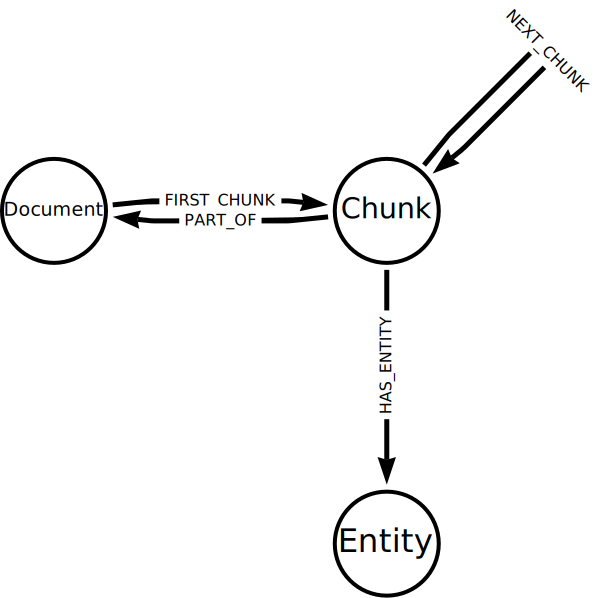

# Building Knowledge Graphs with LLMs

## Knowledge Graphs
**Knowledge graphs** provide a structured way to represent entities, their attributes, and their relationships, allowing for a comprehensive and interconnected understanding of the information. A knowledge graph stores data and relationships alongside frameworks known as **organizing principles**. 

The **organizing principles** are the rules or categories around the data that provide structure to the data. The organizing principles are stored as nodes in the graph and can be stored alongside the actual data.

Benefits of knowledge graphs
- enhanced data integration and interoperability
- improved search and discovery
- contextual understanding
- enhanced decision making

Challenges of knowledge graphs
- data collection and integration
- data quality and consistency
- data modeling & schema design
- entity resolution
- entity linking & relationship

We will use [`llm-knowledge-graph-construction`](https://github.com/neo4j-graphacademy/llm-knowledge-graph-construction) repository to build a knowledge graph using LLMs. The knowledge graph maps the relationships between the following entity types referred to in the articles:
- `Person`
- `Location`
- `Organization`
- `Building`
- `Political party`
- `State`

To reveal how the entities from the articles are related to each other:
```sql
MATCH p=(a:Article)-[:HAS_ENTITY]->(e)-[r]-()
RETURN p
```
The above query will return the paths between the articles and the entities. The `HAS_ENTITY` relationship is used to connect the articles to the entities. The `r` variable represents the relationship between the entities. The `p` variable represents the path between the articles and the entities `(a:Article)-[:HAS_ENTITY]->(e)-[r]-()`.

We can check how **Jimmy Carter** was connected to the other `Person` entities:
```sql
MATCH (p:Person {id: "Jimmy Carter"})-[r]-(p2:Person)
RETURN p, r, p2
```

We can use the nodes and relationships to understand how different entities are related, for example, `Person` and `State` entities:
```sql
MATCH (p:Person)-[r](s:State)
RETURN p, r, s
```

We can also see how the entities of a specific article are connected in the knowledge graph:
```sql
MATCH (a:Article {id: "1976-8"})-[:HAS_ENTITY]->(e)

MATCH (e)-[r]-(e2)
WHERE (a)-[:HAS_ENTITY]->(e2)
RETURN e, r, e2
```
Restricting the entities to only those from a specific article gives us a better understanding of how the entities are related to each other.

Common use cases for knowledge graphs include:
- enhanced data integration and interoperability
- improved search and information retrieval
- advanced analytics and insight generation
- personalized recommendations and content delivery


## LLM Graph Builder
Steps to build a knowledge graph from unstructured text using LLMs:
- Gather data
- Chunk data
- *Vectorize data*
- Pass data to LLM to extract nodes and relationships
- Use output to generated knowledge graph

The [Neo4j LLM Graph Builder](https://llm-graph-builder.neo4jlabs.com/) is a tool for tuning unstructured data into a knowledge graph. It automates the same process described above.

After building the knowledge graph with the LLM Graph Builder, We can explore the structure of the knowledge graph using the Neo4j Browser. The data model template is shown below:



- Each `Document` node represents a document or text source uploaded to the LLM Graph Builder.
- The `Document` is split into `Chunk` nodes, identified by `FIRST_CHUNK` and `PART_OF` relationships.
- The LLM processes the chunks and `Entity` nodes extracted. The graph connects the `Entity` nodes to the `Chunk` nodes using the `HAS_ENTITY` relationship.
- The LLM may also extract relationships between entities.

We can explore the knowledge graph:
```sql
MATCH (d:Document
    {fileName:'llm-fundamentals_1-introduction_1-neo4j-and-genai.pdf'}
    )
MATCH (d)<-[:PART_OF]-(c:Chunk)-[:HAS_ENTITY]->(e)
RETURN e
```
This query will return all the entities extracted from the document `llm-fundamentals_1-introduction_1-neo4j-and-genai.pdf`. We can modify the query to return the label and ID of the entities:
```sql
MATCH (d:Document
    {fileName:'llm-fundamentals_1-introduction_1-neo4j-and-genai.pdf'}
    )
MATCH (d)<-[:PART_OF]-(c:Chunk)-[:HAS_ENTITY]->(e)
RETURN labels(e) as labels, e.id as entity
```

By matching a path from the document to the entities, we can see how the entities relate to the document:
```sql
MATCH (d:Document
    {fileName:'llm-fundamentals_1-introduction_1-neo4j-and-genai.pdf' }
    )
MATCH p = (d)-[*0..3]-(e)
RETURN p
```
The `[*0..3]` pattern matches paths of up to three relationships between the document and the entities. Increasing the number will return more complex paths, but the query will take longer. We can see what documents contain a specific entity:
```sql
MATCH (e:Concept {id: "Hallucination"})<-[:HAS_ENTITY]-(c:Chunk)-[:PART_OF]->(d:Document)
RETURN DINSTINCT d.fileName
```

## Build a Graph with Python
Clone the repository:
```bash
git clone https://github.com/neo4j-graphacademy/llm-knowledge-graph-construction
cd llm-knowledge-graph-construction
pip install -r requirements.txt
```

Set up a `.env` file with the following variables:
```bash
OPENAI_API_KEY=your_openai_api_key
NEO4J_URI=bolt://localhost:7687
NEO4J_USERNAME=neo4j
NEO4J_PASSWORD=password
```

#### Gather data
```python
from langchain_community.document_loaders import DirectoryLoader, PyPDFLoader

DOCS_PATH = 'llm-knowledge-graph/data/course/pdfs'
loader = DirectoryLoader(DOCS_PATH, glob="**/*.pdf", loader_cls=PyPDFLoader)
docs = loader.load()
```
The `glob` specifies the search path to find the PDFs.

#### Chunk data
```python
from langchain.text_splitter import CharacterTextSplitter

text_splitter = CharacterTextSplitter(
    separator="\n\n",
    chunk_size=1500,
    chunk_overlap=200,
)
chunks = text_splitter.split_documents(docs)
```
We will split the text into paragraphs with a double newline separator `\n\n`.

#### Vectorize data
```python
import os
from langchain_openai import OpenAIEmbeddings
from langchain_neo4j import Neo4jGraph

embedding_model = OpenAIEmbeddings(
    openai_api_key=os.getenv("OPENAI_API_KEY"),
    model="text-embedding-ada-002",
)

graph = Neo4jGraph(
    url=NEO4J_URI,
    username=NEO4J_USERNAME,
    password=NEO4J_PASSWORD,
)

for chunk in chunks:
    # Extract the filename
    filename = os.path.basename(chunk.metadata['source'])
    # Create a unique id for the chunk
    chunk_id = f"{filename}.{chunk.metadata['page']}"
    # Embed the chunk
    chunk_embedding = embedding_model.embed_query(chunk.page_content)
    
    # Add the Document and Chunk nodes to the graph
    properties = {
        'filename': filename,
        'chunk_id': chunk_id,
        'text': chunk.page_content,
        'text_embedding': chunk_embedding,
    }

    graph.query(
        """
        MERGE (d:Document {id: $filename})
        MERGE (c:Chunk {id: $chunk_id})
        SET c.text = $text
        MERGE (d)<-[:PART_OF]-(c)

        WITH c
        CALL db.create.setNodeVectorProperty(c, 'embedding', $text_embedding)
        """,
        properties
    )


# Create the vector index
graph.query(
    """
    CREATE VECTOR INDEX `vector`
    FOR (c:Chunk)
    ON (c.embedding)
    OPTIONS {indexConfig: {
        `vector.dimensions`: 1536,
        `vector.similarity_function`: 'cosine'
    }}
    """
)
```

#### Extract nodes and relationships
We will use the LangChain `LLMGraphTransformer` to extract the nodes and relationships. The `LLMGraphTransformer` requires an `llm`.
```python
from langchain_openai import ChatOpenAI
from langchain_experimental.graph_transformers import LLMGraphTransformer

llm = ChatOpenAI(
    openai_api_key=os.getenv("OPENAI_API_KEY"),
    model='gpt-4o'
)

doc_transformer = LLMGraphTransformer(llm=llm)

for chunk in chunks:
    # Generate the entites and relationships from the chunk
    grpah_docs = doc_transformer.convert_to_graph_documents([chunk])
```
The `convert_to_graph_documents` method uses the `llm` to generate a set of graph docs of nodes and relationships.

#### Use the output to generate the graph
The graph documents consist of a set of entity nodes. A `Node` representing the `Chunk` and a `HAS_ENTITY` relationship is added to each graph document to create a link between the generated entities and the source document.
```python
from langchain_community.graphs.graph_document import Node, Relationship

for chunk in chunks:
    filename = os.path.basename(chunk.metadata['source'])
    chunk_id = f"{filename}.{chunk.metadata['page']}"

    graph_docs = doc_transformer.convert_to_graph_documents([chunk])

    # Map the entities in the graph document to the Chunk node
    for graph_doc in graph_docs:
        chunk_node = Node(
            id=chunk_id,
            type="Chunk"
        )

        for node in graph_doc.nodes:
            graph_doc.relationships.append(
                Relationship(
                    source=chunk_node,
                    target=node,
                    type="HAS_ENTITY",
                )
            )

    # Add the graph documents to the graph
    graph.add_graph_documents(graph_docs)
```
The `add_graph_documents` method creates the nodes and relationships in the Neo4j graph.

After running the code above, the last step is to create the vector index:
```python
graph.query(
    """
    CREATE VECTOR INDEX `vector`
    FOR (c:Chunk)
    ON (c.embedding)
    OPTIONS {indexConfig: {
        `vector.dimensions`: 1536,
        `vector.similarity_function`: 'cosine'
    }}
    """
)
```

### Build a Knoledge Graph with Python
The complete code to build a knowledge graph using LangChain:
```python
import os

from langchain_community.document_loaders import DirectoryLoader, PyPDFLoader
from langchain.text_splitter import CharacterTextSplitter
from langchain_openai import OpenAIEmbeddings
from langchain_neo4j import Neo4jGraph
from langchain_openai import ChatOpenAI
from langchain_experimental.graph_transformers import LLMGraphTransformer
from langchain_community.graphs.graph_document import Node, Relationship

from dotenv import load_dotenv
load_dotenv()

DOCS_PATH = "llm-knowledge-graph/data/course/pdfs"

llm = ChatOpenAI(
    openai_api_key=os.getenv('OPENAI_API_KEY'), 
    model_name="gpt-3.5-turbo"
)

embedding_provider = OpenAIEmbeddings(
    openai_api_key=os.getenv('OPENAI_API_KEY'),
    model="text-embedding-ada-002"
    )

graph = Neo4jGraph(
    url=os.getenv('NEO4J_URI'),
    username=os.getenv('NEO4J_USERNAME'),
    password=os.getenv('NEO4J_PASSWORD')
)

doc_transformer = LLMGraphTransformer(
    llm=llm,
    )

# Load and split the documents
loader = DirectoryLoader(DOCS_PATH, glob="**/*.pdf", loader_cls=PyPDFLoader)

text_splitter = CharacterTextSplitter(
    separator="\n\n",
    chunk_size=1500,
    chunk_overlap=200,
)

docs = loader.load()
chunks = text_splitter.split_documents(docs)

for chunk in chunks:

    filename = os.path.basename(chunk.metadata["source"])
    chunk_id = f"{filename}.{chunk.metadata["page"]}"
    print("Processing -", chunk_id)

    # Embed the chunk
    chunk_embedding = embedding_provider.embed_query(chunk.page_content)

    # Add the Document and Chunk nodes to the graph
    properties = {
        "filename": filename,
        "chunk_id": chunk_id,
        "text": chunk.page_content,
        "embedding": chunk_embedding
    }
    
    graph.query("""
        MERGE (d:Document {id: $filename})
        MERGE (c:Chunk {id: $chunk_id})
        SET c.text = $text
        MERGE (d)<-[:PART_OF]-(c)
        WITH c
        CALL db.create.setNodeVectorProperty(c, 'textEmbedding', $embedding)
        """, 
        properties
    )

    # Generate the entities and relationships from the chunk
    graph_docs = doc_transformer.convert_to_graph_documents([chunk])

    # Map the entities in the graph documents to the chunk node
    for graph_doc in graph_docs:
        chunk_node = Node(
            id=chunk_id,
            type="Chunk"
        )

        for node in graph_doc.nodes:

            graph_doc.relationships.append(
                Relationship(
                    source=chunk_node,
                    target=node, 
                    type="HAS_ENTITY"
                    )
                )

    # add the graph documents to the graph
    graph.add_graph_documents(graph_docs)

# Create the vector index
graph.query("""
    CREATE VECTOR INDEX `chunkVector`
    IF NOT EXISTS
    FOR (c: Chunk) ON (c.textEmbedding)
    OPTIONS {indexConfig: {
    `vector.dimensions`: 1536,
    `vector.similarity_function`: 'cosine'
    }};""")
```

### Documents
We could load a set of PDF documents in a directory
```python
loader = DirectoryLoader(DOCS_PATH, glob="**/*.pdf", loader_cls=PyPDFLoader)
```
We can also load data from a CSV file:
```python
from langchain_community.document_loaders.csv_loader import CSVLoader

loader = CSVLoader(file_path="path/to/csv_file.csv")
```

### Allowed nodes and relationships
We can specify the allowed nodes and relationships in the `LLMGraphTransformer`:
```python
doc_transformer = LLMGraphTransformer(
    llm=llm,
    allowed_nodes=[
        "Technology",
        "Concept",
        "Skill",
        "Event",
        "Person",
        "Object",
    ]
)
```
We can also specify the allowed relationships:
```python
doc_transformer = LLMGraphTransformer(
    llm=llm,
    allowed_nodes=["Technology", "Concept", "Skill", "Event", "Person", "Object"],
    allowed_relationships=["USES", "HAS", "IS", "AT", "KNOWS"],
)
```
Restricting the nodes and relationship will result in a more concise knowledge graph. A more concise graph may support us in answering specific questions but it could also be missing information.

### Properties
We can also instruct the LLM to include properties in the nodes and relationships.
```python
doc_transformer = LLMGraphTransformer(
    llm=llm,
    allowed_nodes=["Technology", "Concept", "Skill", "Event", "Person", "Object"],
    node_properties=["name", "description"],
)
```
This allows a `name` and `description` property to be added to the nodes if the values can be determined from the text.

After generating the graph documents, we can query the graph
```sql
MATCH (d:Document)-[*]-(n)
RETURN d, n
LIMIT 50
```

## Querying Knowledge Graphs

### Querying with Cypher
The graph generated by an LLM may not conform to a strict schema (depending on how we configured the LLM). The lack of a strict schema changes how we query the graph. We may not be looking to find a specific node or relationship, but rather a pattern or structure in the graph.

The entities in the graph allow us to understand what the text is about.
```sql
MATCH ()-[:HAS_ENTITY]->(e)
RETURN labels(e) as labels, count(e) as nodes
ORDER BY nodes DESC
```
This query will return the most mentioned topics in the graph by counting the number of times a node label (or entity) appears in the graph. LLM’s have inherent "randomness" and as such will generate different results, and therefore different entities, each time the graph is created. We can drill down into the entity ID to gain insights into the content. For example, we can find the most mentioned `Technology` entity:
```sql
MATCH ()-[r:HAS_ENTITY]->(e:Technology)
RETURN e.id AS entityId, count(r) AS mentions
ORDER BY mentions DESC
```

The relationships in the graph allow uS to understand how entities are connected and the context of the text.
```sql
MATCH ()-[:HAS_ENTITY]->(entity)-[r]->(other)<-[:HAS_ENTITY]-()
RETURN DISTINCT type(r) AS relType, count(r) AS number
ORDER BY number DESC
```
This query will return all the entities between the chunks and relationships between them.

We can also build statements about the content by using the entity labels, id, and relationship type:
```sql
MATCH ()-[:HAS_ENTITY]->(entity)-[r]->(other)<-[:HAS_ENTITY]-()
RETURN DISTINCT
    labels(entity), entity.id, type(r), labels(other), other.id
```

The knowledge graph can also show us the connections within the content. For example, what documents relate to each other.
```sql
MATCH (d:Document {
    id: "llm-fundamentals_1-introduction_1-neo4j-and-genai.pdf"
})<-[:PART_OF]-(c:Chunk)
MATCH (c)-[:HAS_ENTITY]->(entity)<-[:HAS_ENTITY]-(otherChunk)
MATCH (otherChunk)-[:PART_OF]->(otherDocument)
RETURN DISTINCT entity.id, otherDocument.id
```

We can restrict the query output to a specific entity type:
```sql
MATCH (d:Document {
    id: "llm-fundamentals_1-introduction_2-hallucination.pdf"
})<-[:PART_OF]-(c:Chunk)
MATCH (c)-[:HAS_ENTITY]->(e)

MATCH p = (e)-[r]-(e2)
WHERE (c)-[:HAS_ENTITY]->(e2)

RETURN p
```

We can gain the node labels, ids, relationship types by *unwinding* the path's relationships:
```sql
MATCH (d:Document {
    id: "llm-fundamentals_1-introduction_2-hallucination.pdf"
})<-[:PART_OF]-(c:Chunk)
MATCH (c)-[:HAS_ENTITY]->(e)

MATCH p = (e)-[r]-(e2)
WHERE (c)-[:HAS_ENTITY]->(e2)

UNWIND relationships(p) as rels
RETURN
    labels(startNode(rels))[0] as eLabel,
    startNode(rels).id as eId,
    type(rels) as relType,
    labels(endNode(rels))[0] as e2Label,
    endNode(rels).id as e2Id
```

The chunks in the knowledge graph can be queried using the vector index to find similar entities.
```sql
WITH genai.vector.encode(
    "Why do LLMs get things wrong?",
    "OpenAI",
    { token: "sk-..." }) AS userEmbedding
CALL db.index.vector.queryNodes('chunkVector', 6, userEmbedding)
YIELD node, score
RETURN node.text, score
```

We can find the related nodes and relationships by unwinding the relationships:
```sql
WITH genai.vector.encode(
    "Why do LLMs get things wrong?",
    "OpenAI",
    { token: "sk-..." }) AS userEmbedding
CALL db.index.vector.queryNodes('chunkVector', 6, userEmbedding)
YIELD node, score

MATCH (node)-[:HAS_ENTITY]->(e)
MATCH p = (e)-[r]-(e2)
WHERE (node)-[:HAS_ENTITY]->(e2)

UNWIND relationships(p) as rels
WITH node, score, collect(
        [
            labels(startNode(rels))[0],
            startNode(rels).id,
            type(rels),
            labels(endNode(rels))[0],
            endNode(rels).id
        ]
    )
    as kg
RETURN node.text, score, kg
```

### Querying with LLMs
Using an LLM to generate cypher can help us query the knowledge graph, particularly when the schema is created from unstructured data. The LLM uses the knowledge graph schema to dynamically create Cypher queries.

We will use the `GraphCypherQAChain` to query the knowledge graph.

We will trust the generation of Cypher to the LLM. It may generate invalid Cypher queries that could corrupt data in the graph or provide access to sensitive information. We have to opt-in to this risk by setting the `allow_dangerous_requests` flag to `True`.

```python
import os
from langchain_openai import ChatOpenAI
from langchain_neo4j import GraphCypherQAChain, Neo4jGraph
from langchain.prompts import PromptTemplate

from dotenv import load_dotenv
load_dotenv()

llm = ChatOpenAI(
    openai_api_key=os.getenv('OPENAI_API_KEY'), 
    temperature=0
)

graph = Neo4jGraph(
    url=os.getenv('NEO4J_URI'),
    username=os.getenv('NEO4J_USERNAME'),
    password=os.getenv('NEO4J_PASSWORD')
)

CYPHER_GENERATION_TEMPLATE = """Task:Generate Cypher statement to query a graph database.
Instructions:
Use only the provided relationship types and properties in the schema.
Do not use any other relationship types or properties that are not provided.
Only include the generated Cypher statement in your response.

Always use case insensitive search when matching strings.

Schema:
{schema}

The question is:
{question}"""

cypher_generation_prompt = PromptTemplate(
    template=CYPHER_GENERATION_TEMPLATE,
    input_variables=["schema", "question"],
)

cypher_chain = GraphCypherQAChain.from_llm(
    llm,
    graph=graph,
    cypher_prompt=cypher_generation_prompt,
    verbose=True,
    allow_dangerous_requests=True
)

def run_cypher(q):
    return cypher_chain.invoke({"query": q})

while (q := input("> ")) != "exit":
    print(run_cypher(q))
```

The name of entities in the knowledge graph are not always in the same case as the question. We can include an additional instruction and example in the prompt to help the LLM understand and generate this Cypher:
```python
CYPHER_GENERATION_TEMPLATE = """Task:Generate Cypher statement to query a graph database.
Instructions:
Use only the provided relationship types and properties in the schema.
Do not use any other relationship types or properties that are not provided.
Only include the generated Cypher statement in your response.

Always use case insensitive search when matching strings.

Schema:
{schema}

Examples: 
# Use case insensitive matching for entity ids
MATCH (c:Chunk)-[:HAS_ENTITY]->(e)
WHERE e.id =~ '(?i)entityName'

The question is:
{question}"""
```
We can also provide specific examples related to navigating the graph structure. For example, we can find documents from the extracted entities:
```python
CYPHER_GENERATION_TEMPLATE = """Task:Generate Cypher statement to query a graph database.
Instructions:
Use only the provided relationship types and properties in the schema.
Do not use any other relationship types or properties that are not provided.
Only include the generated Cypher statement in your response.

Always use case insensitive search when matching strings.

Schema:
{schema}

Examples: 
# Use case insensitive matching for entity ids
MATCH (c:Chunk)-[:HAS_ENTITY]->(e)
WHERE e.id =~ '(?i)entityName'

# Find documents that reference entities
MATCH (d:Document)<-[:PART_OF]-(:Chunk)-[:HAS_ENTITY]->(e)
WHERE e.id =~ '(?i)entityName'
RETURN d

The question is:
{question}"""
```

The `GraphCypherQAChain` also provides configuration options to improve the Cypher genreation. If there are node labels or relationship types that we wish to exclude from our Cypher queries, we can use the `exclude_types` parameter. For example, if we store conversation history alongside our knowledge graph, we could exclude those nodes and relationships:
```python
cypher_chain = GraphCypherQAChain.from_llm(
    llm,
    graph=graph,
    cypher_prompt=cypher_generation_prompt,
    verbose=True,
    exclude_types=["Session", "Message", "LAST_MESSAGE", "NEXT"],
    allow_dangerous_requests=True
)
```

If the properties within our knowledge graph contain a relatively small range of values, we may benefit from using the `enhanced_schema` parameter. When we set the `enhanced_schema` parameter, the system scans property values and provides examples to the LLM when generating Cypher queries. This can lead to more accurate queries at the cost of more complex prompts, and potentially slower generation times.
```python
cypher_chain = GraphCypherQAChain.from_llm(
    llm,
    graph=graph,
    cypher_prompt=cypher_generation_prompt,
    verbose=True,
    enhanced_schema=True,
    allow_dangerous_requests=True
)
```

We can also configure to use different LLMs for Cypher and question/answer generation. Using different LLMs can give give improved performance and/or better cost efficiency. Picking the right LLM for the right task can be a trade-off between speed and accuracy.
```python
qa_llm = ChatOpenAI(
    openai_api_key=os.getenv('OPENAI_API_KEY'), 
    model="gpt-3.5-turbo",
)

cypher_llm = ChatOpenAI(
    openai_api_key=os.getenv('OPENAI_API_KEY'), 
    model="gpt-4",
    temperature=0
)
cypher_chain = GraphCypherQAChain.from_llm(
    qa_llm=qa_llm,
    cypher_llm=cypher_llm,
    graph=graph,
    cypher_prompt=cypher_generation_prompt,
    verbose=True,
    allow_dangerous_requests=True
)
```

### Integrate with a Retriever
The complete code:
```python
import os
from dotenv import load_dotenv
load_dotenv()

from langchain_openai import ChatOpenAI
from langchain_openai import OpenAIEmbeddings
from langchain_neo4j import Neo4jGraph, Neo4jVector
from langchain.chains.combine_documents import create_stuff_documents_chain
from langchain.chains.retrieval import create_retrieval_chain
from langchain_core.prompts import ChatPromptTemplate

llm = ChatOpenAI(
    openai_api_key=os.getenv('OPENAI_API_KEY'), 
    temperature=0
)

embedding_provider = OpenAIEmbeddings(
    openai_api_key=os.getenv('OPENAI_API_KEY')
    )

graph = Neo4jGraph(
    url=os.getenv('NEO4J_URI'),
    username=os.getenv('NEO4J_USERNAME'),
    password=os.getenv('NEO4J_PASSWORD')
)

chunk_vector = Neo4jVector.from_existing_index(
    embedding_provider,
    graph=graph,
    index_name="chunkVector",
    embedding_node_property="textEmbedding",
    text_node_property="text",
    retrieval_query="""
// get the document
MATCH (node)-[:PART_OF]->(d:Document)
WITH node, score, d

// get the entities and relationships for the document
MATCH (node)-[:HAS_ENTITY]->(e)
MATCH p = (e)-[r]-(e2)
WHERE (node)-[:HAS_ENTITY]->(e2)

// unwind the path, create a string of the entities and relationships
UNWIND relationships(p) as rels
WITH 
    node, 
    score, 
    d, 
    collect(apoc.text.join(
        [labels(startNode(rels))[0], startNode(rels).id, type(rels), labels(endNode(rels))[0], endNode(rels).id]
        ," ")) as kg
RETURN
    node.text as text, score,
    { 
        document: d.id,
        entities: kg
    } AS metadata
"""
)

instructions = (
    "Use the given context to answer the question."
    "Reply with an answer that includes the id of the document and other relevant information from the text."
    "If you don't know the answer, say you don't know."
    "Context: {context}"
)

prompt = ChatPromptTemplate.from_messages(
    [
        ("system", instructions),
        ("human", "{input}"),
    ]
)

chunk_retriever = chunk_vector.as_retriever()
chunk_chain = create_stuff_documents_chain(llm, prompt)
chunk_retriever = create_retrieval_chain(
    chunk_retriever, 
    chunk_chain
)

def find_chunk(q):
    return chunk_retriever.invoke({"input": q})

while (q := input("> ")) != "exit":
    print(find_chunk(q))
```

Initially, we will use the `Neo4jVector`:
```python
chunk_vector = Neo4jVector.from_existing_index(
    embedding_provider,
    graph=graph,
    index_name="chunkVector",
    embedding_node_property="textEmbedding",
    text_node_property="text",
    retrieval_query="""
// get the document
MATCH (node)-[:PART_OF]->(d:Document)
WITH node, score, d

// get the entities and relationships for the document
MATCH (node)-[:HAS_ENTITY]->(e)
MATCH p = (e)-[r]-(e2)
WHERE (node)-[:HAS_ENTITY]->(e2)

// unwind the path, create a string of the entities and relationships
UNWIND relationships(p) as rels
WITH 
    node, 
    score, 
    d, 
    collect(apoc.text.join(
        [labels(startNode(rels))[0], startNode(rels).id, type(rels), labels(endNode(rels))[0], endNode(rels).id]
        ," ")) as kg
RETURN
    node.text as text, score,
    { 
        document: d.id,
        entities: kg
    } AS metadata
"""
)
```
The `retrieval_query` is used to structure the output of the retriever. The query matches the entities and relationships for the chunks and reutrns the data in the format `nodeLabel`, `entityId`, `RELATIONSHIP_TYPE`.

Then, we will create the retriever from the `prompt`, `chunk_chain`, and `Neo4jVector`:
```python
instructions = (
    "Use the given context to answer the question."
    "Reply with an answer that includes the id of the document and other relevant information from the text."
    "If you don't know the answer, say you don't know."
    "Context: {context}"
)

prompt = ChatPromptTemplate.from_messages(
    [
        ("system", instructions),
        ("human", "{input}"),
    ]
)

chunk_retriever = chunk_vector.as_retriever()
chunk_chain = create_stuff_documents_chain(llm, prompt)
chunk_retriever = create_retrieval_chain(
    chunk_retriever, 
    chunk_chain
)
```