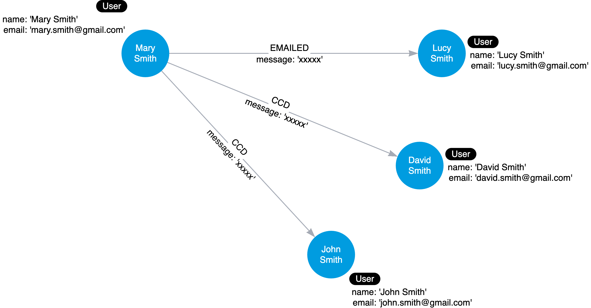

# Graph Data Modeling Fundamentals

## Introduction
The Neo4j components that are used to define the graph data model are:
- Nodes
- Labels
- Relationships
- Properties

**Steps to create a graph data model:**
1. Understand the domain and define specific use cases (questions) for the application.
2. Develop the initial graph data model:
    1. Model the nodes (entities)
    2. Model the relationships between nodes
3. Test the use cases against the initial data model.
4. Create the graph (instance model) with test data using Cypher.
5. Test the use cases, including performance against the graph.
6. Refactor (improve) the graph data model due to a change in the key use cases or for performance reasons.
7. Implement the refactoring on the graph and retest using Cypher.

### The Domain
In this tutorial, we still use the "starter" movie graph. The domain includes movies, people who acted or directed movies, and users who rated movies.

Most use cases for an application can be enumerated by a comprehensive list of questions. The use cases help to define how the application will behave at runtime. In our domain, we want to differentiate a person who acted in or directed a movie and a user or reviewer who rated a movie.

### Purpose of the Model
When performing the graph data modeling, we need 
- Data model
- Instance model

The **data model** describes the labels, relationships, and properties for the graph. It does not have specific data that will be created in the graph. A data model is important because it defines the names that will be used for labels, relationship types, and properties when the graph is created and used by the application.

Labels, relationship types, and property keys are case-sensitive, unlike Cypher keywords which are case-insensitive. A Neo4j best practice for naming:
- A label is a single identifier that begins with a capital letter and can be **CamelCase**.
    - Examples: `Person`, `Movie`, `Company`, `GitHubRepo`
- A relationship type is a single identifier that is in all capital letters with the underscore character `_` separating words.
    - Examples: `ACTED_IN`, `FOLLOWS`, `MARRIED_TO`
- A property key for a node or a relationship is a single identifier that begins with a lowercase letter and can be **camelCase**.
    - Examples: `firstName`, `lastName`, `deptId`, `rating`

NOTE: Property key names need not be unique. For example, for a `Person` node and a `Movie` node, each can have the property key `id`.

The **instance model** is the actual graph that is created in Neo4j. In the instance model, we have specific data that is created in the graph for the nodes, relationships, and properties. The instance model can be used to test the use cases and performance of the graph.

## Modeling Nodes
Entities are the dominant nouns in our application. The entities will be the labeled nodes in the graph data model. In the Movie domain, we have the `Movie`, `Person`, and `User` entities.

Node properties are use to
- uniquely identify a node
- answer specific details about the node
- return data

For example, in the Movie domain, properties are used to
- anchor (where to begin in the query)
    - ```MATCH (p:Person {name: 'Tom Hanks'})-[:ACTED_IN]-(m:Movie) RETURN m```
- traverse the graph
    - ```MATCH (p:Person)-[:ACTED_IN]-(m:Movie {title: 'Apollo 13'})-[:RATED]-(u:User) RETURN p,u```
- return data from the query
    - ```MATCH (p:Person {name: 'Tom Hanks'})-[:ACTED_IN]-(m:Movie) RETURN m.title, m.released```

In the *Movie* graph, we use the following properties to uniquely identify our nodes:
- `Person.tmdbId`
- `Movie.tmdbId`

The following properties are deifned for the `Movie` nodes:
- `Movie.title` (string)
- `Movie.released` (date)
- `Movie.imdbRating` (decimal between 0 and 10)
- `Movie.genres` (list of strings)

The following properties are defined for the `Person` nodes:
- `Person.name` (string)
- `Person.born` (date)
- `Person.died` (date)

## Modeling Relationships
Connections are the **verbs** in our application.

Relationship types need to be intuitive to stakeholders and developers alike. Relationship types cannot be confused with an entity name. When we create a relationship in Neo4j, a direction must either be specified explicitly or inferred by the left-to-right direction in the pattern specified. At runtime, during a query, direction is typically not required.

In the *Movie* graph, we have the following relationships:
- `ACTED_IN`
- `DIRECTED`

Both of these relationship types start at `Person` nodes and end in `Movie` nodes.

Properties for a relationship are used to enrich how two nodes are related. When we define a property for a relationship, we want to answer how two nodes are related.

In the *Movie* graph, when we want to figure out what role a person played in a movie, we know that the *role* for a particular `ACTED_IN` relationship will be necessary for this, so we add the *role* property to this relationship.

## Testing the Model
We can run the following Cypher query where we specify the title of the movie:
```sql
MATCH (p:Person)-[:ACTED_IN]-(m:Movie)
WHERE m.title = 'Sleepless in Seattle'
RETURN p.name AS Actor
```

A really important factor with testing the graph is **scalability**. We want to make sure that the graph can scale with the data and the queries that we will run against it.

## Refactoring the Graph
Refactoring is the process of changing the data model and the graph. The reasons for refactoring can be:
- the graph as modeled does not answer all of the use cases
- a new use case has come up that we must account for in our data model
- the cypher for the use cases does not perform optimally, especially when the graph scales

To refactor a graph data model and a graph,
1. Design the new data model
2. Write Cypher code to transform the existing graph to implement the new data model
3. Retest all use cases.


Node labels serve as an anchor point for a query, By specifying a label, we reduce the amount of data that is retrieved. For example,
- `MATCH (n) RETURN n` returns all nodes in the graph.
- `MATCH (n:Person) RETURN n` returns all `Person` nodes in the graph.

Our goal in modeling should be to reduce the size of the graph that is toched by a query.

We should use labels wisely in our data model. They should be used if it will help with **most** of our use cases. A best practice is to limit the number of labels for a node to 4. If the use of a property for a node will suffice, then it is best to not have the label.

To set a new label for a node, we can use the `SET` command in Cypher:
```sql
MATCH (p:Person)
WHERE exists ((p)-[:ACTED_IN]-())
SET p:Actor
```

After we have refactored the graph, we should revisit all queries for our use cases. After we added the `Actor` label to the `Person` nodes, we can now run the following query:
```sql
MATCH (a:Actor)-[:ACTED_IN]-(m:Movie)
WHERE m.title = 'Sleepless in Seattle'
RETURN a.name AS Actor
```
This query is more efficient because it only returns `Actor` nodes and not all `Person` nodes. This query should also return the same results as the previous query.
```sql
MATCH (p:Person)-[:ACTED_IN]-(m:Movie)
WHERE m.title = 'Sleepless in Seattle'
RETURN p.name AS Actor
```

**Semantically orthogonal** means that labels should have nothing to do with one another. We should be careful not to use the same type of label in different contexts.

We should also avoid labeling our nodes to represent hierarchies.

## Eliminating Duplicate Data
Suppose we add a property to each `Movie` node in the graph named `languages` that represents the languages in which a movie is available. Now if all `Movie` nodes have *English* in the list of languages, we have a lot of duplicate data in the graph.

we could use the following query to find all movies in *Italian*:
```sql
MATCH (m:Movie)
WHERE 'Italian' IN m.languages
RETURN m.title
```
However, this query has two issues as the graph scales:
- the name of the language is duplocated in many `Movie` nodes
- all `Movie` nodes must be retrieved to perform the query

To refactor the graph, we will
- Take the property values for each `Movie` node and create a `Language` node.
- Crete the `IN_LANGUAGE` relationship between the `Movie` node and the `Language` node.
- Remove the `languages` property from the `Movie` node.

This is a good example to refactor the graph to turn the property values into nodes:
```sql
MATCH (m:Movie)
UNWIND m.languages AS language

MERGE (l:Language {name: language})
MERGE (m)-[:IN_LANGUAGE]->(l)
SET m.languages = null
```
This query iterates through all `Movie` nodes and creates a `Language` node for each language it find and then creates the relationship between the `Movie` node and the `Language` node using the `IN_LANGUAGE` relationship. It uses the Cypher `UNWIND` clause to separate each element of the `languages` property list into a separate row value that is processed later in the query.

There will only be one node with the language value of *English* and we remove the `languages` property from all `Movie` nodes. This eliminates a lot of duplication in the graph.

If we try `UNWIND` on a property alone and return the value:
```sql
MATCH (m:Movie)
UNWIND m.languages AS language
RETURN language
```
This will return a list of all the languages in the graph, including duplicates. We can use the `DISTINCT` keyword to remove duplicates:
```sql
MATCH (m:Movie)
UNWIND m.languages AS language
RETURN DISTINCT language
```

Next, the `Movie` nodes have a `genres` property that contains a list of genres for each movie.
```sql
MATCH (m:Movie)
RETURN m.title, m.genres
```
We can refactor the graph to create `Genre` nodes and connect them to the `Movie` nodes using an `IN_GENRE` relationship:
```sql
MATCH (m:Movie)
UNWIND m.genres AS genre
MERGE (g:Genre {name: genre})
MERGE (m)-[:IN_GENRE]->(g)
SET m.genres = null
```

### Eliminating Complex Data in Nodes
Since nodes are used to store data about specific entities, we may have intially modeled, for example, a `Production` node to contain the details of the address for the production company. Storing complex data in the nodes like this may not be beneficial for a couple of reasons:
- Duplicate data - many nodes may have production companies in a particular location and the data is repeated in many nodes.
- Queries related to the information in the nodes require that all nodes be retireved.

If there are queries that need to filter production companies by their state, then it will be faster to query based upon the *State.name* value, rather than evaluating all of the *state* properties forthe `Production` nodes.

## Using Specific Relationships
Neo4j as a native graph database is implemented to traverse relationships quickly. It is more performant to query the graph based upon relationship types, rather than properties in the nodes.

Relationships are fast to traverse and they do not take up a lot of space in the graph. In our *Movie* graph, in addition to the `ACTED_IN` and `DIRECTED` relationships, we can add relationships that have year information. In most cases where we specialize relationships, we keep the original generic relationships as existing queries still need to use them.

The code to refactor the graph to add these speciailized relationships uses the APOC library. The following code will refactor the `ACTED_IN` relationships in the graph:
```sql
MATCH (n:Actor)-[:ACTED_IN]->(m:Movie)
CALL apoc.merge.relationship(n, 'ACTED_IN_' + left(m.released, 4), {}, {}, m, {})
YIELD rel
RETURN count(*) AS `Number of relationships merged`
```
The `apoc.merge.relationship` allows us to dynamically create relationships in the graph. It uses the *4 leftmost* characters o the `released` property for a `Movie` node to create the name of the relationship. As a result of the refactoring, we will have the following relationships in the graph:
- `ACTED_IN_1992`
- `ACTED_IN_1993`
- `ACTED_IN_1995`

NOTE that \`Number of relationships merged\` is enclosed in backticks. This is a Neo4j convention to allow for spaces in the name of the column, instead of using single or double quotes.

Then we can rewrite the query from
```sql
MATCH (p:Actor)-[:ACTED_IN]-(m:Movie)
WHERE p.name = 'Tom Hanks' AND
m.released STARTS WITH '1995'
RETURN m.title AS Movie
```
to
```sql
MATCH (p:Actor)[:ACTED_IN_1995]-(m:Movie)
WHERE p.name = 'Tom Hanks'
RETURN m.title AS Movie
```
For this query, only the `ACTED_IN_1995` relationships are traversed. This is a more efficient query than the previous one.

We can refactor the `DIRECTED` relationships in the same way:
```sql
MATCH (n:Director)-[:DIRECTED]-(m:Movie)
CALL apoc.merge.relationship(n, 'DIRECTED_' + left(m.released, 4), {}, {}, m, {})
YIELD rel
RETURN count(*) AS `Number of relationships merged`
```

In our current graph, there are `RATED` relationships between `User` nodes and `Movie` nodes. We can refactor the graph to create a `RATED_` relationship for each specific rating value. This will allow us to quickly find all movies rated with a specific rating. The code to refactor the graph is:
```sql
MATCH (u:User)-[r:RATED]->(m:Movie)
CALL apoc.merge.relationship(u, 'RATED_' + r.rating, {}, {}, m, {})
YIELD rel
RETURN count(*) AS `Number of relationships merged`
```

## Adding Intermediate Nodes
We sometimes find cases where we need to connect more data to a relationship than can be fully captured in the properties. In other words, we want a relationship that connects more than two nodes. this is the concept of a **hyperedge**. In Neo4j, a solution to hyperedges is to create intermediate nodes.

We can create intermediate nodes when we need to
- connect more than two nodes in a single context.
    - Hyperedges (n-ary relationships)
- relate something to a relationship
- share data in the graph between entities

In the following example graph, we have the `WORKS_at` hyperedge that has the from to to properties, but we need to associate the role with this period of work. In Neo4j, there is no way to create a relationship that connects a relationship to the third node. Neo4j relationships can only connect two nodes.


The solution is to replace the hyperedge with a connection point node. Since nodes are connection points, we simply create a node in the middle of the hyperedge. We will replace the `WORKS_AT` hyperedge with an `Employment` intermediate node. This provides a connection point that allows us to connect any amount of information to `Person`'s term of employment at a `Company` node.


Another example is that, relationships can share data which enables our graph to contain less duplicate data. For example, when we send a message via email, we may cc other people, which can be represented in the following graph.



Intermediate nodes allow us to de-duplicate information to split a property onto its own node which allows us to reference it via a relationship instead of a repeated property.


In this case, the `Email` intermediate node spares us having to rpeat the email content on every single relationship.

### Adding a `Role` Node
In our *Movie* graph, the same role could be repeated in multiple movies. We may want to add how different roles interact with each other in the same movie or between movies.

We need to refactor the graph to add an intermediate node representing the `role` property of the `ACTED_IN` relationship. For example, we need to write and run refactor:
1. Find an `Actor` that acted in a `Movie`
2. Create a `Role` node setting its name to the `role` property in the `ACTED_IN` relationship
3. Create a `PLAYED` relationship between the `Actor` and the `Role` nodes
4. Create an `IN_MOVIE` relationship between the `Role` and the `Movie` nodes
```sql
MATCH (a:Actor)-[r:ACTED_IN]->(m:Movie)
MERGE (p:Role {name: r.role})
MERGE (a)-[:PLAYED]->(p)
MERGE (p)-[:IN_MOVIE]->(m)
SET r.role = null
```