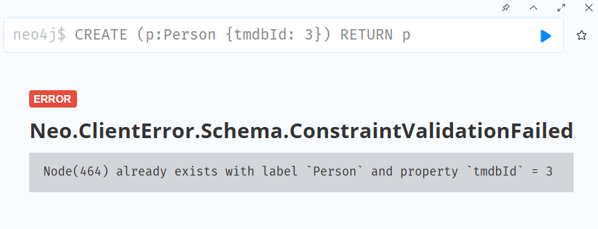

# Importing CSV Data into Neo4j

## Importing Data
We may import source data from
- Relational databases
- Web APIs
- Public data directories
- BI tools
- Spreadsheets (e.g., Excel, Google Sheets)

The data in the source files may not be in the format needed for our graph data model:
- The source files could contain more data than we need.
- There may not be a one-to-one mapping of the data in a CSV file to a node or relationship in the graph.
- The data types may not map directly onto those supported in Neo4j.

The data import process involves creating Cypher code to
- Read the source data
- Transform the data as needed
- Create nodes, relationships, and properties to create the graph

CSV files store data separated by a special character, usually a comma. For example,
```csv
personId,name,birthYear
23945,Gerard Pires,1942
553509,Helen Reddy,1941
113934,Susan Flannery,1939
```

The separator can also be a tab (`\t`) or a pipe (`|`). For example,
```csv
personId|name|birthYear
23945|Gerard Pires|1942
553509|Helen Reddy|1941
113934|Susan Flannery|1939
```
The character used to separate the values in a CSV file is called the **Delimiter** or **Field Terminator**.

Typically the first row of a CSV file is a header row, which contains the names of the columns:
```csv
personId,name,birthYear
```

If the data contains the field terminator character, the data must be enclosed in double quotes. For example,
```csv
personId,name,birthYear
23945,"Pires, Gerard",1942
553509,"Reddy, Helen",1941
113934,"Flannery, Susan",1939
```

### Normalized Data
If the source data is normalized (e.g., when exported from a relational data model), there will typically be multiple CSV files. Each CSV file will represent a table in the relational data model, and the files will be related to each other by unique IDs. For example, suppose there are three CSV files for people, movies, and roles, respectively:

`person.csv`
```csv
personId,name,birthYear
23945,Gerard Pires,1942
553509,Helen Reddy,1941
113934,Susan Flannery,1939
```
`movie.csv`
```csv
movieId,title,avgVote,releaseYear,genres
189,Sin City,8.000000,2005,Crime|Thriller
2300,The Fifth Element,7.700000,1997,Action|Adventure|Sci-Fi
11969,Tombstone,7.800000,1993,Action|Romance|Western
```
Note that the `genres` column contains multiple values separated by a pipe (`|`).

`role.csv`
```csv
personId,movieId,character
2295,189,Marv
56731,189,Nancy
16851,189,Dwight
```
Note that the `person.csv` has a unique ID for every person, and the `movie.csv` has a unique ID for every movie. The `role.csv` relates a person to a movie, and provides the characters

### De-normalized Data
If the source data is de-normalized, there will typically be a single CSV file. The single file will contain all the data, often duplicated where there are relationships between entities. For example,

`movies-n.csv`
```csv
movieId,title,avgVote,releaseYear,genres,personType,name,birthYear,character
2300,The Fifth Element,7.700000,1997,Action|Adventure|Sci-Fi,ACTOR,Bruce Willis,1955,Korben Dallas
2300,The Fifth Element,7.700000,1997,Action|Adventure|Sci-Fi,ACTOR,Gary Oldman,1958,Jean-Baptiste Emanuel Zorg
2300,The Fifth Element,7.700000,1997,Action|Adventure|Sci-Fi,ACTOR,Ian Holm,1931,Father Vito Cornelius
11969,Tombstone,7.800000,1993,Action|Romance|Western,ACTOR,Kurt Russell,1951,Wyatt Earp
11969,Tombstone,7.800000,1993,Action|Romance|Western,ACTOR,Val Kilmer,1959,Doc Holliday
11969,Tombstone,7.800000,1993,Action|Romance|Western,ACTOR,Sam Elliott,1944,Virgil Earp
```
De-normalized data typically represents data from multiple tables. The movie and person data is repeated in multiple rows in the file. A row represents a particular actor's role in a movie.

## Loading CSV Files
The `LOAD CSV` clause reads data from a CSV file and returns the rows in the file:
```sql
LOAD CSV [WITH HEADERS] FROM url [AS alias] [FIELDTERMINATOR char]
```
- `WITH HEADERS` specifies that the first row of the CSV file contains the column names. If this is not specified, the first row is treated as data.
- `FROM url` specifies the location of the CSV file. The URL can be a local file path or a web address. For example, `file:///path/to/file.csv` or `https://example.com/file.csv`. The URL must be accessible from the Neo4j server.
- `AS alias` specifies an alias for the rows returned from the CSV file. This is optional, and if not specified, the rows will be returned as a list of values.
- `FIELDTERMINATOR char` specifies the character used to separate the values in the CSV file. The default is a comma (`,`). This is optional, and if not specified, the default will be used.

For example, we will load the `people.csv` file:
```sql
LOAD CSV WITH HEADERS
FROM 'https://data.neo4j.com/importing-cypher/people.csv'
AS row
RETURN row
```
This will return a list of rows from the CSV file, with each row represented as a map of key-value pairs. For example,
```json
{
  "birthYear": "1942",
  "name": "Gerard Pires",
  "personId": "23945"
}
```

To ensure all rows are loaded, we can coutn the number of rows in the CSV file and compare it to the number of rows returned by the `LOAD CSV` clause. For example,
```sql
LOAD CSV WITH HEADERS
FROM 'https://data.neo4j.com/importing-cypher/people.csv'
AS row
RETURN count(row)
```

## Creating Nodes, Properties, and Relationships
We will load THE `persons.csv` file:
```sql
LOAD CSV WITH HEADERS
FROM 'https://data.neo4j.com/importing-cypher/persons.csv'
AS row
RETURN row
```
We can see that the CSV file contains
- `bio`
- `born`
- `bornIn`
- `died`
- `person_imdbId`
- `person_tmdbId`
- `Id`
- `name`
- `person_poster`
- `person_url`

### Creating `Person` Nodes
We will create `Person` nodes from the CSV file directly:
```sql
LOAD CSV WITH HEADERS
FROM 'https://data.neo4j.com/importing-cypher/persons.csv' AS row
MERGE (p:Person {tmdbId: toInteger(row.person_tmdbId)})
SET
    p.imdbId = toInteger(row.person_imdb),
    p.bornIn = row.bornIn,
    p.name = row.name,
    p.bio = row.bio,
    p.poster = row.person_poster,
    p.url = row.person_url,
    p.born = row.born,
    p.died = row.died
```

We could confirm the data in the graph by returning the first 25 `Person` nodes:
```sql
MATCH (p:Person)
RETURN p LIMIT 25
```

### Unique IDs and Constraints
A Neo4j best practice is to use an ID as a unique property value for each node. Unique IDs help ensure duplicate data is not created.

If the IDs in our CSV file are not unique for the same entity (node), we could create duplicate data. We may have issues loading the data and creating relationships between nodes. This is where we need to add constraints to our database to stop creating nodes with duplicate IDs.

The syntax for creating a unique constraint on a property is:
```sql
CREATE CONSTRAINT [constriant_name] [IF NOT EXISTS]
FOR (n:LabelName)
REQUIRE n.propertyName IS UNIQUE
```
- `constraint_name` is the name of the constraint. This is optional, and if not specified, Neo4j will create a default name for the constraint.
- `IF NOT EXISTS` is optional, and if specified, the constraint will only be created if it does not already exist. If not specified, an error will be raised by Neo4j if the constraint already exists.
- `LabelName` is the name of the label for the nodes to which the constraint applies.
- `REQUIRE n.propertyName IS UNIQUE` specifies the property that must be unique for the nodes with the specified label. The property must be indexed for the constraint to be created.

Now we can create a unique constraint for our `Person` nodes. The `Person` nodes should all have a unique `tmdbId` property. We can create a constraint for the `tmdbId` property to ensure that all `Person` nodes have a unique `tmdbId` property value:
```sql
CREATE CONSTRAINT Person_tmdbId IF NOT EXISTS
FOR (p:Person)
REQUIRE p.tmdbId IS UNIQUE
```
Note that
- The constraint name is `Person_tmdbId`.
- The `IF NOT EXISTS` clause is optional, and if not specified, an error will be raised by Neo4j if the constraint already exists.
- It applies to all nodes with the `Person` label.
- It requires the `tmdbId` property to be unique

We can check the constraints has been created by running
```sql
SHOW CONSTRAINTS
```
We should see the contraint named `Person_tmdbId` in the results.

If we try to create a `Person` node with a duplicate `tmdbId` property value,
```sql
CREATE (p:Person {tmdbId: 3})
RETURN p
```
Neo4j will raise an error:



To drop a constraint,
```sql
DROP CONSTRAINT [constraint_name]
```

### Adding `Movie` Nodes
Next we will load the `movies.csv` file to create `Movie`:
```sql
LOAD CSV WITH HEADERS
FROM 'https://data.neo4j.com/importing-cypher/movies.csv' AS row
MERGE (m:Movie {movieId: toInteger(row.movieId)})
SET
    m.tmdbId = row.movie_tmdbId,
    m.imdbId = row.movie_imdbId,
    m.released = row.released,
    m.title = row.title,
    m.year = toInteger(row.year),
    m.plot = row.plot,
    m.budget = toInteger(row.budget)
```

To return the first 25 `Movie` nodes,
```sql
MATCH (m:Movie)
RETURN m LIMIT 25
```

### `ACTED_IN` Relationships
We will create relationships between the `Person` and `Movie` nodes by loading the `acted_in.csv` file, which contains
- `movieId` - the `movieId` property of the `Movie` node
- `person_tmdbId` - the `tmdbId` property of the `Person` node
- `role` - the role of the person played in the movie

We will create `ACTED_IN` relationships between the `Person` and `Movie` nodes:
```sql
LOAD CSV WITH HEADERS
FROM 'https://data.neo4j.com/importing-cypher/acted_in.csv' AS row
MATCH (p:Person {tmdbId: toInteger(row.person_tmdbId)})
MATCH (m:Movie {movieId: toInteger(row.movieId)})
MERGE (p)-[r:ACTED_IN]->(m)
SET r.role = row.role
```
Note that
- The two `MATCH` clauses are used to find the `Person` and `Movie` nodes using the `tmdbId` and `movieId` properties, respectively.
- The `MERGE` clause is used to create the `ACTED_IN` relationship between the matched `Person` and `Movie` nodes.
- The `SET` clause is used to set the `role` property of the `ACTED_IN` relationship to the value in the CSV file.

To verify the relationships have been created,
```sql
MATCH (p:Person)-[r:ACTED_IN]->(m:Movie)
RETURN p, r, m LIMIT 25
```

### `DIRECTED` Relationships
We will create `DIRECTED` relationships between the `Person` and `Movie` nodes by loading the `directed.csv` file, which contains
- `movieId`
- `person_tmdbId`

Unlike the `ACTED_IN` relationships, the `DIRECTED` relationships has no properties, so we will not set any properties on the relationship.
```sql
LOAD CSV WITH HEADERS
FROM 'https://data.neo4j.com/importing-cypher/directed.csv' AS row
MATCH (p:Person {tmdbId: toInteger(row.person_tmdbId)})
MATCH (m:Movie {movieId: toInteger(row.movieId)})
MERGE (p)-[:DIRECTED]->(m)
```
To verify the relationships have been created,
```sql
MATCH (p:Person)-[r:DIRECTED]->(m:Movie)
RETURN p, r, m LIMIT 25
```

Once we have created the `ACTED_IN` and `DIRECTED` relationships, we can find people who directed and acted in the same movie:
```sql
MATCH (p:Person)-[:ACTED_IN]->(m:Movie)<-[:DIRECTED]-(p:Person)
RETURN p, m
```

## Data Types, Lists, and Labels
All data loaded using `LOAD CSV` will be returned as strings - we need to cast the data to appropriate data types before being written to properties. We have seen `toInteger()` to cast a string to an integer when we created the `Person` and `Movie` nodes.

Cypher supports the following data types:
| Function | Description |
|----------|-------------|
| `toBoolean()` | Cast to a boolean |
| `toFloat()` | Cast to a float |
| `toInteger()` | Cast to an integer |
| `toString()` | Cast to a string |
| `date()` | Cast to a date |
| `datetime()` | Cast to a date and time |

We can use the `apoc.meta.nodeTypeProperties()` function to show the data types used in the graph:
```sql
CALL apoc.meta.nodeTypeProperties()
YIELD nodeType, propertyName, propertyTypes
```