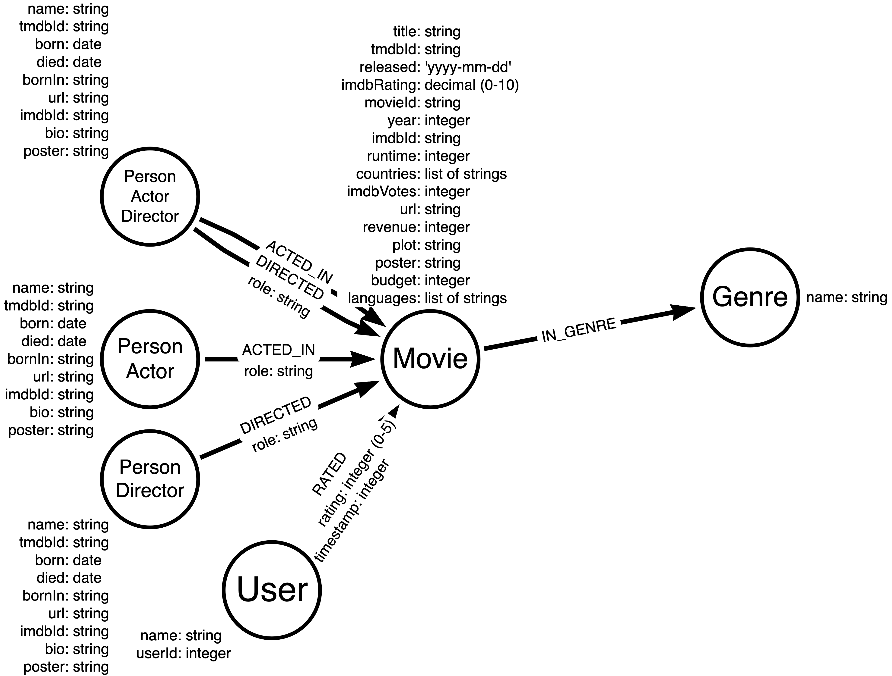
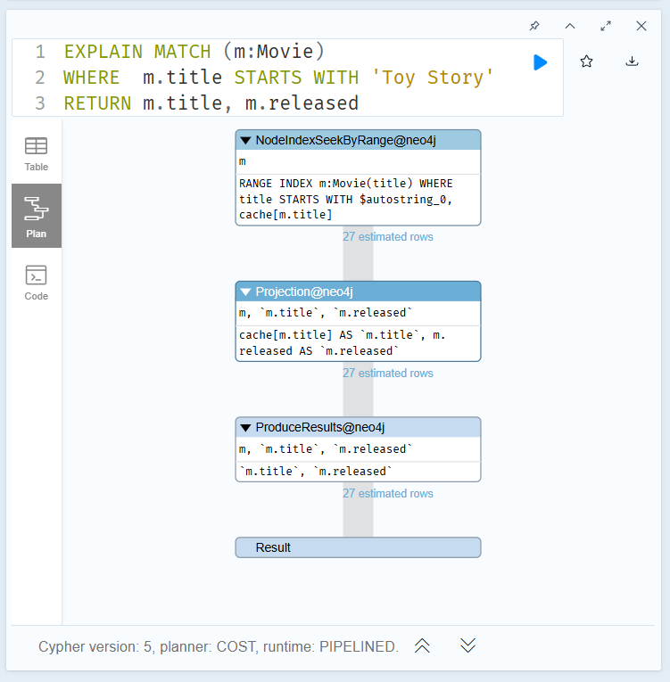
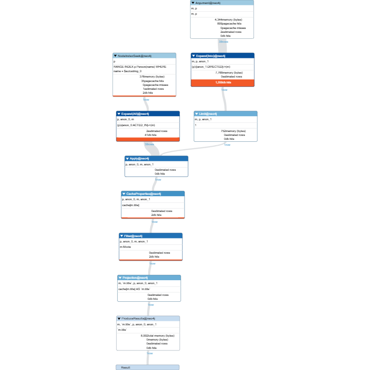
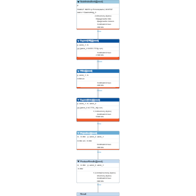

# Intermediate Cypher Queries

We will use the movie dataset for all the queries in this example in GraphAcademy. The graph data model is as follows:



## Filtering Queries
In a graph database, we can view the data model by exucuting
```sql
CALL db.schema.visualization()
```
The node labels for the graph invlude:
- `Person`
- `Actor`
- `Director`
- `Movie`
- `Genre`
- `User`

The relationship types include:
- `ACTED_IN` (with an optional role property)
- `DIRECTED` (with an optional role property)
- `RATED` (with rating and timestamp properties)
- `IN_GENRE`

We know that the nodes have a number of properties, along with the type of data that will be used for each property. We can view the property types for nodes in the graph by executing
```sql
CALL db.schema.nodeTypeProperties()
```
We can view the property types for relationships in the graph by executing
```sql
CALL db.schema.relTypeProperties()
```

Each node with a given label has a property that uniquely identifies the node. These nodes are indexed in the graph.
- `Movie` nodes use `movieId`
- `Person` nodes use `tmdbId`
- `User` nodes use `userId`
- `Genre` nodes use `name`

We can view the uniqueness constraint indexes in the graph by executing
```sql
SHOW CONSTRAINTS
```

### Basic Cypher Queries

#### Testing equality
```sql
MATCH (p:Person)-[:ACTED_IN]->(m:Movie)
WHERE p.name = "Tom Hanks"
AND m.year = 2013
RETURN m.title
```
This query
- finds all `Person` nodes with the name "Tom Hanks"
- traverses the `ACTED_IN` relationship to find all `Movie` nodes, and filter for movies released in 2013
- returns the title of the movie

We are specyfing the pattern to *traverse through the graph*, and then filtering on what data is retrieved within that pattern.

#### Testing inequality
```sql
MATCH (p:Person)-[:ACTED_IN]->(m:Movie)
WHERE p.name <> "Tom Hanks"
AND m.title = "Captain Phillips"
RETURN p.name
```
This query returns the names of all actors that acted in the movie "Captain Phillips" where "Tom Hanks" is excluded. The `<>` operator is used to test for inequality.

#### Testing less than or greater than
```sql
MATCH (m:Movie) WHERE m.title = "Toy Story"
RETURN
    m.year < 1995 AS lessThan, // Less than (false)
    m.year <= 1995 AS lessThanOrEqual, // Less than or equal (true)
    m.year > 1995 AS greaterThan, // Greater than (false)
    m.year >= 1995 AS greaterThanOrEqual // Greater than or equal (true)
```

#### Testing ranges
```sql
MATCH (p:Person)-[:ACTED_IN]->(m:Movie)
WHERE p.name = "Tom Hanks"
AND 2005 <= m.year <= 2010
RETURN m.title, m.released
```
This query returns the title and release date of movies that Tom Hanks acted in between 2005 and 2010. 

We can also use `OR` to expand the filtering to return more data as follows:
```sql
MATCH (p:Person)-[:ACTED_IN]->(m:Movie)
WHERE p.name = "Tom Hanks"
OR m.title = "Captain Phillips"
RETURN p.name, m.title
```

#### Testing `null` property values
A property for a node or relationship is null if it does not exist. We can test the existence of a property for a node using the `IS NOT NULL` predicate.
```sql
MATCH (p:Person)
WHERE p.died IS NOT NULL
AND p.born.year >= 1985
RETURN p.name, p.born, p.died
```
This query returns the names, born, and died properties for all people who have a value for their `died` property and were born after 1985.  We can also test `IS NULL` predicate:
```sql
MATCH (p:Person)
WHERE p.died IS NULL
AND p.born.year <= 1922
RETURN p.name, p.born, p.died
```

#### Testing labels or patterns
We can test for a label's existence on a node using the `{alias}:{label}` syntax.
```sql
MATCH (p:Person)
WHERE p.born.year > 1960
AND p:Actor
AND p:Director
RETURN p.name, p.born, labels(p)
```
This query will retrieve all `Person` nodes with the labels `Actor` and `Director` that were born after 1960. The `labels()` function returns the list of labels for a node.

Rather than using the `Actor` and `Director` labels, we can also use the relationship types `ACTED_IN` and `DIRECTED` to imply that the node at the other end of the relationship has the correct label:
```sql
MATCH (p:Person)-[:ACTED_IN]->(m:Movie)<-[:DIRECTED]>-(p)
WHERE p.born.year > 1960
RETURN p.name, p.born, labels(p), m.title
```

#### Discovering relationships
```sql
MATCH (p:Person)-[r]->(m:Movie)
WHERE p.name = "Tom Hanks"
RETURN m.title AS movie, type(r) AS relationshipType
```
This query retrieves all `Movie` nodes that are related to Tom Hanks. Each row returned is a movie title and the type of relationship that Tom Hanks has to that movie. The `type()` function returns the type of relationship.

#### Testing list includsion
```sql
MATCH (m:Movie)
WHERE "China" IN m.countries
RETURN m.title, m.languages, m.countries
```

### Testing Strings
When the property is a string type, we can filter with different string functions.
```sql
MATCH (m:Movie)
WHERE m.title STARTS WITH "Toy Story"
RETURN m.title, m.released
```
This query returns movie titles and release dates for movies that start with "Toy Story". We can also use `CONTAINS` and `ENDS WITH` functions:
```sql
MATCH (m:Movie)
WHERE m.title ENDS WITH "Story"
RETURN m.title, m.released
```
Or
```sql
MATCH (m:Movie)
WHERE m.title CONTAINS "Story"
RETURN m.title, m.released
```

String matching in Cypher is case-sensitive. We can use the `toLower()` function to convert the string to lower case before matching:
```sql
MATCH(p:Person)
WHERE toLower(p.name) ENDS WITH "demille"
RETURN p.name
```
Conversely, we can use the `toUpper()` function to convert the string to upper case before matching:
```sql
MATCH(p:Person)
WHERE toUpper(p.name) STARTS WITH "DEMILLE"
RETURN p.name
```
We can combine with `CONTAINS`:
```sql
MATCH(p:Person)
WHERE toUpper(p.name) CONTAINS "DE"
RETURN p.name
```

If we transform a string property during a query, such as `toLower()` or `toUpper()`, the query engine turns off the use of the index. With any query, we can always check if an index will be used by prefixing the query with `EXPLAIN`:
```sql
EXPLAIN MATCH (m:Movie)
WHERE m.title STARTS WITH "Toy Story"
RETURN m.title, m.released
```
This query produces the execution plan where the first step is `NodeIndexSeekByRange`. In this case an index will be used because it is defined in the graph.



A best practice for handling property values that need to be evaluated as upper, lower, or mixed case is to use fulltext schema indexes.

### Query Patterns and Performance
A pattern is a combination of nodes and relationships that is used to traverse the graph at runtime. We can write queries that test whether a pattern exists in the graph:
```sql
MATCH (p:Person)-[:ACTED_IN]->(m:Movie)
WHERE p.name = "Tom Hanks"
AND exists {(p)-[:DIRECTED]->(m)}
RETURN p.name, labels(p), m.title
```
This query
- Retrieves the anchor of the query, the Tom Hanks `Person` node
- Follows the `ACTED_IN` relationship to the `Movie` node
- Tests whether these nodes are related by the `DIRECTED` relationship for the `Movie` node and `Person` node
- Returns the rows if they are

The `exists {}` test is done for every `Movie` node related to Tom Hanks as an actor. This query returns the single movie that Tom Hanks directed and acted in.

We can use the `PROFILE` keyword to show the total number of rows retrieved from the graph in the query:
```sql
PROFILE MATCH (p:Person)-[:ACTED_IN]->(m:Movie)
WHERE p.name = "Tom Hanks"
AND exists {(p)-[:DIRECTED]->(m)}
RETURN m.title
```
In the profile, we can see that the initial row is retrieved, but then 38 rows are retrieved for each `Movie` node that Tom Hanks acted in. Then the test is done for the `DIRECTED` relationship in the following returned image:



The following query is a better way to do the same query before:
```sql
PROFILE MATCH (p:Person)-[:ACTED_IN]->(m:Movie)<-[:DIRECTED]-(p)
WHERE p.name = "Tom Hanks"
RETURN m.title
```
The query:
- Retrieves the anchor (the Tom Hanks `Person` node)
- Finds a `Movie` node where Tom Hanks is related to with the `ACTED_IN` relationship
- Traverses all `DIRECTED` relationships that point to the same Tom Hanks `Person` node



This traversal is very efficient because the graph engine can take the internal relationship cardinalities into account. If we execute this query, it returns the same result as the previous query. However, this query is much more efficient.

The difference between using `EXPLAIN` and `PROFILE` is that `EXPLAIN` provides estimates of the query steps where `PROFILE` provides the exact steps and number of rows retrieved for the query.

We have already seen how we use `exists { }` to test for the existence of a pattern. We can also use `NOT exists { }` to exclude patterns in the graph. For example, we want to find all the movies that Tom Hanks acted in, but did not direct:
```sql
MATCH (p:Person)-[:ACTED_IN]->(m:Movie)
WHERE p.name = "Tom Hanks"
AND NOT exists {(p)-[:DIRECTED]->(m)}
RETURN m.title
```
Here we want to exclude the `DIRECTED` relationship to moveis for Tom Hanks.

### Multiple MATCH Clauses
```sql
MATCH (p:Person)-[:ACTED_IN]->(m:Movie)
WHERE m.year > 2000
MATCH (m)<-[:DIRECTED]-(d:Person)
RETURN a.name, m.title, d.name
```
This query
- Retrieves the anchor nodes (movies released after 2000) and the set of actors for each movie.
- Then follows the `DIRECTED` relationship to each `Movie` node to retrieve the director of each movie.
- Returns the tuple of actor name, movie title, and director name.

There are repeated rows in the result set because the same actor may have acted in multiple movies, and the same movie may have multiple actors. An alternative to using multiple `MATCH` clauses is to specify multiple patterns:
```sql
MATCH (a:Person)-[:ACTED_IN]->(m:Movie),
      (m)<-[:DIRECTED]-(d:Person)
WHERE m.year > 2000
RETURN a.name, m.title, d.name
```
In this query, multiple patterns are specified. In the second pattern, the variable `m` is used from the first pattern. In general, using a single `MATCH` clause will perform better than multiple `MATCH` clauses, because relationship uniqueness is enforced so there are fewer relationships traversed.

We can also write the same query as follows:
```sql
MATCH (a:Person)-[:ACTED_IN]->(m:Movie)<-[:DIRECTED]-(d:Person)
WHERE m.year > 2000
RETURN a.name, m.title, d.name
```

Cypher has a clause that allows us to return rows that contain null values for some properties. For example,
```sql
MATCH (m:Movie) 
WHERE m.title = "Kiss Me Deadly"
MATCH (m)-[:IN_GENRE]->(g:Genre)<-[:IN_GENRE]-(rec:Movie)
MATCH (m)<-[:ACTED_IN]-(a:Actor)-[:ACTED_IN]->(rec)
RETURN rec.title, a.name
```
In this query:
- We find the movie node for "Kiss Me Deadly"
- Then we find all movies, `rec`, that are in the same genre as "Kiss Me Deadly"
- Then we find the actors that acted in both `rec` and "Kiss Me Deadly"

What if we want to expand the result returned to return all movies that are in the same genre, and the actor that acted in both movies. We can use the `OPTIONAL MATCH` clause. The `OPTIONAL MATCH` clause will return null for missing parts of the pattern if no matches are found. For example:
```sql
MATCH (m:Movie)
WHERE m.title = "Kiss Me Deadly"
MATCH (m)-[:IN_GENRE]->(g:Genre)<-[:IN_GENRE]-(rec:Movie)
OPTIONAL MATCH (m)<-[:ACTED_IN]-(a:Actor)-[:ACTED_IN]->(rec)
RETURN rec.title, a.name
```
This query returns rows where an actor acted in both movies is optional and null value is returned for any row that has no value.


## Controling Results Returned

### Ordering results
Whether we return results as nodes or as properties of nodes, we can specify a property value for the ordering.
- Stirngs are ordered by their text values
- Boolean true comes before false
- Numeric data (including date and datetime properties) are ordered by their numeric values

We specify `ORDER BY` in the `RETURN` clause where we specify the property for the ordering:
```sql
MATCH (p:Person)
WHERE p.born.year = 1980
RETURN p.name AS name,
p.born AS birthDate,
ORDER BY p.born
```
This query fins all `Person` nodes with a born year of 1980. The born property of `Person` nodes is a Cypher date type, so we can use the year method to test the year value. The default ordering is ascending, but we can specify `DESC` for descending order:
```sql
MATCH (p:Person)
WHERE p.born.year = 1980
RETURN p.name AS name,
p.born AS birthDate
ORDER BY p.born DESC
```

We may not want to return null values when we order the results, so it is a good practice to use the `WHERE` clause to filter out null values before ordering:
```sql
MATCH (p:Person)
WHERE p.born IS NOT NULL
RETURN p.name AS name, p.born AS birthDate
ORDER BY p.born DESC
```

We can also provide multiple sort expressions and the result will be sorted in that order:
```sql
MATCH (p:Person)-[:DIRECTED | ACTED_IN]->(m:Movie)
WHERE p.name = "Tom Hanks"
OR p.name = "Keanu Reeves"
RETURN m.year, m.title
ORDER BY m.year DESC, m.title
```
This query returns the movie in descending year order and then the movie title in ascending order. The `|` operator is used to specify multiple relationship types in the pattern.


### Limiting or counting results returned
Although we can filter queries to reduce the number of results returned, we may also want to limit the number of results returned. We can use the `LIMIT` clause to limit the number of rows returned:
```sql
MATCH (m:Movie)
WHERE m.released IS NOT NULL
RETURN m.title AS title,
m.released AS releaseDate
ORDER BY m.released DESC LIMIT 100
```
This query returns the first 100 movies in descending order of release date.

We may want to determine the youngest person in the graph:
```sql
MATCH (p:Person)
WHERE p.born IS NOT NULL
RETURN p.name AS name,
p.born AS birthDate
ORDER BY p.born DESC LIMIT 1
```

In an ordered result set, we may want to control what results are returned. For example, we can return the names of people born in 1980 ordered by their birth date:
```sql
MATCH (p:Person)
WHERE p.born.year = 1980
RETURN p.name AS name,
p.born AS birthDate
ORDER BY p.born
```
Then we can add a `SKIP` and `LIMIT` keywords to control what page of results are returned:
```sql
MATCH (p:Person)
WHERE p.born.year = 1980
RETURN p.name AS name,
p.born AS birthDate
ORDER BY p.born SKIP 40 LIMIT 10
```
This query returns 10 rows starting at the 41st row.

If we want to eliminate duplicates from the result set, we can use the `DISTINCT` keyword:
```sql
MATCH (p:Person)-[:DIRECTED | ACTED_IN]->(m:Movie)
WHERE p.name = "Tom Hanks"
RETURN DISTINCT m.title, m.released
ORDER BY m.title
```

We can use `DISTINCT` to eliminate duplications of 
- rows returned 
- property values
- nodes

For example, we can eliminate duplicate property values:
```sql
MATCH (m:Movie)
RETURN DISTINCT m.year
ORDER BY m.year
```
This query return only the distinct years for movies in the graph. We can also eliminate duplicate nodes:
```sql
MATCH (p:Person)-[:DIRECTED | ACTED_IN]->(m:Movie)
WHERE p.name = "Tom Hanks"
RETURN DISTINCT m
```
This query returns the distinct `Movie` nodes that Tom Hanks acted in or directed. 


### Map projections to return data
The data is returned as rows of data where each row represents a JSON-style object for a node. For example,
```sql
MATCH (p:Person)
WHERE p.name CONTAINS "Thomas"
RETURN p AS person
ORDER BY p.name ASC
```
This query returns all `Person` nodes that contain the string "Thomas". We can also return the data without the internal node information, that is, only property values:
```sql
MATCH (p:Person)
WHERE p.name CONTAINS "Thomas"
RETURN p {.* } AS person
ORDER BY p.name ASC
```
This query returns an object named person that contains all of the property values for the node. It does not contain any of the internal node information such as its labels or id. The `.*` syntax is used to return all properties for the node.

```sql
MATCH (p:Person)
WHERE p.name CONTAINS "Thomas"
RETURN p { .name, .born } AS person
ORDER BY p.name ASC
```
This query returns person objects that only contain the `name` and `born` properties.

We can also add information to the objects returned that are not part of the data in the graph:
```sql
MATCH (m:Movie)<-[:DIRECTED]-(d:Director)
WHERE d.name = "Woody Allen"
RETURN m {.*, favorite: true} AS movie
```
In addition to returning all properties for the `Movie` node for each movie directed by Woody Allen, we also return a property named `favorite` with a value of `true` for each movie.

### Changing results returned
We can always change the data that is returned by performing string or numeric operations on the data. For example,
```sql
MATCH (m:Movie)<-[:DIRECTED]-(p:Person)
WHERE m.title CONTAINS "Toy Story"
AND p.died IS NULL
RETURN m.title AS movie,
p.name AS actor,
p.born AS dob,
date().year - p.born.year AS AgeThisYear
```
This query returns the actors in each Toy Story movie and their age if they are still alive according to our current graph. We add data to each line by calculating the actor's age by subtracting the year of birth from the current year. The `date()` function returns the current date and time, and the `year` method returns the year value.

We can also concatenate string data returned:
```sql
MATCH (m:Movie)<-[:ACTED_IN]-(p:Person)
WHERE m.title CONTAINS "Toy Story"
AND p.died IS NULL
RETURN "Movie: " + m.title AS movie,
p.name AS actor,
p.born AS dob,
date().year - p.born.year AS AgeThisYear
```

Cypher also has a `CASE` clause that we can specify to compute the data returned which may be different from what is in the graph. For example,
```sql
MATCH (m:Movie)<-[:ACTED_IN]-(p:Person)
WHERE p.name = "Henry Fonda"
RETURN m.title AS movie,
CASE
    WHEN m.year < 1940 THEN "oldies"
    WHEN 1940 <= m.year < 1950 THEN "forties"
    WHEN 1950 <= m.year < 1960 THEN "fifties"
    WHEN 1960 <= m.year < 1970 THEN "sixties"
    WHEN 1970 <= m.year < 1980 THEN "seventies"
    WHEN 1980 <= m.year < 1990 THEN "eighties"
    WHEN 1990 <= m.year < 2000 THEN "nineties"
    ELSE "two-thousands"
END
AS timeFrame
```
In this query, we transform the data returned to reflect the timeframe for the movie. The `CASE` clause is used to specify the different timeframes for the movie. The `ELSE` clause is used to specify a default value if none of the other conditions are met.


## Working with Cypher Data