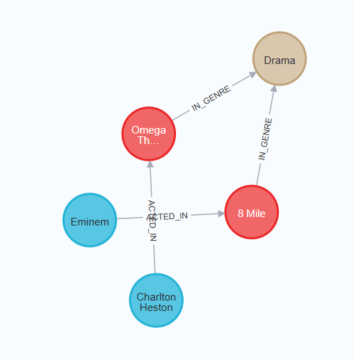
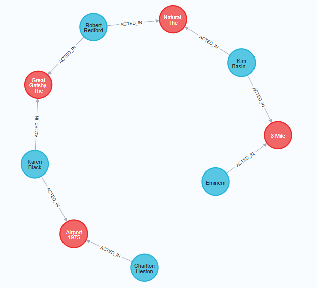

# Intermediate Cypher Queries

We will use the movie dataset for all the queries in this example in GraphAcademy. The graph data model is as follows:


## Filtering Queries
In a graph database, we can view the data model by exucuting
```sql
CALL db.schema.visualization()
```
The node labels for the graph invlude:
- `Person`
- `Actor`
- `Director`
- `Movie`
- `Genre`
- `User`

The relationship types include:
- `ACTED_IN` (with an optional role property)
- `DIRECTED` (with an optional role property)
- `RATED` (with rating and timestamp properties)
- `IN_GENRE`

We know that the nodes have a number of properties, along with the type of data that will be used for each property. We can view the property types for nodes in the graph by executing
```sql
CALL db.schema.nodeTypeProperties()
```
We can view the property types for relationships in the graph by executing
```sql
CALL db.schema.relTypeProperties()
```

Each node with a given label has a property that uniquely identifies the node. These nodes are indexed in the graph.
- `Movie` nodes use `movieId`
- `Person` nodes use `tmdbId`
- `User` nodes use `userId`
- `Genre` nodes use `name`

We can view the uniqueness constraint indexes in the graph by executing
```sql
SHOW CONSTRAINTS
```

### Basic Cypher Queries

#### Testing equality
```sql
MATCH (p:Person)-[:ACTED_IN]->(m:Movie)
WHERE p.name = "Tom Hanks"
AND m.year = 2013
RETURN m.title
```
This query
- finds all `Person` nodes with the name "Tom Hanks"
- traverses the `ACTED_IN` relationship to find all `Movie` nodes, and filter for movies released in 2013
- returns the title of the movie

We are specyfing the pattern to *traverse through the graph*, and then filtering on what data is retrieved within that pattern.

#### Testing inequality
```sql
MATCH (p:Person)-[:ACTED_IN]->(m:Movie)
WHERE p.name <> "Tom Hanks"
AND m.title = "Captain Phillips"
RETURN p.name
```
This query returns the names of all actors that acted in the movie "Captain Phillips" where "Tom Hanks" is excluded. The `<>` operator is used to test for inequality.

#### Testing less than or greater than
```sql
MATCH (m:Movie) WHERE m.title = "Toy Story"
RETURN
    m.year < 1995 AS lessThan, // Less than (false)
    m.year <= 1995 AS lessThanOrEqual, // Less than or equal (true)
    m.year > 1995 AS greaterThan, // Greater than (false)
    m.year >= 1995 AS greaterThanOrEqual // Greater than or equal (true)
```

#### Testing ranges
```sql
MATCH (p:Person)-[:ACTED_IN]->(m:Movie)
WHERE p.name = "Tom Hanks"
AND 2005 <= m.year <= 2010
RETURN m.title, m.released
```
This query returns the title and release date of movies that Tom Hanks acted in between 2005 and 2010. 

We can also use `OR` to expand the filtering to return more data as follows:
```sql
MATCH (p:Person)-[:ACTED_IN]->(m:Movie)
WHERE p.name = "Tom Hanks"
OR m.title = "Captain Phillips"
RETURN p.name, m.title
```

#### Testing `null` property values
A property for a node or relationship is null if it does not exist. We can test the existence of a property for a node using the `IS NOT NULL` predicate.
```sql
MATCH (p:Person)
WHERE p.died IS NOT NULL
AND p.born.year >= 1985
RETURN p.name, p.born, p.died
```
This query returns the names, born, and died properties for all people who have a value for their `died` property and were born after 1985.  We can also test `IS NULL` predicate:
```sql
MATCH (p:Person)
WHERE p.died IS NULL
AND p.born.year <= 1922
RETURN p.name, p.born, p.died
```

#### Testing labels or patterns
We can test for a label's existence on a node using the `{alias}:{label}` syntax.
```sql
MATCH (p:Person)
WHERE p.born.year > 1960
AND p:Actor
AND p:Director
RETURN p.name, p.born, labels(p)
```
This query will retrieve all `Person` nodes with the labels `Actor` and `Director` that were born after 1960. The `labels()` function returns the list of labels for a node.

Rather than using the `Actor` and `Director` labels, we can also use the relationship types `ACTED_IN` and `DIRECTED` to imply that the node at the other end of the relationship has the correct label:
```sql
MATCH (p:Person)-[:ACTED_IN]->(m:Movie)<-[:DIRECTED]>-(p)
WHERE p.born.year > 1960
RETURN p.name, p.born, labels(p), m.title
```

#### Discovering relationships
```sql
MATCH (p:Person)-[r]->(m:Movie)
WHERE p.name = "Tom Hanks"
RETURN m.title AS movie, type(r) AS relationshipType
```
This query retrieves all `Movie` nodes that are related to Tom Hanks. Each row returned is a movie title and the type of relationship that Tom Hanks has to that movie. The `type()` function returns the type of relationship.

#### Testing list includsion
```sql
MATCH (m:Movie)
WHERE "China" IN m.countries
RETURN m.title, m.languages, m.countries
```

### Testing Strings
When the property is a string type, we can filter with different string functions.
```sql
MATCH (m:Movie)
WHERE m.title STARTS WITH "Toy Story"
RETURN m.title, m.released
```
This query returns movie titles and release dates for movies that start with "Toy Story". We can also use `CONTAINS` and `ENDS WITH` functions:
```sql
MATCH (m:Movie)
WHERE m.title ENDS WITH "Story"
RETURN m.title, m.released
```
Or
```sql
MATCH (m:Movie)
WHERE m.title CONTAINS "Story"
RETURN m.title, m.released
```

String matching in Cypher is case-sensitive. We can use the `toLower()` function to convert the string to lower case before matching:
```sql
MATCH(p:Person)
WHERE toLower(p.name) ENDS WITH "demille"
RETURN p.name
```
Conversely, we can use the `toUpper()` function to convert the string to upper case before matching:
```sql
MATCH(p:Person)
WHERE toUpper(p.name) STARTS WITH "DEMILLE"
RETURN p.name
```
We can combine with `CONTAINS`:
```sql
MATCH(p:Person)
WHERE toUpper(p.name) CONTAINS "DE"
RETURN p.name
```

If we transform a string property during a query, such as `toLower()` or `toUpper()`, the query engine turns off the use of the index. With any query, we can always check if an index will be used by prefixing the query with `EXPLAIN`:
```sql
EXPLAIN MATCH (m:Movie)
WHERE m.title STARTS WITH "Toy Story"
RETURN m.title, m.released
```
This query produces the execution plan where the first step is `NodeIndexSeekByRange`. In this case an index will be used because it is defined in the graph.


A best practice for handling property values that need to be evaluated as upper, lower, or mixed case is to use fulltext schema indexes.

### Query Patterns and Performance
A pattern is a combination of nodes and relationships that is used to traverse the graph at runtime. We can write queries that test whether a pattern exists in the graph:
```sql
MATCH (p:Person)-[:ACTED_IN]->(m:Movie)
WHERE p.name = "Tom Hanks"
AND exists {(p)-[:DIRECTED]->(m)}
RETURN p.name, labels(p), m.title
```
This query
- Retrieves the anchor of the query, the Tom Hanks `Person` node
- Follows the `ACTED_IN` relationship to the `Movie` node
- Tests whether these nodes are related by the `DIRECTED` relationship for the `Movie` node and `Person` node
- Returns the rows if they are

The `exists {}` test is done for every `Movie` node related to Tom Hanks as an actor. This query returns the single movie that Tom Hanks directed and acted in.

We can use the `PROFILE` keyword to show the total number of rows retrieved from the graph in the query:
```sql
PROFILE MATCH (p:Person)-[:ACTED_IN]->(m:Movie)
WHERE p.name = "Tom Hanks"
AND exists {(p)-[:DIRECTED]->(m)}
RETURN m.title
```
In the profile, we can see that the initial row is retrieved, but then 38 rows are retrieved for each `Movie` node that Tom Hanks acted in. Then the test is done for the `DIRECTED` relationship in the following returned image:


The following query is a better way to do the same query before:
```sql
PROFILE MATCH (p:Person)-[:ACTED_IN]->(m:Movie)<-[:DIRECTED]-(p)
WHERE p.name = "Tom Hanks"
RETURN m.title
```
The query:
- Retrieves the anchor (the Tom Hanks `Person` node)
- Finds a `Movie` node where Tom Hanks is related to with the `ACTED_IN` relationship
- Traverses all `DIRECTED` relationships that point to the same Tom Hanks `Person` node


This traversal is very efficient because the graph engine can take the internal relationship cardinalities into account. If we execute this query, it returns the same result as the previous query. However, this query is much more efficient.

The difference between using `EXPLAIN` and `PROFILE` is that `EXPLAIN` provides estimates of the query steps where `PROFILE` provides the exact steps and number of rows retrieved for the query.

We have already seen how we use `exists { }` to test for the existence of a pattern. We can also use `NOT exists { }` to exclude patterns in the graph. For example, we want to find all the movies that Tom Hanks acted in, but did not direct:
```sql
MATCH (p:Person)-[:ACTED_IN]->(m:Movie)
WHERE p.name = "Tom Hanks"
AND NOT exists {(p)-[:DIRECTED]->(m)}
RETURN m.title
```
Here we want to exclude the `DIRECTED` relationship to moveis for Tom Hanks.

### Multiple MATCH Clauses
```sql
MATCH (p:Person)-[:ACTED_IN]->(m:Movie)
WHERE m.year > 2000
MATCH (m)<-[:DIRECTED]-(d:Person)
RETURN a.name, m.title, d.name
```
This query
- Retrieves the anchor nodes (movies released after 2000) and the set of actors for each movie.
- Then follows the `DIRECTED` relationship to each `Movie` node to retrieve the director of each movie.
- Returns the tuple of actor name, movie title, and director name.

There are repeated rows in the result set because the same actor may have acted in multiple movies, and the same movie may have multiple actors. An alternative to using multiple `MATCH` clauses is to specify multiple patterns:
```sql
MATCH (a:Person)-[:ACTED_IN]->(m:Movie),
      (m)<-[:DIRECTED]-(d:Person)
WHERE m.year > 2000
RETURN a.name, m.title, d.name
```
In this query, multiple patterns are specified. In the second pattern, the variable `m` is used from the first pattern. In general, using a single `MATCH` clause will perform better than multiple `MATCH` clauses, because relationship uniqueness is enforced so there are fewer relationships traversed.

We can also write the same query as follows:
```sql
MATCH (a:Person)-[:ACTED_IN]->(m:Movie)<-[:DIRECTED]-(d:Person)
WHERE m.year > 2000
RETURN a.name, m.title, d.name
```

Cypher has a clause that allows us to return rows that contain null values for some properties. For example,
```sql
MATCH (m:Movie) 
WHERE m.title = "Kiss Me Deadly"
MATCH (m)-[:IN_GENRE]->(g:Genre)<-[:IN_GENRE]-(rec:Movie)
MATCH (m)<-[:ACTED_IN]-(a:Actor)-[:ACTED_IN]->(rec)
RETURN rec.title, a.name
```
In this query:
- We find the movie node for "Kiss Me Deadly"
- Then we find all movies, `rec`, that are in the same genre as "Kiss Me Deadly"
- Then we find the actors that acted in both `rec` and "Kiss Me Deadly"

What if we want to expand the result returned to return all movies that are in the same genre, and the actor that acted in both movies. We can use the `OPTIONAL MATCH` clause. The `OPTIONAL MATCH` clause will return null for missing parts of the pattern if no matches are found. For example:
```sql
MATCH (m:Movie)
WHERE m.title = "Kiss Me Deadly"
MATCH (m)-[:IN_GENRE]->(g:Genre)<-[:IN_GENRE]-(rec:Movie)
OPTIONAL MATCH (m)<-[:ACTED_IN]-(a:Actor)-[:ACTED_IN]->(rec)
RETURN rec.title, a.name
```
This query returns rows where an actor acted in both movies is optional and null value is returned for any row that has no value.


## Controling Results Returned

### Ordering Results
Whether we return results as nodes or as properties of nodes, we can specify a property value for the ordering.
- Stirngs are ordered by their text values
- Boolean true comes before false
- Numeric data (including date and datetime properties) are ordered by their numeric values

We specify `ORDER BY` in the `RETURN` clause where we specify the property for the ordering:
```sql
MATCH (p:Person)
WHERE p.born.year = 1980
RETURN p.name AS name,
p.born AS birthDate,
ORDER BY p.born
```
This query fins all `Person` nodes with a born year of 1980. The born property of `Person` nodes is a Cypher date type, so we can use the year method to test the year value. The default ordering is ascending, but we can specify `DESC` for descending order:
```sql
MATCH (p:Person)
WHERE p.born.year = 1980
RETURN p.name AS name,
p.born AS birthDate
ORDER BY p.born DESC
```

We may not want to return null values when we order the results, so it is a good practice to use the `WHERE` clause to filter out null values before ordering:
```sql
MATCH (p:Person)
WHERE p.born IS NOT NULL
RETURN p.name AS name, p.born AS birthDate
ORDER BY p.born DESC
```

We can also provide multiple sort expressions and the result will be sorted in that order:
```sql
MATCH (p:Person)-[:DIRECTED | ACTED_IN]->(m:Movie)
WHERE p.name = "Tom Hanks"
OR p.name = "Keanu Reeves"
RETURN m.year, m.title
ORDER BY m.year DESC, m.title
```
This query returns the movie in descending year order and then the movie title in ascending order. The `|` operator is used to specify multiple relationship types in the pattern.


### Limiting or Counting Results Returned
Although we can filter queries to reduce the number of results returned, we may also want to limit the number of results returned. We can use the `LIMIT` clause to limit the number of rows returned:
```sql
MATCH (m:Movie)
WHERE m.released IS NOT NULL
RETURN m.title AS title,
m.released AS releaseDate
ORDER BY m.released DESC LIMIT 100
```
This query returns the first 100 movies in descending order of release date.

We may want to determine the youngest person in the graph:
```sql
MATCH (p:Person)
WHERE p.born IS NOT NULL
RETURN p.name AS name,
p.born AS birthDate
ORDER BY p.born DESC LIMIT 1
```

In an ordered result set, we may want to control what results are returned. For example, we can return the names of people born in 1980 ordered by their birth date:
```sql
MATCH (p:Person)
WHERE p.born.year = 1980
RETURN p.name AS name,
p.born AS birthDate
ORDER BY p.born
```
Then we can add a `SKIP` and `LIMIT` keywords to control what page of results are returned:
```sql
MATCH (p:Person)
WHERE p.born.year = 1980
RETURN p.name AS name,
p.born AS birthDate
ORDER BY p.born SKIP 40 LIMIT 10
```
This query returns 10 rows starting at the 41st row.

If we want to eliminate duplicates from the result set, we can use the `DISTINCT` keyword:
```sql
MATCH (p:Person)-[:DIRECTED | ACTED_IN]->(m:Movie)
WHERE p.name = "Tom Hanks"
RETURN DISTINCT m.title, m.released
ORDER BY m.title
```

We can use `DISTINCT` to eliminate duplications of 
- rows returned 
- property values
- nodes

For example, we can eliminate duplicate property values:
```sql
MATCH (m:Movie)
RETURN DISTINCT m.year
ORDER BY m.year
```
This query return only the distinct years for movies in the graph. We can also eliminate duplicate nodes:
```sql
MATCH (p:Person)-[:DIRECTED | ACTED_IN]->(m:Movie)
WHERE p.name = "Tom Hanks"
RETURN DISTINCT m
```
This query returns the distinct `Movie` nodes that Tom Hanks acted in or directed. 


### Map Projections to Return Data
The data is returned as rows of data where each row represents a JSON-style object for a node. For example,
```sql
MATCH (p:Person)
WHERE p.name CONTAINS "Thomas"
RETURN p AS person
ORDER BY p.name ASC
```
This query returns all `Person` nodes that contain the string "Thomas". We can also return the data without the internal node information, that is, only property values:
```sql
MATCH (p:Person)
WHERE p.name CONTAINS "Thomas"
RETURN p {.* } AS person
ORDER BY p.name ASC
```
This query returns an object named person that contains all of the property values for the node. It does not contain any of the internal node information such as its labels or id. The `.*` syntax is used to return all properties for the node.

```sql
MATCH (p:Person)
WHERE p.name CONTAINS "Thomas"
RETURN p { .name, .born } AS person
ORDER BY p.name ASC
```
This query returns person objects that only contain the `name` and `born` properties.

We can also add information to the objects returned that are not part of the data in the graph:
```sql
MATCH (m:Movie)<-[:DIRECTED]-(d:Director)
WHERE d.name = "Woody Allen"
RETURN m {.*, favorite: true} AS movie
```
In addition to returning all properties for the `Movie` node for each movie directed by Woody Allen, we also return a property named `favorite` with a value of `true` for each movie.

### Changing Results Returned
We can always change the data that is returned by performing string or numeric operations on the data. For example,
```sql
MATCH (m:Movie)<-[:DIRECTED]-(p:Person)
WHERE m.title CONTAINS "Toy Story"
AND p.died IS NULL
RETURN m.title AS movie,
p.name AS actor,
p.born AS dob,
date().year - p.born.year AS AgeThisYear
```
This query returns the actors in each Toy Story movie and their age if they are still alive according to our current graph. We add data to each line by calculating the actor's age by subtracting the year of birth from the current year. The `date()` function returns the current date and time, and the `year` method returns the year value.

We can also concatenate string data returned:
```sql
MATCH (m:Movie)<-[:ACTED_IN]-(p:Person)
WHERE m.title CONTAINS "Toy Story"
AND p.died IS NULL
RETURN "Movie: " + m.title AS movie,
p.name AS actor,
p.born AS dob,
date().year - p.born.year AS AgeThisYear
```

Cypher also has a `CASE` clause that we can specify to compute the data returned which may be different from what is in the graph. For example,
```sql
MATCH (m:Movie)<-[:ACTED_IN]-(p:Person)
WHERE p.name = "Henry Fonda"
RETURN m.title AS movie,
CASE
    WHEN m.year < 1940 THEN "oldies"
    WHEN 1940 <= m.year < 1950 THEN "forties"
    WHEN 1950 <= m.year < 1960 THEN "fifties"
    WHEN 1960 <= m.year < 1970 THEN "sixties"
    WHEN 1970 <= m.year < 1980 THEN "seventies"
    WHEN 1980 <= m.year < 1990 THEN "eighties"
    WHEN 1990 <= m.year < 2000 THEN "nineties"
    ELSE "two-thousands"
END
AS timeFrame
```
In this query, we transform the data returned to reflect the timeframe for the movie. The `CASE` clause is used to specify the different timeframes for the movie. The `ELSE` clause is used to specify a default value if none of the other conditions are met.


## Working with Cypher Data

### Aggregating Data

#### Using `count()` to aggregate data
Cypher has a `count()` function that we can use to perform a count of nodes, relationships, path, rows during query processing.
```sql
MATCH (a:Person)-[:ACTED_IN]->(m:Movie)
WHERE a.name = "Tom Hanks"
RETURN a.name AS actorName,
count(*) AS numMovies
```
This query returns the number of movies that Tom Hanks acted in. The `*` wildcard is necessary to count all rows returned.
```sql
MATCH (a:Person)-[:ACTED_IN]->(m:Movie)<-[:DIRECTED]-(d:Person)
RETURN a.name AS actorName,
d.name AS directorName,
count(*) AS numMovies
ORDER BY numMovies DESC
```
In this query, actors and directors worked together in the same movie and the number of movies is counted. The `ORDER BY` clause is used to order the results by the number of movies in descending order.

When we aggregate in a Cypher statement, the query must process al patterns in the `MATCH` clause to complete the aggregation to return results. This is called *eager aggregation*.
```sql
MATCH (a:Person)-[:ACTED_IN]->(m:Movie)<-[:DIRECTED]-(d:Person)
WHERE a.name, d.name,
count(*) AS numMovies
ORDER BY numMovies DESC
```
This query processes all nodes and relationships in the pattern so that it can perform a count of all movies for a particular actor-director pair in the graph.

If we specify `count(n)`, the graph engine calculates the number of non-null occurrences of *n*. If we specify `count(*)`, the graph engine calculates the number of rows retrieved, including those with null values.


#### Returning a list
In our example Movie dataset, we know that the `languages` and `countries` properties are lists:
```sql
MATCH (m:Movie)
RETURN m.languages AS languages,
m.countries AS countries
```
We can also return a list by specifying the square brackets `[]`:
```sql
MATCH (p:Person)
RETURN p.name, [p.born, p.died] AS lifeTime
LIMIT 10
```

#### Using `collect()` to create a list
Cypher has a built-in aggregation function called `collect()` that enables us to aggregate values into a list. The value can be any expression, for example a property value, a node, or result of a function or operations.
```sql
MATCH (a:Person)-[:ACTED_IN]->(m:Movie)
RETURN a.name AS actor,
count(*) AS total,
collect(m.title) AS movies
ORDER BY total DESC LIMIT 10
```
This query returns a list of movies titles associated with each actor.

#### Eliminating duplicates in lists
Just like we can use `DISTINCT` to eliminate duplicates in the result set, we can also use `DISTINCT` with `collect()` to eliminate duplicates in the list:
```sql
MATCH (a:Person)-[:ACTED_IN]->(m:Movie)
WHERE m.year = 1920
RETURN collect(m.title) AS movies,
collect(a.name) AS actors
```
We notice that there are duplicate titles in the Movie list. We can use `DISTINCT` to eliminate duplicates:
```sql
MATCH (a:Person)-[:ACTED_IN]->(m:Movie)
WHERE m.year = 1920
RETURN collect(DISTINCT m.title) AS movies,
collect(a.name) AS actors
```

#### Collecting nodes
Rather than collecting the values of the *title* properties for movies, we can collect the nodes.
```sql
MATCH (a:Person)-[:ACTED_IN]->(m:Movie)
WHERE p.name = "Tom Cruise"
RETURN collect(m) AS tomCruiseMovies
```
This query returns a list of all `Movie` nodes for Tom Cruise. If replace `RETURN collect(m) AS tomCruiseMovies` with `RETURN m AS tomCruiseMovies`, the returned data is no longer a list in table view.

#### Accessing elements of a list
We can access elements of the list using the `[index-value]` notation. For example, we can return the first cast member for each movie:
```sql
MATCH (m:Movie)<-[:ACTED_IN]-(a:Person)
RETURN m.title AS movie,
collect(a.name)[0] AS castMember,
size(collect(a.name)) AS castSize
```

We can also return a slice of a collection:
```sql
MATCH (m:Movie)<-[:ACTED_IN]-(a:Person)
RETURN m.title AS movie,
collect(a.name)[2..] AS castMembers,
size(collect(a.name)) AS castSize
```
This query returns the second to the end of the list names of actors. Other aggregating functions include `min()`, `max()`, `avg()`, and `sum()`.

#### Using `count()` versus `size()`
We can either use `count()` to count the number of rows, or alternatively, we can return the size of the collected results. The `size()` function returns the number of elements in a list:
```sql
MATCH (a:Person)-[:ACTED_IN]->(m:Movie)<-[:DIRECTED]-(d:Person)
RETURN a.name, d.name,
size(collect(m)) AS collaborations,
collect(m.title) AS movies
```

`count()` may be more efficient than `size()` because it gets its values for node counts or relationships from a node from the internal count store of the graph.

#### List comprehension
We can create a list by evaluating an expression that tests for list inclusion:
```sql
MATCH (m:Movie)
RETURN m.title AS movie,
[x IN m.countries WHERE x CONTAINS "USA" OR x CONTAINS "German"]
AS countries LIMIT 500
```

#### Pattern comprehension
we can also use pattern comprehension to create lists without changing the cardinality of the query:
```sql
MATCH (m:Movie)
WHERE m.year = 2015
RETURN m.title,
[(dir:Person)-[:DIRECTED]->(m) | dir.name] AS directors,
[(act:Person)-[:ACTED_IN]->(m) | act.name] AS actors
```
For pattern comprehension, we specify the list with the square braces to include the pattern followed by the pipe `|` to specify what values will be placed in the list from the pattern.

We can also use pattern comprehension to create a list where we specify a filter for the pattern:
```sql
MATCH (a:Person {name: "Tom Hanks"})
RETURN [
    (a)-->(b:Movie)
    WHERE b.title CONTAINS "Toy" | b.title + ": " + b.year
]
AS movies
```
For this pattern comprehension, the title of the movie is concatenated with the year of the movie as a value to add as an element of the list returned.

#### Working with maps
A Cypher `map` is list of key/value pairs where each element of the list is of the format `key: value`. A node or relationship can have a property that is a map.

For example, a map of months and the number of days per month could be:
```
{Jan: 31, Feb: 28, Mar: 31, Apr: 30 , May: 31, Jun: 30 , Jul: 31, Aug: 31, Sep: 30, Oct: 31, Nov: 30, Dec: 31}
```

Using this map, we can return the value for one of its elements:
```sql
RETURN {Jan: 31, Feb: 28, Mar: 31, Apr: 30 , May: 31, Jun: 30 , Jul: 31, Aug: 31, Sep: 30, Oct: 31, Nov: 30, Dec: 31}["Feb"] AS daysInFeb
```
Alternatively, we can access a value with the `.` operator:
```sql
RETURN {Jan: 31, Feb: 28, Mar: 31, Apr: 30 , May: 31, Jun: 30 , Jul: 31, Aug: 31, Sep: 30, Oct: 31, Nov: 30, Dec: 31}.Feb AS daysInFeb
```
We can also use the `keys()` function to return the keys of a map:
```sql
RETURN keys({Jan: 31, Feb: 28, Mar: 31, Apr: 30 , May: 31, Jun: 30 , Jul: 31, Aug: 31, Sep: 30, Oct: 31, Nov: 30, Dec: 31}) AS months
```

#### Map projections
Map projections are when we can use retrieved nodes to create or return some of the information in the nodes. A `Movie` node can have the properties `title`, `released`, and `tagline`. Suppose we want to return the `Movie` node information, but without the `tagline` properry:
```sql
MATCH (m:Movie)
WHERE m.title CONTAINS "Matrix"
RETURN m { .title, .released } AS movie
```

### Working with Dates and Times
Cypher has basic formats for storing date and time data:
```sql
RETURN date(), datetime(), time()
```
For example,
MERGE (x:Test {id: 1})
SET x.date = date(),
x.datetime = datetime(),
x.time = time()
RETURN x
```
This query creates a node with the label `Test` and sets the properties `date`, `datetime`, and `time` to the current date, datetime, and time.

We can access the components of a date or datetime property:
```sql
MATCH (x:Test {id: 1})
RETURN x.date.day, x.date.year,
x.datetime.year, x.datetime.hour,
x.datetime.minute
```

We can use a string to set a value for a date:
```sql
MATCH (x:Test {id: 1})
SET x.date1 = date("2022-01-01"),
x.date2 = date("2025-01-05")
RETURN x
```

We can also use a string to set a value for a datetime:
```sql
MATCH (x:Test {id: 1})
SET x.datetime1 = datetime("2022-01-01T12:00:00"),
x.datetime2 = datetime("2025-01-05T15:33:01")
RETURN x
```

A duration is used to determine the difference between two date/datetime values or to add or subtract a duration to a value. For example, we can use the `duration` to find the difference between two date values:
```sql
MATCH (x:Test {id: 1})
RETURN duration.between(x.date1, x.date2)
```
This query returns the duration that represents the days and months and times between the two dates. We can also return the duration in days between two datetime values:
```sql
MATCH (x:Test {id: 1})
RETURN duration.inDays(x.datetime1, x.datetime2).days
```

We can add a duration of 6 months:
```sql
MATCH (x:Test {id: 1})
RETURN x.date1 + duration({months: 6})
```

We can use the APOClibrary to format a datetime:
```sql
MATCH (x:Test {id: 1})
RETURN x.datetime, as Datetime,
apoc.temporal.format(x.datetime, "HH:mm:ss.SSSS")
AS formattedDatetime
```

## Graph Traversal
When the execution plan is created, it determines the set of nodes that will be the starting points for the query.

The anchor for a query is based upon a `MATCH` clause. The anchor is determined by metadata that is stored in the graph or a filter that is provided inline or in a `WHERE` clause. The anchor for a query will be based upon the fewest number of nodes that need to be retrieved into memory.

```sql
PROFILE MATCH (p:Person)-[:ACTED_IN]->(m)
RETURN p.name, m.title LIMIT 100
```
In this query, the `Person` nodes are the anchor for the query, because they have fewer number of nodes that need to be retrieved than the total number of nodes in the graph which is what `m` represents.

```sql
PROFILE MATCH (p:Person)-[:ACTED_IN]->(m:Movie)
RETURN p.name, m.title LIMIT 100
```
In this query, the `Movie` nodes are the anchor for the query, because they have fewer number of nodes than the `Person` nodes.

```sql
PROFILE MATCH (p:Person)-[:ACTED_IN]->(m:Movie)
WHERE p.name = "Eminem"
RETURN p.name, m.title
```
In this query, a filter is specified to reduce the number of nodes retrieved for the `Person` nodes. Satisfying the filter is the anchor for the query.

By default, an anchor set of nodes is determined by the metadata related to the query path and `WHERE` clauses to filter the query.
```sql
PROFILE
MATCH (p1:Person)-[:ACTED_IN]->(m1)
MATCH (m2)<-[:ACTED_IN]-(p2:Person)
WHERE p1.name = "Tom Hanks"
AND p2.name = "Meg Ryan"
AND m1 = m2
RETURN m1.title
```
In this query, all `p1` nodes are retrieved as well as all `p2` nodes. This query has two sets of anchor nodes. It retrieves the anchor nodes before the equality filter is applied.

After the anchor nodes have been retrieved, the next step is to follow the path in the query.The goal is to eliminate paths from the nodes in memory to nodes that will need to be retrieved. This is where specifying the relationship type is important.
```sql
PROFILE MATCH (m:Movie)<--(p:Person)
WHERE p.name = "Clint Eastwood"
RETURN m.title
```
```sql
PROFILE MATCH (m:Movie)<-[:DIRECTED]-(p:Person)
WHERE p.name = "Clint Eastwood"
RETURN m.title
```
The second query is more efficient because it specifies the relationship type `DIRECTED` which reduces the number of nodes that need to be retrieved.


#### Basic query traversal
```sql
MATCH (p:Person)-[:ACTED_IN]->(m:Movie)
WHERE p.name = "Eminem"
RETURN m.title AS movies
```
When this query executes,
1. The `"Eminem"` `Person` node is retrieved.
2. Then the first `ACTED_IN` relationship is traversed to retrieve the `Movie` node for "8 Mile".
3. Then the second `ACTED_IN` relationship is traversed to retrieve the next `Movie` node for "Hip Hop Witch, Da".
4. The `title` property is retrieved and returned.

Another graph optimization we can take advantage of is to reduce labels used in our query patterns. Having a label for the anchor nodes in a pattern is good:
```sql
PROFILE MATCH (p:Person)-[:ACTED_IN]->(m:Movie)
WHERE p.name = "Eminem"
RETURN m.title AS movies
```
We can have a more performant query by removing the label from the `Movie` node:
```sql
PROFILE MATCH (p:Person)-[:ACTED_IN]->(m)
WHERE p.name = "Eminem"
RETURN m.title AS movies
```

When we return nodes, by default the relationships are visualized:
```sql
MATCH (p:Person)-[]->(m)
WHERE p.name = "Eminem"
RETURN p, m
```
The visualization includes one `Person` node that is connected to four `Movie` nodes using five relationships. We can return paths in our query:
```sql
MATCH p = ((person:Person)-[]->(movie))
WHERE person.name = "Eminem"
RETURN p
```
This query return 5 paths. We can use those paths and analyze:
- `length(p)` to return the length of the path
- `nodes(p)` to return a list containing the nodes in the path
- `relationships(p)` to return a list containing the relationships in the path


### Varying Length Traversal
Any graph that represents social networking, hierarchies, transport, flow, or dependency networks will most likely have multiple paths of varying lengths. Use cases for this type of traversal:
- Finding the shortest path between two nodes
- Finding out how "close" nodes are to each other in the graph

#### Shortest path
Cypher has a built-in function that returns the shortest path between any two nodes, if one exists:
```sql
MATCH p = shortestPath( (p1:Person)-[*]-(p2:Person) )
WHERE p1.name = "Eminem"
AND p2.name = "Charlton Heston"
RETURN p
```
This query calculates and returns the shortest path between the Eminem node and the Charlton Heston node in the graph. Because nothing is specified for the relationship type, it finds the shortest path regardless of the relationship type. 



We can also limit the relationship types:
```sql
MATCH p = shortestPath( (p1:Person)-[:ACTED_IN*]->(p2:Person) )
WHERE p1.name = "Eminem"
AND p2.name = "Charlton Heston"
RETURN p
```
This query returns a longer path because the relationship must be `ACTED_IN`:



#### Varying length
Suppose we want to retrieve all `Person` nodes that are exactly *two hops* away from Eminem using the `ACTED_IN` relationship:
```sql
MATCH (p:Person {name: "Eminem"})-[:ACTED_IN*2]-(others:Person)
RETURN others.name
```

We can also do *four hops* away:
```sql
MATCH (p:Person {name: "Eminem"})-[:ACTED_IN*4]-(others:Person)
RETURN others.name
```

We can also retrieve all `Person` nodes that are *up to four hops* away from Eminem:
```sql
MATCH (p:Person {name: "Eminem"})-[:ACTED_IN*1..4]-(others:Person)
RETURN others.name
```
The `*1..4` syntax is used to specify the range of hops. This depth-first traversal and retrieval continues until all Person nodes that are two hops away and four hops away are retrieved.


## Pipelining Queries

### Scoping Variables
```sql
MATCH (p:Person)-[:ACTED_IN]->(m:Movie)
WHERE p.name = "Tom Hanks"
RETURN m.title AS movies
```
In this query, the variable `p` is used to test each `Person` node against the value "Tom Hanks". The variable `m` is used to return the movie titles. We can define and initialize variables with a `WITH` clause:
```sql
WITH "Tom Hanks" AS actorName
MATCH (p:Person)-[:ACTED_IN]->(m:Movie)
WHERE p.name = actorName
RETURN m.title AS movies
```

```sql
WITH "Toy Story" AS mt, "Tom Hanks" AS actorName
MATCH (p:Person)-[:ACTED_IN]->(m:Movie)
WHERE p.name = actorName
AND toLower(m.title) CONTAINS mt
RETURN m.title AS movies
```
In this query, `mt` and `actorName` are within scope of the `MATCH` clause that also uses the `WHERE` clause.

```sql
WITH "Toy Story" AS mt, "Tom Hanks" AS actorName
MATCH (p:Person)-[:ACTED_IN]->(m:Movie)
WITH m, toLower(m.title) AS movieTitle
WHERE p.name = actorName
AND movieTitle CONTAINS mt
RETURN m.title AS movies, movieTitle
```
In this query, the `mt` and `actorName` variables are available to the `MATCH` and `WHERE` clauses just like the previous query. However, we must add the `m` to the second `WITH` so that the node can be used to return the title of the node.

A `WITH` clause is used to define or redefine the scope of variables. Because we want to redefine what is used for the `WHERE` clause, we add a new `WITH` clause. This creates a new scope for the remainder of the query so that `m` and `movieTitle` can be used to return values.

Suppose we have a query that returns only two rows:
```sql
WITH "Tom Hanks" AS theActor
MATCH (p:Person)-[:ACTED_IN]->(m:Movie)
WHERE p.name = theActor
RETURN m.title AS movies LIMIT 2
```
Another way to write:
```sql
WITH "Tom Hanks" AS theActor
MATCH (p:Person)-[:ACTED_IN]->(m:Movie)
WHERE p.name = theActor
WITH m LIMIT 2
RETURN m.title AS movies
```

If we limit the nodes to process further in the query or for the `RETURN` clause, we can also order them:
```sql
WITH "Tom Hanks" AS theActor
MATCH (p:Person)-[:ACTED_IN]->(m:Movie)
WHERE p.name = theActor
WITH m ORDER BY m.year LIMIT 5
RETURN m.title AS movies, m.year AS yearReleased
```

Using a map projection, we can specify which properties are returned:
```sql
MATCH (n:Movie)
WHERE n.imdbRating IS NOT NULL
AND n.poster IS NOT NULL

WITH n {
    .title,
    .year,
    .languages,
    .plot,
    .poster,
    .imdbRating,
    directors: [ (n)<-[:DIRECTED]-(d) | d { tmdbId:i.imdbId, .name } ]
}
ORDER BY n.imdbRating DESC LIMIT 4
RETURN collect(n)
```
This query returns a subset of the data in a `Movie` node. It returns the top four rated movies.


### Pipelining Queries
We knew that we can use `WITH` clause to redefine the scope for a query. We can also further process the returned data with another `MATCH` clause. For example:
```sql
WITH "Tom Hanks" AS theActor
MATCH (p:Person)-[:ACTED_IN]->(m:Movie)
WHERE p.name = theActor
WITH m LIMIT 5
MATCH (d:Person)-[:DIRECTED]->(m)
RETURN d.name AS director,
m.title AS movies
```
The five Movie nodes are used for the second `MATCH` clause and five rows are returned. The `WITH` clause enables us to pipeline the results of the first query into the second query.

#### Using `WITH` for aggregation
```sql
MATCH (:Movie {title: 'Toy Story'})-[:IN_GENRE]->(g:Genre)<-[:IN_GENRE]-(m)
WHERE m.imdbRating IS NOT NULL
WITH g.name AS genre,
count(m) AS moviesInCommon,
sum(m.imdbRating) AS total
RETURN genre, moviesInCommon,
total/moviesInCommon AS score
ORDER By score DESC
```
In this query we are counting the number of movies that share the same `Genre` node.

```sql
MATCH (u:User {name: "Misty Williams"})-[r:RATED]->(:Movie)
WITH u, avg(r.rating) AS average
MATCH (u)-[r:RATED]->(m:Movie)
WHERE r.rating > average
RETURN average , m.title AS movie,
r.rating as rating
ORDER BY rating DESC
```
In this query, we first calculate the average rating for all movies that Misty Williams rated, and then we use this calculated value as a test for the second `MATCH` clause.

#### Using `WITH` for collecting

```sql
MATCH (m:Movie)--(a:Actor)
WHERE m.title CONTAINS "New York"
WITH m, collect (a.name) AS actors,
count(*) AS numActors
RETURN m.title AS movieTitle, actors
ORDER BY numActors DESC
```
This query collects the names of actors that acted in movies containing the string "New York".

```sql
MATCH (m:Movie)<-[:ACTED_IN]-(a:Actor)
WHERE m.title CONTAINS 'New York'
WITH m, collect (a.name) AS actors,
count(*) AS numActors
ORDER BY numActors DESC
RETURN collect(m { .title, actors, numActors }) AS movies
```
This query performs a 2-step aggregation for collecting a list of maps.


#### Using `LIMIT` early
A best practice is to execute queries that minimize the number of rows processed in the query. One way to do that is to limit early in the query. For example:
```sql
PROFILE MATCH (p:Person)-[:ACTED_IN]->(m:Movie)
WHERE p.born.year = 1980
WITH p,
collect(m.title) AS movies LIMIT 3
RETURN p.name AS actor, movies
```
A better way to do this query is to limit early:
```sql
PROFILE MATCH (p:Actor)
WHERE p.born.year = 1980
WITH p  LIMIT 3
MATCH (p)-[:ACTED_IN]->(m:Movie)
WITH p, collect(m.title) AS movies
RETURN p.name AS actor,  movies
```


#### Using `DISTINCT` when necessary

```sql
MATCH (p:Actor)
WHERE p.born.year = 1980
WITH p  LIMIT 3
MATCH (p)-[:ACTED_IN]->(m:Movie)-[:IN_GENRE]->(g:Genre)
WITH p, collect(g.name) AS genres
RETURN p.name AS actor, genres
```
For this query, the collected genre names are repeated. We want to ensure that they are not duplicated:
```sql
MATCH (p:Actor)
WHERE p.born.year = 1980
WITH p  LIMIT 3
MATCH (p)-[:ACTED_IN]->(m:Movie)-[:IN_GENRE]->(g:Genre)
WITH p, collect(DISTINCT g.name) AS genres
RETURN p.name AS actor, genres
```


### Unwinding Lists
In a query, we can create lists of nodes, strings, or numbers using `collect()`. Sometimes it is useful to collect elements as intermediate results that are passed on to a later part of a query.

`UNWIND` returns a row for each element of a list.
```sql
MATCH (m:Movie)-[:ACTED_IN]-(a:Actor)
WHERE a.name = 'Tom Hanks'
UNWIND m.languages AS lang
RETURN m.title AS movie,
m.languages AS languages,
lang AS language
```
In this query,
1. A `Movie` node is retrieved that Tom Hanks acted in.
2. The `languages` property, which is a list, is *unwound* and each value is referenced as `lang`.
3. The rows returned will be the movie title and the `languages` property repeated for multiple rows and the `lang` value for each row.

```sql
MATCH (m:Movie)
UNWIND m.languages AS lang
WITH m, trim(lang) AS language

WITH language, collect(m.title) AS movies
RETURN language, movies[0..10]
```
This query:
1. Retrieves all `Movie` nodes in the graph.
2. For each `Movie` node, it unwinds the `languages` property to create a list called `lang`. Notice that we use the `trim()` function to ensure there are no extraenous whitespace characters in the language name.
3. Then we use the element of the list to find all `Movie` nodes that use that language.
4. Finally, we return a row that contains each language name and the list of up to 10 movie titles for that language.


## Reducing Memory
When we execute a series of `MATCH` clauses, all nodes and relationships retrieved are in memory. If the memory requirements for a set of `MATCH` clauses exceed the VM configured, the query will fail.

A subquery is a set of Cypher statements that execute within their own scope. A subquery is typically called from an outer enclosing query.

#### Performing subqueries with `CALL`
```sql
CALL {
   MATCH (m:Movie) WHERE m.year = 2000
   RETURN m ORDER BY m.imdbRating DESC LIMIT 10
}
MATCH  (:User)-[r:RATED]->(m)
RETURN m.title, avg(r.rating)
```
The subquery is demarcated by the `{ }` brackets. In a `CALL` clause, we can specify a query that can return data from the graph or derived from the graph. A set of nodes returned in the `CALL` clause can be used by the enclosing query.


#### Passing variables into a subquery
```sql
MATCH (m:Movie)
CALL {
    WITH m
    MATCH (m)<-[r:RATED]-(u:User)
     WHERE r.rating = 5
    RETURN count(u) AS numReviews
}
RETURN m.title, numReviews
ORDER BY numReviews DESC
```
In this query,
1. The first `MATCH` clause returns a row for every `Movie` node called `m` in the graph.
2. It passes the `m` variable into the subquery.
3. Within the subquery, the query executes to find all `User` nodes that gave that movie a rating of 5 and counts them.
4. The subquery returns the count.
5. Back in the enclosing query, the title is returned, and the count of the number of rows returned from the subquery.


#### Combining query results with `UNION`
As our queries become more complex, we may want to combine the results of multiple queries. We can do this with the `UNION` clause:
```sql
MATCH (m:Movie) WHERE m.year = 2000
RETURN {type:"movies", theMovies: collect(m.title)} AS data
UNION ALL
MATCH (a:Actor) WHERE a.born.year > 2000
RETURN { type:"actors", theActors: collect(DISTINCT a.name)} AS data
```
The first query returns an object with a type property of "movies" and a theMovies property that is a list of movies. It returns this object as a variable named `data`. The second query returns an object with a type property of "actors" and a theActors property that is a list of actor names. It returns this object as a variable named `data`. Because both queries return a variable named `data`, we can combine the results using `UNION ALL`.

#### Using `UNION` with subqueries
```sql
MATCH (p:Person)
WITH p LIMIT 100
CALL {
  WITH p
  OPTIONAL MATCH (p)-[:ACTED_IN]->(m:Movie)
  RETURN m.title + ": " + "Actor" AS work
UNION
  WITH p
  OPTIONAL MATCH (p)-[:DIRECTED]->(m:Movie)
  RETURN m.title+ ": " +  "Director" AS work
}
RETURN p.name, collect(work)
```
This query:
1. 100 `Person` nodes are retrieved and passed to the subquery.
2. If that `Person` acted in the movie, its title with the Actor suffix is returned.
3. The second part of the subquery does the same for the `DIRECTED` relationships.
4. The work results are combined and collected.
5. The result is the name of the person and their `Actor` or `Director` titles.


## Using Parameters
In Cypher, a parameter name begin with the `$` symbol.
```sql
MATCH (p:Person)-[:ACTED_IN]->(m:Movie)
WHERE p.name = $actorName
RETURN m.released AS releaseDate,
m.title AS title
ORDER BY m.released DESC
```
At runtime, if the parameter `$actorName` has a value, it will be used in the Cypher statement when it runs in the graph engine.

We can set a value for a parameter in the Neo4j Browser using the `:param` command:
```sql
:param actorName: "Tom Hanks"
```
After we have set the parameter, we can then run the Cypher statement:
```sql
MATCH (p:Person)-[:ACTED_IN]->(m:Movie)
WHERE p.name = $actorName
RETURN m.released AS releaseDate,
m.title AS title
ORDER BY m.released DESC
```

Due to a discrepancy between integers in JaveScript and Neo4y type system, any integers are converted to floating point values when the parameter is set. This is designed to avoid any data loss on large numbers. If we run:
```sql
:param number: 10
```
The Neo4j Browser will output:
```json
{
    "number": 10.0
}
```
To force the number to be an integer, we can use
```sql
:param number=> 10
```
This will set the parameter to be an integer in the Neo4j Browser:
```json
{
    "number": 10
}
```

We can also use the JSON-style syntax to set multiple parameters at once:
```sql
:params {actorName: "Tom Hanks", movieTitle: "Toy Story"}
```

Then we can apply multiple parameters in our Cypher statement:
```sql
MATCH (p:Person)-[:ACTED_IN]->(m:Movie)
WHERE p.name = $actorName
AND m.title = $movieName
RETURN p, m
```

To view the current parameters and their values:
```sql
:params
```

If we want to remove parameters:
```sql
:params {}
```