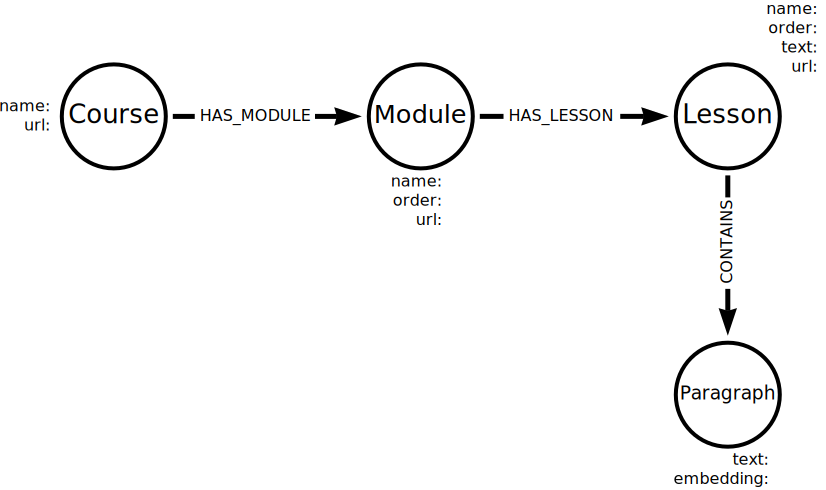

# Introduction to Vector Indexes and Unstructured Data

## Introduction

### Semantic search
**Semantic search** aims to understand search phrases' intent and contextual meaning, rather than focusing on individual keywords. Traditional keyword search often depends on exact-match keywords or proximity-based algorithms that find similar words. Semantic search is dependent on understanding the context of the search. 

The results of a semantic search are typically scored based on the perceived intent of the search. The score can be a combination of
- relevance of the result to the search
- popularity of the result
- quality of the result

Semantic search allows us to find and score related data. It is useful when finding similarities within unstructured data that rely on understanding the intent and contextual meaning of the search query. However, semantic search faces several challenges that stem from the complexity of natural language, the diversity of user intents, and the dynamic nature of information.

As a recap to our Movies database, we first want to return the titles and plots for the movies in the database
```sql
MATCH (m:Movie)
RETURN m.title, m.plot
```
Then we filter the "Toy Story" movie and return the title and plot
```sql
MATCH (m:Movie {title: "Toy Story"})
RETURN m.title, m.plot
```

Next, we want to find similar movies to "Toy Story". This is where semantic search comes into play. Semantic search works by comparing numerical representations of the text (known as embeddings). We can view the embeddings for a movie plot:
```sql
MATCH (m:Movie {title: "Toy Story"})
RETURN m.title, m.plot, m.plotEmbedding
```
We can find similar movies by using the embedding for the movie plot and a vector index. Finally, we can query the vector index to find similar movies:
```sql
MATCH (m:Movie {title: "Toy Story"})

CALL db.index.vector.queryNodes(
    'moviePlots',
    6,
    m.plotEmbedding,
)
YIELD node, score

RETURN node.title, score, node.plot
```
This query returns the top 6 movies that are most similar to "Toy Story" based on the plot embedding. The `score` represents how similar the movies are to "Toy Story":


A semantic search in Neo4j involves
- The user submits a query
- The system creates a vector representation of the query
- The system compares the query vector to the vectors of the indexed data
- The results are scored based on their similarity
- The system returns the most relevant results to the user


### Unstructured data
**Unstructured data** refers to information that does not fit neatly into pre-defined structures and types. It includes all sorts of data formats that are not easily categorized or organized in a predefined manner. Examples are text files, emails, social media posts, images, videos, audio files, and web pages.

Unstructured data is often rich in information but challenging to analyze because it lacks a predictable structure or format.

Vectors and embeddings can represent unstructured data, making it easier to identify similarities and search for related data.

Graphs are a powerful tool for representing and analyzing unstructured data. Graphs can help visualize and understand the relationships and connections between data points.

## Vector Indexes
Common embedding models:
- **Word2Vec** - A model for generating word embeddings, turning words into vectors based on their context.
- **FastText** - An extension of Word2Vec, FastText treats each word as composed of character n-grams, allowing it to generate embeddings for out-of-vocabulary words.
- **Node2Vec** - An algorithm that computes embeddings based on random walks through a graph.
- **GPT** - A series of models (e.g. GPT-4) that use transformers for generating text that we can also use for generating embeddings.
- **Universal Sentence Encoder** - Designed to convert sentences into embeddings.
- **Doc2Vec** - An extension of the Word2Vec model to generate embeddings for entire documents or paragraphs, capturing the overall meaning.

Each embedding model is different and captures different aspects of the data. We need to make sure to use the same model to generate the embeddings for the data we want to compare. As an example, we will use OpenAI's `text-embedding-ada-002` model to generate the embeddings for the movie plots.

We can either create or load  embeddings. Suppose we have a embedding csv file `Quora-QuAD-1000-embeddings.csv` with the following columns:
```csv
question,answer,question_embedding,answer_embedding
"The question","The answer","[0.1, 0.2, 0.3, ...]","[0.4, 0.5, 0.6, ...]"
```
Then we can load the data into two nodes, `Question` and `Answer`, with a relationship, `ANSWERED_BY`. The `Question` and `Answer` nodes will store the original `text` and an `embedding` as properties:


We will use the `LOAD CSV` command to load the data into Neo4j:
```sql
LOAD CSV WITH HEADERS
FROM "https://data.neo4j.com/llm-vectors-unstructured/Quora-QuAD-1000-embeddings.csv" AS row

MERGE (q:Question {text: row.question})
WITH row, q
CALL db.create.setNodeVectorProperty(
    q,
    "embedding",
    apoc.convert.fromJsonList(row.question_embedding)
)

MERGE (a:Answer {text: row.answer})
WITH row, a, q
CALL db.create.setNodeVectorProperty(
    a,
    "embedding",
    apoc.convert.fromJsonList(row.answer_embedding)
)

MERGE (q)-[:ANSWERED_BY]->(a)
```
The `embedding` property is set using the `setNodeVectorProperty` procedure from the APOC library. The `apoc.convert.fromJsonList` function converts the embedding string into a list of numbers.

Then we can check the data model:
```sql
MATCH (q:Question)-[:ANSWERED_BY]->(a:Answer)
RETURN q, r, a LIMIT 100
```

### Create a vector index
We will use the `CREATE VECTOR INDEX` Cypher syntax statement to create the index:
```sql
CREATE VECTOR INDEX [index_name] [IF NOT EXISTS]
FOR (n:LabelName)
ON (n.propertyName)
OPTIONS "{" option: value[, ...] "}"
```
`CREATE VECTOR INDEX` expects
- `index_name` - the name of the index to be created.
- `LabelName` - the node label on which to index
- `propertyName` - the property on which to index
- `OPTIONS` - the options for the index, where we can specify:
    - `vector.dimensions` - the dimensions of the embedding (e.g., OpenAI embeddings have 1536 dimensions)
    - `vector.similarity_function` - the similarity function to use when comparing values in this index.

For example, we can create a vector index for the `Question` nodes using the `embedding` property:
```sql
CREATE VECTOR INDEX questions IF NOT EXISTS
FOR (q:Question)
ON (q.embedding)
OPTIONS {indexConfig: {
    `vector.dimensions`: 1536,
    `vector.similarity_function`: "cosine"
}}
```
The index is called `questions`, is against the `Question` label, and is on the `embedding` property. The `vector.dimensions` is set to 1536, and the `vector.similarity_function` is set to `cosine`. The `IF NOT EXISTS` clause ensures that the statement only creates the index if it does not already exist.

We can check if the index was created successfully using the `SHOW INDEXES` command:
```sql
SHOW INDEXES WHERE type = "VECTOR"
```
Once the `state` is `ONLINE`, the index will be ready to query. The `populationPercentage` indicates the proportion of node and property pairing. When the `populationPercentage` is 100%, all the question embeddings are indexed.

After the quesiton index is created, we can create the answer index:
```sql
CREATE VECTOR INDEX answers IF NOT EXISTS
FOR (a:Answer)
ON (a.embedding)
OPTIONS {indexConfig: {
    `vector.dimensions`: 1536,
    `vector.similarity_function`: "cosine"
}}
```

### Query a vector index
When querying a vector index, we have to query with an embedding. Typically, we have two use case scenarios:
- A user views an existing question and wants to see similar questions.
- A user submits a new question and receives answers to a similar question.

#### Finding similar questions
We can use the `questions` and `answers` vector indexes to find questions that are similar to each other. For example, we can find similar questions to *"What are the most touristic countries in the world?"*:
```sql
MATCH (q:Question {text: "What are the most touristic countries in the world?"})
CALL db.index.vector.queryNodes(
    "questions",
    6,
    q.embedding
)
YIELD node, score
RETURN node.text, score
```
This query:
- Matches the `Question` node with the text *"What are the most touristic countries in the world?"*.
- Calls the `db.index.vector.queryNodes` procedure to query the `questions` vector index with the `Question` node's embedding - `q.embedding`. The function returns the top `6` similar nodes.
- `YIELD`s the `node` and `score` properties.
- Returns the `text` and `score` properties of the similar questions.

We can also extend this query to return the answers to the most similar questions:
```sql
MATCH (q:Question {text: "What are the most touristic countries in the world?"})
CALL db.index.vector.queryNodes(
    "questions",
    6,
    q.embedding
)
YIELD node, score
MATCH (node)-[:ANSWERED_BY]->(a:Answer)
RETURN a.text, score
```

#### Finding answers to a similar question
To improve the user experience when asking a new question, we can use the vector index to find similar questions and answers. To achieve this, we need to generate an embedding for the user's new question and use it to query the vector index.

We can generate a new embedding in Cypher using the `genai.vector.encode` function:
```sql
genai.vector.encode(
    resource :: STRING,
    provider :: STRING,
    configuration :: MAP = {}
) :: LIST<FLOAT>
```
We will pass the text we want to encode as the `resource` parameter. We will use the `text-embedding-ada-002` model from OpenAI as the `provider`. Provider-specific details like, API keys, are passed in the `configuration` parameter.

For example, we can generate an embedding for the question *"What are the most touristic countries in the world?"* into our query to find similar questions:
```sql
WITH genai.vector.encode(
    "What are the most touristic countries in the world?",
    "OpenAI",
    {token: "<openai-api-key>"}
) AS userEmbedding

CALL db.index.vector.queryNodes(
    'questions',
    6,
    userEmbedding
)
YIELD node, score
RETURN node.text, score
```
This query creates an embedding using `genai.vector.encode` and then uses that embedding to query the `questions` vector index.

## Impoting Unstructured Data
In this section, we will use the [`llm-vectors-unstructured`](https://github.com/neo4j-graphacademy/llm-vectors-unstructured) repository. Make sure to have a `.env` file with the following variables:
```env
OPENAI_API_KEY="<openai-api-key>"
NEO4J_URI="bolt://"
NEO4J_USERNAME="neo4j"
NEO4J_PASSWORD="password"
```

Vector indexes and embeddings allow us to search and query unstructured data. We can also use the metadata surrounding the unstructured data to improve our queries. For example, we can represent the customer emails in a graph of `Email`, `Customer`, and `Product` nodes:


By importing the unstructured data into a graph, we can use the known relationships between the data to improve our queries.

In this section, we will use Python and LangChain to import the text of a GraphAcademy course into Neo4j. The GraphAcademy represnets courses as a graph of `Course`, `Module`, and `Lesson` nodes:


The course content in plain text is unstructured but we can use the metadata (the course structure), embeddings, and vector indexes to improve our queries.

**Chunking** - When dealing with large amounts of data, breaking it into smaller, more manageable parts is helpful. Smaller pieces of data are easier to work with and process. Embedding models also have size (token) limits and can only handle a certain amount of data.

Strategies for chunking data include:
- **Size** - splitting data into equal-sized chunks
- **Word, Sentence, Paragraph** - breaking down text data into individual sections
- **N-grams** - creating chunks of *n* consecutive words or characters
- **Topic Segmentation** - dividing text into sections based on topic changes
- **Event Detection** - identifying specific events or activities
- **Semantic Segmentation** - dividing data regions with different smentic meanings

Overlapping chunks, so the end of one chunk is the start of the next, can help to capture context and relationships between chunks.

It is a good idea to name the nodes and relationships in a way that makes it easy to understand the data and how it is related. For example, if we split a set of documents by paragraph, we could name the nodes `Document` and `Paragraph` with a `CONTAINS` relationship. Also, if we split a document by an arbitrary size value or character, we may use the node label `Chunk`.

We can store embeddings for individual chunks and create relationships between chunks to capture context and relationships. We may also want to store metadata about the chunks, such as the position in the original data, the size, and any other relevant information. When storing the course content, we will create a node for each `Paragraph` chunk and a relationship `CONTAINS` between the `Lesson` and `Paragraph` nodes:



### Importing data with Python and LangChain
In the `llm-vectors-unstructured/data` directory, we have the following structure:
- `asciidoc` - all the course content in asciidoc format
    - `courses` - the course content
        - `llm-fundamentals` - the course name
            - `modules` - numbered directories for each module
                - `01-name` - the module name
                    - `lessons` - numbered directories for each lesson
                        - `01-name` - the lesson name
                            - `lesson.adoc` - the lesson content

We will split the lesson content into chunks of text, around 1500 characters long, with each chunk containing one or more paragraphs.
```python
import os
from dotenv import load_dotenv
load_dotenv()

from langchain_community.document_loaders import DirectoryLoader, TextLoader

COURSES_PATH = "llm-vectors-unstructured/data/asciidoc"

# Load lesson documents
loader = DirectoryLoader(COURSES_PATH, glob="**/lesson.adoc", loader_cls=TextLoader)
docs = loader.load()
```
Then we can split the documents into chunks using the `CharacterTextSplitter` class from LangChain:
```python
from langchain.text_splitter import CharacterTextSplitter

text_splitter = CharacterTextSplitter(
    separator="\n\n",
    chunk_size=1500,
    chunk_overlap=200,
)

chunks = text_splitter.split_documents(docs)
print(f"Number of chunks: {len(chunks)}")
```

Next, we can use LangChain `Neo4jVector` and `OpenAIEmbeddings` classes to create the embeddings, the vector index, and store the chunks in a Neo4j database:
```python
from langchain_neo4j import Neo4jVector
from langchain_openai import OpenAIEmbeddings

neo4j_db = Neo4jVector.from_documents(
    chunks,
    OpenAIEmbeddings(openai_api_key=os.getenv('OPENAI_API_KEY')),
    url=os.getenv('NEO4J_URI'),
    username=os.getenv('NEO4J_USERNAME'),
    password=os.getenv('NEO4J_PASSWORD'),
    database="neo4j",  
    index_name="chunkVector", # name of the vector index
    node_label="Chunk",  # label for the nodes
    text_node_property="text", 
    embedding_node_property="embedding",  # property for the embedding
)
```

Now we can view the chunks in the Neo4j database:
```sql
MATCH (c:Chunk) RETURN c LIMIT 25
```

We can also query the vector index to find similar chunks. For example, we can find lesson chunks relating to "What does Hallucination mean?":
```sql
WITH genai.vector.encode(
    "What does Hallucination mean?",
    "OpenAI",
    {token: "<openai-api-key>"}
) AS userEmbedding

CALL db.index.vector.queryNodes(
    'chunkVector',
    6,
    userEmbedding
)
YIELD node, score
RETURN node.text, score
```

### Creating embeddings
We used to use the `genai.vector.encode` function to create embeddings for the text. We can also use the `OpenAIEmbeddings` class to create embeddings for the text in Python:
```python
import os
from dotenv import load_dotenv
load_dotenv()

from openai import OpenAI

llm = OpenAI(api_key=os.getenv('OPENAI_API_KEY'))

response = llm.embeddings.create(
        input="Text to create embeddings for",
        model="text-embedding-ada-002"
    )

print(response.data[0].embedding)
```

#### Query Neo4j with an embedding
Next, we can use the embedding to query the Neo4j `chunkVector` vector index:
```python
import os
from dotenv import load_dotenv
from langchain_neo4j import Neo4jGraph
load_dotenv()

from openai import OpenAI

# Set up llm
llm = OpenAI(api_key=os.getenv('OPENAI_API_KEY'))
# Create an embedding for the text
response = llm.embeddings.create(
        input="What does Hallucination mean?",
        model="text-embedding-ada-002"
    )

embedding = response.data[0].embedding

# Create a Neo4jGraph object
graph = Neo4jGraph(
    url=os.getenv('NEO4J_URI'),
    username=os.getenv('NEO4J_USERNAME'),
    password=os.getenv('NEO4J_PASSWORD'),
)
```
Then we can use the `query` method to run the Cypher to query the `chunkVector` vector index using the embedding:
```python
result = graph.query(
    """
    CALL db.index.vector.queryNodes("chunkVector", 6, $embedding)
    YIELD node, score
    RETURN node.text, score
    """,
    parameters={"embedding": embedding}
)
```
The embedding is passed to the `query` method as a parameter. Finally we can print the results:
```python
for row in result:
    print(row['node.text'], row['score'])
```

### Create a graph
We will create a simple graph data model to represent the course content:


The graph contains
- `Course`, `Module`, and `Lesson` nodes with a `name` property
- `Lesson` nodes with a `url` property
- `Paragraph` nodes with a `text` and `embedding` properties
- `HAS_MODULE`, `HAS_LESSON`, and `CONTAINS` relationships between the nodes

We have already set up and created the text chunks:
```python
import os
from dotenv import load_dotenv
load_dotenv()

from langchain_community.document_loaders import DirectoryLoader, TextLoader
from langchain.text_splitter import CharacterTextSplitter
from openai import OpenAI
from neo4j import GraphDatabase

COURSES_PATH = "llm-vectors-unstructured/data/asciidoc"

loader = DirectoryLoader(COURSES_PATH, glob="**/lesson.adoc", loader_cls=TextLoader)
docs = loader.load()

text_splitter = CharacterTextSplitter(
    separator="\n\n",
    chunk_size=1500,
    chunk_overlap=200,
)

chunks = text_splitter.split_documents(docs)
```
For each chunk, we will create an embedding of the text and extract the metadata:
```python
def get_embedding(llm, text):
    response = llm.embeddings.create(
            input=text,
            model="text-embedding-ada-002"
        )
    return response.data[0].embedding

def get_course_data(llm, chunk):
    data = {}

    path = chunk.metadata['source'].split(os.path.sep)

    data['course'] = path[-6]
    data['module'] = path[-4]
    data['lesson'] = path[-2]
    data['url'] = f"https://graphacademy.neo4j.com/courses/{data['course']}/{data['module']}/{data['lesson']}"
    data['text'] = chunk.page_content
    data['embedding'] = get_embedding(llm, data['text'])

    return data
```

Then we need to create an OpenAI object and a Neo4j driver to connect to the database:
```python
llm = OpenAI(api_key=os.getenv('OPENAI_API_KEY'))

driver = GraphDatabase.driver(
    os.getenv('NEO4J_URI'),
    auth=(
        os.getenv('NEO4J_USERNAME'),
        os.getenv('NEO4J_PASSWORD')
    )
)
driver.verify_connectivity()
```

To create the data in the graph, we will need a function that incorporates the course data into a Cypher statement and runs it in a transaction:
```python
def create_chunk(tx, data):
    tx.run(
        """
        MERGE (c:Course {name: $course})
        MERGE (c)-[:HAS_MODULE]->(m:Module {name: $module})
        MERGE (m)-[:HAS_LESSON]->(l:Lesson {name: $lesson, url: $url})
        MERGE (l)-[:CONTAINS]->(p:Paragraph {text: $text})

        WITH p
        CALL db.create.setNodeVectorProperty(
            p,
            "embedding",
            $embedding
        )
        """,
        data
    )
```
The `create_chunk` function takes the `data` dictionary created by the `get_course_data` function.

```python
for chunk in chunks:
    with driver.session(database="neo4j") as session:
        session.execute_write(
            create_chunk,
            get_course_data(llm, chunk)
        )
```
A new session is created for each chunk. The `execute_write` method calls the `create_chunk` function, passing the `data` dictionary created by the `get_course_data` function.

Finally, we can close the Neo4j driver:
```python
driver.close()
```

We can explore the graph in Neo4j Browser:
```sql
MATCH (c:Course)-[:HAS_MODULE]->(m:Module)-[:HAS_LESSON]->(l:Lesson)-[:CONTAINS]->(p:Paragraph)
RETURN *
```

We have already created the embeddings for the `Paragraph` nodes and set the `embedding` property. Next, we can create a vector index for the `Paragraph` nodes:
```sql
CREATE VECTOR INDEX paragraphs IF NOT EXISTS
FOR (p:Paragraph)
ON (p.embedding)
OPTIONS {indexConfig: {
    `vector.dimensions`: 1536,
    `vector.similarity_function`: "cosine"
}}
```
We then can use this vector index and the graph to find a lesson to help with specific questions:
```sql
WITH genai.vector.encode(
    "How does RAG help ground an LLM?",
    "OpenAI",
    {token: "<openai-api-key>"}
) AS userEmbedding
CALL db.index.vector.queryNodes(
    'paragraphs',
    6,
    userEmbedding
)
YIELD node, score

MATCH (l:Lesson)-[:CONTAINS]->(node)
RETURN l.name, l.url, score
```

### Extract topics
Topics are a way to categorize and organize content. We can use topics to help users find relevant content, recommend related content, and understand the relationships between different pieces of content. To hold the topic data, we should extend the data model to include a new `Topic` node and a `MENTIONS` relationship between the `Paragraph` and `Topic` nodes:


We will use the `textblob` library to extract noun phrases from text and use them as topics:
```python
from textblob import TextBlob

phrase = "You can extract topics from phrases using TextBlob"

topics = TextBlob(phrase).noun_phrases
print(topics)
```

We will apply this method to update our functions, `get_course_data` and `create_chunk`.
```python
from textblob import TextBlob

def get_course_data(llm, chunk):
    data = {}

    path = chunk.metadata['source'].split(os.path.sep)

    data['course'] = path[-6]
    data['module'] = path[-4]
    data['lesson'] = path[-2]
    data['url'] = f"https://graphacademy.neo4j.com/courses/{data['course']}/{data['module']}/{data['lesson']}"
    data['text'] = chunk.page_content
    data['embedding'] = get_embedding(llm, data['text'])
    data['topics'] = TextBlob(data['text']).noun_phrases

    return data


def create_chunk(tx, data):
    tx.run(
        """
        MERGE (c:Course {name: $course})
        MERGE (c)-[:HAS_MODULE]->(m:Module{name: $module})
        MERGE (m)-[:HAS_LESSON]->(l:Lesson{name: $lesson, url: $url})
        MERGE (l)-[:CONTAINS]->(p:Paragraph{text: $text})
        
        WITH p
        CALL db.create.setNodeVectorProperty(p, "embedding", $embedding)
           
        FOREACH (topic in $topics |
            MERGE (t:Topic {name: topic})
            MERGE (p)-[:MENTIONS]->(t)
        )
        """,
        data
    )
```
The `topics` are returned as a list from the `TextBlob.noun_phrases` method. The `FOREACH` clause iterates over the list, creating a `Topic` node and a `MENTIONS` relationship between the `Paragraph` and `Topic` nodes.

After we run the code to update the graph, we can check the data model:
```sql
MATCH (t:Topic {name: "Semantic search"})<-[:MENTIONS]-(p:Paragraph)<-[:CONTAINS]-(l:Lesson)
RETURN DISTINCT l.name, l.url
```

We can also list the topics and the number of lessons that mention them to understand the most popular topics:
```sql
MATCH (t:Topic)<-[:MENTIONS]-(p:Paragraph)<-[:CONTAINS]-(l:Lesson)
RETURN t.name, COUNT(DISTINCT l) AS lessons
ORDER BY lessons DESC
```    