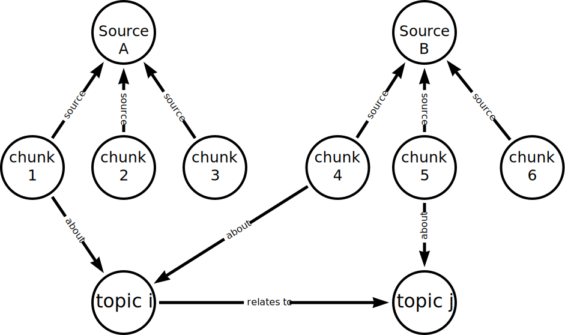

# Neo4j & LLM Fundamentals

## Neo4j and GenAI
Knowledge graphs are a specific implementation of a Graph Database, where information is captured and integrated from many different sources, representing the inherent knowledge of a particular domain. They provide a structured way to represent entities, their attributes, and their relationships, allowing for a comprehensive and interconnected understanding of the information within that domain.

Knowledge graphs break down sources of information and integrate them, allowing us to see the relationships between the data:



We can tailor knowledge graphs for semantic search, data retrieval, and reasoning.

The response generated by a Large Language Model (LLM) is a probabilistic continuation of the instructions it receives. The LLM provides the most likely response based on the patterns it has learned from its training data. Providing additional contextual data helps to *ground* the LLM’s responses and make them more accurate.

A knowledge graph is a mechanism for providing additional data to an LLM. Data within the knowledge graph can guide the LLM to provide more relevant, accurate, and reliable responses.

Retrieval Augmented Generation (RAG) combines the strengths of large-scale language models with external retrieval or search mechanisms, enabling relevant information from vast datasets to be dynamically fed into the model during the generation process, thereby enhancing its ability to provide detailed and contextually accurate responses.

RAG provides additional benefits of
- Increased transparency, as the sources of the information can be stored and examined.
- Security, as the data sources can be secured and access controlled.
- Accuracy and timeliness, as the data sources can be updated in real-time.
- Access to private or proprietary data


## Vectors & Semantic Search
Semantic search aims to understand search phrases' intent and contextual meaning, rather than focusing on individual keywords. We can use embedding models to convert text into vectors, which are numerical representations of the text. These vectors can then be used to find similar text based on their proximity in vector space. 

For example, OpenAI's `text-embedding-ada-002` embedding model converts text into a vector of 1536 dimensions. Then we can use the *distance* or *angle* between vectors to gauge the semantic similarity between words or phrases. Words with similar meanings or contexts will have vectors that are close together, while unrelated words will be farther apart.

Vectors are the backbone of semantic search. They enable systems to understand and represent the complex, multi-dimensional nature of language, context, and meaning. Neo4j supports [vector indexes](https://neo4j.com/docs/cypher-manual/current/indexes/semantic-indexes/vector-indexes/) and querying, allowing us to search for nodes based on their vector representations.

### Vector Indexes
We will still use our Movies dataset, with the `Person`, `Movie`, and `User` nodes. We can check that each movie has a `plot` property.
```sql
MATCH (m:Movie {title: "Toy Story"})
RETURN m.title AS title, m.plot AS plot
```
This returns
```
"A cowboy doll is profoundly threatened and jealous when a new spaceman figure supplants him as top toy in a boy's room."
```
We can use the vector index to find the most similar movies by converting the plots into vector embeddings and comparing them.

In this tutorial, we will use a pre-created `openai-embeddings.csv` CSV file, which contains
- `movieId` - the ID of the movie
- `embedding` - the vector embedding of the movie plot generated by OpenAI

The `embedding` here was generated using the `text-embedding-ada-002` model from OpenAI. From the [Neo4j GitHub repo](https://github.com/neo4j-graphacademy/llm-fundamentals/blob/main/plot_openai_embeddings.py), we can see that the strings before the `embedding` are the combination of the `title` and `plot` properties of the movie:
```python
plot = f"{movie['title']}: {movie['plot']}"
response = llm.embeddings.create(
    input=plot,
    model='text-embedding-ada-002'
)
```

### Loading embeddings
```sql
LOAD CSV WITH HEADERS
FROM 'https://data.neo4j.com/llm-fundamentals/openai-embeddings.csv' AS row
MATCH (m:Movie {movieId: row.movieId})

CALL db.create.setNodeVectorProperty(m, 'plotEmbedding', apoc.convert.fromJsonList(row.embedding))
RETURN count(*)
```
This query will
- load the `openai-embeddings.csv` file
- match the `Movie` node with the corresponding `movieId` property
- call `db.create.setNodeVectorProperty()` procedure to set the `plotEmbedding` property
- validate the property is a valid vector

When data is loading using `LOAD CSV`, it is treated as a string unless specifically cast uing a specific function, e.g., `toInteger()` or `toFloat()`. The embedding is a string representing a JSON list, the statement coerces it into a Cypher `List` using the `apoc.convert.fromJsonList()` function.

The `db.create.setNodeVectorProperty(m, 'plotEmbedding', apoc.convert.fromJsonList(row.embedding))` procedure is used to set the vector property on the node. The `apoc.convert.fromJsonList(row.embedding)` function converts the JSON string into a list of floats, which is the expected format for a vector property.

Once complete, we can query the database to see the `plotEmbedding` property on the `Movie` node:
```sql
MATCH (m:Movie {title: "Toy Story"})
RETURN m.title AS title, m.plot AS plot, m.plotEmbedding AS plotEmbedding
```

### Creating the vector index
Next, we will need to create a vector index to search across these embeddings. We can use the `CREATE VECTOR INDEX` statement to create the index:
```sql
CREATE VECTOR INDEX [index_name] [IF NOT EXISTS]
FOR (n:LabelName)
ON (n.propertyName)
OPTIONS "{" option: value[, ...] "}"
```
`CREATE VECTOR INDEX` expects
- `index_name` - the name of the index
- `LabelName` - the node label on which to index
- `propertyName` - the property on which to index
- `OPTIONS` - the options for the index, where we can specify:
    - `vector.dimensions` - the dimension of the embedding, e.g., OpenAI embeddings consist of 1536 dimensions
    - `vector.similarity_function` - the similarity function to use when comparing values in this index - this can be `euclidean` or `cosine`


For example, we can create a vector index on the `plotEmbedding` property of the `Movie` nodes:

```sql
CREATE VECTOR INDEX moviePlots IF NOT EXISTS
FOR (m:Movie)
ON m.plotEmbedding
OPTIONS {indexConfig: {
    `vector.dimensions`: 1536,
    `vector.similarity_function`: "cosine"
}}
```
This query will create a vector index called `moviePlots` against the `Movie` label, and it is on the `plotEmbedding` property. The `vector.dimensions` is set to 1536, which is used by OpenAI, and the `vector.similarity_function` is set to `cosine`. The `IF NOT EXISTS` clause ensures that the statement only creates the index if it does not already exist.

### Check the index creation status
The index will be updated asynchronously. We can check the status of the index creation using the `SHOW INDEXES` statement:
```sql
SHOW INDEXES
YEILD id, name, type, state, populationPercent
WHERE type = "VECTOR"
```
We should see something like this:


- Once the `state` is `ONLINE`, the index will be ready to query.
- The `populationPercent` field indicates the proportion of node and property pairing.
- When the `populationPercent` is `100.0`, all the movie embeddings have been indexed.

### Querying vector indexes
We can query the index using the `db.index.vector.queryNodes()` procedure. The procedure returns the requested number of approximate nearest neighbors nodes and their similarity score, sorted by the score. The syntax is as follows:
```sql
CALL db.index.vector.queryNodes(
    indexName :: STRING,
    numberOfNearestNeighbours :: INTEGER,
    query :: LIST<FLOAT>,
) 
YIELD node, score
```

The procedure accepts three parameters:
- `indexName` - the name of the vector index
- `numberOfNearestNeighbours` - the number of nearest neighbors to return
- `query` - a list of floats that represent an embedding

The procedure yields two values:
- `node` - the node that is the nearest neighbor
- `score` - the similarity score of the node to the query embedding, ranging from 0 to 1, where 1 is the most similar

We can use this procedure to find the closest embedding value to a given embedding. For example, we can find movies with a similar plot to "Toy Story":
```sql
MATCH (m:Movie {title: "Toy Story"})

CALL db.index.vector.queryNodes(
    "moviePlots",
    6,
    m.plotEmbedding
)
YIELD node, score

RETURN node.title AS title, score, node.plot AS plot
```
This query find the *Toy Story* `Movie` node and uses the `plotEmbedding` property to find the most similar plots. The `db.index.vector.queryNodes()` procedure uses the `moviePlots` vector index to find similar embeddings. We should see something like this:


The procedure returns the requested number of approximate nearest neighbor nodes and their similarity score, sorted by the score.

The downside to this approach is that it relies heavily on the embeddings and similarity function to produce valid results. The movies returned look similar, but without reading and comparing them, you would have no way of verifying that the results are correct.


## Introduction to Langchain
LangChain is designed to accelerate the development of LLM applications. Langchain provides out-of-the-box integrations with APIs and databases including Neo4j.

LangChain applications bridge users and LLMs, communicating back and forth with the LLM through **Chains**.

LangChain supports multiple LLM providers (OpenAI, Cohere, Ollama, etc.)

### Initializing the LLM
To install `langchain` in python,
```shell
pip install langchain
```
We will also use components from other libraries:
```shell
pip install langchain-community langchain-neo4j langchainhub neo4j
```
We also need OpenAI support:
```shell
pip install openai langchain-openai
```

Once we have installed the libraries, make sure we have the OpenAI API key set in our environment variables `OPENAI_API_KEY` and then we can initialize the LLM:
```python
import os
from langchain_openai import OpenAI

llm = OpenAI(openai_api_key=os.getenv('OPENAI_API_KEY'))

response = llm.invoke("What is Neo4j?")
print(response)
```

#### Prompts
Prompt templates allow us to create reusable instructions or questions. We can use them to create more complex or structured input for the LLM. For example,
```python
from langchain_core.prompts import PromptTemplate

template = PromptTemplate(
    template="""
    You are a cockney fruit and vegetable seller.
    Your role is to assist your customer with their fruit and vegetable needs.
    Respond using cockney rhyming slang.

    Tell me about the following fruit: {fruit}
    """,
    input_variables=['fruit']
)
```
Then we can call the LLM passing the formatted prompt template as the input:
```python
response = llm.invoke(template.format(fruit='apple'))
print(response)
```

We can create a prompt from a string by calling the `PromptTemplate.from_template()` method or load a prompt from a file using the `PromptTemplate.from_file()` method.

#### Configuring the LLM
When we create the LLM, we can configure it with parameters:
```python
llm = OpenAI(
    openai_api_key=os.getenv('OPENAI_API_KEY'),
    model='gpt-4o',
    temperature=0.,
)
```

### Chains
Chains allows us to combine language models with different data sources and third-party APIs. We can create a chain using **LangChain Expression Language (LCEL)**. LCEL is a declarative way to chain LangChain components together.

Components are chained together using the `|` operator. For example, we can create a chain that takes a prompt template and an LLM and returns the response from the LLM:
```python
llm_chain = template | llm
```
Then we want to call the chain, we can use the `invoke()` method:
```python
response = llm_chain.invoke({'fruit': 'apple'})
print(response)
```
Note that the `invoke()` method takes a dictionary as input, where the keys are the input variables defined in the prompt template.

The output from the chain is typically a string, and we can specify an output parser to parse the output. For example, we can add a `StringOutputParser` to the chain to ensure the output is a string:
```python
from langchain_core.output_parsers import StringOutputParser

llm_chain = template | llm | StringOutputParser()
```

We can also change the prompt to instruct the LLM to return a specific output type. For example, we can return JSON by specifying and give a format in the prompt:
```python
template = PromptTemplate.from_template("""
You are a cockney fruit and vegetable seller.
Your role is to assist your customer with their fruit and vegetable needs.
Respond using cockney rhyming slang.

Output JSON as {{"description": "your response here"}}

Tell me about the following fruit: {fruit}
""")
```
Then we can ensure LangChain parses the response as JSON by using the `JsonOutputParser`:
```python
from langchain_core.output_parsers import JsonOutputParser

llm_chain = template | llm | JsonOutputParser()
```

### Chat Models
Chat models are designed to have conversations - they accept a list of messages and return a conversational response. Chat models typically support different types of messages:
- System - system messages instruct the LLM on how to act on human messages
- Human - human messages are messages sent from the user
- AI - responses from the AI are called AI responses

For example, we can create a chat model using the `ChatOpenAI` class:
```python
import os
from langchain_openai import ChatOpenAI
from langchain_core.messages import SystemMessage, HumanMessage

chat_llm = ChatOpenAI(openai_api_key=os.getenv('OPENAI_API_KEY'))
```

Then we can create messages to the chat model:
```python
instructions = SystemMessage(
    content="""
    You are a surfer dude, having a conversation about the surf conditions on the beach.
    Respond using surfer slang.
    """
)

question = HumanMessage(content="What is the weather like?")

# We can call the chat model with the messages
response = chat_llm.invoke([
    instructions,
    question
])
print(response.content)
```
The `response` is an `AIMessage` object.

#### Wrapping in a chain
```python
import os
from langchain_openai import ChatOpenAI
from langchain_core.prompts import ChatPromptTemplate
from langchain_core.output_parsers import StrOutputParser

chat_llm = ChatOpenAI(openai_api_key=os.getenv('OPENAI_API_KEY'))

# Create a chat prompt template
prompt = ChatPromptTemplate.from_messages(
    [
        (
            "system",
            "You are a surfer dude, having a conversation about the surf conditions on the beach. Respond using surfer slang.",
        ),
        (
            "human", 
            "{question}"
        ),
    ]
)

# Create a chain with the chat prompt and LLM
chat_chain = prompt | chat_llm | StrOutputParser()

response = chat_chain.invoke(
    {"question": "What is the weather like?"}
)
print(response)
```
The `ChatPromptTemplate.from_messages()` method creates a chat prompt template from a list of messages. The `invoke()` method takes a dictionary as input, where the keys are the input variables defined in the prompt template.

However, this approach is unawaare of surf conditions on the beach. It responds based on the question and the LLMs training data. We can ground the chat model by providing information about the surf conditions on the beach. We can add additional messages to the chat model to provide context. For example,
```python
import os
from langchain_openai import ChatOpenAI
from langchain_core.prompts import ChatPromptTemplate
from langchain_core.output_parsers import StrOutputParser

# Modify the prompt template
prompt = ChatPromptTemplate.from_messages(
    [
        (
            "system",
            "You are a surfer dude, having a conversation about the surf conditions on the beach. Respond using surfer slang.",
        ),
        ( "system", "{context}" ),
        ( "human", "{question}" ),
    ]
)

chat_chain = prompt | chat_llm | StrOutputParser()

# add current surf conditions to the context
current_weather = """
    {
        "surf": [
            {"beach": "Fistral", "conditions": "6ft waves and offshore winds"},
            {"beach": "Polzeath", "conditions": "Flat and calm"},
            {"beach": "Watergate Bay", "conditions": "3ft waves and onshore winds"}
        ]
    }
"""

response = chat_chain.invoke(
    {
        'context': current_weather,
        "question": "What is the weather like on Watergate Bay?",
    }
)
print(response)
```

### Giving a chat model memory
Without the ability to remember what messages have been sent and received, the chat model will not be able to act according to the context of the conversation.

LangChain supports memory components, and we will use the `InMemoryChatMessageHistory` component to temporarily store the conversation history in memory, even though each call to the LLM is stateless. We can modify the prompt template to include the chat history as a list of messages using a `MessagesPlaceholder` object:
```python
from langchain_core.prompts import MessagesPlaceholder, ChatPromptTemplate

prompt = ChatPromptTemplate.from_messages(
    [
        (
            "system",
            "You are a surfer dude, having a conversation about the surf conditions on the beach. Respond using surfer slang.",
        ),
        ( "system", "{context}" ),

        MessagesPlaceholder(variable_name='chat_history'),
        ("human", "{question}" ),
    ]
)
```
The `chat_history` variable will contain the conversation history.

To keep the message history, we need to wrap the `chat_chain` in a **Runnable**. A `Runnable` is a LangChain component that can be called with input and returns output. In this case, we will use the `RunnableWithMessageHistory` runnable which will use the memory component to store and retrieve the conversation history.

First, we need to create a `InMemoryChatMessageHistory` memory component and a function that the `RunnableWithMessageHistory` will use to get the memory component:
```python
from langchain_core.chat_history import InMemoryChatMessageHistory

memory = InMemoryChatMessageHistory()

def get_memory(session_id):
    return memory
```
The `get_memory()` function returns the `InMemoryChatMessageHistory` memory component. The `session_id` parameter is used to identify the conversation session. As there will only be one conversation in memory at a time, we can ignore the `session_id` parameter for now.

Next we can create a new chain using the `RunnableWithMessageHistory` runnable, passing the `chat_chain` and `get_memory()` function as parameters:
```python
from langchain_core.runnables.history import RunnableWithMessageHistory

chat_chain = prompt | chat_llm | StrOutputParser()

chat_with_message_history = RunnableWithMessageHistory(
    chat_chain,
    get_memory,
    input_messages_key="question",
    history_messages_key="chat_history"
)
```
Note that the `RunnableWithMessageHistory` runnable takes the `chat_chain` and `get_memory()` function as parameters. The `input_messages_key` parameter specifies the key for the input messages `"question"` we defined in the prompt template. The `history_messages_key` parameter specifies the key for the chat history messages `"chat_history"` we defined in the prompt template.

#### Invoke the chat model
When we call the `chat_with_message_history` chain, the user's question and the response will be stored in the `InMemoryChatMessageHistory` memory component.

Every subsequent call to the `chat_with_message_history` chain will include the chat history in the prompt. When we ask the chat model multiple questions, the LLM will use the context from the previous questions when responding:
```python
repsonse = chat_with_message_history.invoke(
    {
        'context': current_weather,
        "question": "Hi, I am at Watergate Bay. What is the surf like?"
    },
    config={'configurable': {'session_id': '111}}
)
print(response)

response = chat_with_message_history.invoke(
    {
        'context': current_weather,
        "question": "Where am I?"
    },
    config={'configurable': {'session_id': '111'}}
)
print(response)
```
The `config` parameter is used to pass the `session_id` to the `get_memory()` function. The `session_id` is used to identify the conversation session. In this case, we are using a hardcoded value of `'111'`, but in a real application, we would use a unique identifier for each conversation session.

We can also create a simple loop and ask the chat model multiple questions:
```python
while (question := input("> ")) != "exit":
    response = chat_with_message_history.invoke(
        {
            'context': current_weather,
            "question": question
        },
        config={'configurable': {'session_id': '111'}}
    )
    print(response)
```

### Storing conversation history in Neo4j
LangChain includes functionality to integrate directly with Neo4j, including allowing us to run Cypher statements, query vector indexes, and use Neo4j as a conversation memory store.

We need to connect to a Neo4j database first.
```python
import os
from langchain_neo4j import Neo4jGraph

graph = Neo4jGraph(
    url=os.getenv('NEO4J_URL'),
    username=os.getenv('NEO4J_USERNAME'),
    password=os.getenv('NEO4J_PASSWORD')
)

# test the connection
result = graph.query(
    """
    MATCH (m:Movie {title: "Toy Story"})
    RETURN m.title, m.plot, m.poster
    """
)
print(result)
```
We still use the Movies dataset as before. Note that the `Neo4jGraph` class is a wrapper to the Neo4j Python driver. It simplifies connecting to Neo4j and integrating with LangChain.

When we connect to the Neo4j database, the object loads the database **schema** into memory - this enables LangChain to access the schema information without having to query the database:
```python
print(graph.schema)
```
We can refresh the schema by calling the `graph.refresh_schema()` method. This is useful if we have made changes to the database schema and want to update the schema information in memory.

We previously create a chat model that uses the `InMemoryChatMessageHistory` memory component to store conversation history in memory. We will not update this chat model to store the conversation history in Neo4j database using the `Neo4jChatMessageHistory` component.

Before that, we must create and assign a **session ID** to each conversation to identify them. The session ID can be any unique value, such as a **Universally Unique Identifier (UUID)**. We can generate a random UUID using the `uuid` library and create a new session ID constant:
```python
from uuid import uuid4

SESSION_ID = str(uuid4())
print(f"Session ID: {SESSION_ID}")
```
This session ID will be used to identify the conversation in the Neo4j database.

Next we can create a `Neo4jGraph` object to connect to our Neo4j database.
```python
from langchain_neo4j import Neo4jGraph

graph = Neo4jGraph(
    url=os.getenv('NEO4J_URL'),
    username=os.getenv('NEO4J_USERNAME'),
    password=os.getenv('NEO4J_PASSWORD')
)
```

Previously, the `get_memory()` function returned an instance of `InMemoryChatMessageHistory`. Now the `get_memory()` function should return an instance of `Neo4jChatMessageHistory`, and we should pass the `session_id` and the `graph` connection as parameters:
```python
from langchain_neo4j import Neo4jChatMessageHistory

def get_memory(session_id):
    return Neo4jChatMessageHistory(
        session_id=session_id,
        graph=graph
    )
```
Finally, we must add the `SESSION_ID` to the `config` parameter when we invoke the chat model:
```python
response = chat_with_message_history.invoke(
    {
        'context': current_weather,
        "question": question
    },
    config={'configurable': {'session_id': SESSION_ID}}
)
print(response)
```

The conversation history is stored using the following data model:


The `Session` node represents a conversation session and has an `id` property. The `Message` node represents a message in the conversation and has
- `content` - the message content
- `type` - the message type: `system`, `human`, or `ai`


The `LAST_MESSAGE` relationship connects the `Session` node to the conversation's last `Message` node. The `NEXT` relationship connects the `Message` nodes in the conversation.

We can return the graph of the conversation history using a Cypher query:
```sql
MATCH (s:Session)-[:LAST_MESSAGE]->(last:Message)<-[:NEXT*]-(msg:Message)
RETURN s, last, msg
```
We should see something like this:


We can return the conversation history for a single session by filtering on the `session_id` property:
```sql
MATCH (s:Session)-[:LAST_MESSAGE]->(last:Message)
WHERE s.id = "SESSION_ID"
MATCH p = (last)<-[:NEXT*]>-(msg:Message)
UNWIND nodes(p) as msgs
RETURN DISTINCT msgs.type, msgs.content
```

### Agents
**Agents** wrap a model and give it access to a set of *ttols*. These tools may access additional data sources, APIs, or functionalities. The model is used to determine which of the tools to use to complete a task.

A **tool** is a specific abstraction around a function that makes it easy for language model to interact with it.

We will create a *movie trailer agent* in this section, but before that, we need to set up `movie_chat` chat model chain, just like we did before.

```python
import os
from langchain_openai import ChatOpenAI
from langchain_core.prompts import ChatPromptTemplate
from langchain_core.output_parsers import StrOutputParser
from langchain_neo4j import Neo4jGraph, Neo4jChatMessageHistory
from uuid import uuid4
from langchain_core.runnables.history import RunnableWithMessageHistory

SESSION_ID = str(uuid4())
print(f"Session ID: {SESSION_ID}")

# Set up LLM
llm = ChatOpenAI((openai_api_key=os.getenv('OPENAI_API_KEY'))
# Set up Neo4j connection
graph = Neo4jGraph(
    url=os.getenv('NEO4J_URL'),
    username=os.getenv('NEO4J_USERNAME'),
    password=os.getenv('NEO4J_PASSWORD')
)
# Set up chat prompt template
prompt = ChatPromptTemplate.from_messages(
    [
        (
            'system',
            "You are a movie expert. You find movies from a genre or plot.",
        ),
        (
            'human',
            '{input}'
        )
    ]
)

# Set up chat model chain
movie_chat = prompt | llm | StrOutputParser()

# Before moving forward, we need to set up the memory component
def get_memory(session_id):
    return Neo4jChatMessageHistory(
        session_id=session_id,
        graph=graph
    )
```

Next, we will define the tools that the agent will use. The tools are defined using the `Tool` class.
```python
from langchain_core.tools import Tool

tools = [
    Tool.from_function(
        name="Movie Chat",
        description="For when you need to chat about movies. The question will be a string. Return a string.",
        func=movie_chat.invoke
    )
]
```
The `Tool.from_function()` method creates a tool from a function. In this case, we created a tool using our chain `movie_chat` with the `invoke()` method.

Then, we can create the agent that uses this tool:
```python
from langchain.agents import AgentExecutor, create_react_agent
from langchain import hub

agent_prompt = hub.pull("hwchase17/react-chat")
agent = create_react_agent(
    llm=llm,
    tools=tools,
    prompt=agent_prompt,
)

agent_executor = AgentExecutor(
    agent=agent,
    tools=tools
)
```
The `create_react_agent()` method creates an agent that uses the `react` prompt. The `AgentExecutor` class is used to execute the agent with the tools.

Finally, we will wrap the agent with the `RunnableWithMessageHistory` runnable to store the conversation history in Neo4j:
```python
chat_agent = RunnableWithMessageHistory(
    agent_executor,
    get_memory,
    input_messages_key="input",
    history_messages_key="chat_history"
)
```

We can have a simple loop to ask the agent multiple questions:
```python
while (question := input("> ")) != "exit":
    response = chat_agent.invoke(
        {"input": question},
        {'configurable': {"session_id": SESSION_ID}}
    )
    print(response['output'])
```

#### Creating tools
Tools are interfaces that an agent can interact with. We can create custom tools able to perform any functionality we want. In the previous example, we created a tool that uses the `movie_chat.invoke` method:
```python
tools = [
    Tool.from_function(
        name="Movie Chat",
        description="For when you need to chat about movies. The question will be a string. Return a string.",
        func=movie_chat.invoke,
    )
]
```
The `name` and `description` parameters help the LLM select which tool to use when presented with a question. The `func` parameter is the function that will be called when the tool is selected.

Agents support multiple tools, so we can pass them to the agent as a list.

#### Initializing agent
```python
agent_prompt = hub.pull("hwchase17/react-chat")
agent = create_react_agent(llm, tools, agent_prompt)
agent_executor = AgentExecutor(agent=agent, tools=tools)
```
There are different types of agents that we can create. In this example, we create a *ReAct* - Reasoning and Acting - agent. An agent requires a prompt and we pulled a pre-existing prompt from the LangChain Hub. The `hwcase17/react-chat` prompt instructs the model to provide an answer using the tools available in a specific format.

The `create_react_agent()` function creates the agent and expects
- `llm` that manages the interactions and decide which tool to use
- `tools` that the agent can use
- `prompt` that the agent will use to generate the response

The `AgentExecutor` class runs the agent and expects
- `agent` to run
- `tools` that the agent can use
- `memory` to store the conversation history

We may also set additional parameters to the `AgentExecutor` class:
- `max_iterations` - the maximum number of iterations to run the LLM for. This prevents the LLM from running for too long or entering an infinite loop.
- `verbose` - whether to print the LLM output and tool output.
- `handle_parsing_errors` - whether to handle parsing errors and return a message to the user.

For example,
```python
agent_executor = AgentExecutor(
    agent=agent,
    tools=tools,
    max_iterations=3,
    verbose=True,
    handle_parse_errors=True
)
```

#### Multiple tools
A key advantage of using an agent is that they can use multiple tools. Access to multiple tools allows us to create agents that can perform several specific tasks.

We can create a tool that searches YouTube for movie trailers by adding a `YouTubeSearchTool` to the `tools` list, but first we need to install the `youtube-search` library:
```shell
pip install youtube-search
```
Then we can create the tool:
```python
from langchain_community.tools import YouTubeSearchResults

youtube = YouTubeSearchResults()
```
The `YouTubeSearchResults` tool expects a search term and the number of results passed as a comma-separated string.

The agent may pass queries containing commas, so we need to create a function to strip the commas from the query and pass the query to the `YouTubeSearchResults` tool:
```python
def call_trailer_search(term):
    term = term.replace(",", " ")
    return youtube.run(term)
```

Finally, we can add the `call_trailer_search()` function to the `tools` list:
```python
tools = [
    Tool.from_function(
        name="Movie Chat",
        description="For when you need to chat about movies. The question will be a string. Return a string.",
        func=movie_chat.invoke,
    ),
    Tool.from_function(
        name="Movie Trailer Search",
        description="Use when needing to find a movie trailer. The question will include the word trailer. Return a link to a YouTube video.",
        func=call_trailer_search,
    )
]
```
The rest of the code remains the same. The agent will now be able to use the `Movie Trailer Search` tool to search for movie trailers on YouTube.

### Retrievers
**Retrievers** are LangChain chain components that allow us to retrieve documents using an unstructured query.
- Documents are unstructured text that we want to retrieve
- A retriever uses a vector store as its underlying data structure.

Previously, we loaded embeddings and created a vector index of Movie plots. In this section, the movie plots are the *documents* that we want to retrieve, and a *retriever* could be used to give a model context.

The `Neo4jVector` is a LangChain vector store that uses a Neo4j database as the underlying data structure. We can use the `Neo4jVector` to generate embeddings, store them in the database and retrieve them.

#### Querying a vector index
We will create a `Neo4jVector` from the `moviePlots` index we created earlier in the Section ["Creating the vector index"](#creating-the-vector-index).
```python
import os
from langchain_openai import OpenAIEmbeddings
from langchain_neo4j import Neo4jVector, Neo4jGraph

# Set up an OpenAI embeddings model
embedding_model = OpenAIEmbeddings(openai_api_key=os.getenv('OPENAI_API_KEY'))

# Set up Neo4j connection
graph = Neo4jGraph(
    url=os.getenv('NEO4J_URL'),
    username=os.getenv('NEO4J_USERNAME'),
    password=os.getenv('NEO4J_PASSWORD')
)

# Create a Neo4jVector object
movie_plot_vector = Neo4jVector.from_existing_index(
    embedding_model,
    graph=graph,
    index_name="moviePlots",
    embedding_node_property="plotEmbedding",
    text_node_property="plot"
)

# Test the vector store
result = movie_plot_vector.similarity_search("A movie where aliens land and attack earth.")
for doc in result:
    print(doc.metadata['title'], '-', doc.page_content)
```

We can also pass an optional `k` parameter to the `similarity_search()` method to specify the number of documents to return. The default value is 4.
```python
query = "A movie where aliens land and attack earth."
result = movie_plot_vector.similarity_search(query, k=1)
```

#### Creating a new vector index
The `Neo4jVector` class can also generate embeddings and vector indexes. For example, we can create embeddings and a new index called `myVectorIndex` in the database for `Chunk` nodes with a `text` property:
```python
import os
from langchain_openai import OpenAIEmbeddings
from langchain_neo4j import Neo4jVector, Neo4jGraph
from langchain_core.documents import Document

# A list of Documents
documents = [
    Document(
        page_content="Text to be indexed",
        metadata={'source': 'local'}
    )
]

# Service used to create the embeddings
embedding_model = OpenAIEmbeddings(openai_api_key=os.getenv('OPENAI_API_KEY'))
# Neo4j connection
graph = Neo4jGraph(
    url=os.getenv('NEO4J_URL'),
    username=os.getenv('NEO4J_USERNAME'),
    password=os.getenv('NEO4J_PASSWORD')
)
# Create a Neo4jVector object
new_vector = Neo4jVector.from_documents(
    documents,
    embedding_model,
    graph=graph,
    index_name="myVectorIndex", # name of the index
    node_label="Chunk", # label of the nodes to be indexed
    text_node_property="text", # property of the nodes to be indexed
    embedding_node_property="embedding", # property of the nodes to be indexed
    create_id_index=True
)
```

#### Creating a retrieval chain
We need to create a *retrieval* chain to incorporate a retriever and Neo4j vector into a LangChain application. The `Neo4jVector` class has a `as_retriever()` method that returns a retriever object.

The `RetrievalQA` class is a chain that uses a retriever as part of its pipeline. It will use the retriever to retrieve documents and pass them to the language model. By incorporating `Neo4jVector` into the `RetrievalQA` chain, we can use data and vectors in Neo4j in our application.

```python
import os
from langchain.chains import RetrievalQA
from langchain_openai import ChatOpenAI, OpenAIEmbeddings
from langchain_neo4j import Neo4jVector, Neo4jGraph

llm = ChatOpenAI(openai_api_key=os.getenv('OPENAI_API_KEY'))

embedding_model = OpenAIEmbeddings(openai_api_key=os.getenv('OPENAI_API_KEY'))

graph = Neo4jGraph(
    url=os.getenv('NEO4J_URL'),
    username=os.getenv('NEO4J_USERNAME'),
    password=os.getenv('NEO4J_PASSWORD')
)

movie_plot_vector = Neo4jVector.from_existing_index(
    embedding_model,
    graph=graph,
    index_name="moviePlots",
    embedding_node_property="plotEmbedding",
    text_node_property="plot"
)

# Create a retriever from the vector store
plot_retriever = RetrievalQA.from_llm(
    llm=llm,
    retriever=movie_plot_vector.as_retriever()
)

# test
response = plot_retriever.invoke(
    {'query': "A movie where a mission to the moon goes wrong"}
)
print(response)
```
When we call the `plot_retriever.invoke()` method, the `RetrievalQA` chain will use the `movie_plot_vector` retriever to retrieve documents from the `moviePlots` index and pass them to the `llm`.

To understand how the model generated the response and how the retriever affected it, we can set additional parameters to the `RetrievalQA` class:
```python
plot_retriever = RetrievalQA.from_llm(
    llm=llm,
    retriever=movie_plot_vector.as_retriever(),
    verbose=True, # print the LLM output and tool output
    return_source_documents=True, # return the source documents used to generate the response
)
```

## Using LLMs for Query Generation

### Generating Cypher
LangChain includes the `GraphCypherQAChain` chain that can interact with a Neo4j database. It uses a language model to generate Cypher queries and execute them against the database.

`GraphCypherQAChain` requires
- `llm` - a language model to generate Cypher queries
- `graph` - a graph database connection for answering the queries
- `cypher_prompt` - a prompt template to give the LLM the schema and question
- an appropriate question which relates to the schema and data in the graph.

The example below shows how to use the `GraphCypherQAChain` chain to generate Cypher queries and execute them against a Neo4j database:
```python
import os
from langchain_openai import ChatOpenAI
from langchain_neo4j import Neo4jGraph, GraphCypherQAChain
from langchain_core.prompts import PromptTemplate

llm = ChatOpenAI(openai_api_key=os.getenv('OPENAI_API_KEY'))
graph = Neo4jGraph(
    url=os.getenv('NEO4J_URL'),
    username=os.getenv('NEO4J_USERNAME'),
    password=os.getenv('NEO4J_PASSWORD')
)

# Create a prompt template for the LLM
CYPHER_GENERATION_TEMPLATE = """
You are an expert Neo4j Developer translating user questions into Cypher to answer questions about movies and provide recommendations.
Convert the user's question based on the schema.

Schema: {schema}
Question: {question}
"""
cypher_generation_prompt = PromptTemplate(
    template=CYPHER_GENERATION_TEMPLATE,
    input_variables=["schema", "question"]
)

# Create a GraphCypherQAChain object
cypher_chain = GraphCypherQAChain.from_llm(
    llm,
    graph=graph,
    cypher_prompt=cypher_generation_prompt,
    verbose=True, # print the LLM output and tool output
    allow_dangerous_requests=True
)

# test
result = cypher_chain.invoke({"query": "What is the plot of the movie Toy Story?"})
print(result['result'])
```

The `CYPHER_GENERATION_TEMPLATE` gives the LLM context. The `schema` and `question` are passed to the LLM as input variables. The `schema` will be automatically generated from the graph database and passed to the LLM. The `question` will be the user’s question.

NOTE: We trust the generation of Cypher to the LLM. It may generate invalid Cypher queries that could corrupt data in the graph or provide access to sensitive data. The `allow_dangerous_requests` parameter is set to `True` to allow the LLM to generate Cypher queries that may be dangerous. In production, we should ensure that access to data is limited, and sufficient security is in place to prevent malicious queries. This could include the use of a read-only user or role-based access control.

### Providing specific instructions
In the previous section, we used a prompt template to generate Cypher statements:
```python
CYPHER_GENERATION_TEMPLATE = """
You are an expert Neo4j Developer translating user questions into Cypher to answer questions about movies and provide recommendations.
Convert the user's question based on the schema.

Schema: {schema}
Question: {question}
"""
```
The LLM may generate Cypher queries that are not valid and do not conform to the schema. To mitigate this, we can provide specific instructions to the LLM to state that the generated Cypher queries should follow the schema. For example, we could give instructions only to use the provided relationship types and properties in the schema:
```python
CYPHER_GENERATION_TEMPLATE = """
You are an expert Neo4j Developer translating user questions into Cypher to answer questions about movies and provide recommendations.
Convert the user's question based on the schema.

Instructions:
Use only the provided relationship types and properties in the schema.
Do not use any other relationship types or properties that are not provided.

Schema: {schema}
Question: {question}
"""
```

The LLM may also need additional instructions about the data. For example,
```python
CYPHER_GENERATION_TEMPLATE = """
You are an expert Neo4j Developer translating user questions into Cypher to answer questions about movies and provide recommendations.
Convert the user's question based on the schema.

Instructions:
Use only the provided relationship types and properties in the schema.
Do not use any other relationship types or properties that are not provided.
For movie titles that begin with "The", move "the" to the end, For example "The 39 Steps" becomes "39 Steps, The" or "The Matrix" becomes "Matrix, The".

Schema: {schema}
Question: {question}
"""
```
The LLM will be instructed to move "the" to the end of the movie title. This is useful when we want to ensure that the movie titles are formatted correctly in the database.

In addition to instructing the LLM on how to deal with the question, we can also instruct it on how to respond. For example,
```python
CYPHER_GENERATION_TEMPLATE = """
You are an expert Neo4j Developer translating user questions into Cypher to answer questions about movies and provide recommendations.
Convert the user's question based on the schema.

Instructions:
Use only the provided relationship types and properties in the schema.
Do not use any other relationship types or properties that are not provided.
For movie titles that begin with "The", move "the" to the end, For example "The 39 Steps" becomes "39 Steps, The" or "The Matrix" becomes "Matrix, The".
If no data is returned, do not attempt to answer the question.
Only respond to questions that require you to construct a Cypher statement.
Do not respond to any questions that might ask anything else than for you to construct a Cypher statement.
Do not include any explanations or apologies in your responses.
Do not include any text except the generated Cypher statement.

Schema: {schema}
Question: {question}
"""
```

Even though we have provided specific instructions to the LLM, it may still make mistakes. **Few-shot prompting** is a technique where we provide the LLM with examples of how to respond or generate a response to a specific scenario. For example,
```python
CYPHER_GENERATION_TEMPLATE = """
You are an expert Neo4j Developer translating user questions into Cypher to answer questions about movies and provide recommendations.
Convert the user's question based on the schema.

Instructions:
Use only the provided relationship types and properties in the schema.
Do not use any other relationship types or properties that are not provided.
For movie titles that begin with "The", move "the" to the end, For example "The 39 Steps" becomes "39 Steps, The" or "The Matrix" becomes "Matrix, The".

If no data is returned, do not attempt to answer the question.
Only respond to questions that require you to construct a Cypher statement.
Do not include any explanations or apologies in your responses.

Examples: 

Find movies and genres:
MATCH (m:Movie)-[:IN_GENRE]->(g)
RETURN m.title, g.name

Schema: {schema}
Question: {question}
"""
```